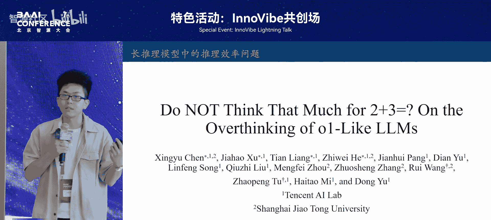

# 特色活动：InnoVibe共创场-p09-长推理模型中的推理效率问题：王-越-陈星宇

在本节课中，我们将学习长推理模型（如R1）在推理过程中出现的两种效率问题：**过思考**与**欠思考**。我们将分析这两种现象的表现、成因，并探讨相应的优化方法。

---

## 过思考现象分析

上一节我们介绍了课程主题，本节中我们来看看第一种效率问题：过思考。

过思考是指模型在简单问题上反复生成冗余且同质化的解答。例如，对于“2加3等于几”这样的简单问题，模型可能会生成13个不同的解答，每个解答都得出答案5。这种行为极大地浪费了计算资源。

在这里，我们将一个**完整包含推理步骤和答案的片段**定义为一个解答。

### 过思考现象的具体观察

以下是关于过思考现象的三个关键观察：

1.  **冗余解答对正确率影响低**：统计显示，在第一个解答生成时，模型在至少85%的问题上已经得出正确答案。后续解答主要对答案进行验证，并不提升最终正确率。
2.  **策略多样性低**：使用GPT-4o进行策略检测发现，在第二个解答中，只有40%的可能性会引入新策略。新策略的数量随解答数量增加而逐渐减少，导致后续生成多为冗余。
3.  **现象在简单题上更明显**：在MATH500数据集上，随着题目难度上升，解答密度（每1000个token包含的解答数）直线下降。这意味着越简单的问题，包含的冗余解答越多。

### 效率评估与优化方法

基于上述观察，我们提出两种评估指标：
*   **产出效率**：衡量正确token的占比。
*   **过程效率**：衡量策略多样性的占比。

即使是R1这样的先进模型，其产出效率和过程效率也仅在50%到60%左右，意味着至少一半的token是冗余的。

我们提出了一种基于偏好优化的方法来缓解过思考问题。核心思想是通过精简模型的生成为其构造更精确、更简短的正样本。我们最终采用的最优方法是：**只保留整个生成路径中的第一个正确解答，以及额外的一轮验证**。

实验结果表明，在数学推理数据集上，该方法能在保持模型性能的同时，减少至少一半的token生成量，有效提高了推理效率。

---

## 欠思考现象分析

上一节我们介绍了过思考现象，本节中我们来看看另一种效率问题：欠思考。

欠思考是指模型在面对挑战性问题时，过早放弃正确的推理思路，导致推理深度不足。例如，模型在解题过程中频繁出现“Alternatively”（换一种思路）来切换思路，但被放弃的前序思路中可能包含能导向正确答案的路径。

### 欠思考现象的具体观察

以下是关于欠思考现象的两个关键观察：

1.  **思路切换与错误回答相关**：在模型的错误回复中，思路切换现象明显增加。同时，在难题中，思路切换的频率也更高。
2.  **错误回复中包含被放弃的正确思路**：我们让大模型根据被放弃的思路进行续写，发现许多错误回复的前期思路其实是正确的。大部分错误回复中都包含至少一条正确的推理思路，但模型放弃了它们。

### 量化指标与优化方法

我们引入一个量化指标来评估欠思考的严重程度：当一个错误回复中存在被放弃的正确思路时，我们认为发生了欠思考。其严重性可通过“在第一个正确推理思路被放弃后，模型额外生成了多少token”来衡量。

基于此观察，我们提出了一种简单的基于解码约束的推理策略。其直观想法是降低“Alternatively”这个词频繁出现的概率，从而鼓励模型坚持已有的、可能是正确的思路。

具体做法通过以下**公式**描述：记录上一次出现“Alternatively”的位置，如果当前位置与上一次出现的位置过于接近，则惩罚“Alternatively”在当前解码步骤的出现概率。这相当于打压那些过于频繁的、不成熟的思路切换。

实验结果显示，该方法能在多个模型上显著提升准确率，证明让模型坚持原有思路是有效的。

---

## 总结

本节课中我们一起学习了长推理模型中两种影响推理效率的现象。

*   **过思考**：在简单问题上反复生成冗余解答，浪费计算资源。可通过保留首个正确解答并精简验证过程来优化。
*   **欠思考**：在难题上过早放弃正确思路，导致推理深度不足。可通过约束解码过程、抑制频繁的思路切换来缓解。

这两种现象都会导致推理效率降低。理解并优化它们，对于构建更高效、更可靠的长推理模型具有重要意义。