# 特色活动：InnoVibe共创场-p10-VLA-on-Wheels--Empowering-Vision-language-action-Models-for-Mobile-Manipulation-

在本节课中，我们将学习如何将视觉-语言-动作模型应用于移动操作任务。我们将探讨传统方法的局限性，并介绍一种新的框架，通过优化机器人的站立位置和运动规划，来提升移动操作的成功率。

## 背景介绍：为什么需要移动操作？

上一节我们介绍了操作任务，本节中我们来看看移动操作的必要性。

移动操作是指机器人不仅需要控制机械臂进行操作，还需要同时移动其底座。这是因为在日常或工业场景中，机器人需要与位于不同位置的物体进行交互。

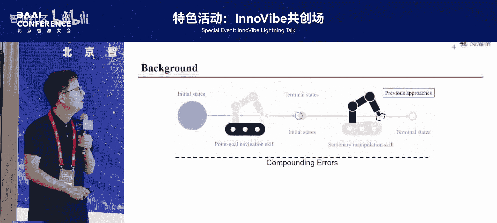

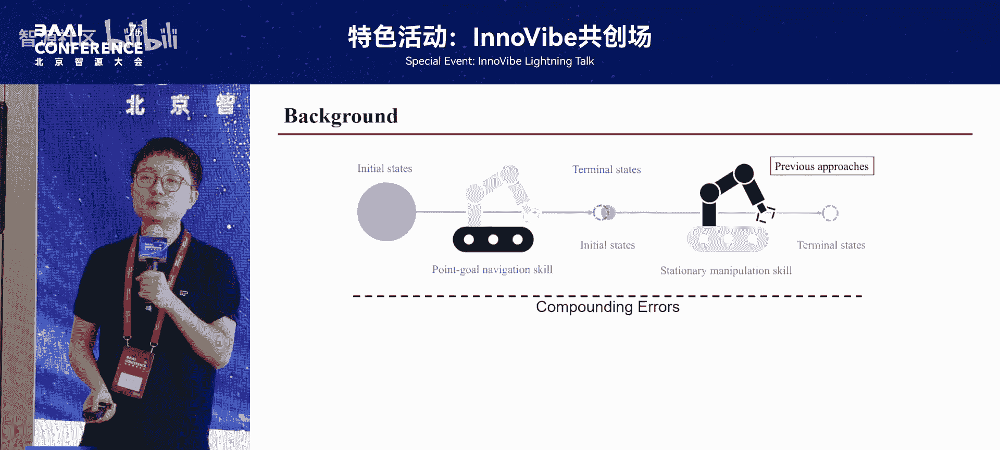

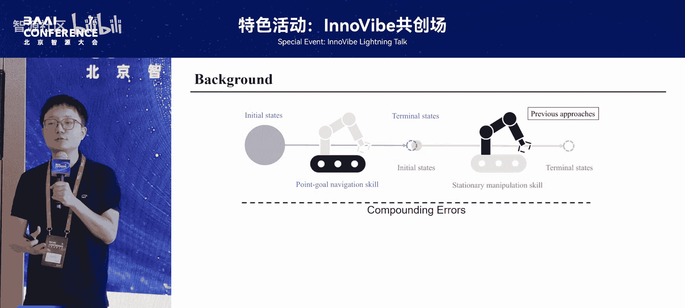

例如，在做饭任务中，机器人需要：
*   从冰箱中取出食材。
*   在厨房台面上切菜。
*   在炉灶旁加热食物。

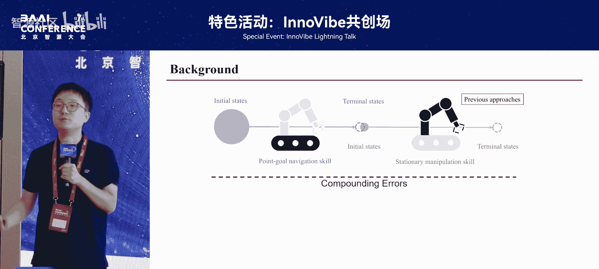

因此，这是一个需要全身协调控制的问题。

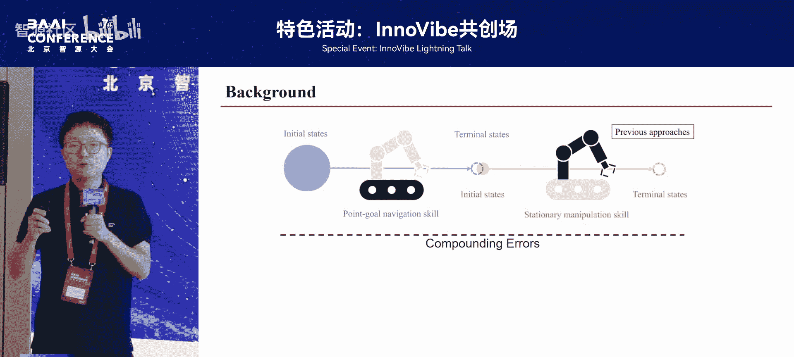

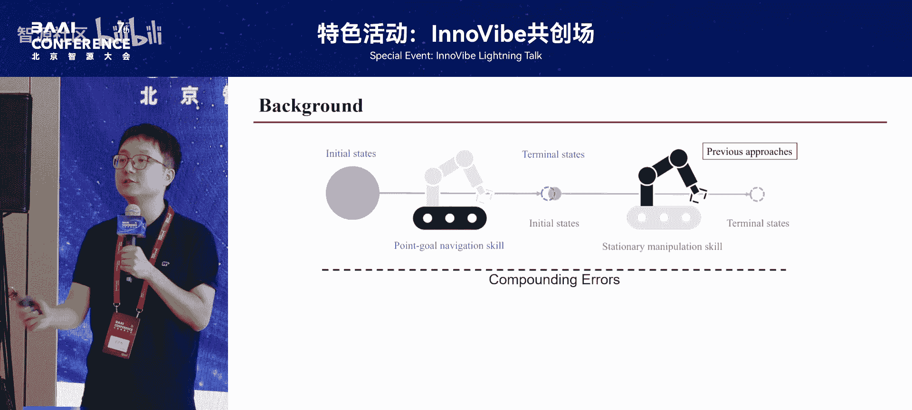

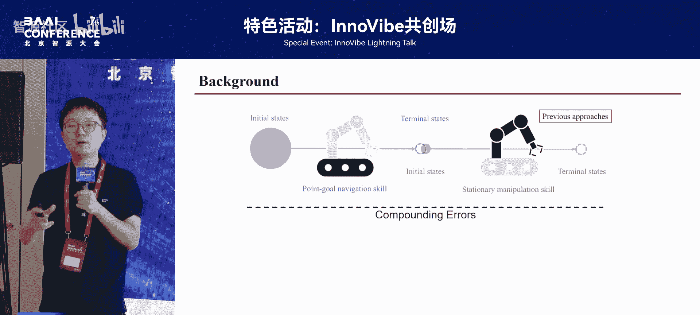

## 现有方法的挑战：VLA + VLN 为何不够？

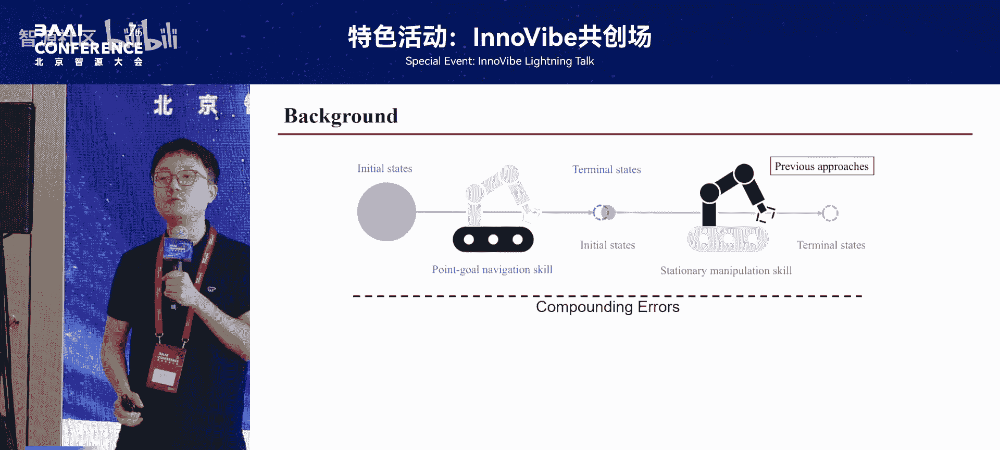

上一节我们了解了移动操作的需求，本节中我们来看看现有方法面临的挑战。

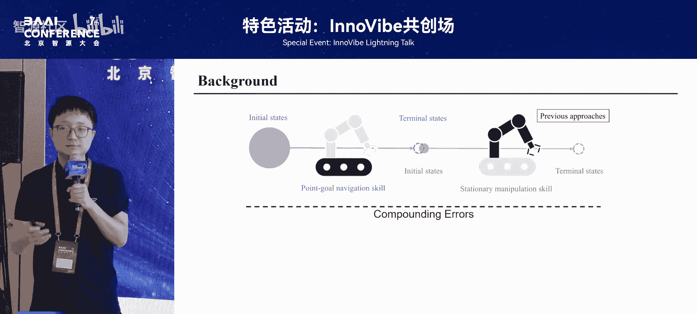

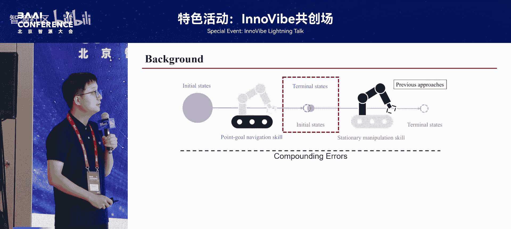

现有的视觉-语言-动作模型通常是在固定基座场景下训练的。虽然它们能很好地完成某些任务，但在移动操作场景下，成功率会显著下降。

一个直观的想法是，将视觉语言导航模型与视觉-语言-动作模型简单结合。但这种方法存在根本问题：

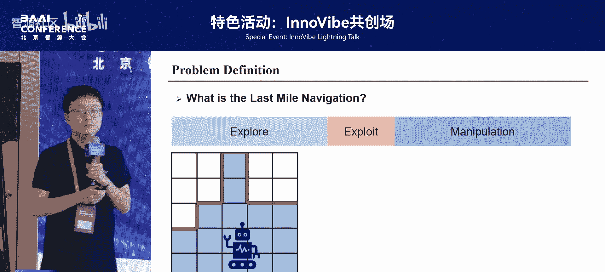

**视觉语言导航的目标是找到物体，并未考虑后续如何操作。**

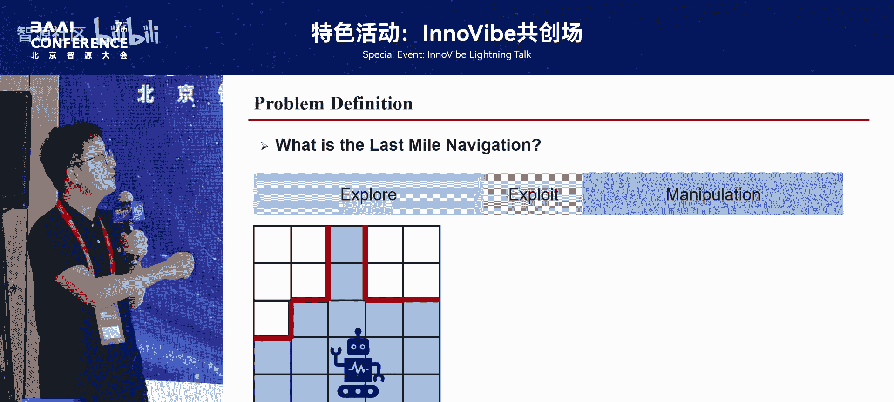

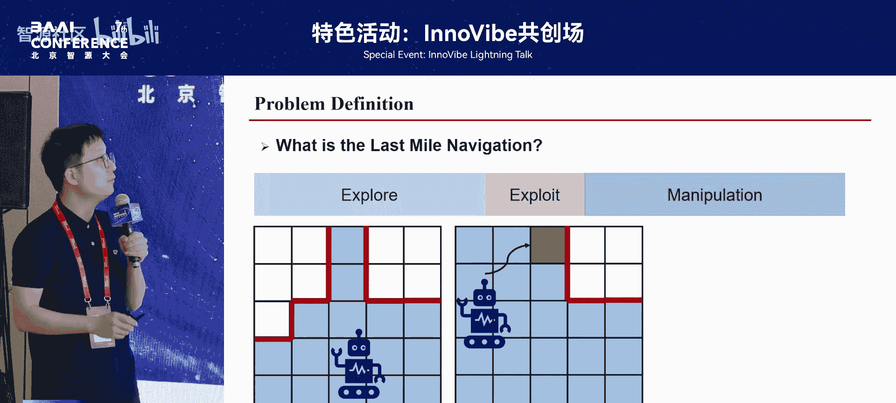

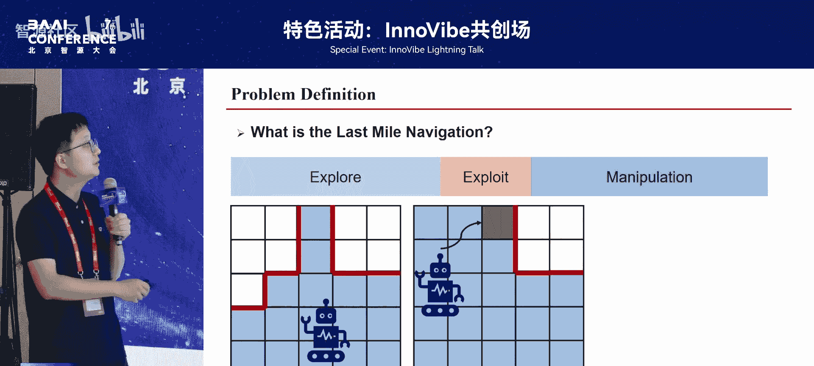

这会导致机器人选择的最终停靠点不适合操作。以下是具体问题示例：

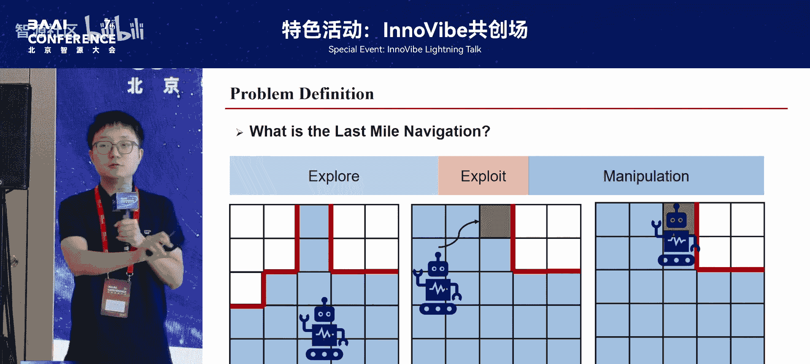

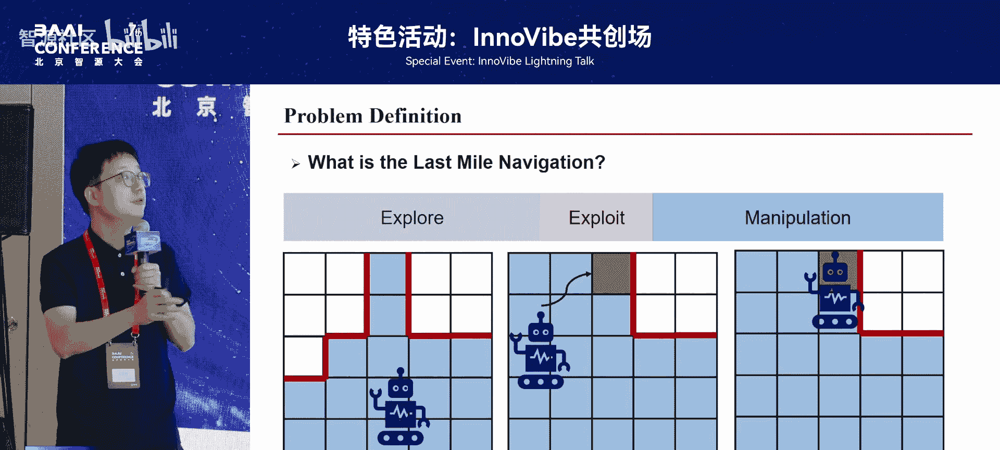

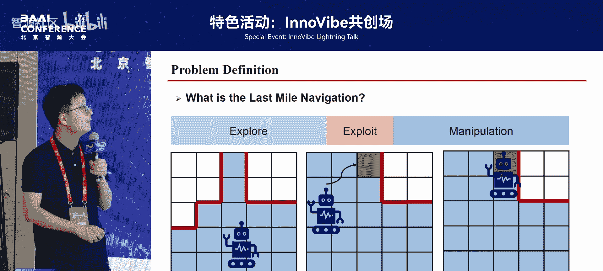

以下是直接结合VLA和VLN可能遇到的问题：
1.  **可达性问题**：机器人找到了瓶子，但停靠的位置使其无法成功抓取瓶子。
2.  **碰撞问题**：机器人找到了柜子里的瓶子，但直接抓取会碰到柜门。

因此，我们需要重新定义问题流程。

## 核心解决方案：引入“最后一步导航”阶段

上一节我们指出了简单结合的缺陷，本节中我们来看看提出的核心解决方案。

原始流程是：探索 -> 操作。
我们提出的新流程是：探索 -> **最后一步导航** -> 操作。

这个新增的“最后一步导航”阶段，其核心任务是**为后续操作选择一个合适的机器人站立位置**。

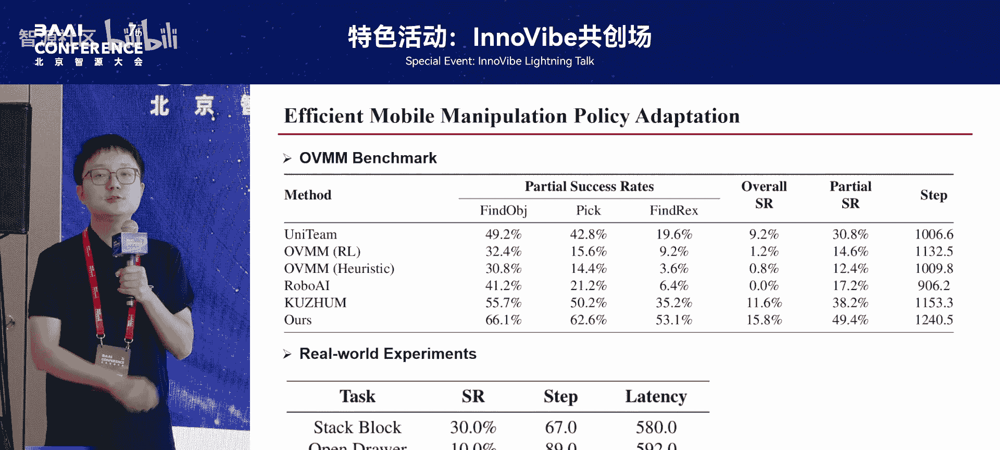

想明白这一点后，整个框架就变得非常直观。问题不在于VLA模型本身，而在于停靠点选择不当。因此，我们的核心思路是：

**仍然使用VLA模型预测机械臂末端的目标位置，但我们需要为机器人的底座和手臂协同搜索一条轨迹，使其能够安全、可达地到达该位置。**

具体做法是，将VLA预测的下一个目标位置，与一系列约束条件（如可达性、平滑性、避碰）结合，构建一个运动规划优化问题。

**目标函数**可以形式化为：
`minimize J = w1 * 可达性代价 + w2 * 平滑性代价 + w3 * 碰撞代价`
其中，`w1, w2, w3` 是权重系数。

通过求解这个优化问题，我们可以得到一条协调的底座和手臂运动轨迹。

## 方法演进：从VLA规划到VLM规划

上一节我们介绍了基于VLA规划的方案，本节中我们来看看进一步的改进。

实验发现，基于VLA规划的方法仍有局限。因为VLA通常在物体较近的视角下训练，而移动操作起始时机器人可能离物体很远，导致初始规划可能不准确。

因此，我们引入对视角变化更鲁棒的视觉语言模型来辅助规划。具体步骤如下：

1.  **提取关键点**：为当前场景提取3D关键点，这些点代表了可能需要交互的物体关键部位。
2.  **大语言模型选择**：使用大语言模型，根据任务指令和场景信息，判断当前应该前往哪个关键点。
3.  **运动规划**：确定了目标点后，沿用上一节的运动规划框架，搜索并执行到达该点的轨迹。

这种方法进一步提升了任务成功率。

## 场景理解：构建3D场景图以支持长程任务

上一节我们改进了单步规划，本节中我们来看看如何支持更复杂的长程任务。

移动操作通常是多步骤的长程任务。为了生成合理的停靠点序列，机器人需要对整个场景有全局理解。

现有的场景表示方法各有优缺点：
*   **点云**：包含丰富几何信息，但数据量大，处理复杂。
*   **语义图**：轻量，包含物体类别和关系，但缺乏几何信息。

我们提出结合两者优点的**3D场景图**，它包含两层：
1.  **语义层**：包含物体类别、属性及物体间关系。
2.  **几何层**：使用物体的**凸包**顶点作为其紧凑的几何表示。

有了场景表示后，规划流程如下：
1.  在目标物体周围生成一系列潜在的可行停靠点候选。
2.  将包含这些候选点的3D场景图输入大语言模型。
3.  大语言模型基于常识和任务要求，选择最佳的当前停靠点。

例如，任务“抓取碗”，模型会判断候选点A（碰撞风险）、B（不可达）、C（最佳），并给出理由。这种方法在复杂和长程任务中显著提升了性能。

## 总结

本节课中我们一起学习了如何赋能视觉-语言-动作模型进行移动操作。我们首先分析了简单结合导航与操作模型的不足，然后引入了“最后一步导航”阶段来优化停靠点选择。接着，我们探讨了使用更鲁棒的VLM进行规划，以及构建3D场景图来支持长程、复杂的移动操作任务。这些方法共同提升了机器人在动态环境中完成复杂操作任务的成功率和可靠性。