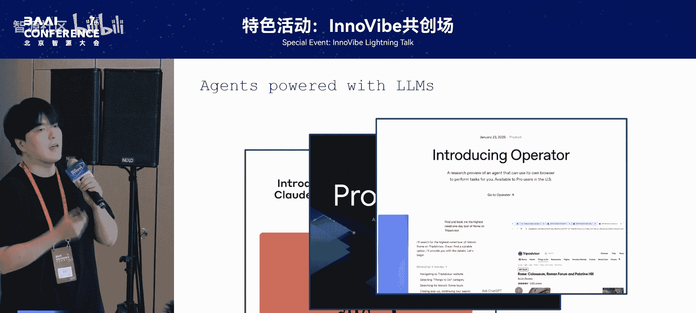
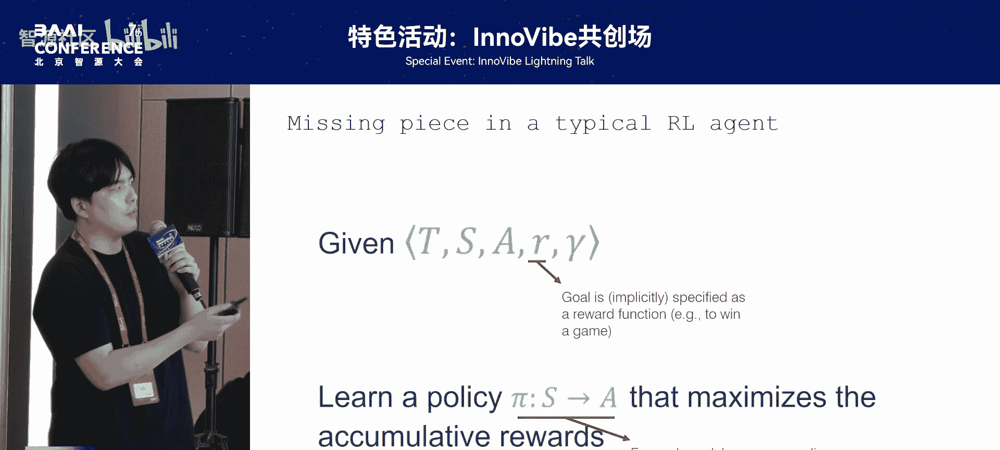
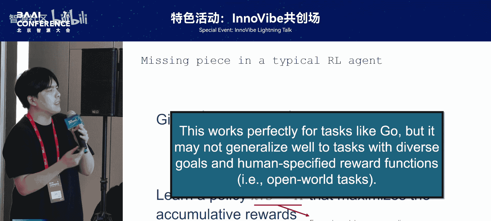
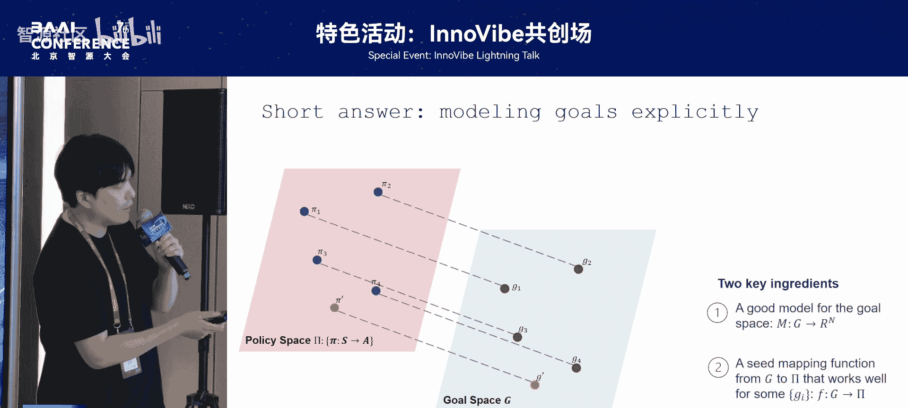
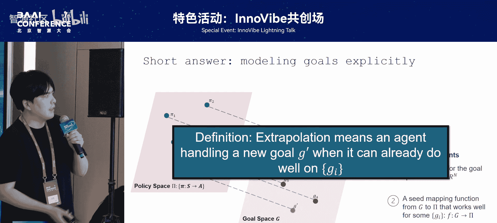
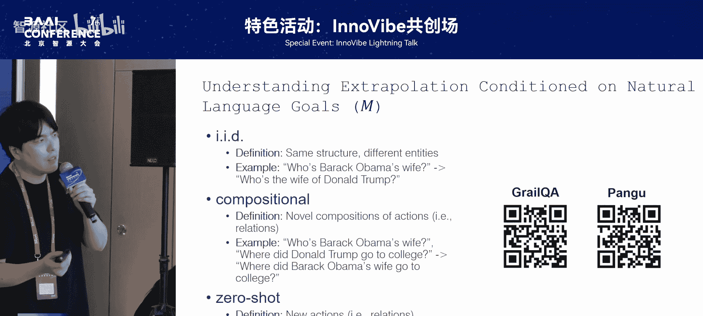
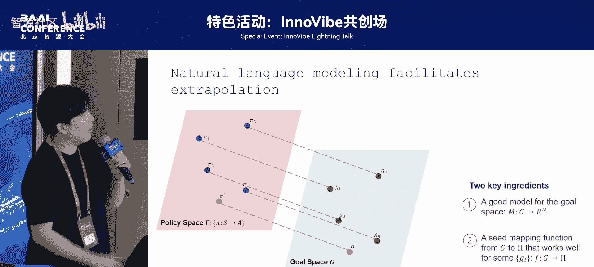
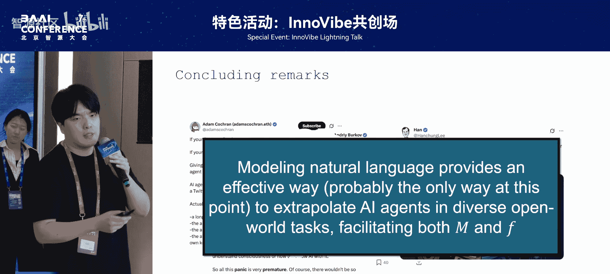

# 特色活动：InnoVibe共创场-p11-Extrapolating-AI-Agents-to-Open-World-Tasks-with-Natural-Language：谷-雨

在本节课中，我们将学习如何利用自然语言帮助AI智能体（Agent）处理开放世界中的多样化任务。我们将探讨传统强化学习方法的局限性，并理解自然语言如何为目标空间提供结构，并为策略学习提供先验知识，从而实现更高效的泛化。

## 智能体的定义与演进 🤖

智能体并非新概念。在人工智能研究早期，人们就开始讨论何为智能体。其定义非常简单：任何能够与环境交互的事物，即能够感知环境并采取行动，都可以被称为智能体。

最近一波智能体的热潮，主要源于大语言模型（LM）的赋能。例如，谷歌的Project Mariner、OpenAI的Operator等，都是这类由LM驱动的智能体。我们当前讨论的智能体，主要指的就是这些被大语言模型赋予了新能力的智能体。

## 关于自然语言角色的争论 💬

尽管智能体概念备受关注，但并非所有人都认同当前基于自然语言的智能体研究方向。许多来自强化学习或多智能体研究领域的学者，对所谓的“LM智能体”或使用语言与环境交互的智能体持保留态度。

他们的观点包括：
*   认为LM智能体的根本方向是错误的。
*   认为在智能体研究中引入自然语言是一种干扰，并非必要。
*   认为语言仅用于通信和交互，与智能体核心能力关系不大。

因此，本节课的核心目的之一，是为自然语言在智能体研究中的角色“正名”，并阐明自然语言智能体研究人员的贡献。

## 传统强化学习的局限 🔄

为了更好地理解自然语言的作用，我们首先需要看看传统强化学习智能体研究缺少了什么。

强化学习有一个根本范式，其目标是最大化一个奖励函数。这个目标通常不会直接在智能体内部建模，而是由人类根据目标间接地编写一个奖励函数，然后进行优化。例如，在下围棋时，不是直接告诉智能体“要赢”，而是设定一个关于胜负的奖励函数：赢了获得正奖励，输了获得负奖励。

智能体根据这个奖励函数进行优化，最终得到一个最优策略。这个策略将状态映射到动作空间，即智能体知道在什么状态下应该做什么事。

这个范式表面上看没有问题，像AlphaGo等大量强化学习研究都遵循此范式。但它存在一个关键问题：**我们为每一个目标，都需要独立地学习和优化一个对应的策略**。

这对于围棋等目标固定的任务是完美的。但在开放世界的真实场景中，我们面临的是多样化的目标。例如，家庭环境中的机器人可能需要完成各种不同的家务。按照传统强化学习的假设，这意味着每遇到一个新目标，都需要人类重新标注一个新的奖励函数，然后重新训练智能体。这导致泛化能力极差，因为整个过程高度依赖人工介入，效率低下。

## 目标的结构与泛化需求 🎯

为什么传统方法效率低下？一个更直观的例子可以帮助我们理解。

假设有两个目标：制作木板和制作木棍。按照传统强化学习设定，我们需要为每个目标单独编写奖励函数，并训练独立的策略。

但这里存在一个问题：**目标之间是具有结构的**。所谓“结构”，意味着当你知道如何制作木板时，直观上，这些知识也应该在一定程度上告诉你如何制作木棍。这两个目标是相关的。如果在学习过程中能够利用这种相关性，样本效率就会高很多。

然而，传统方法为每个目标独立编写奖励函数和训练策略，使得学习过程非常低效。我们的最终目标是处理开放世界中极其多样的目标，例如，让智能体根据语言指令在任意网站上完成操作。为每一个可能的目标都编写奖励函数并训练，其成本和代价是不可接受的。

那么，解决方案是什么？我们如何才能更高效地学习处理开放世界任务的智能体？

## 解决方案：对目标空间进行显式建模 🗺️

一个简短而直接的答案是：**我们需要对目标空间进行显式建模**。

让我解释一下这意味着什么。在传统设定中，我们为每个目标独立学习一个策略，没有考虑对目标本身进行建模。如果我们对目标进行建模，就可以构建一个从目标空间到策略空间的映射。

这样做的好处是：当遇到一个新目标时，我们可以根据之前学到的从已知目标到策略的映射关系，对新目标的策略进行预测。这极大地提升了样本效率，因为学习了少数几个目标后，就能预测新目标的策略。

要实现这一点，需要两个核心要素：
1.  **一个好的目标空间表示方法**：我们需要一种有效的方式来建模和表示不同的目标。
2.  **一个好的映射方法**：我们需要一种有效的方式，能够完成从目标空间到策略空间的映射。

同时满足这两个要求，我们就能达到更理想的、样本效率更高的状态。而本节课最关键的命题是：**我们可以通过自然语言建模来同时完成这两件事**。自然语言既能用来建模目标空间，也能为我们提供从目标空间到策略空间的映射先验。

## 自然语言如何赋能智能体泛化 🚀

基于上述核心思想，自然语言如何具体帮助智能体泛化呢？这里的“泛化”指的是：当智能体已经学会处理一些目标后，它如何应对新的目标。

以下是两个关键的研究方向：

### 1. 定义与理解基于语言的泛化类型

首先，我们需要理解基于自然语言建模的泛化。为此，我们需要定义智能体“已经会”的目标，并定义这些目标与新目标之间的关系，因为泛化能力是由已掌握任务和待完成任务之间的关系定义的。

在LM时代之前，定义这种关系很困难。我们的工作通过构造训练数据，并根据训练数据与测试数据的关系，定义了几种不同类型的泛化：
*   **简单泛化**：例如，智能体会回答“奥巴马的妻子是谁”，那么它也应该会回答“特朗普的妻子是谁”。
*   **组合泛化**：例如，智能体会回答“奥巴马的妻子是谁”和“特朗普在哪里上大学”，那么它可能被期望能回答“奥巴马的妻子在哪里上大学”。
*   **极端泛化**：例如，智能体会回答“奥巴马的妻子是谁”，而新任务是“她是什么时候出生的？”，这看起来完全不相关。

基于这个框架，我们进行了一系列模型设计上的改进。

### 2. 构建从目标到策略的映射

第二个方向是如何构建从目标空间到策略空间的映射。一个简单的洞察是：**自然语言编码了大量的过程性知识**。这种过程性知识能够帮助完成许多任务。

例如，如果你直接问“如何完成目标A？”，语言模型可以直接告诉你一步一步应该做什么。这种过程性知识可以被利用，作为智能体策略的条件或指导。

基于这个洞察，我们有两个相关的工作：
*   一个是通过自然语言赋能更好的策略学习。
*   另一个是通过自然语言赋能更好的世界模型与规划，这与前面有同学提到的世界模型和规划工作非常相似，但我们的场景是网页交互。在网页这种动作更离散、语言描述更丰富的场景中，自然语言能发挥独特作用。

## 核心总结与观点重申 📝

本节课中，我们一起学习了自然语言如何助力智能体在开放世界任务中的泛化。

回到开头的争论，我想强调的是：自然语言确实为智能体在开放世界任务中的泛化提供了一种非常有效的方式。它为目标空间提供了结构，并为策略学习提供了宝贵的先验知识。

但需要明确一点：我并没有说自然语言是**必要条件**，也没有说智能体**必须**依赖自然语言，因为人类的许多推理也并不需要语言。我只是指出，在当前的技术背景下，使用自然语言是一种非常高效和可行的途径。

总而言之，对于自然语言处理和大语言模型相关的研究者而言，在智能体研究中，我们扮演的角色正是通过自然语言这座桥梁，将智能体的能力拓展至广阔、多变的开放世界。