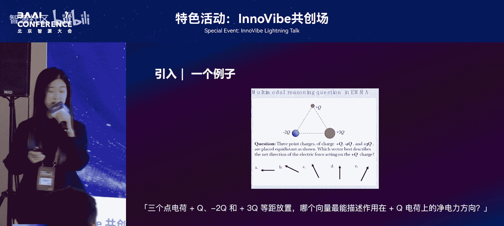
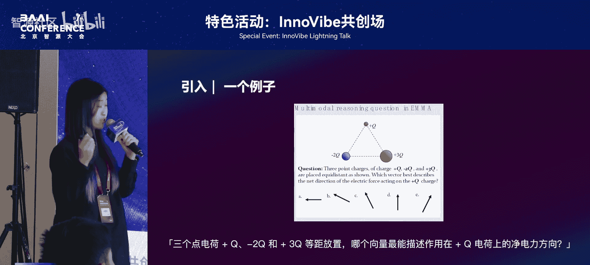
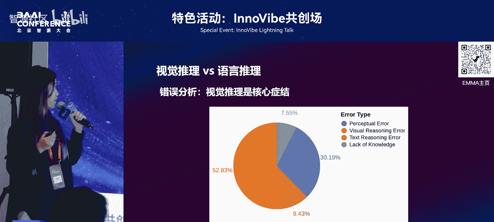

# 特色活动：InnoVibe共创场-p12-Can-MLLMs-Reason-Think-in-Multimodality；顾嘉炜

在本节课中，我们将学习多模态大语言模型（MLLMs）的推理能力。我们将探讨什么是多模态推理，分析当前模型的瓶颈，并展望未来的发展方向。

## 什么是多模态推理？

上一节我们介绍了课程主题，本节中我们来看看多模态推理的具体定义。

多模态推理是指模型在处理问题时，需要综合分析和交互来自不同模态（如文本和图像）的信息，并运用相关知识进行思考的能力。

我们可以通过一个简单的物理题例子来理解。题目包含一张图片和一段文字描述：有两个红色的正电荷和一个蓝色的负电荷，需要进行受力分析。解题原理是“同性相斥，异性相吸”。

在解决这道题时，我们首先需要分析题干中的图片和文字信息。然后运用物理学知识，在脑海中对受力方向进行模拟，并在草稿上绘制出来。最后将得出的合力方向与选项进行比对，从而得到答案。

这种在文本和图像之间反复进行思考的能力，就是一种典型的多模态推理能力。

## 当前MLLMs的推理能力现状

理解了多模态推理的概念后，我们来看看当前的多模态大语言模型是否已经具备这种能力。

我们使用同一道物理题测试了GPT-4O。尽管模型知道“同性相斥”的原理，但它无法准确判断排斥力的具体方向，例如无法区分左上角和右下角这两个力的方向。

我们怀疑这并非个例，因此提出了一个增强的多模态推理基准测试，称为 **M³Bench**。该基准测试中的每一个问题都无法通过在单一模态内进行独立思考来解决。每个问题都需要对视觉和文本信息进行深度交互才能解决。这是M³Bench与当前主流基准测试的核心区别。

在当前模型的性能榜单上，可以看到模型在跨模态推理能力上存在明显瓶颈。即使是最先进的模型，如GPT-4或能够调用视觉工具的模型，其表现距离人类专家水平仍有超过20%的差距。

## 人类与模型的思维模式差异

为了深入理解模型与人类的差距，我们分析了他们在处理问题时的思维模式差异。

以下是观察到的核心区别：
*   **人类**：倾向于借助简洁的手绘草图进行视觉化思考和空间模拟。
*   **模型**：依赖于冗长的文本进行详尽、结构化的步骤推理。

这意味着人类和模型在处理多模态推理问题时，采用了不同的思维模式。模型展现出强大的语言逻辑能力，但较少展现出类人的、以视觉为核心的直观灵活推理策略。

我们对模型的错误进行了分析，统计结果与直观观察一致。以下是主要的错误类型分布：
1.  **视觉推理错误**：占大多数。
2.  **感知错误**：其次。
3.  **文本错误**：最少。

## 如何提升MLLMs的跨模态推理能力？

认识到问题后，一个自然的问题是：如何提升多模态大语言模型的跨模态推理能力？我们探索了三种主流方法。

### 方法一：思维链（CoT）策略

我们尝试在现有问题上应用文本思维链策略。结论是CoT的效果是分化的，并且对视觉密集型任务通常有负面影响。
*   **分化**：对于开源模型，文本CoT策略往往有正向作用；对于闭源模型，则往往有负向作用。
*   **局限性**：这表明仅靠文本推理难以弥补模型在视觉推理上的短板。

### 方法二：测试时计算扩展（Test-time Compute Scaling）

我们尝试了三种不同的测试时计算扩展策略，包括多数投票、最佳N选择等。这些策略通过增加推理时的计算量，能在一定程度上提升性能，但幅度非常有限。
*   **结论**：仅在推理阶段增加文本CoT的候选数量，难以从根本上提升视觉推理能力。

### 方法三：强化学习（Reinforcement Learning）

当前开源社区已有一些工作在此方向进行探索。例如，有研究使用强化学习方式将模型扩展到720亿参数，在M³Bench挑战集上取得了较好的表现，达到了开源模型的领先水平。
*   **展望**：与前两种方法相比，通过强化学习进行优化的方式可能是更有前景的方向。

## 未来发展趋势与新范式

综合前面的探索，我们揭示了未来多模态智能的发展趋势：必将从当前以语言指导为主的推理模式，转向更深层次的模态间协作模式。

以下是可能出现的新范式：
*   **统一架构扩展**：不再仅仅扩展现有模型架构，而是对统一的多模态大语言模型架构进行扩展，使图像和文本在表征空间上实现统一。
*   **增强视觉生成交互**：在生成阶段，增强模型与视觉内容的交互能力，例如允许模型在推理过程中画辅助线或放大图像细节。

认清当前的挑战至关重要。我们期待未来有更多方法能在我们的基准测试上得到更好的验证。

## 总结与交流

本节课中我们一起学习了多模态推理的定义，分析了当前多模态大语言模型在此能力上的瓶颈，并探讨了可能的提升路径与未来范式。

目前这项工作已被ICML 2025接收。我们后续会有更多多模态推理相关的工作，欢迎大家感兴趣的话与我们联系讨论。

---

### 问答环节精选

**问：** 当前大部分模型将视觉部分转为类似文本的token输入，是否可能对模型本身进行改动以更好地理解视觉信息？

**答：** 是的，这是新范式的第一种方向。当前MLLMs的强大主要源于其底层语言模型的能力。新的尝试旨在训练一个统一的图文混合模型，使图像和文本在表征空间上统一。已有如Chameleon、Bagualu等工作在模型架构和训练数据上进行此类优化。

**问：** 多模态推理目前只涉及数学和物理问题吗？

**答：** 不是的。我们的数据集中包含数学、物理和编程问题。实际上，多模态推理也涵盖日常场景，例如“根据一张打篮球的图片，找出正在投篮的运动员的球衣号码”。这类任务更注重视觉，且可能没有辅助文本。而数理问题很多时候仍是文本主导的。

**问：** 在多模态任务上使用思维链（CoT）效果如何？

**答：** 效果主要取决于任务类型。如果任务只需对图片进行一次描述（Caption），然后进行文本CoT推理就能解决，那意味着推理过程不需要与图片进行多轮交互，CoT可能有效。但如果任务需要对图片进行交互（如放大、画辅助线），在大多数场景下CoT不会有增益。若能用文字准确描述图片所有内容，则文本CoT有可能带来提升。

**问：** 在目标检测（Detection）这类视觉任务上，CoT有效吗？

**答：** 在我们的实验中，类似检测的任务比较偏视觉主导，因此在文本上构造CoT没有表现出很大的增益。