# 特色活动：InnoVibe共创场-p13-机器学习势在催化计算中的应用：李文韬

在本节课中，我们将学习机器学习势在催化计算领域的基本概念、重要性及其应用背景。催化剂是现代化学工业的基石，但其传统研发模式面临诸多挑战。催化理论计算和机器学习势为应对这些挑战提供了新的解决方案。

## 催化剂的重要性与挑战

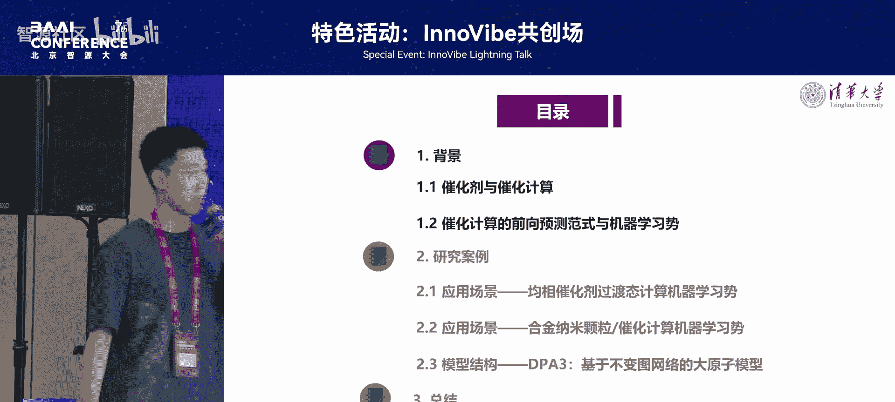

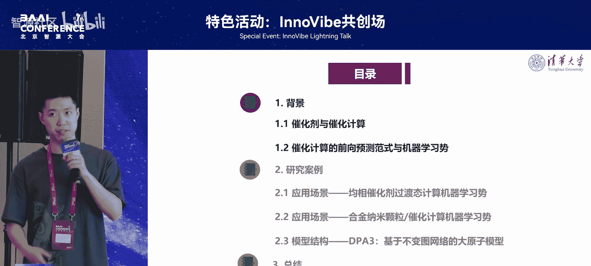

催化剂在化工与材料领域至关重要。催化剂可以降低反应的活化能，提高反应速率。催化剂可以提高反应的选择性，生成预期的产物。催化剂可以降低反应条件，从而降低成本。

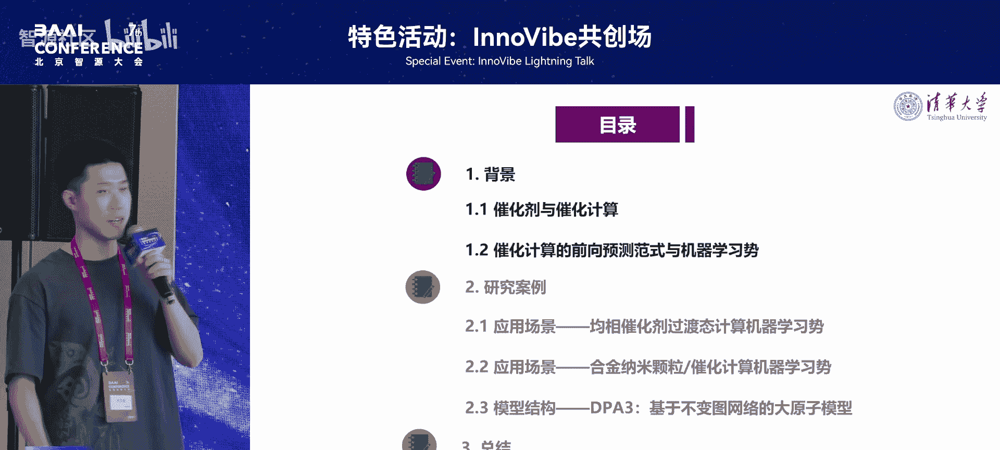

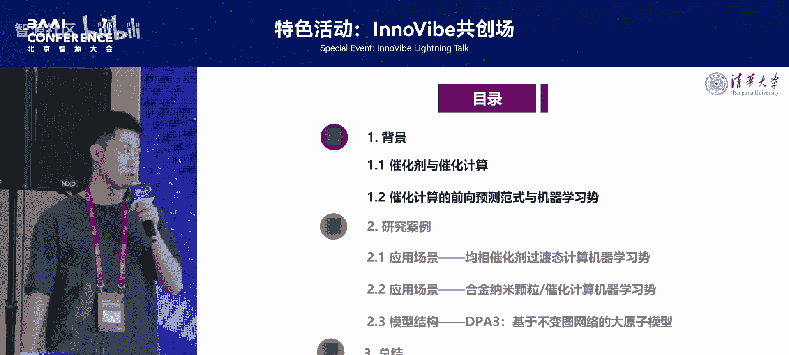

目前，传统的催化材料研发面临许多挑战。基于实验的催化研发大多采用试错式研发范式，导致研发周期长、成本高。催化剂材料的设计空间广阔而稀疏，难以快速探索。即使是专业研究人员，也难以快速获得高性能的催化剂材料。

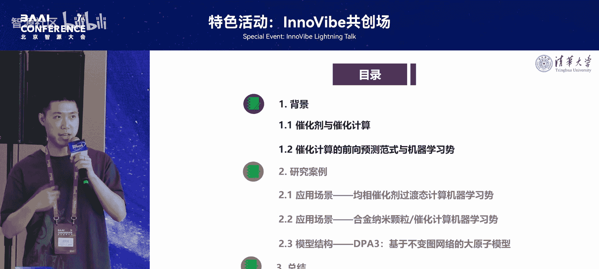

## 催化理论计算与机器学习势

上一节我们介绍了催化剂研发的挑战，本节中我们来看看理论计算如何提供帮助。催化理论计算是将量子化学方法（常用密度泛函理论DFT）应用于催化反应体系的建模和分析，以得到材料体系的势能面。

计算模拟在催化研究中具有重要作用。计算模拟可以揭示催化反应机理，例如计算反应路径和过渡态，从而验证或提出新机理。计算模拟可以预测催化剂性能，包括活性、选择性和稳定性，为实验提供理论指导，减少试错成本。

目前，基于计算预测的催化研究主要有三大范式。

以下是三大范式的具体介绍：
*   **催化理论计算**：精确度高，但计算代价昂贵。单个材料样本可能需要数小时或数十小时的计算，难以进行大规模筛选。
*   **材料性质预测**：计算速度快，但由于缺乏足够的物理信息，难以泛化到下游场景。
*   **机器学习势**：兼具前两者的优势，效率较高，并且具备比较全面的物理信息，能够更精确地描述材料体系。

具体而言，在实现层面，基于几何图神经网络的机器学习势可以以图结构的形式处理催化剂数据。机器学习势在基于DFT计算的标签数据集上进行训练后，可以替代DFT或量子化学计算方法，得到材料体系的势能面，从而进一步揭示催化反应机理和预测催化剂性能。

---

# 机器学习势在催化计算中的应用：2：研究案例与应用场景

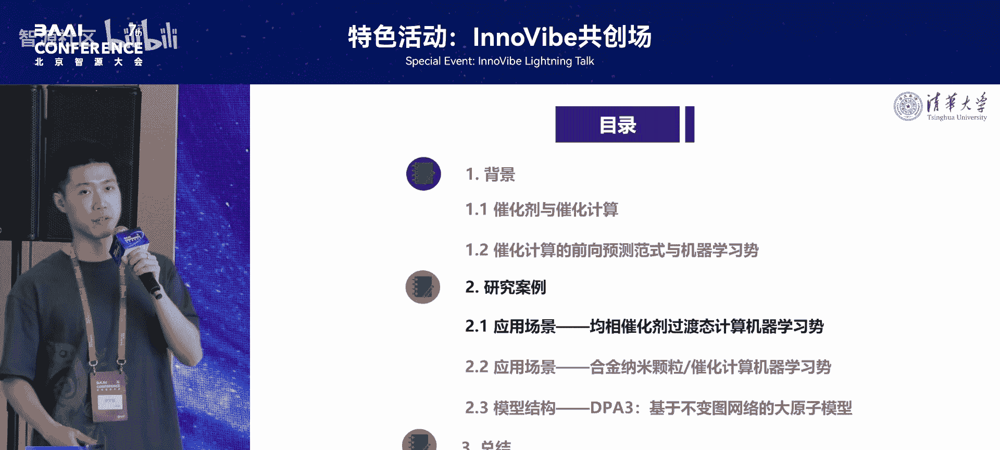

在了解了背景知识后，本节我们将结合具体的研究案例，深入探讨机器学习势在均相催化和异相催化中的实际应用。

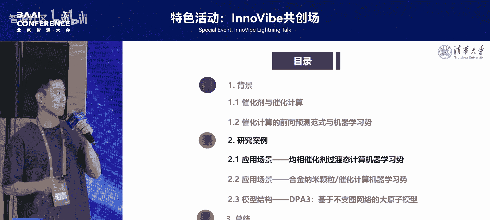

## 案例一：均相催化中的过渡态计算

催化剂的活性是重要的衡量指标，而催化反应的过渡态能量是决定反应活性的关键指标。因此，我们构建了面向催化剂发现的过渡态搜索势函数模型。

该模型的工作流程主要分为三个阶段。
以下是三个阶段的简要说明：
*   **结构与训练数据构建**：选取乙烯加氢这一简单反应体系，催化剂为贵金属结合膦配合物的均相催化体系。我们从数据库获取了数百种催化剂结构，并使用量子化学计算（DFT结合NEB方法）生成了约60万个单点数据集。
*   **过渡态势函数的训练**：通过迁移学习的方式降低数据需求并提高模型精度。
*   **初始结构生成与大规模筛选**：结合生成算法，对未见过的催化剂结构进行生成，并通过训练好的机器学习势预测其反应的过渡态能量。

在性能验证方面，模型预测的过渡态能量和结构与DFT结果高度吻合，适用于大规模筛选。通过整个工作流程筛选出的Top 50催化剂，再经过催化理论计算验证，结果保持了一致性。同时，结合大模型进行机理分析表明，大规模筛选出的催化剂其反应过渡态能量的趋势符合已有的材料知识，并总结出了一些规则，可为催化专家提供启发。

## 案例二：异相催化中的表面能预测

上一节我们探讨了均相催化，本节中我们来看看异相催化（即晶体材料、合金纳米颗粒催化）中的应用。晶体表面能是反映催化剂表面稳定性的重要指标，而稳定性是催化剂的关键性能之一。

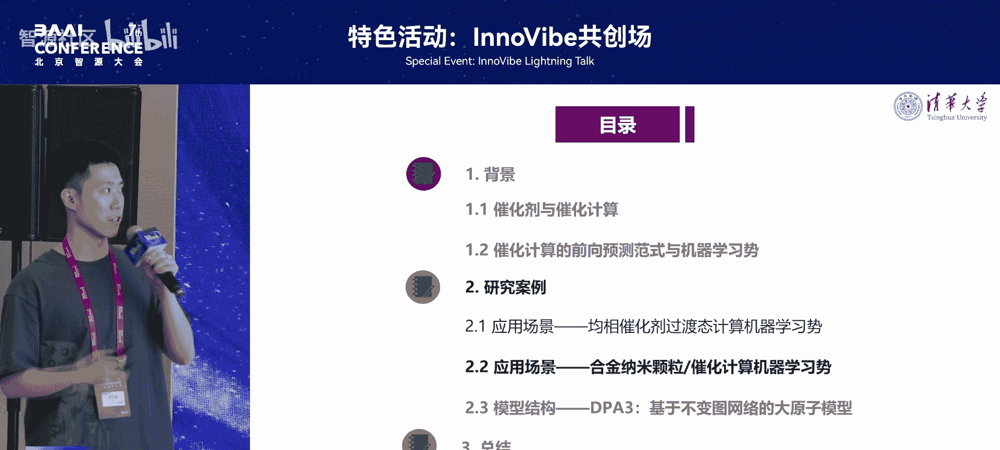

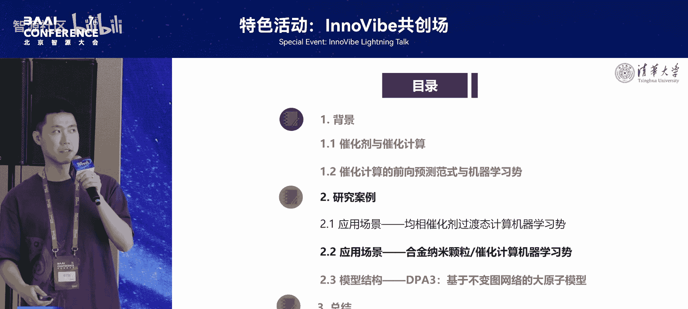

我们通过构建表面能的机器学习势来预测异相催化剂的表面能量，该能量是评估晶体表面可合成性的重要指标。我们通过主动学习框架构建了一个合金表面能的势能数据库。该数据集包含50种金属元素、6000种合金和12000种合金表面形貌，花费了超过34万次DFT单点计算，涵盖了Materials Project中所有稳定的二元和三元合金，是领域内最大的高精度合金表面数据集之一。

我们训练了表面能的机器学习势。该势函数在预留数据集、同分布数据集以及分布外（OOD）数据集上都表现出较高的精度。对于几种常见的晶体材料，通过预测其表面能并依据Wulff规则构建出的晶体表面形貌，与DFT计算出的结果具有很高的相似性。

我们与实验组合作，对一些常见晶体材料的表面进行了合成与表征，并通过大语言模型作为知识提取工具，从文献中提取催化信息和表征信息，从实验和文献角度验证了计算结果的准确性。相关模型已在论文附带的代码链接中开源，研究者可加载模型预测未出现在数据集中的晶体表面，也可通过少样本微调使预训练模型快速适应下游任务。

---

# 机器学习势在催化计算中的应用：3：模型结构与未来展望

在介绍了具体应用后，本节我们将关注支撑这些应用的模型技术本身，并展望该领域的未来发展方向。

## 模型结构研究：DPA-3大原子模型

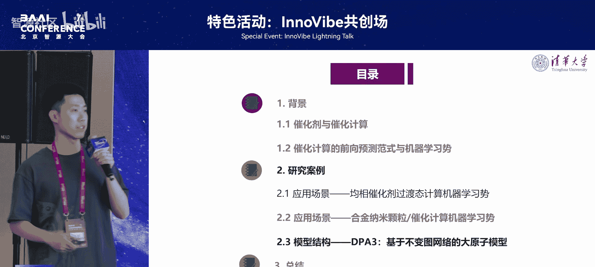

目前，机器学习势的发展逐渐走向更大、更通用的阶段，因此“大原子模型”的概念应运而生。大原子模型指在超大规模量子化学或DFT计算数据上训练的、能够通用表示各种材料体系势能面的模型。

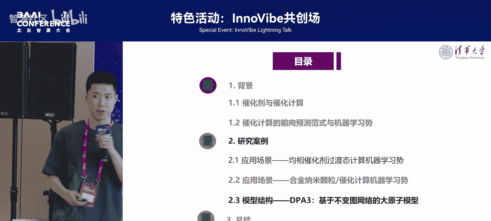

在自然语言处理领域，缩放定律（Scaling Law）成立，即模型参数量、数据量和计算资源的增加能持续提升模型性能。然而，这一现象在大原子模型中尚未得到充分验证。因此，我们提出了一个基于线图理论的机器学习势模型——DPA-3。

DPA-3模型考虑了原子（点）、键（边）、角度和二面角等几何结构信息，同时涵盖了对称性信息。该模型满足物理不变性，例如旋转、排列和平移不变性，并满足能量守恒。这一模型先天具有很好地描述原子间相互作用的能力。

我们的DPA-3模型在各种基准数据集上都取得了优异的结果。我们验证了模型的缩放定律，如右图所示，在同一模型架构下，随着层数的不断增加，模型的损失曲线和最终性能均有所提升。

## 总结与未来方向

本节课中我们一起学习了机器学习势在催化计算中的应用。目前，AI驱动的材料科学研究主要分为三大方面。

以下是三个主要方向：
*   **构建更全面的数据集**。
*   **构建表示能力与泛化能力更强的模型结构**。
*   **寻找更加前沿、更具挑战性的科学问题**。

目前，机器学习势参与的催化研究也已进入这三者的良性循环。我相信在未来，通过构建更准确、更高效的势函数，将有助于催化研究者产生更多灵感，从而促进下一代催化剂的发现。

---

## 问答环节

**问**：在您的第一个工作中提到使用了迁移学习来增加泛化性。请问这里的迁移学习具体指什么样的方法？

**答**：这里的迁移学习指的是，我们的模型首先在一个相关的任务上进行有监督的预训练，然后再在目标任务上进行微调。具体来说，因为过渡态数据对应的是催化剂在反应路径上的非稳态结构，我们需要专门的过渡态势函数数据集。我们加载了一个名为“TransOneX”的模型，它是在小分子反应（同样是反应路径下的非稳态结构，但非催化剂）的过渡态数据上训练的。我们先在小分子数据上预训练，然后加载参数，再在我们的催化剂过渡态数据上进行微调。这意味着中间经历了一次微调过程。