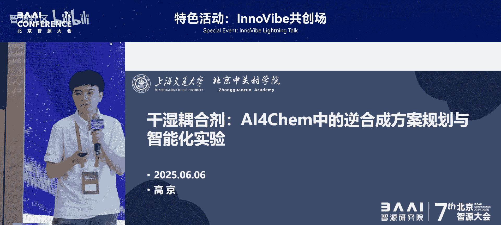
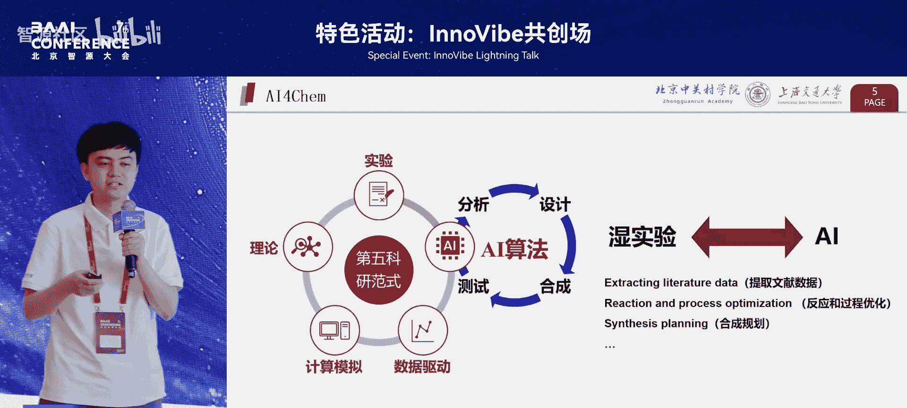

# 特色活动：InnoVibe共创场-p14-干湿耦合剂：AI4Chem中的逆合成方案规划与智能化实验-高-京

在本节课中，我们将学习AI在化学领域（AI4Chem）的应用，特别是如何将算法（干实验）与物理实验（湿实验）相结合。我们将探讨逆合成方案规划的核心方法，并了解如何通过智能化实验平台实现方案的自动化执行。

## 🔬 AI4Science的发展历程

上一节我们介绍了课程主题，本节中我们来看看AI4Science的背景。AI4Science并非全新概念，其起源可追溯至1957年发表在《Science》上的一篇文章。该研究利用计算机系统检索美国专利局中的化学信息记录。这项研究与60年后的今天所倡导的“第四科研范式”——即基于数据驱动的科学研究——在本质上并无区别。

如今我们谈论的AI4Science，常被视为“第五科研范式”。它旨在将传统科研中的四个环节——实验、理论、第一性原理计算模拟以及数据驱动——结合起来，从而形成更强大的新范式。

## 🧩 AI4Chemistry的任务分类

在了解了宏观背景后，我们聚焦到化学领域。2023年，多伦多大学的Alán教授团队对AI for Chemistry（或Materials）的任务进行了系统性总结。以下是其划分的6个大类：

1.  **机器学习势能**：利用机器学习模型模拟原子间相互作用。
2.  **性质预测**：预测分子的物理、化学或生物活性。
3.  **构象生成**：生成分子的稳定三维结构。
4.  **逆合成规划**：为核心主题，下文详述。
5.  **反应预测**：预测给定反应物下的主要产物。
6.  **条件优化**：优化化学反应的实验条件。

这些任务在“干实验”（算法与模拟）中已取得显著成果。然而，AI在干实验上的突破，最终需要与真实的“湿实验”相结合才能创造实际价值。目前，AI在实验环节的应用仍有巨大探索空间，是一片广阔的蓝海。

## 🧪 从算法到实验的挑战

那么，如何将AI与湿实验结合呢？首先需了解一般科学物质实验的流程。通常，科研人员会先选取一个特定的研究体系，然后借助计算模拟或数据驱动的方式对问题进行建模与预测，从而得到候选材料。

获得候选材料后，关键步骤是如何将其融入实验环节。目前，许多课题组将后续工作交给了实验室的硕士或博士生，由他们手动规划并执行实验、分析数据。这实际上是一种“人工的智能”。

流程的右侧环节——即实验的自动化规划与执行——是目前智能化实验室建设中极度匮乏的阶段。该阶段可总结为需要以下7个方面的能力：

1.  实验方案设计
2.  资源调度与管理
3.  实验操作执行
4.  数据实时采集
5.  过程监控与安全
6.  结果分析与反馈
7.  方案迭代优化

若进一步精炼，可借用深势科技张林峰博士的观点：我们需要让AI模型学会 **“读、算、做”** 三项核心能力。

*   **读**：从化学文献等非结构化数据中，提取有用的知识并将其结构化。这与1957年的工作一脉相承，但在当今大语言模型（LLM）的加持下，我们能处理更复杂的数据，如化学结构式、图表等。
*   **算**：利用第一性原理计算软件或机器学习模型，进行性质预测和模拟。
*   **做**：这是实验得以进行的关键，需要一个**调度的中控**和一个**执行的平台**来将方案转化为实际行动。

我们的研究小组主要致力于解决“做”这一环节的挑战，即蓝色部分所代表的智能化实验执行。

## 🧬 任务一：有机逆合成预测

首先，我们介绍一个在学术界已活跃多年的任务：**有机单步逆合成预测**。其背景是：在医药等领域，若发现一个具有卓越疗效的化合物，如何快速、高效地设计出合成它的路线？这就是逆合成规划的目标。

传统方法主要基于模板或半模板，利用图神经网络对分子进行表示和建模。但这种方法受限于模板库，难以实现能力扩展。随后，研究者开始使用Transformer模型对SMILES字符串（一种表示分子结构的字符串）进行编码。

然而，这些方法忽略了一个关键点：在逆合成任务中，反应物与产物共享一个分子骨架。这个骨架的表达顺序也需要被模型理解。因此，我们通过**增强位置编码与SMILES字符串顺序**的方式，使模型能更好地捕捉这一结构信息。

在无需模板（template-free）的方法中，我们的模型在**Top-1准确率**上达到了 **66.2%** 的精度。公式上，这可以表示为模型对给定目标分子 \( T \) 预测最佳前体分子 \( R \) 的概率：
\[
R^* = \arg\max_{R} P(R | T)
\]

## ⚗️ 任务二：无机化合物逆合成

接下来，我们探讨一个源于DeepMind等团队在2023年底发表于《Nature》的工作所激发的任务：**无机化合物逆合成**。与有机合成相比，它既简单又困难。

*   **简单之处**：无机合成通常不需要多步规划，往往通过“一锅法”直接得到产物，只需找到合适的前驱体和反应条件。
*   **困难之处**：有机合成有美国专利局等机构整理的规范结构化数据，而无机合成的数据则散落在科研论文的“实验方法”部分。这部分文本信息密度高，且作者为降低重复率，常使用灵活多变、人类能理解但机器难以解析的描述。

我们测试发现，即使使用GPT-4等先进大语言模型，从文献中提取此类数据的准确率仍不理想，需要大量人工干预。

获得数据后，解决该任务的核心是将已知合成方案构建为**知识库**，并进行**知识检索**。具体方法是：为每个产物计算表征，通过相似性检索，为待预测的化合物找到最相似的已知化合物。这样，可将前驱体的候选类别从上千个缩小到约20个，从而大幅提升模型预测的精确度。

我们的方法相比2023年NeurIPS会议上发表的相关工作，在准确率上**高出约3个百分点**。

## 🤖 智能化实验执行平台

有了实验方案（用什么原料、何种条件、哪个步骤），下一步就是执行。正如前文所述，这需要一个**调度的中控系统**。

我们与深势科技合作，基于其开发的**UniLabOS**平台进行开发。该平台支持多种编程语言和多协议串口通信，旨在帮助一线实验室实现自动化升级，将硕博生从重复性实验操作中解放出来，更专注于科学思考。

平台提供了网页界面，可与真实实验设备联动，远程监控和操控实验。目前，深势科技正与教育部联合举办“有机智能实验”大赛，总奖金高达20万元，欢迎感兴趣的同学关注参与。

## 👁️ 具身智能在化学实验室的应用

拥有了调度中控，要真正实现自动化，还需要“手”和“眼”，这就是当前火热的**具身智能**。在化学实验场景中，一个核心挑战是操作**大量透明的实验仪器**（如烧杯、试管）。

要让机械臂抓取准确，必须对操作物体进行精确的**位置估计**。针对透明物体难以感知的问题，我们提出了新的解决方案：

1.  首先，使用**Diffusion模型**对透明物体表面生成掩码（Mask）。
2.  然后，针对透明部分单独进行**第一表面反射**的几何信息抽取。

相比于之前基于高斯重建的方法，我们的方法在透明物体位置估计上实现了显著的效果提升。我们同时构建了包含试管、烧杯等常用化学仪器在内的数据集，以推动该领域研究。

在获得精确的位置估计后，即可用机器人机械臂执行抓取、倾倒、混合等操作。我们设计了一个**视觉语言动作模型**，将化学实验动作拆解为原子操作。对于每个动作，结合RGB图像信号估计的位置信息，利用**Diffusion Policy**生成机械臂的控制轨迹。

我们已实现了完整的真机演示，系统能够按规划方案执行一系列实验步骤。

## 🚀 展望：知识飞轮与AGI

我们正处在一个充满机遇的时代。前几年大语言模型蓬勃发展，今年具身智能又成为热点。可以这样总结趋势：

*   **科学智能** 在不断产生数据。
*   **大语言模型** 负责对知识进行抽取、压缩与推理。
*   **具身智能** 赋予AI与物理世界交互的能力。

这三者若能紧密结合，将形成一个强大的 **“知识飞轮”**：从数据中提炼知识，用知识指导智能体行动，行动产生新数据，进而迭代优化知识。这个循环有望加速我们通往**通用人工智能**的道路。

## 📝 总结

本节课中我们一起学习了AI4Chem的核心内容。我们从AI4Science的历程谈起，了解了AI在化学中的主要任务分类。重点探讨了**有机与无机逆合成规划**两种任务的不同挑战与解决方案。接着，我们深入讲解了实现智能化实验所需的**调度中控平台**和**具身智能技术**，特别是针对透明仪器的视觉感知难题。最后，我们对科学智能、大语言模型与具身智能三者融合形成的“知识飞轮”进行了展望。希望本教程能帮助你理解AI如何驱动化学研究的自动化与智能化。