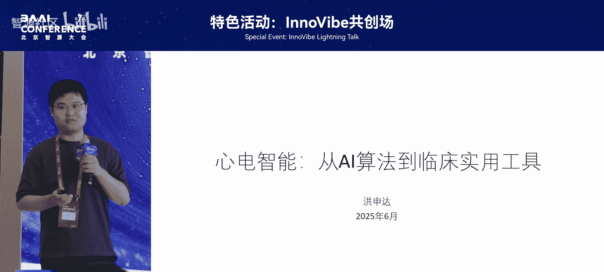
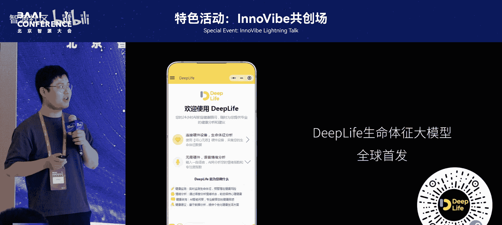
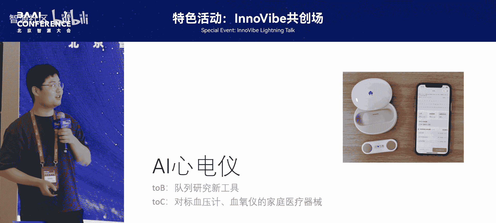

# 特色活动：InnoVibe共创场-p15-心电智能：从AI算法到临床实用工具-洪申达

在本节课中，我们将学习北京大学洪申达教授关于心电智能的研究工作。课程将涵盖心电图的独特价值、人工智能算法在心电分析中的应用，以及如何将这些算法转化为临床实用的工具。

## 1：心电图的独特价值与研究视角 😊

心电图对我们而言，既熟悉又陌生。从1924年因其机制研究获得诺贝尔医学奖，到2024年使用现代设备采集心电图，一百多年来其采集方式没有本质变化。因此，心电图被认为是房颤等疾病研究的绝佳视角，因为其数据采集方式稳定。

近年来，医学研究发现心电图与多种疾病存在关联。除了房颤，心电图还与心衰、贫血等血液指标，甚至全因死亡风险相关。在AI时代，越来越多的疾病被发现与心电信号存在关联，这为我们提供了一个绝佳的研究视角。

基于此，我们的探索目标是发现心电信号与多种疾病之间的关联，并利用这种数据来识别未来的疾病风险。

## 2：迈向AI家庭医生：生命体征大模型 😊

当前大模型技术火热，我们希望它能成为家庭医生。然而，仅靠对话无法准确评估健康状况，必须对接健康监测设备或医疗器械。

为此，我们开发了名为“ep life”的生命体征大模型。其重点不在于模型本身，而在于如何让大模型理解设备采集的生理信号，特别是心电信号。今年下半年，我们计划对接更多设备，如智能戒指、眼罩、脑电、PPG等信号。

我们的最终目标是打造一个由健康监测设备与大模型结合，在居家场景下实现健康监测与管理的AI家庭医生。

## 3：数据基础与算法探索 😊

为了实现上述目标，我们进行了大量前期工作。首先是数据积累。我们在心电领域有充足底气，因为我们拥有大量数据。

我们在前年年底公开了一个大规模数据集。其特点是数据量庞大，包含了来自180万人的超过1000万份心电图。我们在这个数据集上进行了后续的大模型研究工作。

将心电信号作为时序数据处理，是我们近年来的工作重点。最终，我们公开了一个网络架构。该网络不仅对心电信号有效，对许多生理信号也很有用。通过简单的结构化设计，可以构建不同大小、宽度和深度的卷积神经网络，通常都能达到良好的效果。

最近，我们结合上述两项技术完成了一项新工作。该工作探索了12导联心电信号对150种心律失常的诊断效能。此外，我们还进行了一些有趣的探索，例如通过心电信号准确识别人的性别和年龄。

对于某些有创检查指标，例如心梗患者会检测的NT-proBNP指标，我们也可以通过心电图推断其风险水平。我们还探索了预测未来发生慢性肾脏病和慢性心血管疾病风险的工作，这些发现都颇具意义。

## 4：心电多模态与大模型技术 😊

回到大模型技术本身，目前市面上大多数模型既无法理解心电信号，也无法根据文本生成心电信号。

因此，我们在心电多模态领域提出了新概念。心电信号通常被视为信号数据，但它也包含心电图图片、波形参数以及医生的描述文本等多种形式。我们正在探索如何围绕这些多模态心电数据构建大模型，使其能够实现“文生心电”、“心电生文”或进行波形分割与解读等任务。

## 5：从算法到临床实用工具 😊

在算法研究达到一定阶段后，我们的下一步目标是开发临床可用的工具。我们最近开发了一款设备，通过微信小程序即可使用。

我们希望将其打造为对标血压计和血氧仪的家庭医疗器械。该项目的软件、硬件和算法均为自主研发，并已获得医疗器械认证，在主流电商平台均可找到。

在AI算法方面，我们致力于体现AI医学的温度。例如，我们专门开发了模型来识别设备导联是否倒置，因为许多老年用户可能看不清标识。对于同一设备多人使用的情况，我们发现每个人的心电信号具有独特性，因此可以利用心电信号进行用户身份识别。

我们还致力于提供简单易懂的解读。例如，许多人在体检报告上看到“窦性心律”后会上网搜索其含义。我们的目标之一就是解决这类问题。

## 6：临床合作与社会意义 😊

我们的工作得到了社会关注。总的来说，这项研究的一大意义在于能让更多人享受到人工智能的价值。

通过人工智能算法、我们开发的设备以及与临床医生的真实合作，目前我们已在多家医院开展了多项临床试验，涉及房颤、心衰、瓣膜病等患者的院前筛查和院后健康管理。

## 7：总结与展望 😊

最后进行总结。在技术方面，我们涉及新的模型架构、训练策略和提示工程。算法追求精准和可应用性。

在解决临床问题的过程中，许多医生正在使用我们的设备进行医学新发现，探索新型无创检测、居家检测以及AI家庭医生等新概念的验证。

我们构建了一个集算法、设备和微信小程序于一体的便携式患者健康管理系统。以上是我们目前正在进行的工作，未来也期待与更多同仁分享临床方面的进展。

我们正在医学部致力于AI医疗研究。如果各位感兴趣，欢迎合作或加入我们的实验室，共同探索人工智能在医疗领域真正能够落地、让每个人都能受益的应用场景。

---

本节课中，我们一起学习了心电智能从基础研究到临床应用的完整路径。我们了解了心电图的独特价值，探索了用于心电分析的人工智能算法，特别是大规模数据集和卷积神经网络的应用。我们还看到了如何将这些算法转化为实际可用的临床工具，例如便携式心电监测设备，并探讨了与临床结合实现健康管理的愿景。最后，我们认识到，让先进技术服务于大众健康，是医疗人工智能发展的核心目标。