# 特色活动：InnoVibe共创场-p17-面向具身智能的在线三维场景感知：许修为

## 概述
在本节课中，我们将学习清华大学许修伟博士提出的面向具身智能的在线三维场景感知方法。该方法旨在解决机器人实时理解三维环境的核心挑战，为导航、操作等下游任务提供坚实基础。

---

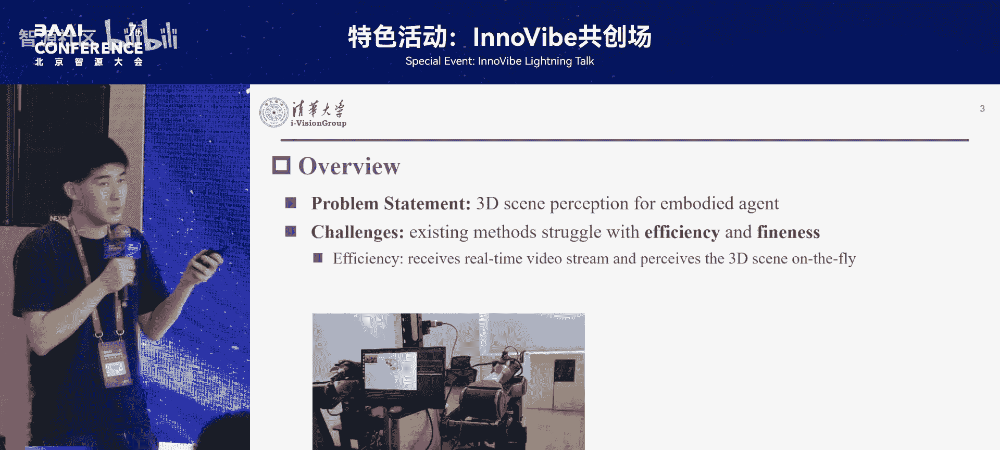

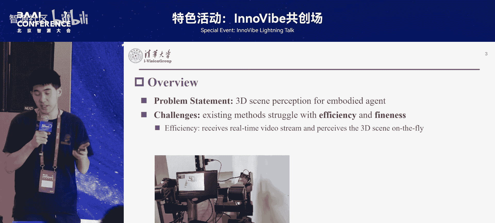

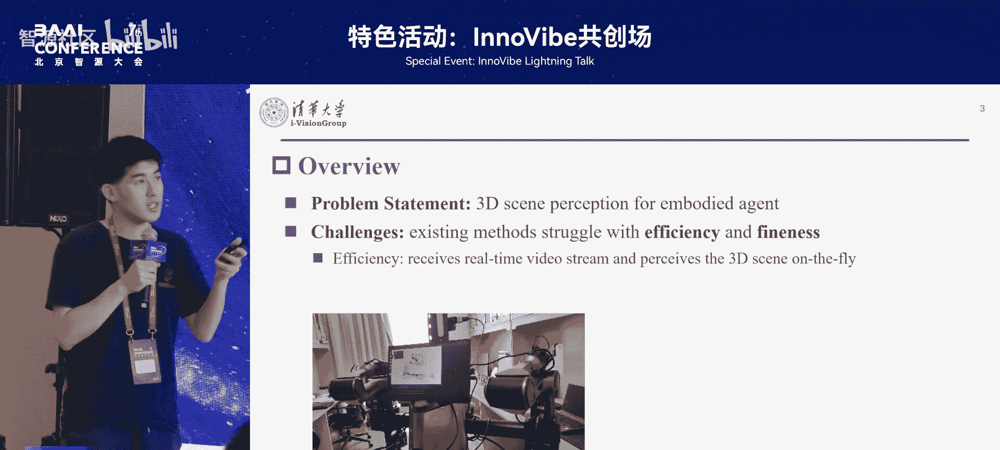

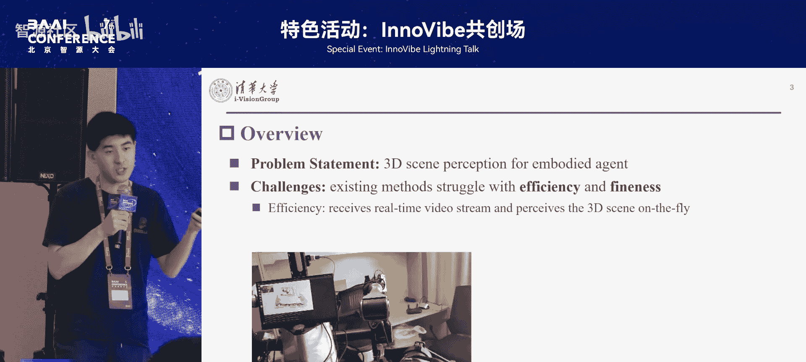

## 核心挑战与目标
我们要做的事情是精准理解三维空间中的所有物体，并将它们识别出来。这为下游的各种具身任务，例如任务规划、导航和操作，提供了坚实基础。

然而，目前的三维感知方法在应用到具身机器人时，会面临许多问题，导致它们无法实际落地。具体体现在两个方面。

第一点在于效率层面。在瞬息万变的现实场景中，机器人往往需要探索未知环境。在探索过程中，机器人的规划、决策和运行需要与场景感知同步完成。因此，场景感知的输入应该是一个实时在线的视频流，而非提前重建好的场景。

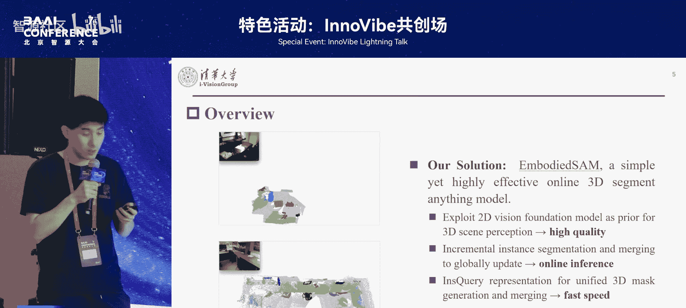

第二点则在于细粒度。我们希望服务于各种各样广泛的具身应用，所以希望能把场景中尽可能多、尽可能细的物体检测并分割出来。

以上挑战激发我们提出一种新的三维场景感知范式。它需要具有三个特征。

以下是该范式需要具备的三个特征：
1.  **高质量**：无论是准确度还是泛化性，都是作为3D感知基础模型必须具备的能力。
2.  **在线推理能力**：它不应该是提前把场景重建好，收集完数据后再做感知，而应该随着机器人的探索和移动，同步完成场景的重建和感知。
3.  **高效率**：它可以直接部署在机器人的边缘端，而非运行在云端，并且在边缘端也能达到实时的运行速度。

为此，我们提出了 **Inbody** 方法。我们通过一个基于2D视觉基础模型和通用实例查询的表示方式，比较简单地实现了以上目标。

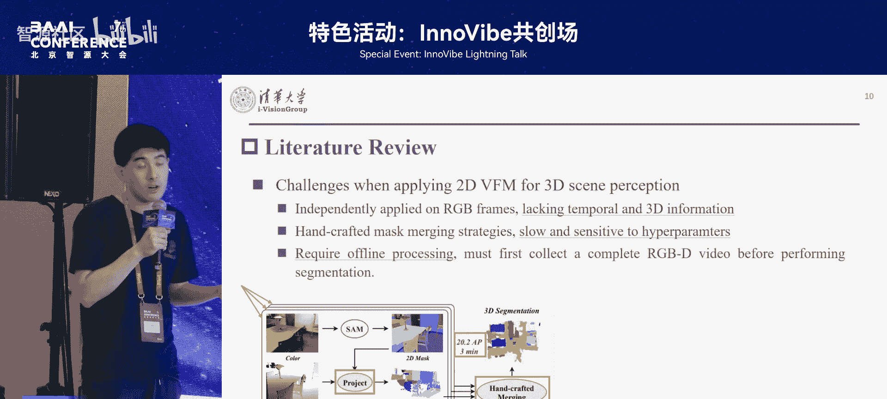

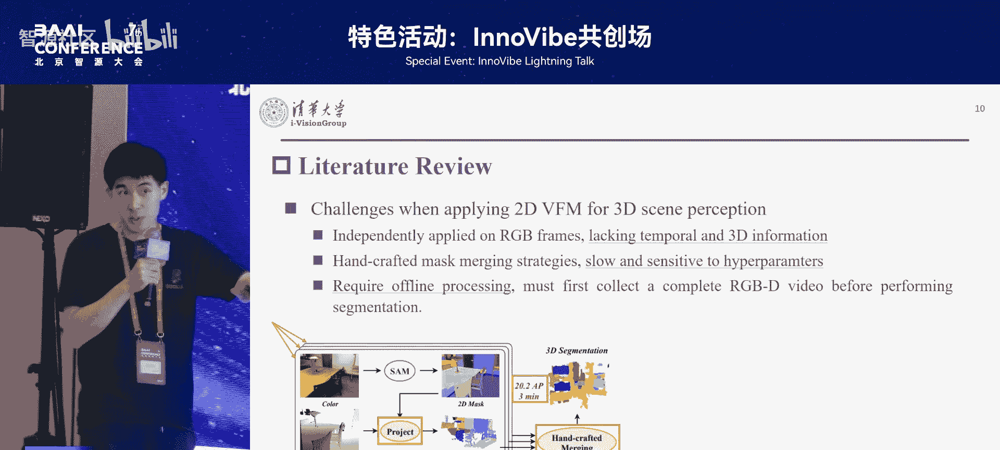

---

## 相关工作与现有问题
我们的目标是训练一个实时在线、精细度高、有很强泛化能力的三维感知模型。但如果纯粹从3D数据去训练这样的模型，几乎是不可能的。因为在数据的质量和规模上，3D的标注和2D相比不在一个数量级上。

与此同时，在2D领域已经有非常多强大的视觉基础模型，例如 **SAM**、**DINO** 等。它们已经展现了很强的通用感知、识别和泛化能力。因此，如何将2D的视觉基础模型运用到3D感知，是一个很有前景的研究问题。

像 **SAM-3D** 等相关工作进行了研究。对于一个3D场景，它们捕获周围的RGB-D观测，然后将SAM运用到每一帧RGB图像上，得到2D分割结果。之后，将2D分割结果投影到3D空间，并进行手工融合，从而实现了3D空间中比较精细的感知。这种方法可以在零样本条件下，只通过调用SAM而不需要任何训练，就实现场景分割。

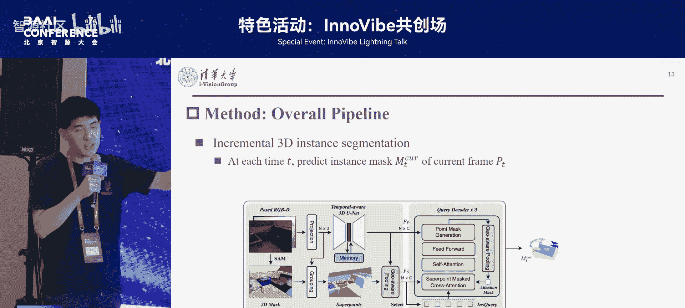

但是，它们仍然面临非常多问题，导致完全无法实用。

以下是现有方法存在的三个主要问题：
1.  **缺乏时序与几何信息利用**：它们是独立运用在每一帧RGB图像上的，没有利用RGB-D视频的时序信息，也没有利用深度图丰富的几何特征。
2.  **融合过程低效**：它们的融合是先做2D感知，把2D的SAM掩码投影到3D，再做手工融合。手工融合无论是速度还是对超参数的敏感性，都难以接受。
3.  **离线且速度慢**：它们都是离线方法，需要提前收集好整个场景的数据，不能做到机器人一边移动一边感知，并且速度非常慢。

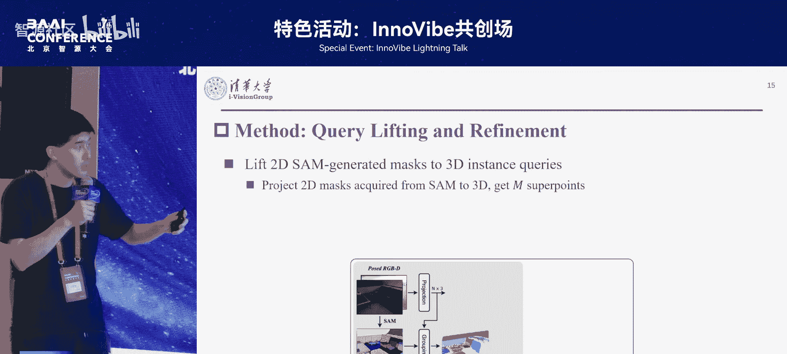

---

## Inbody 方法设计
与之对应，我们的 **Inbody** 方法希望解决以上所有问题。它可以实时在线地直接处理RGB-D视频流，一边采集数据就可以一边完成场景感知。同时，它的速度是此前方法的二三十倍。之前的方法处理一个场景可能需要几分钟，而我们的方法只需要5秒不到，并且性能也高出两倍以上。

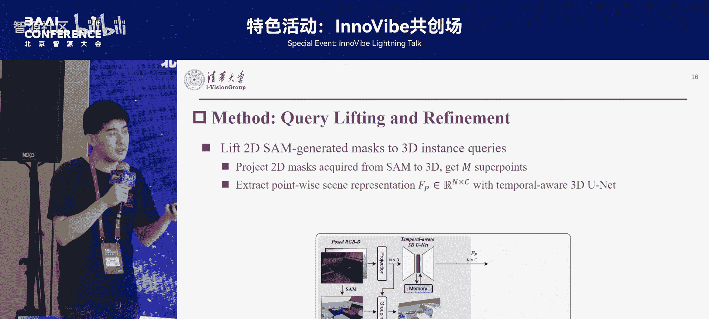

接下来我们讲解如何设计这样的模型。

### 任务定义与增量式框架
首先简单介绍在线三维感知的任务定义，例如语义分割、目标检测和实例分割。对于一个在线任务，在时刻 `t`，我们可以拿到从第一个时刻到第 `t` 个时刻的所有RGB-D观测。我们有RGB图像、深度图以及相机的内外参。通过相机内外参可以把深度图转换成世界坐标的点云。但在时刻 `t`，任何未来时刻的信息是不可知的。我们需要在任何时刻都预测出迄今为止观测到的场景的良好感知结果。

随着场景观测的增加，场景会越来越大，物体会越来越多，感知的复杂度也会逐渐增加。为了实时在线地完成这个任务，我们提出了一个增量式的感知模块。我们将感知分成两个部分。

以下是增量式感知的两个步骤：
1.  **单帧分割**：对于每一帧输入的RGB-D，只感知当前帧，只对当前帧的点云进行分割。
2.  **帧间融合**：将当前帧的分割结果，融合到过去所有帧的掩码中。

### 单帧分割：Query Lifting 与优化
在单帧分割方面，我们提出了 **Query Lifting** 与优化的思路。我们希望将2D图像输入后，用一个快速的模型分割出2D的初始结果，然后把这个2D分割结果提升到3D，变成一个可学习的3D token，以进行高效精准的3D融合。

具体流程如下：
1.  对于分割出来的每个SAM掩码，将其投影到由深度图转换成的点云上，得到对应的超点。
    *   假设当前帧有 `N` 个点云（`N x 3` 的矩阵），有 `M` 个SAM掩码，那么可以得到对应的 `M` 个3D超点。
2.  对于 `N` 个点云，使用一个3D时空特征提取器（如我们在CVPR 2024提出的方法）提取每个点的3D特征。这个提取器可以充分利用实时在线的RGB-D视频流的2D和3D信息。
3.  完成特征提取后，得到当前帧 `N` 个点级别的特征以及 `M` 个超点。通过池化操作，将 `N` 个点级别特征聚合到 `M` 个超点级别的特征。这 `M` 个超点特征被选为 **实例查询**，用于贯穿后续流程。
4.  拿到实例查询后，通过一个类似于Transformer的结构，经过若干层迭代，将查询逐层优化。最后，每个查询会预测出它所对应的3D实例掩码。在这个过程中，实例掩码和查询是一一对应的，即每个查询与一个实例完全绑定。

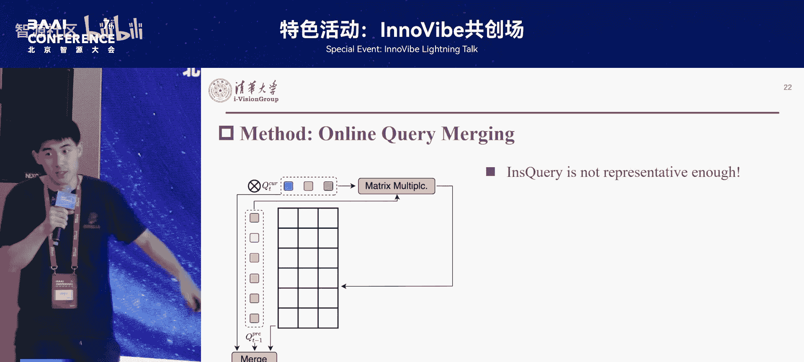

### 帧间融合：高效的 Query 合并
当我们预测出当前帧的 `M_current` 个掩码后，希望将它们融合到过去帧的掩码中。如果两帧观测到同一个物体（例如一张桌子），那么这两帧对应的掩码就应该合并为一个；反之，则应该注册一个新的物体ID。

这个融合过程非常困难。传统方法需要做两个循环：首先遍历所有过去的掩码，然后遍历所有当前帧的掩码。对于每一对掩码，需要取出对应的点云并计算相似度。无论是循环、点云取出还是相似度计算都无法并行，因为点云数量可变，导致时间复杂度难以承受，往往需要数秒才能完成一帧的融合。

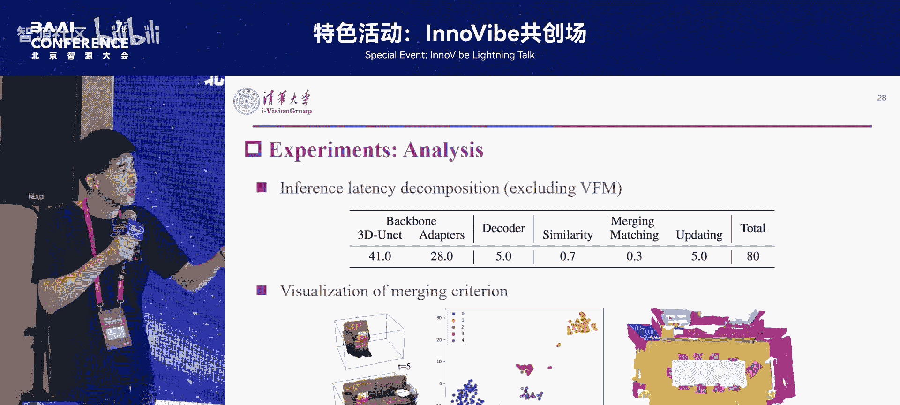

我们的方法则不同。由于我们已经有了一一对应的掩码与查询关系，所以可以把掩码的融合问题转换成一个查询的合并问题。查询是规范化的向量表示。

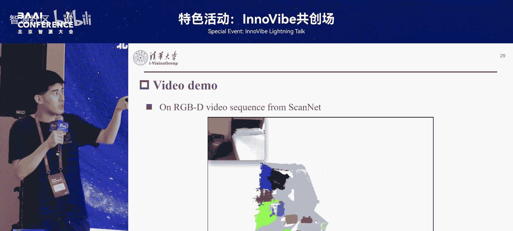

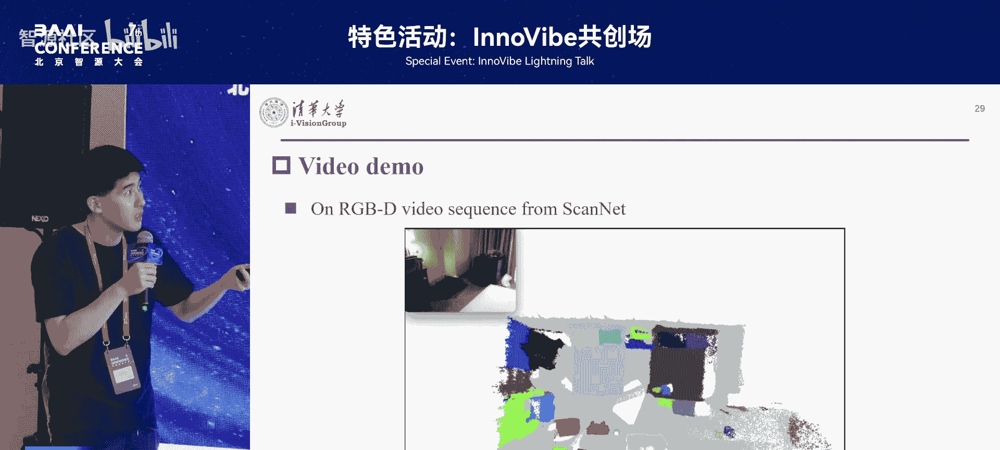

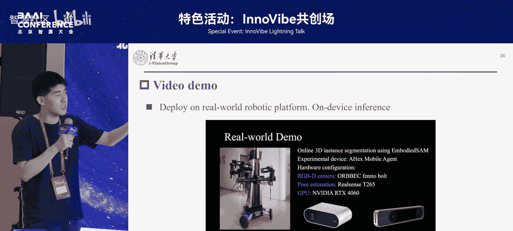

以下是我们的高效融合步骤：
1.  **矩阵化相似度计算**：对于过去帧的 `M_past` 个查询和当前帧的 `N_current` 个查询，只需要进行一次矩阵乘法，就可以得到 `M_past x N_current` 的相似度矩阵。这比传统方法快近千倍。
2.  **多维度相似度融合**：我们发现仅用预测掩码的查询来计算相似度，表示能力不足。因此，我们提出了三种针对性的空间表示，分别计算几何、对比和语义的相似度。每种相似度都可以用矩阵乘法计算出对应的相似度矩阵。
3.  **最终匹配与合并**：将三个相似度矩阵融合，得到最终的整体相似度矩阵。通过阈值化和二分图匹配，确定当前帧分割出的每个掩码应该与过去的哪个掩码合并。对于匹配上的掩码，只需将其掩码进行拼接，并将对应的特征进行加权融合。对于没有匹配上的物体，则简单地为其注册一个新的全局ID。

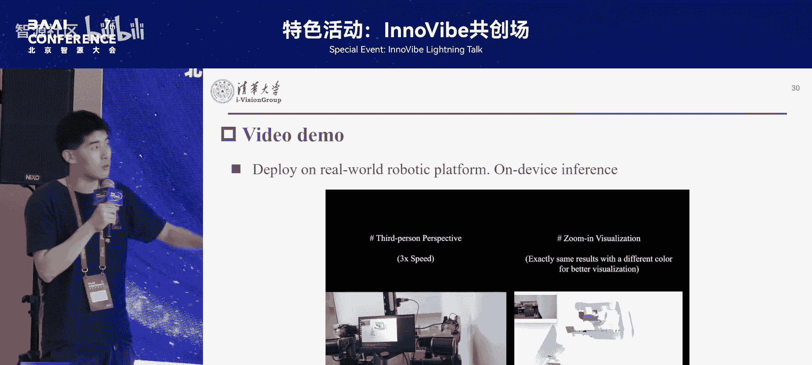

---

## 实验、部署与应用
在实验部分，我们在主流数据集上都实现了性能和速度的领先，并且有很强的泛化能力。

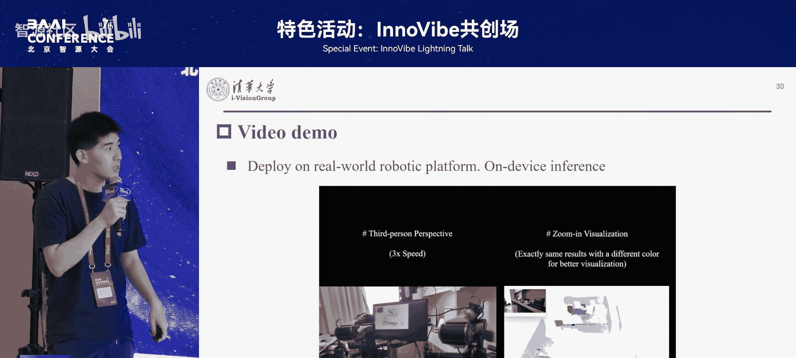

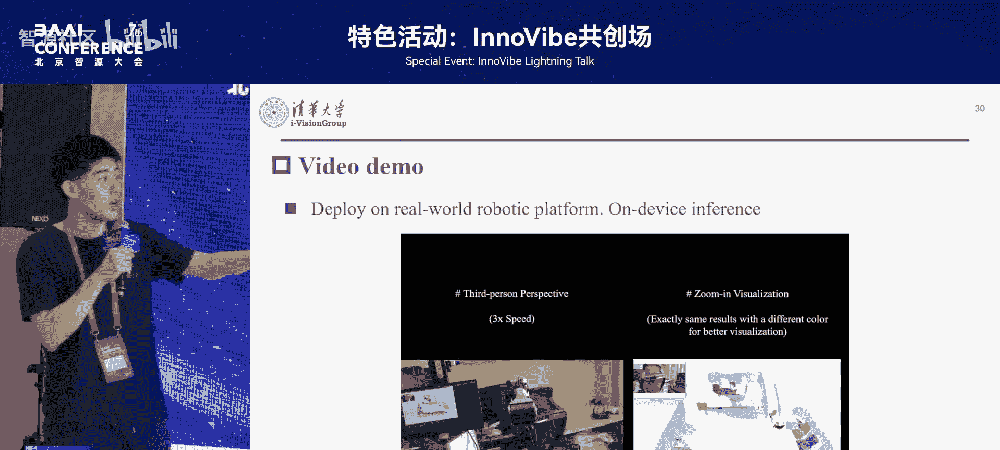

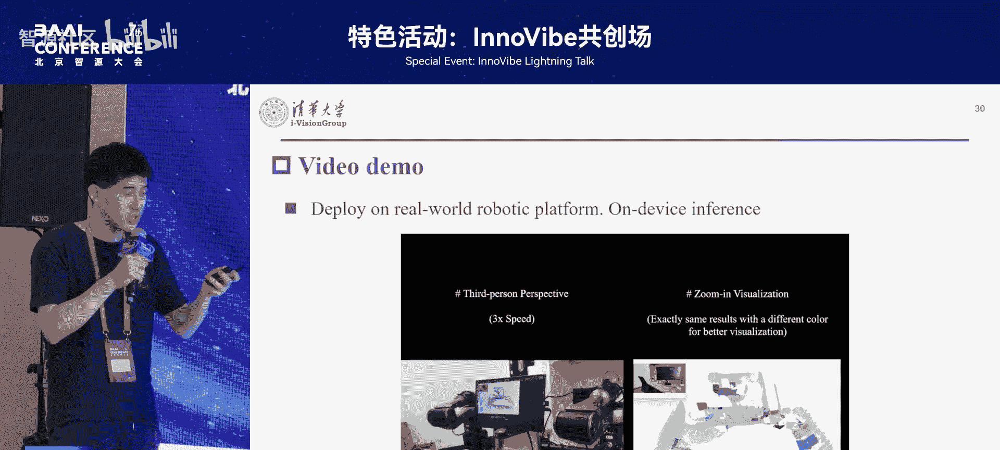

我们分析了速度分布。目前，使用一个快速模型可以实现20毫秒的2D推理，3D部分大约80毫秒，整体可实现10 FPS的推理速度。当前的时间瓶颈主要在于3D骨干网络（占69毫秒）。未来只需对3D骨干网络进行压缩，速度可以进一步提升到20 FPS甚至30 FPS。

可视化结果展示了我们方法学到的属性具有很强的空间、对比和语义能力。我们还将方法部署到了真实的机器人上，直接运行在机器人的边缘端算力上，无需任何云服务器，也能在线下实现实时在线的场景感知。

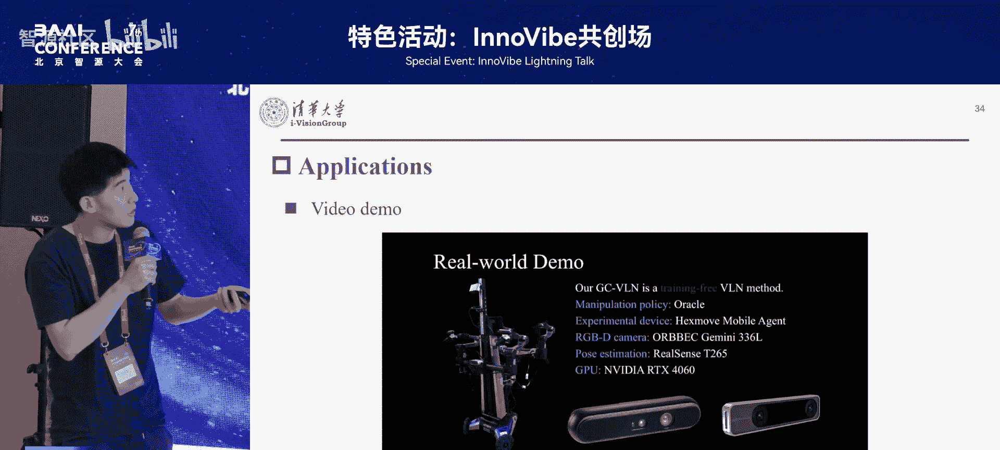

基于在线实例分割结果，可以开展许多后续应用。

以下是几个应用方向示例：
1.  **在线3D场景图构建**：将实例转换为对应节点，构造在线3D场景图。基于场景图，可以用语言模型进行推理，完成导航任务。我们已发表两篇相关文章。
2.  **视觉语言导航**：将其建模为约束满足问题，通过在线场景图加以解决。
3.  **具身任务执行**：例如，机器人可以根据人类指令，在场景中基于物体进行 grounding、探索和操作，完成如取外卖等任务。

---

## 总结
本节课中，我们一起学习了面向具身智能的在线三维场景感知方法 **Inbody**。我们探讨了现有方法在效率和细粒度上的挑战，介绍了如何通过结合2D视觉基础模型和增量式3D查询优化框架，实现高质量、高效率的实时在线感知。该方法不仅能快速精准地分割三维物体，还能高效地进行跨帧实例融合，为机器人的导航、操作等高级任务提供了可靠的环境理解基础。