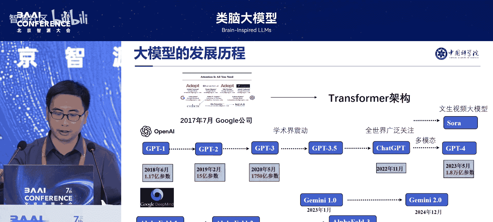
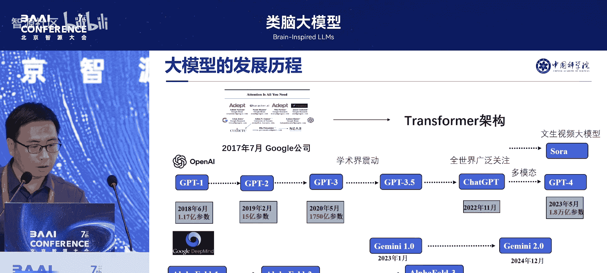
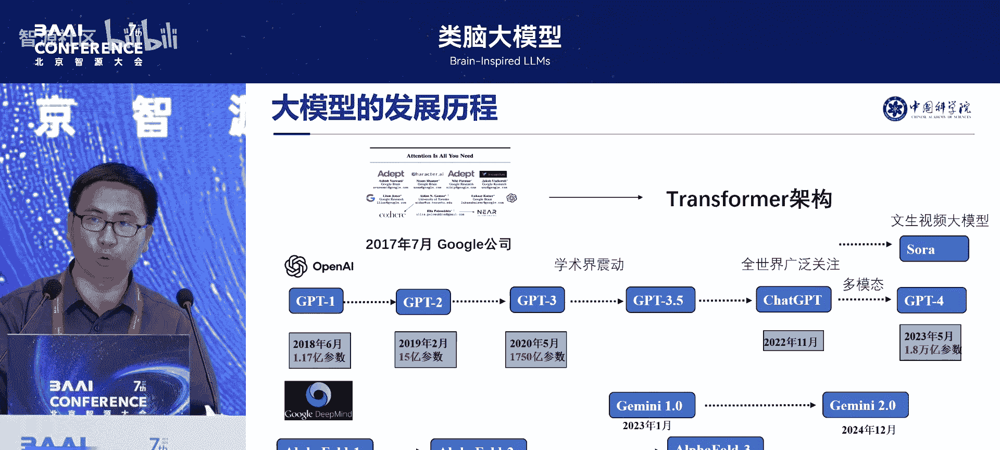

# 类脑大模型-p02-主旨报告一：李国齐

## 概述
在本节课中，我们将学习李国齐教授关于“类脑通用智能大模型”的主旨报告。报告将探讨当前大模型面临的挑战，介绍借鉴大脑机制发展新型AI架构的必要性，并阐述构建类脑大模型的核心科学问题与最新研究进展。

---

## 第一部分：研究背景

上一节我们概述了课程内容，本节中我们来看看当前大模型发展的背景与挑战。

大模型的发展主要源于2017年谷歌提出的Transformer架构。OpenAI发现了该架构具备扩展到超大规模模型的潜力，并由此发展了GPT系列大模型。谷歌则沿着AlphaFold的方向取得了快速突破。

目前，业界已进入大模型时代。许多科学家认为，实现通用人工智能的主要途径是大模型。在算力驱动下，模型参数从GPT-1的1.17亿增长到GPT-4的1.8万亿，规模持续扩大。

然而，我们面临几个关键问题：
1.  计算机硬件可能无法承受模型规模持续增长的需求。
2.  业界在探索大模型的规模边界，我们需要思考无止境的模型增长是否是正确的道路。
3.  在算力驱动下，智能算力系统的功耗问题日益凸显，AI算力平台需要大型电站供电。因此，迫切需要研究新型的低功耗智能计算系统。

当前主流大模型均依赖于Transformer架构。其优点在于能在大规模GPU上高效并行计算。但其缺点在于训练开销巨大，训练复杂度随序列长度呈二次方增长，推理时的时空复杂度也线性增加。这导致Transformer架构难以支持超长序列的学习任务，例如处理整部电影或长篇小说的摘要与关系分析，这限制了模型智能水平的进一步提升。

另一方面，大脑的能效远超现有GPU。人脑拥有约千亿神经元，每个神经元与成千上万个其他神经元通过突触连接，若考虑突触的精细结构，其等效参数量估计可达百亿级别，但功耗仅约20瓦。大脑的能效比GPU高出多个数量级。这表明，用现有全部GPU也难以精细模拟整个大脑。

因此，一个核心思路是：借鉴大脑的信息处理机制，利用神经科学发展新一代AI的基础理论与计算架构。但这面临一个挑战：神经科学与人工智能之间存在鸿沟。神经科学侧重精细结构与生理细节，而人工智能侧重抽象结果与计算高效性。现有GPU专为计算高效性设计，难以支持具有精细结构的生物合理性神经网络模型的高效训练。

我们的思路是对比当前大模型与人脑的差异：
*   **当前大模型**：基本计算单元是**点神经元模型**，结合自注意力机制与Transformer架构。
*   **人脑**：基本计算单元是**树突神经元模型**，具有复杂的树状结构，涉及神经环路与全脑尺度的动力学过程。

我们希望将人脑的结构融合进大模型架构，构建类脑通用智能大模型。对比之下，我们认为当前大模型存在三点不足：

以下是当前大模型的三个主要不足：

1.  **生物可信度差**：未利用大脑网络丰富的多尺度动力学特征（如胞体动力学、树突动力学）。当前模型使用简单的点神经元模型，而树突神经元模型具有多分支、多房室结构，能承载不同尺度的记忆能力。
2.  **功耗过高**：未充分体现大脑的低功耗特征。大脑可能通过**0/1脉冲信息交换**、**事件驱动动态计算**（根据输入稀疏激活部分计算单元）和**稀疏加法**等机制实现低功耗。而当前大模型主要进行稠密的矩阵乘法运算。
3.  **通用性与泛化性不足**：未发挥神经元种类与编码的多样性优势。大脑中存在兴奋性、抑制性等多种形态各异的神经元，这可能是其具备强大通用性的原因，而当前大模型未体现这一点。

第一部分主要介绍了当前基于Transformer架构的大模型发展及其存在的问题，并提出了借鉴人脑低功耗优势来思考大模型新架构的发展方向。

---

## 第二部分：核心科学问题

上一节我们分析了当前大模型的不足，本节中我们来看看构建类脑大模型需要解决哪些核心科学问题。

我们希望构建一座连接神经科学与人工智能的桥梁。我们认为，可以通过**树突计算**来构建这座桥梁，具体而言，是构建**脉冲神经网络**来作为通用且高效的大模型基础。

为什么脉冲神经网络能架起这座桥梁？因为它具备以下特性：
*   **内生复杂性**：具有时空动力学特征，能较好模拟神经元受刺激后的真实动态过程。
*   **低功耗通信与计算**：神经元间以**0/1脉冲**通信，支持**事件驱动的稀疏加法**与动态计算。

基于此构建的类脑大模型，目标是在性能上直接对标乃至超越现有大模型，同时显著降低代价。因此，脉冲神经网络有望在计算高效性与生物合理性之间找到平衡点。

脉冲神经网络是当前类脑智能研究的主流网络。与之对应的是人工神经网络（包括MLP、CNN、RNN、Transformer等），其基本计算单元是点神经元模型，主要进行稠密矩阵乘法。而脉冲神经网络的基本特征是**事件驱动的稀疏加法**，理论上能效可以非常高，是低功耗人工智能的重要途径。

构建类脑大模型需要一套支持它的基础理论体系。总的科学问题是：**如何突破当前主要依赖算力驱动的大模型发展模式，构建基于内生复杂性的新型通用智能类脑大模型技术架构**。

这里引入了**内生复杂性**与**外生复杂性**的概念：
*   **外生复杂性**：当前大模型通过增加神经元数量、参数量、数据量和算力来向外扩展复杂度，其基本计算单元（点神经元）是固定的。
*   **内生复杂性**：我们的思路是打开神经元内部，借鉴其内部丰富的动力学特征与结构来提升模型能力，即向内挖掘复杂性。

这个总问题可以分解为几个层面：

以下是构建类脑大模型需要解决的三个层面问题：

1.  **神经元层面**：用**树突神经元模型**替代点神经元模型。需要解决其训练成本、训练速度的并行化问题，并确保由此构建的网络能提供通用、泛化的计算基础。
2.  **网络架构层面**：寻找**非Transformer的、线性复杂度**的基础模型架构。目标是将类脑特性（如脉冲稀疏性、事件驱动、并行性）融合进该架构，构建面向大模型的事件驱动线性自注意力脉冲网络。
3.  **高效计算层面**：融合现有大模型优化技术，并针对脉冲神经网络独有的优化技术，在GPU上进行大规模训练与推理优化。实现大规模0/1脉冲网络的训练加速，使模型训练更快、规模更大、性能更好。

该架构涉及从模型算法、训练平台、软件到类脑芯片的全链条。目前我们主要在验证模型算法和训练平台方面的能力。

我们设想构建一个百亿到千亿参数级别的类脑大模型，其应用可分为三侧：
*   **边缘侧**：侧重极低功耗，参数规模小于百兆（几兆至十几兆），处理传统视觉任务。
*   **端侧**：参数约3B到10B，用于大模型的垂直领域应用。
*   **云端**：参数达百亿到千亿，用于大模型的训练或推理，需平衡性能与训练代价。

然而，使用脉冲神经网络构建类脑大模型长期面临一个困境：**缺乏有效的学习算法和计算理论，其性能与人工神经网络差距过大**。例如在2019年，脉冲神经网络在ImageNet数据集上甚至难以收敛。

第二部分主要阐述了构建类脑通用智能大模型的核心科学问题，以及当前脉冲神经网络领域面临的主要瓶颈。

---

## 第三部分：研究进展

上一节我们了解了构建类脑大模型面临的挑战，本节中我们来看看目前该领域取得的关键进展，这些进展表明现在正是发展类脑大模型的时机。

脉冲神经网络的性能曾长期落后于深度学习模型，但近年来（尤其是2023-2025年）在架构、训练和性能方面取得了快速突破。目前在纯计算机视觉领域（分类、检测、分割等任务），其性能已基本只落后约一年时间。

以下是我们课题组取得的部分进展：

1.  **神经元层面**：在ACL会议上提出了**树突启发的多房室多分支并行脉冲神经元结构**，并在较大规模上验证了其处理长序列建模任务的能力。
2.  **网络架构层面**：提出了全脉冲驱动的线性自注意力架构（V1, V2, V3版本）。其中，V1版本将注意力计算中的QKV元素全部变为0/1值，将矩阵乘法变为**位运算**，理论上能效提升40-80倍。V3版本在ImageNet上达到86.7%的准确率，已接近人工神经网络水平，而推理代价降低了5-30倍。
3.  **线性模型统一框架**：在NeurIPS上提出了**MetaLA**线性模型统一框架。该框架将线性Transformer、状态空间模型、线性RNN等归类，并表明它们可以用一个通用框架描述，且都是对Softmax的一种逼近。我们提出了同时满足多个条件的最优逼近方法，并在此基础上构建线性大模型的统一框架。
4.  **理论探索**：在*Nature Computational Science*上发表了关于利用内生复杂性架设神经科学到人工智能桥梁的论文。该研究被评为该期刊2024年最受喜爱的论文之一。评论指出，更详细、生物上更真实的神经元模型可以推动深度学习取得更大进展。
5.  **应用验证**：在ECCV上发表了将脉冲神经网络用于物体检测的工作，在COCO数据集上性能与YOLOv8持平，能效提升5-20倍，并获得最佳论文奖提名。该工作弥合了SNN与主流AI模型的差距，展示了其低功耗计算潜力。
6.  **大模型脉冲化**：提出了**SpikeLLM**脉冲大模型量化框架，可将现有大模型量化为脉冲形式。提出OBS框架检测神经元显著性，并据此决定时间步长。使用单卡80G A100，16小时即可完成70B规模Llama模型的量化。
7.  **3D点云任务**：在3D点云数据任务中，我们的脉冲神经网络模型性能超越了主流的人工神经网络模型。这是在特定场景下性能超越AN的重要例证。
8.  **训练平台**：开源了**SpaCE**训练平台，支持在CPU/GPU上对脉冲神经网络进行训练加速。目前正与国产GPU公司合作，训练7B到70B量级的类脑脉冲大模型，旨在打通从国产数据、基础模型到国产算力平台的全链条。
9.  **模型训练实例**：7B模型已在国产GPU集群上完成训练，使用了150B数据，256卡训练约10天。在MMLU和GSM8K基准测试中，其性能在所有线性模型中达到最优。与千问模型相比，我们仅使用了其约1/10的数据量。该模型在手机端初步部署后，推理速度已快2倍以上，经优化后有望再提升。
10. **低功耗硬件部署**：将注意力机制脉冲网络部署到异步类脑芯片（与时识科技合作），在边缘场景实现了极低功耗。通过控制脉冲发放率并结合异步电路，绝大多数计算单元在计算时处于静息状态，近期功耗可达毫瓦级。例如，将15亿参数模型部署到FPGA上，推理时仅进行稀疏加法运算，动态功耗仅约13瓦。
11. **可解释性**：脉冲动态过程为观测模型在不同输入下的内部动态提供了一个新维度，有助于进行模型可解释性分析。
12. **领域综述**：在*Proceedings of the IEEE*上发表了关于类脑计算的详细综述，介绍了其基本概念、主要研究领域、挑战与趋势。

我们认为，需要构建从算法、软件、数据到芯片的类脑计算基础设施与生态。

---

## 总结
本节课中，我们一起学习了李国齐教授关于类脑通用智能大模型的报告。我们回顾了当前大模型在算力、功耗和长序列处理等方面面临的挑战，探讨了借鉴大脑低功耗、高能效机制发展新AI架构的必要性。报告详细阐述了构建类脑大模型需要解决的核心科学问题，包括在神经元层面引入树突复杂性、在网络层面设计线性高效架构、以及在计算层面实现高效训练优化。最后，我们看到了脉冲神经网络领域在模型性能、架构创新、应用落地和硬件部署等方面取得的一系列重要进展，这些进展表明发展高性能、低功耗的类脑大模型正迎来重要机遇期。