# 类脑大模型-p03-主旨报告二：张悠慧

## 概述

在本节课中，我们将学习清华大学张悠慧教授关于通用类脑计算系统研究的报告。课程将探讨类脑计算系统的现状、挑战、计算特征分析，并介绍一种旨在解决当前系统碎片化问题的通用化技术路径。我们将重点关注如何通过软硬件协同设计，构建更易用、更高性能的类脑计算基础设施。

## 现状与挑战

上一节我们概述了课程内容，本节中我们来看看类脑计算领域的现状与挑战。

类脑计算领域近年来蓬勃发展。从系统、体系结构、电路到器件材料，各个层次的研究都非常活跃。近三年的相关文献数量占历史总量的三分之一以上，表明该领域进步迅速。在诸多智能任务上，类脑模型的表现已接近甚至在某些方面超越了深度学习模型。

然而，当前类脑计算系统也存在明显问题。一个核心挑战是软件生态的碎片化。这导致类脑芯片难以被广泛应用，并非因为芯片本身昂贵，而是因为配套的软件系统不好用。

一篇发表于《自然》的综述文章指出了几个关键问题：

*   **缺乏应用与软件的通用规范**：算法难以在不同平台间移植，不同开发框架之间的一致性很差。
*   **缺乏跨平台的编译工具**：没有统一的工具链来适配不同的硬件。
*   **硬件可扩展性差**：这里并非指芯片算力，而是指缺乏统一的硬件抽象层。各类类脑芯片架构各异，导致软件工具链高度绑定于特定芯片的底层约束，跨平台性能很差。

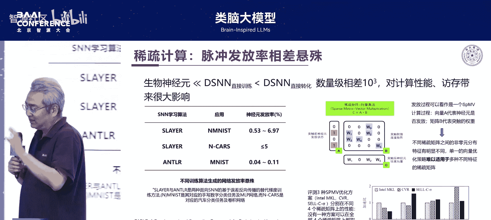

与深度学习领域已经拥有成熟、分层的编译框架（如TVM、XLA）不同，类脑计算领域在这方面几乎是空白。有趣的是，类似的问题在六年前就被提出过，但至今改善有限。

因此，我们面临一个矛盾：一方面，类脑应用和硬件架构都在快速发展、种类繁多；另一方面，工具链和应用却呈现纵向绑定、碎片化的状态。这使得如何整合多样化的硬件特征，构建易于编程的系统，成为一个核心难题。

## 类脑神经网络的计算特征分析

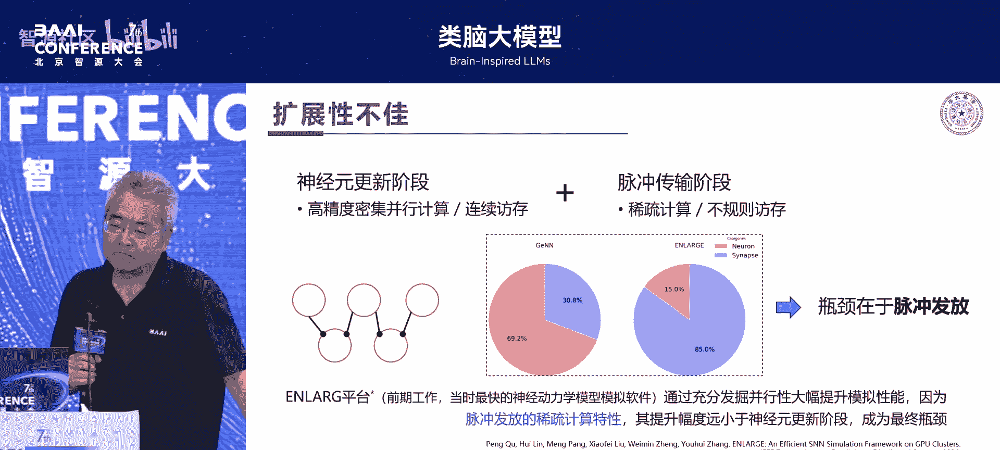

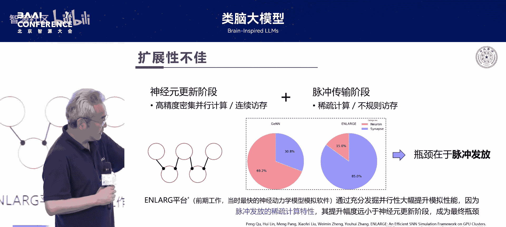

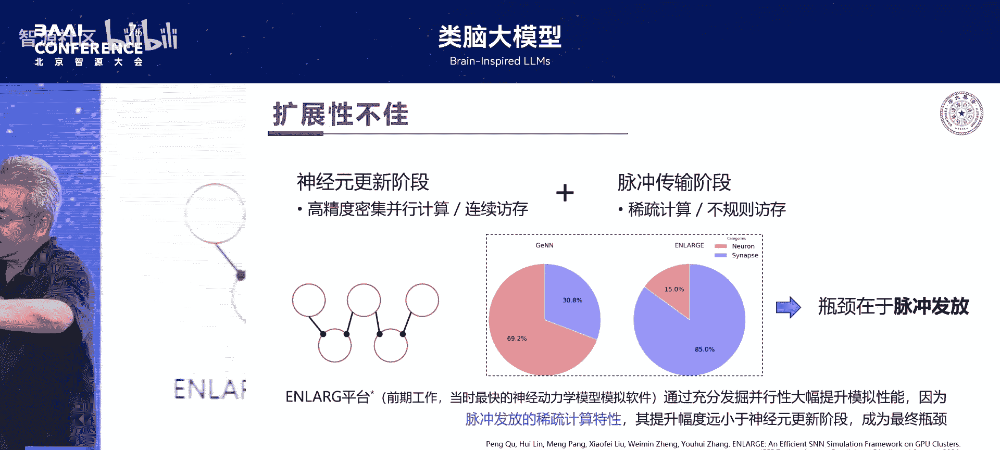

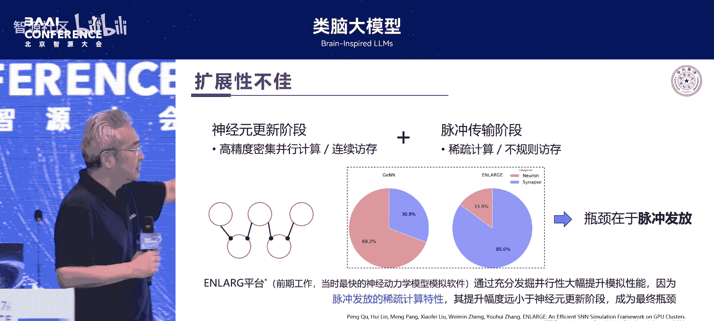

了解了现状与挑战后，本节我们来深入分析一下类脑神经网络本身的计算特征。

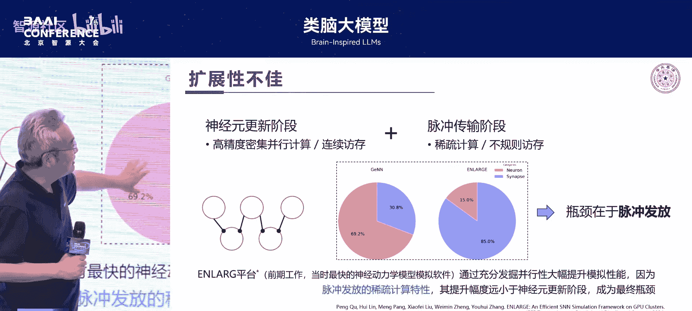

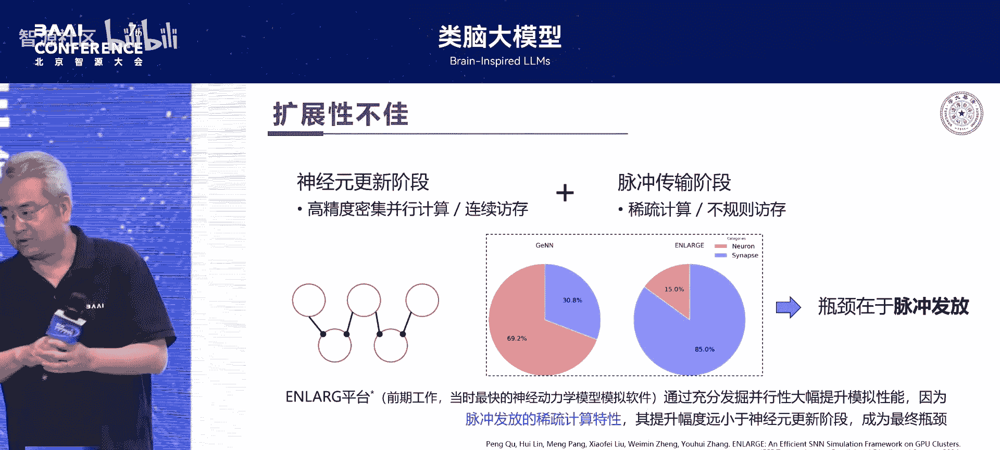

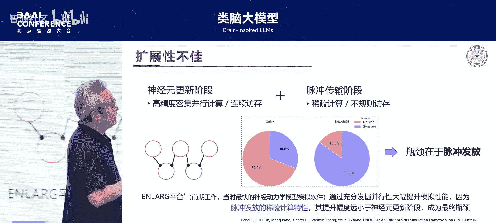

首先，与已经收敛到以反向传播为核心的深度学习不同，脉冲神经网络（SNN）的训练算法仍处于探索阶段，尚未收敛。其训练算法谱系从左至右大致包括：从深度学习模型直接转换、基于梯度的算法（如BPTT）、替代梯度算法以及基于局部规则的算法（如STDP）。从左到右，算法的生物合理性递增，但通常效果递减。

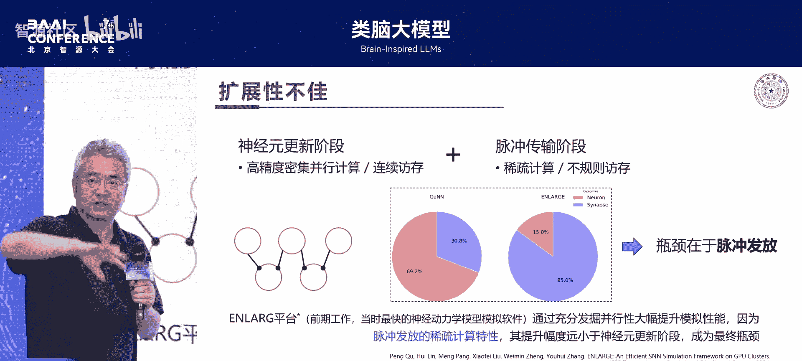

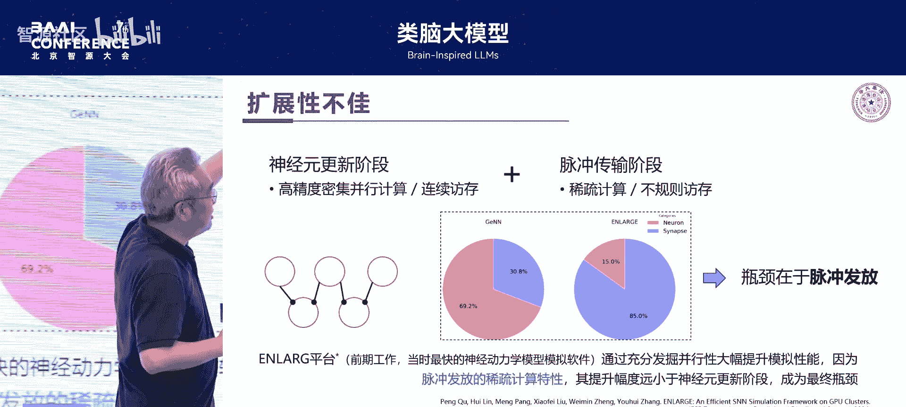

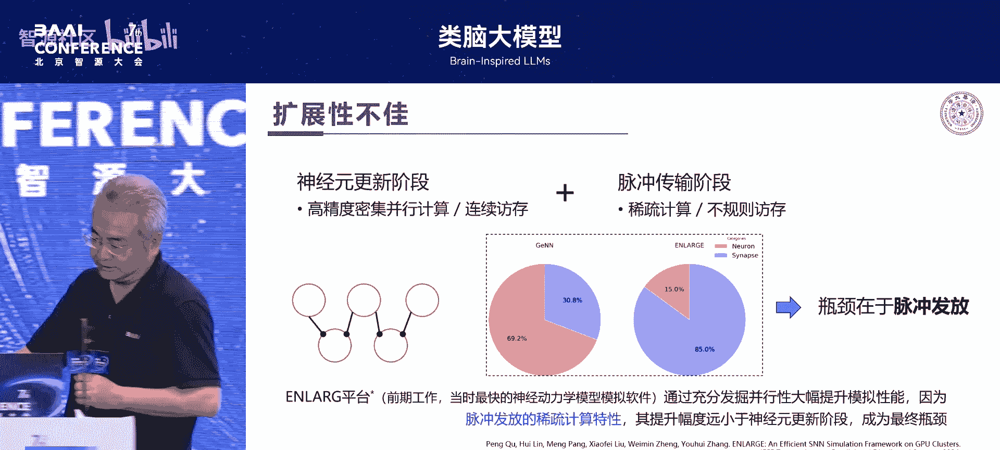

这种计算特性带来两个需要仔细审视的“优势”：

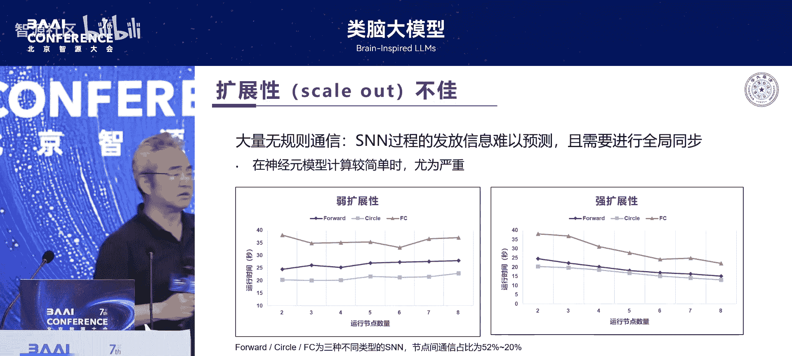

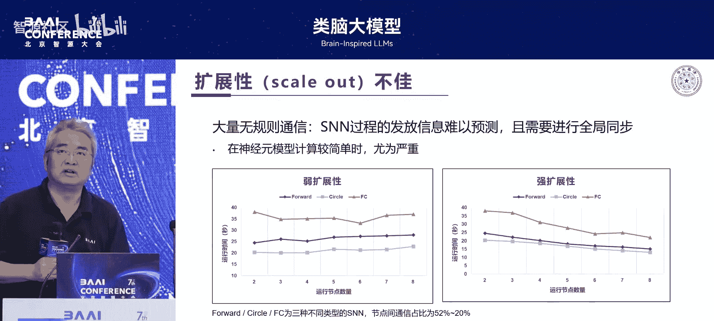

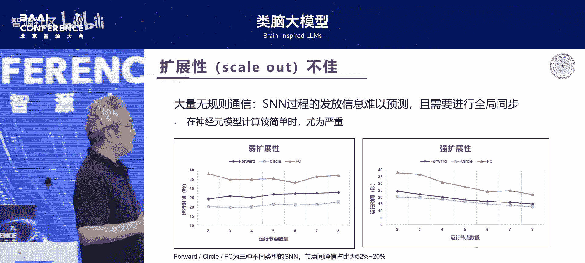

**1. 稀疏计算**
稀疏计算是SNN实现低功耗的重要来源，表现为神经元之间的脉冲发放率差异悬殊。生物神经元的发放率远低于直接训练的SNN，而后者又低于从深度学习模型转换而来的SNN。脉冲发放过程可以视为一个稀疏矩阵-向量乘法（SpMV）操作：`输出脉冲向量 = 连接权重矩阵 × 输入脉冲向量`。然而，稀疏性的程度和模式因网络而异，而不同的稀疏模式对SpMV的最优算法有巨大影响。不存在一个普适的最优算法。因此，不能泛泛而谈稀疏计算的优势，必须具体分析其分布和发放率。

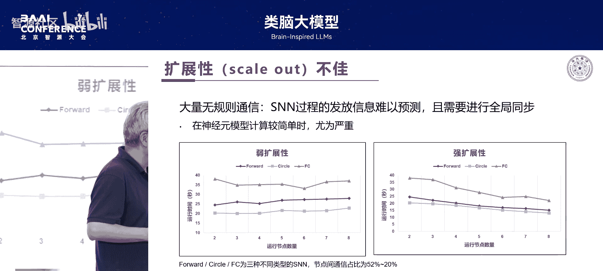

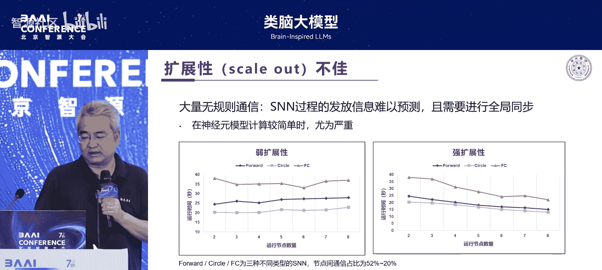

**2. 事件驱动**
事件驱动是SNN的另一个核心计算特征。但需要明确“事件驱动”发生在哪个层面。在软件或算法层面，事件驱动是一种架构模式，通过事件的产生、传递和响应来组织软件，其优势在于提高响应速度和可维护性，但**并不天然带来低功耗**。低功耗的实现需要硬件和编程层面的专门配合。例如，可以在通用处理器微架构层面进行优化，或像某些类脑芯片那样，在硬件层面通过“主动消息”机制来实现更底层的事件驱动支持。因此，“事件驱动”的具体实现方式直接影响其能效。

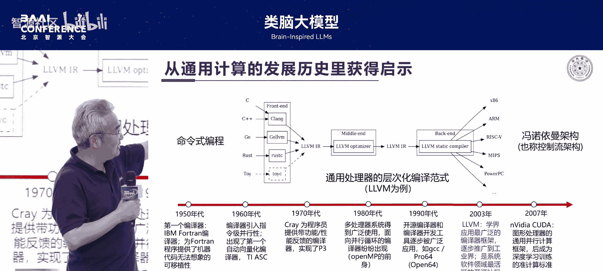

我们之前的一项研究工作揭示了SNN在通用处理器上的性能瓶颈。我们在GPU上优化了一个SNN仿真程序，并与当时最快的CPU模拟器进行比较。优化前，计算与访存开销比例约为7:3；经过针对计算和访存分别进行极致优化后，该比例反转为15:85。这意味着：

*   **神经元状态更新阶段**：虽然计算种类多，但对GPU/CPU是友好的，属于高精度、密集并行计算和连续访存。
*   **脉冲传输阶段（SpMV）**：是主要瓶颈，其不规则的计算和访存模式对GPU非常不友好。

当扩展到多节点时，由于脉冲事件间存在大量不可预测的通信，需要频繁的全局同步，而SNN单次事件的计算又相对简单，导致通信开销占比更高，扩展性（特别是强扩展性）较差。

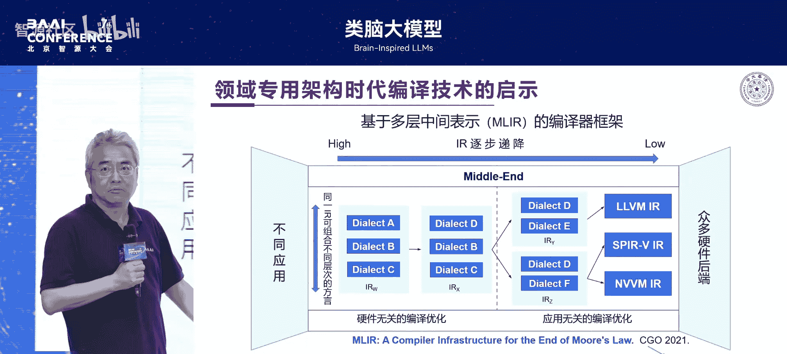

总结来说，SNN的稀疏性和事件驱动特性虽好，但**并不自动转化为高性能和低功耗**。其实际效果高度依赖于具体的实现方式，需要找到性能瓶颈所在并进行针对性优化。

## “通用”类脑计算系统的设计启示

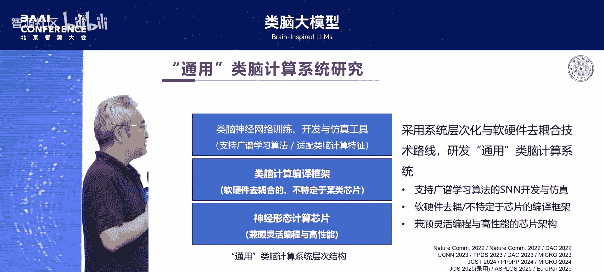

分析了SNN的计算特征后，我们思考如何构建“通用”的类脑计算系统来解决碎片化问题。我们可以从通用计算和领域专用计算的发展中汲取灵感。

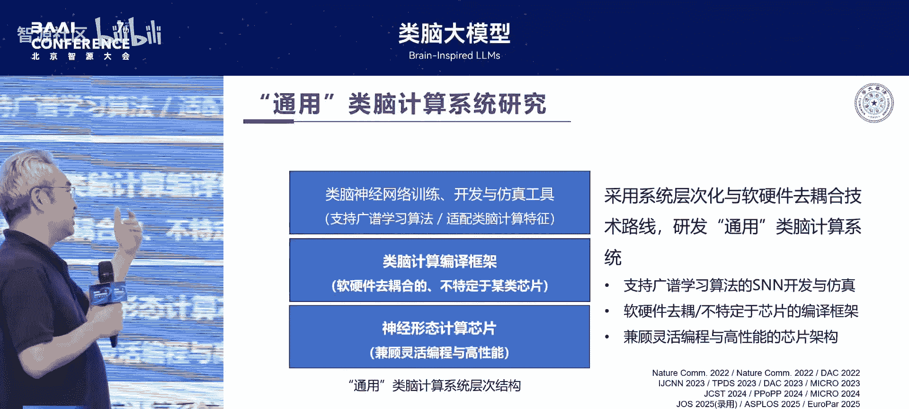

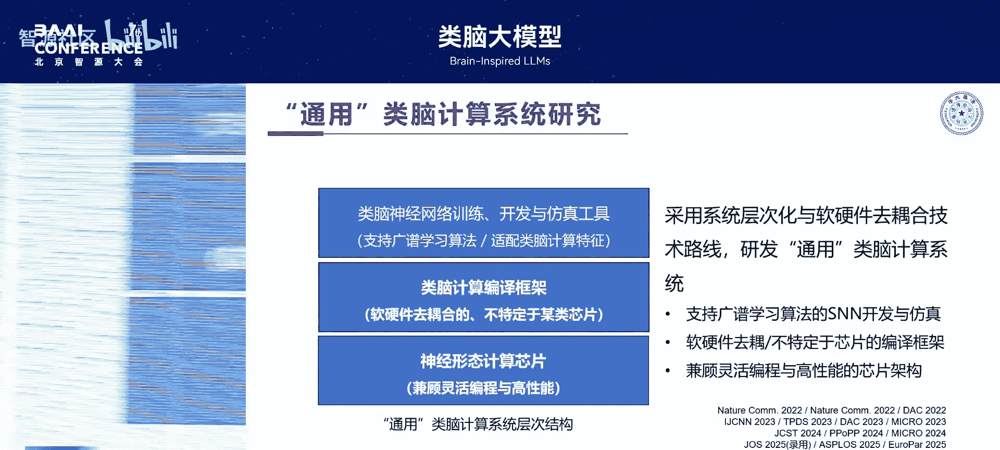

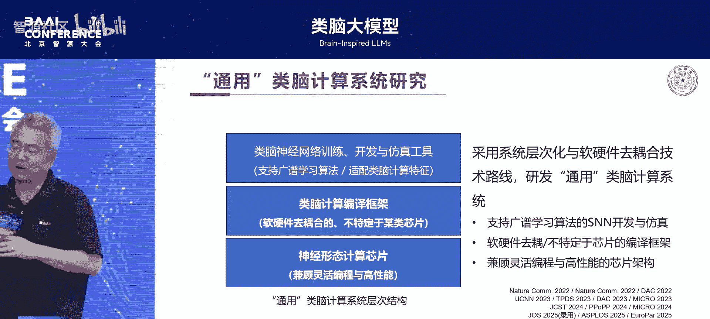

在通用计算领域，编译器通过引入中间表示层（IR）成功解决了N种语言适配M种硬件的问题，将复杂度从N×M降低到(N×1 + 1×M)。这是通过分层抽象实现的。

近年来，计算进入领域专用体系结构时代，这使情况变得与当前类脑领域类似：硬件架构更加多样，而上层编程语言也变为更高抽象层次的声明式语言（如AI框架）。这导致软件与硬件的语义差距拉大。

现代编译框架（如MLIR）为此提供了新思路：
1.  **增加中间层**：在中间表示中加入更多层次，以连接差距变大的两端。
2.  **设计“方言”**：任何特定计算的特征都可以分解为多个子特征。我们可以为每个子特征设计编译中间表示的“方言”。当新的计算出现时，我们就有更高概率通过复用和组合现有的“方言”来覆盖其特征，从而复用编译资源。

另一个启示来自处理器架构的演变：从复杂指令集到精简指令集。硬件提供相对简单的原语，由软件和编译器组合成复杂的语义来满足应用需求。这种思路值得借鉴。我们前期的研究发现，对于存算一体等架构，简化的硬件原语配合编译器，可能比复杂的硬件原语更高效。

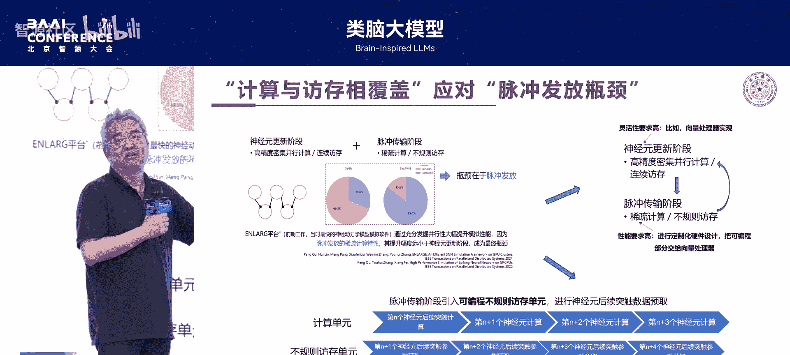

## 通用类脑计算系统的探索实践

基于以上启示，我们开展了一些探索性工作，旨在研发“通用”的类脑计算系统。这里的“通用”指采用系统层次化与软硬件解耦的技术路线。

我们的目标不是针对特定应用或芯片进行定制，而是构建：
1.  一个不绑定于特定芯片的通用编译框架，以弥合上层应用语义与底层多样硬件之间的差距。
2.  一种能兼顾灵活编程与高性能的类脑芯片架构。

以下是两项具体工作：

**工作一：针对稀疏计算特征的架构设计**
我们基于成熟工艺，以通用处理器内核为核心，进行非侵入式架构扩展。核心思路是解决脉冲传输阶段的瓶颈——不规则访存。我们通过设计一种“多元素访存模式处理单元”，尝试将计算与访存重叠。即在计算当前神经元时，预取下一个神经元所需的数据。如果访存延迟能覆盖计算延迟，那么计算部分就可以用灵活的可编程内核（如向量处理器）完成，无需定制固化电路。我们为此设计了一组类脑计算指令扩展。测试表明，该设计在能效和某些场景下的性能上表现良好。

**工作二：引入硬件级事件驱动**
我们进一步在硬件层面实现了事件驱动机制。将神经元状态等局部数据放在片上存储，权重矩阵放在片外，脉冲作为瞬时数据驱动计算。关键创新在于，当脉冲事件触发后端神经元计算时，通过片上“主动消息”网络，将所需数据或索引推送到目标处理核的本地，确保计算所需数据全部在本地或消息头中，从而克服了不规则访存的问题。这种方式能更充分地利用高带宽内存。实验结果显示，其性能可达高端GPU的十倍左右，同时也大幅超越了特定ASIC类脑芯片的性能。

此外，我们也基于多级中间表示，开发了面向多种类脑芯片的统一编译框架。

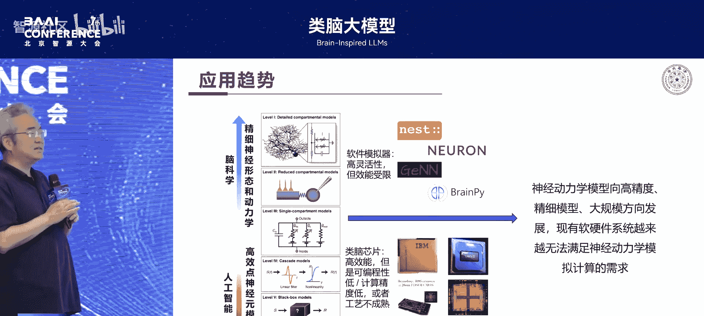

## 应用展望与总结

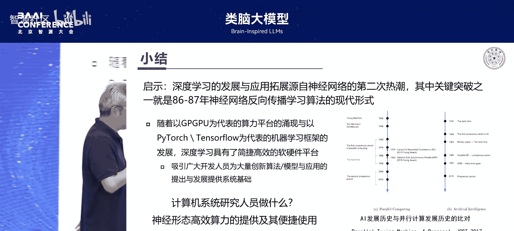

最后，我们来展望一下这类系统的应用前景并总结全文。

当前的一个趋势是脉冲神经网络向高精度、大规模模型发展。许多现有系统（如GPU）对稀疏计算的利用率极低，而许多类脑芯片对高精度计算支持不足。因此，将通用处理器内核的灵活性与针对稀疏计算/访存的定制化硬件扩展相结合，是一个有潜力的方向。我们基于此类思路的芯片已多次流片，并逐步推向实际应用。

回顾人工智能发展史，其几次浪潮的兴起都与算力平台的革新紧密相关。近年来AI的蓬勃发展，很大程度上得益于GPU等高算力平台以及易用的开发工具所构建的繁荣生态。对于类脑计算领域，要解决“为何类脑芯片很少被使用”的问题，我们计算机系统研究者的责任，正是**既要提供高效的类脑算力，也要提供便捷易用的基础软硬件开发工具**，从而促进整个领域的创新与发展。

本节课中我们一起学习了类脑计算系统的碎片化现状与挑战，深入分析了脉冲神经网络的计算特征及其实现瓶颈，探讨了从通用计算领域借鉴的“通用化”设计启示，并介绍了通过软硬件协同与编译创新来构建通用类脑计算系统的具体探索与实践。最终目标是推动类脑计算走出实验室，构建更强大的计算基础设施。