# 类脑大模型-p04-主旨报告三：尚德龙

在本节课中，我们将学习中国科学院微电子研究所尚德能研究员关于“问天一类脑计算机”的主旨报告。报告将从工程角度解读类脑计算机的研制背景、系统架构、软件工具、核心算法创新以及实际应用案例。

---

## 报告人背景介绍

下一位报告人是中国科学院微电子研究所的尚德能研究员。尚研究员是类脑计算机领域的专家。

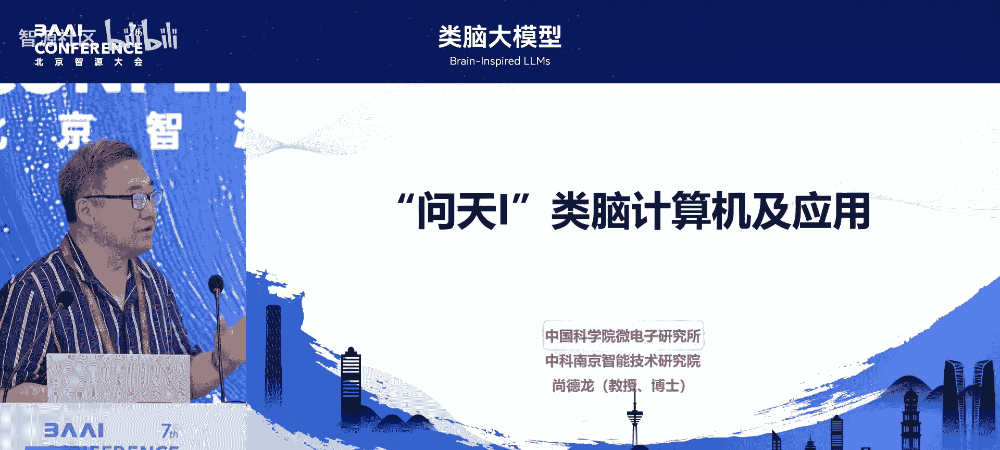

他是中科南京智能技术研究院副院长、江苏省脑机接口重点实验室副主任、南京市类脑计算工程研究中心主任、中国神经学会会员。他参与领导了科创2030项目、7585国家重大科技攻关项目、欧盟HBP项目等。

他荣获中国科学院科技进步一等奖、美国第十届PCBMCM科技领先奖、数字一等奖、国家85期间重大科技成果奖等奖项。他发表论文150余篇，专著四部。

他的主要成果包括问天一类脑计算机、KS2850计算机、KSG2300高档服务器、sneak类脑计算机等。今天他将带来题为“问天一类脑计算机及应用汇报”的报告。

感谢主持人的介绍，也感谢李老师和智源大会的邀请。刚才李老师讲了算法，张老师讲了系统。我的题目“问天一类脑计算机及应用”将从工程角度解读类脑计算机。

刚才张老师讲了很多类脑的基础理论和方法，包括系统架构。我今天整体不会展开，但有些地方可能与张老师的想法不谋而合。

## 第一部分：问天一类脑计算机简介

首先介绍问天一类脑计算机。这台计算机目前支持5.3亿神经元。

下图是机器搭建的实物，上图是2023年10月17日召开的类脑计算机服务正式启动发布会。它拥有5.3亿神经元和2500亿突触。

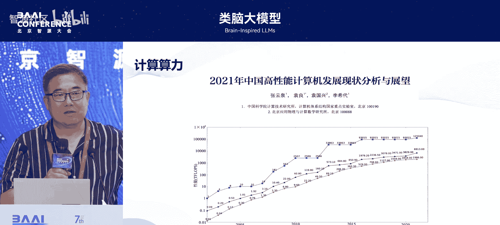

目前它是世界上规模第三大的类脑计算机。最近有团队也在开发50亿神经元的系统，因此按此计算，我们可能是第三或第四。整个机器包括7个标准机柜，其中6个由我们自研的芯片和板卡构成。

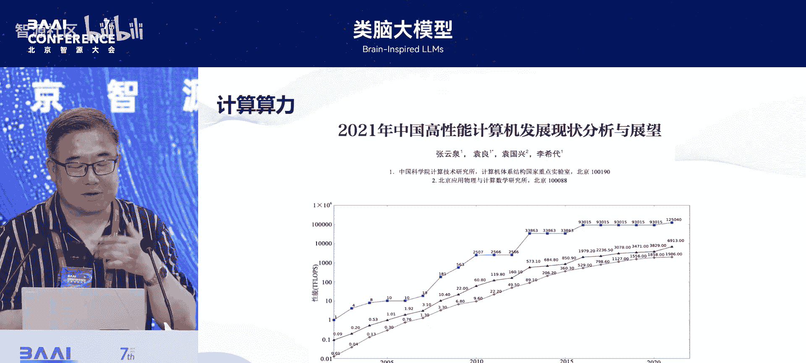

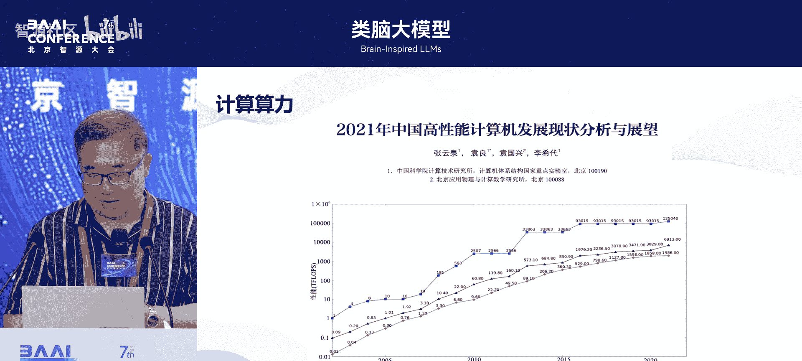

每个小机箱有24块板卡，总共约576块板卡，使用了近3万颗芯片。

### 为何需要类脑计算？

刚才李老师已经阐述了基础。这张图显示，在2021年之前，算力大约每两年翻一倍。目前则是每3到4个月翻一倍。我得到的数据甚至是每两个月翻一倍，更为夸张。

算力的提升对人工智能发展，尤其是大模型的需求，是极其迫切的。但从计算机系统角度看，正如张老师所讲，算力提升已遇到瓶颈。

这张图是我2021年使用的，可以看到计算机性能的提升已基本趋于平缓。进一步提升性能已非常有限。过去的性能提升更多依赖于半导体工艺的进步，如3纳米、5纳米、7纳米。工艺进步对性能提升和功耗降低有巨大影响。

### 个人工作经历回顾

我比较幸运地参与并领导了国家自主小型机CPU和系统的研制工作。第一台是1991年完成的KS2850。

在1991年，这台机器的性能是1.2 MIPS（每秒百万条指令）。与对照计算机相比，我们达到了其20%的性能。但这台机器是完全自主设计的。当时我们面临没有操作系统的问题，必须走兼容路线。因此这是一台兼容复杂指令集的系统。

左图是机柜和我们当时使用的4高度PB板。它完全由分立元件（与非门）搭建而成，我们用了4块4高度的PB板来完成CPU系统。我在这项工作中的贡献是，使用多状态机完善地管理了高速数据存储和总线控制。

右下角是KG2300高档服务器。这本书是《Alpha体系结构》，来自早期的美国数字设备公司（DEC），该公司在计算机架构上有许多创新。这台机器是当时最快的计算机之一，采用精简指令集。

右下角带PB板卡的图是真实图片，但这是我从申威拿来的。因为这份工作实际上是申威超算的第一版。这台机器的性能在3到3.5 MIPS。

我想说明的是，从计算机角度，我们一直在不断追求性能提升。

### 从传统计算到类脑计算的探索

回到我原先的团队。计算机从40年代发明，到五六十年代，从“战国时期”发展至今，x86和ARM体系已比较统一。

我们在1982年已开始小型化工作，例如B型微机。右上角的图是大家现在非常熟悉的微处理器的第一代芯片，这标志着向便携式电子设备方向发展。

但在过程中我们发现一个问题，尤其是刚才提到的Alpha处理器，其65%的能耗消耗在时钟上。因此，在后续工作中，我们一直在探索如何降低功耗，于是有了我们的“E步处理器芯片”（Amule系列，共三代）。第一代于1993年完成。

我们一直在追逐性能和功耗。但在1998年左右，我们也发现了问题。当时我的老板预见到，如果未来计算系统仍按此路径发展，将走不通。这成为了我们探索类脑计算的起点。

当时做类脑计算有两大目标：
1.  如何利用超大规模并行计算资源加速对生物脑功能的理解。
2.  逐步深入理解生物脑功能，是否能牵引和带动更高效、并行、容错的计算系统。

我们当时做类脑，是希望借鉴人脑，但也清楚对人脑的理解并不深刻。包括现在，我们仍不知道将大量神经元集合起来，其功能如何展现。李老师讲的三个LIF神经元可能体现HH模型的某些特性，但终究不是HH模型。这是我们的一个发展起点。

因此，从2011年开始，我们完成了第二版芯片。2016年3月，我们完成了50万处理器核的类脑计算平台。2018年11月，完成了100万处理器核。这些都是约数，实际是47万多和90几万。下面我会具体计算。

这是我们在国外的工作。2019年回国后，我们开展了问天系列类脑芯片及计算机的研制工作。

### 问天一原理机设计

我们从原理机开始。设计思想和理念是：提供多种存储和外设结合的灵活性，以及互联架构的更大灵活性。我们希望有非常大规模的扩展能力。因为不论是5亿还是10亿神经元，与人脑的千亿相比都微不足道。因此，我们希望有非常好的灵活性和可扩展性。

同时，在做类脑计算时，我们也面临应用的迫切压力。从算法层面看，目前的应用还不能完全支撑SNN类脑计算机。因此，我们也希望支持未来算法的研发发展，支持类脑架构研究以及芯片的仿真验证。这是我们原理机的思路。

右图是我们当时使用的FPGA芯片、自研板卡及接口。这是我们自己的一份工作。

原理机开发成功后，我们使用了30块FPGA板卡，板间互联使用光纤。我们更侧重于功能验证而非性能，因此对性能要求不高。同时，我们实现了约57万个神经元规模。

下图中间可以看到，我们集成了非常多的存储。当时大家都在提近存计算和存储瓶颈，我们也尝试做一些突破。这也是我们在研制问天一时所做的科学研究。

### 问天一的技术继承与创新

问天一继承了许多工作，包括由事件驱动的处理器核。刚才张老师提到处理器核是中断驱动的，实际上是神经元事件驱动中断，是由神经元事件来触发中断的。这个过程可能还有很大的探索空间。

另一个是采用通过路由传输脉冲的形式。我们内部有两个网络：一个是脉冲片上网络，另一个是系统片上网络。系统片上网络更多与存储和外设接口。通过路由，我们实现了6个方向的互联，以便更高效地构建网络并提高实时性。

在继承设计理念的同时，我们也做了一些开发。例如共享存储。刚才张老师提到存储的概念，即事先准备数据。同时，我们把存储控制权转移、乱序以及其他技巧性方法结合起来，以应对未来芯片集成更多计算单元（目标160个或更多）时的存储瓶颈。这项工作使整体算力提升了30%。在互联和生物神经元模型降低存储参数量方面也做了很多工作。

### 互联技术示例：类同步传输

举一个互联技术的例子。左侧是异步传输，通常需要握手协议，就像两个人对话。中间是同步传输，现代计算机常用，在统一时钟节拍下操作。但随着电路规模变大，时钟节拍必须按最坏情况设计，带来问题。

右侧是我回国后提出的一种新传输方式：类同步。它本质上是自时钟的，通过相位延迟实现，同时又是可伸缩的、弹性的。这意味着，如果能在同一节拍下操作，就按同步方式；如果不能满足，就按异步方式操作。由于是自时钟，我们消除了异步握手的时间，既节省了功耗，又提高了传输效率。这是我们开展的一项基础研究工作。

这只是举例。除此之外，在存储、计算方式、互联、芯片设计等方面，我们都有基础工作。但我们团队宣传做得非常差。

### 问天一计算机的构建

我们整个问天一类脑计算机从芯片设计开始，生产了约4.2万颗芯片。良率不高，约80%，最终完好的芯片约3万多颗。通过互联封装设计、板卡设计、调试，最终完成了类脑计算机的构建。

分享一些激动人心的时刻：第一块芯片小规模生产后点亮的过程，第一次就成功了，这令我自豪。随后我们开展了PCB板卡的设计和调试工作。这是3块芯片的互联调试，其中运用了一些新的互联技巧。

### 与同类系统的比较

我们一直说问天一与某系统是“同组同桌”。这里有一些比较：
*   **支持神经元数**：我们支持5.3亿神经元，使用了576块板卡、近3万颗芯片；对方使用约6万颗芯片支持10亿神经元。
*   **支持模型**：除了支持LIF等模型，我们还支持HH模型，这可能是目前唯一支持HH模型的类脑计算机，并支持用户自定义模型。
*   **网络模型**：我们有子细胞等创新（后面会讲）。
*   **功耗**：我们每芯片1.1瓦，对方1瓦。总结下来，在实现同等算力时，我们少用了10%的硬件资源，额外多耗0.4%的功耗。同时，我们提供了更高的用户定义、配置和编程能力，并支持HH模型和自定义网络模型。

这是我们机器的形态，包括芯片、板卡、小机柜和大机柜。右侧是大机柜。功耗可以用手摸，并不烫手，说明功耗确实很低。

## 第二部分：软件工具链与算法

上一节我们介绍了问天一硬件系统，本节中我们来看看其软件及算法工作。

### 软件工具链架构

这是我们的架构图。我们提供了一套完整的问天类脑开发工具链。正如张老师所说，目前这类似于计算机60年代的“战国时期”，各家有自己的体系。这是我们自研的类脑开发工具链，目前应该是国内最完备的类脑计算机软件系统之一。

我们打通了芯片、架构、软件编译、算法模型、软硬件的全产业链条。同时，我们支持文本编辑和图形界面。在此基础上，我们还提供了Web端访问功能。这部分在2023年10月基本开发完成，但尚未完全结束，还存在一些bug，需要进一步完善。

### 工作机理与编程流程

整个工作机理如下：
1.  用户通过类脑编程语言或图形界面完成编程。
2.  系统将网络进行拆解、映射，形成神经网络数据。
3.  数据通过网络下传到计算机执行。
4.  运算结果返回给主机端展示。

虽然我们采用处理器核架构（因为希望提供强大的编程性，以应对人脑理解尚不完善的现状），但整体的触发完全是事件驱动的，通过脉冲（Spike）来完成。

从应用端看，基本流程包括：设置编译器、创建神经元种群、创建连接、设置记录信息、仿真执行、获取并记录信息、仿真结束。

### 支持的模型

我们现有的神经元模型都支持，包括自定义模型。同时，我们也支持非常多的突触模型，包括静态突触动力学、权重可塑性、静态突触结构动力学、权重与结构可塑等。在建立连接方面，我们做了大量工作，支持约十三四种互联关系。

### 算法层面的探索

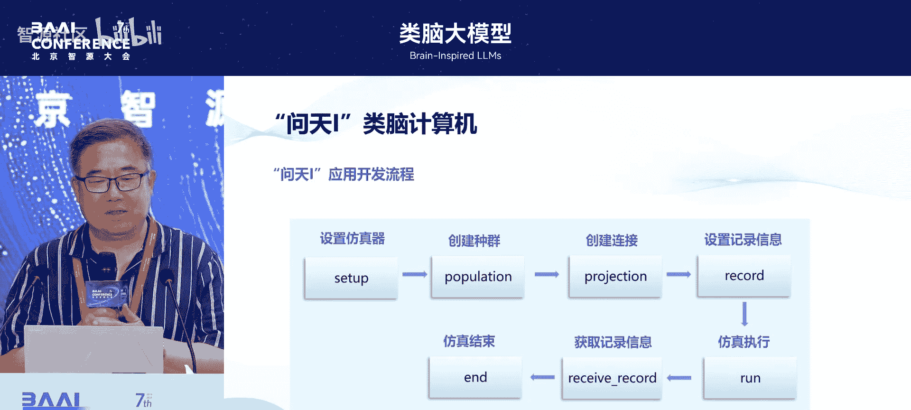

除了软件工作，我们在算法层面也进行探索。刚才李老师讲过长时记忆。虽然与李老师的算法可能不同，但我们整体上是从模仿脑机理出发，想从更基础、更本质的角度探索SNN或脉冲神经网络的算法。

我们关注SNN的记忆表达能力问题，即如何更好地表达动态记忆。这对未来的自动驾驶、具身智能机器人、可穿戴设备都有很大应用场景。

### BSN算法创新：引入胶质细胞

具体工作方面，基于LIF神经元模型（从生物可解释性到计算简易化的发展基础），我们发现其在膜电位重置时存在记忆能力的局限性。

我们通过两个方面解决：
1.  **网络结构**：在脉冲神经网络中引入胶质细胞概念，建立新的脉冲神经元-离子连接以及胶质-离子连接（胶质间隙连接），从而改善神经元状态与突触的连接。
2.  **这份工作首次将脑胶质细胞动力学机制及其网络结构的参数学习、全局时空信息整合应用于SNN领域**。通过丰富的信息处理单元和网络连接，扩展了传统SNN单一的信息处理维度，使其具备全局调控能力，克服了传统SNN局部记忆的局限。

整个工作通过调整神经元状态、调整突触状态以及信息整合，通过新增的神经元模型和突触模型，从胶质细胞角度改变了网络，我们称之为BSN。

### 神经元模型创新：借鉴蘑菇体

在神经元模型上，我们借鉴了可塑性递归蘑菇体模型，在神经元层面开展工作，以改变SNN在时空维度上的记忆保持能力。

我们通过新增一个突触电流动力学（可能与李老师讲的“开关”有异曲同工之妙），实现长时记忆。通过整合输出结构和递归连接，应用半欧拉方程构建新的离散解，解决了时空连续记忆保持问题。我们在实验中验证了其有效性。

但在实践中，我们还有状态爆炸的问题，未来需要解决。李老师提到的64K和128K个长时记忆单元，也是硬件实现层面需要考虑的。当然，这里也有一些像张老师提到的拆解或编码的技巧。

我们将利用蘑菇体胶质细胞的模型应用于避障小车上，成功避障率超过92%。计算量减少了40%。

## 第三部分：应用案例

下面我将应用案例简单介绍一下，这也涉及如何使用问天类脑计算机。

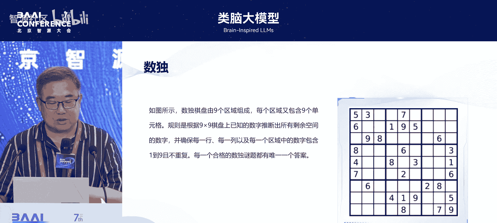

### 应用一：求解数独（NP问题）

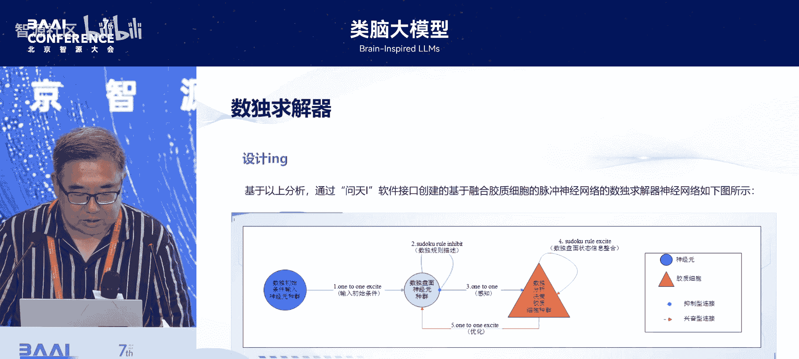

我们首先选择了一个数学NP问题：数独。这是一个多节点、高耦合、强约束的全局一次性问题。

数独大家了解，是9x9宫格，每行、每列、每宫不能有相同数字，只能填1-9。

**整体设计**：我们建立神经元种群（包括数据盘面种群和胶质细胞种群）来构建网络。

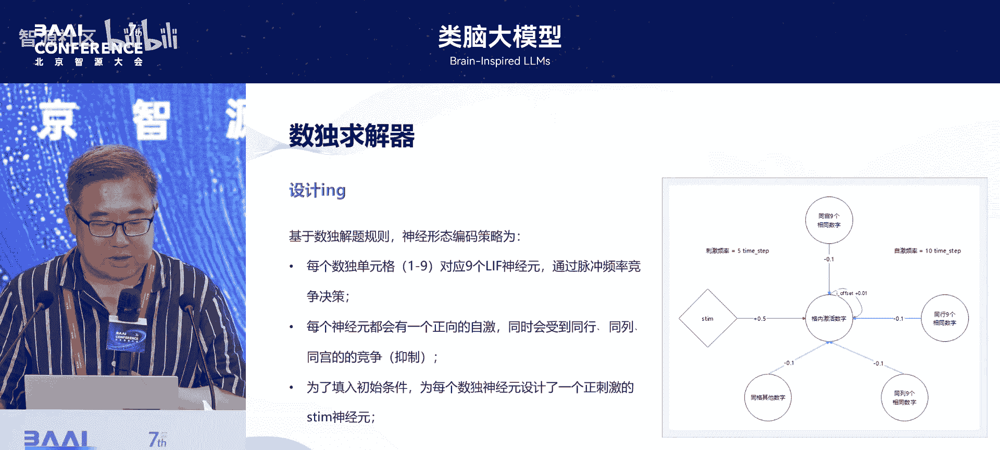

**具体实现**：以每个单元格为例，因为可能是1-9，我们用9个神经元来表示它，通过脉冲频率竞争来实现决策。每个神经元有正向自激励，也有来自同行、同列的抑制性竞争。为了设置初始值，我们通过一个神经元来建立初始条件。这只是实现方法之一，不一定最优。

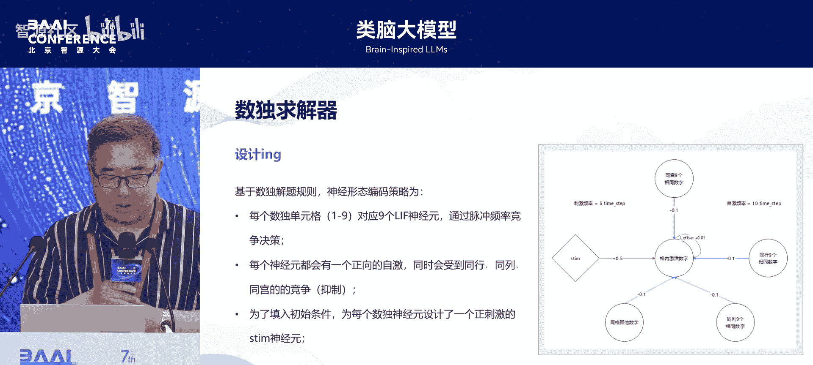

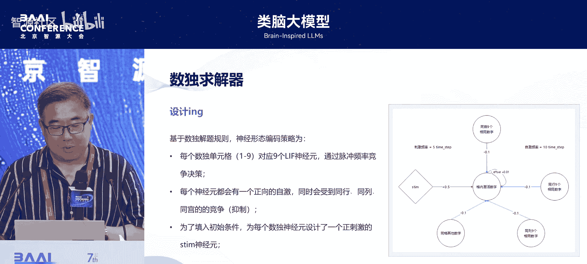

**工作流程**：包括建立种群、建立连接、建立互联关系，以及建立胶质细胞种群（通过文本描述），并建立回溯机制与主机交互。

**最终**，我们让系统运行。这是实际工作的展示。

**评估**：我们对两种数独数据集进行分析。第一个数据集成功率100%，计算量减少了92%。第二个数据集成功率约99.99%（在限定时间内仅一道题未解开）。相比于硬连接的回溯方法，我们分别减少了88%和92%的计算量。

### 应用二：智慧交通信号控制

交通信号灯智能控制是交通流量调度问题，可视为连续时空的流量控制，是智慧城市的重要一环。

**建模**：我们建立了车道及耦合关系模型、车流调控模型、交通灯及其时空逻辑模型、车道负载实时估计模型。

**右侧是网络模型**，构建方式与前例类似：建立种群、互联连接、映射关系，以及互相之间的开关、约束关系的描述文件。

**最终**，我们将道路负载信息编码为平均脉冲发放率，将负载变化量传递给路网表达神经元种群，最终将时空切换逻辑种群的脉冲信息转换成真实信号灯控制。

（视频演示解说词）
随着人口和经济增长，交通拥堵、安全、污染等问题日益严重。传统交通控制采用固定策略，无法准确预测和优化调度，无法做到区域自适应控制。
问天智慧交通系统依托问天类脑超级计算机，是首个脉冲神经网络大规模智能交通控制系统。问天一类脑计算机突破了基于脉冲神经网络的计算模型、体系架构、类脑硬件系统、类脑软件系统及应用开发等关键技术，具有计算能效高和实时性强的优势，较现有计算系统能效提高数十倍，达到国际先进水平。
基于问天一的智慧交通系统，具备低功耗、低延时、低资源占用、快速部署、调控规模大、调控效果优等特点，可以轻松实现单点、干线及区域协同控制。
以南京市建邺区为例，路网有8000多条车道，800个红绿灯路口。为模拟早晚高峰，我们每小时注入14000多辆车。通过一段时间调控，与强化学习智慧交通系统相比，问天系统中的拥堵较少。
通过下方折线图可以看出，在计算机系统性能指标方面，问天系统的功耗和资源占用降低了95%。在交通系统性能指标方面，平均车速提升了100%，平均等待时间降低了90%，碳排放降低。

**数据对比**：在资源占用上，我们的智慧交通系统约13 MB，而GPU方案约305 MB，约为1/23。能耗上，单路口我们约1.9毫焦，GPU方案约49毫焦，约为1/25。我们进行了轻量级、中量级、重量级等不同负载设置实验，无论在计算资源还是交通资源指标上，都有非常大提升。

## 第四部分：总结与展望

最后一部分，我想进行汇报和请教。

### 当前类脑计算生态归纳

*   **计算芯片平台**：多样，包括SNN融合CNN、CNN加线性层、时域方法、数模混合、定制处理器、存算一体等。
*   **计算平台**：有自主系统。
*   **软件**：正如张老师所讲，有系统希望一统天下，但还比较难。
*   **算法**：神经网络架构加线性激活函数、CNN和SNN融合、纯SNN应用很多，但都缺乏“杀手级”应用。这是我们面临的一大困境：什么样的应用适合类脑？这需要探索。

### 我们的未来工作方向

我们目前的工作分三方面：
1.  **面向脑科学探索**：实现智能有限，例如脑疾病预防、脑仿真等。
2.  **创新计算模式**：构建感-存-算融合的自主系统，解决交互实时性难题和任务动态管理难题，服务于高性能计算。
3.  **算法研究**：主要瞄准新模型融合SNN和纯SNN。

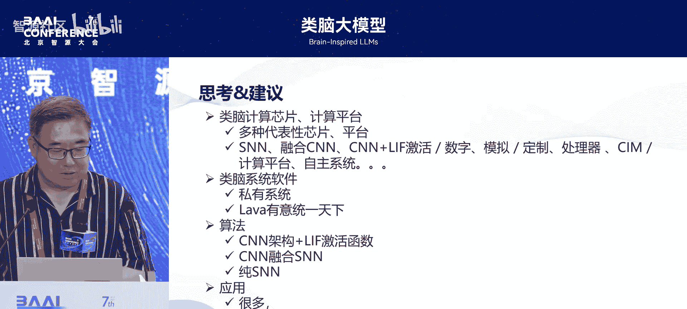

在此呼吁大家共同努力，构建类脑计算生态。类脑是新兴、前沿的交叉学科，需要大家共同努力，才能将其推向高度，实现通用人工智能。

我的汇报到此结束，谢谢大家。

---

## 问答环节

**提问1**：SNN总是强调低延迟和低功耗，它有没有可能在某些领域产生出更强大的智能？如果有，将以什么形式实现？

**回答**：我赞同SNN是通向未来人工智能的途径之一，因此非常认同它可能产生强大智能。如何实现？目前从硬件平台看，已有多种SNN平台。但从算法上讲，尤其是纯粹的SNN算法，还需要大家大力开发，才能体现出所说的强大智能。人脑本身就是世界上最智慧的器官，代表最强大的智能。我是这么认为的。

**提问2**：您刚才提到SNN的问天计算机有低时延的优点。但我理解SNN的推理是多时间步的，而普通ANN通常只有一个时间步。为什么SNN比ANN的时延低？

**回答**：这是个好问题。我本身不做算法，尝试这么回答：SNN确实是多时间步，但每个时间步的计算量并不大。而ANN虽然一步完成，但这一步涉及大量计算。SNN的多步计算是稀疏的，有效数据量少。此外，可能需要强调SNN的稀疏性特性。

---

本节课中我们一起学习了尚德能研究员关于“问天一类脑计算机”的全面介绍。我们从其研制背景、硬件架构、互联技术、软件工具链，到创新的BSN算法和胶质细胞模型，最后通过数独求解和智慧交通两个案例看到了类脑计算的实际应用潜力。报告也总结了当前类脑计算生态的多样性与挑战，并展望了未来的研究方向。