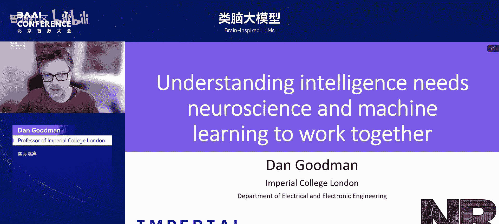
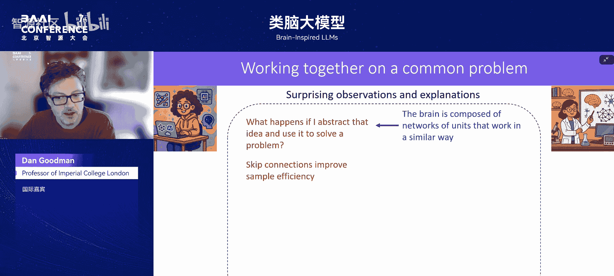
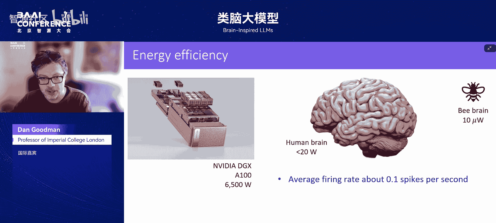
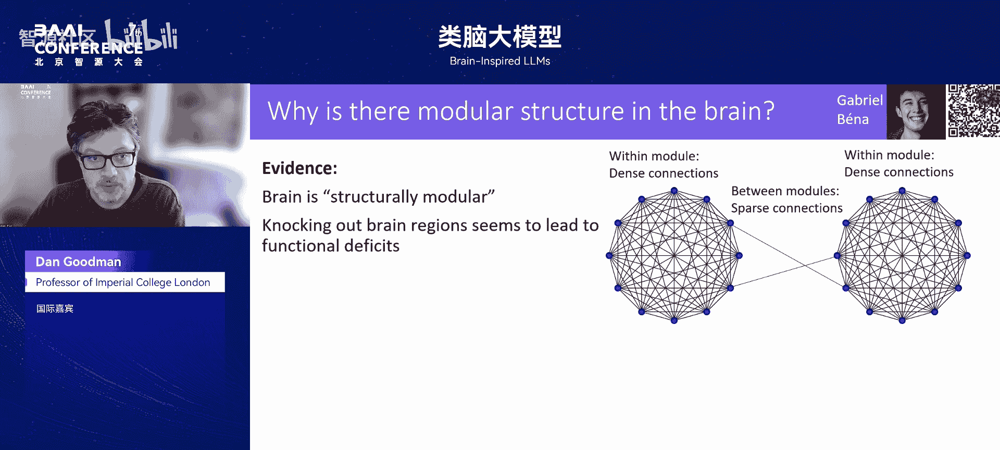
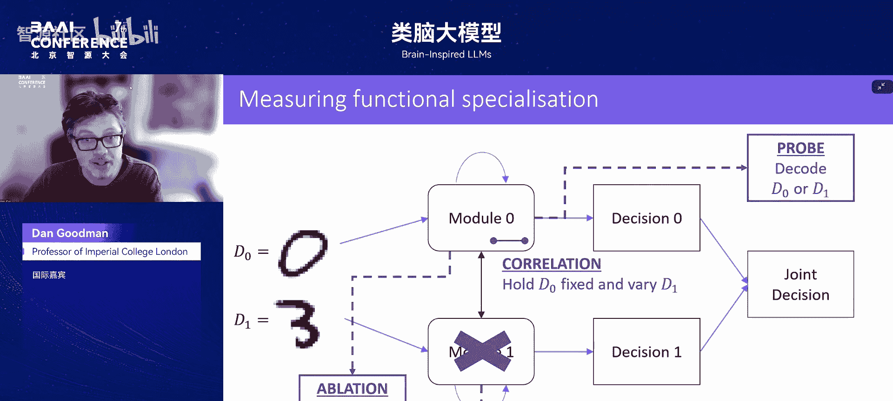
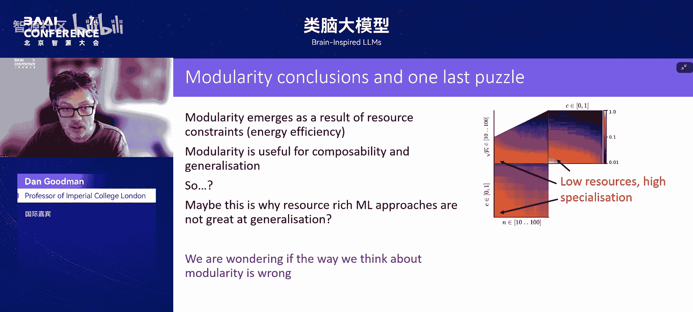
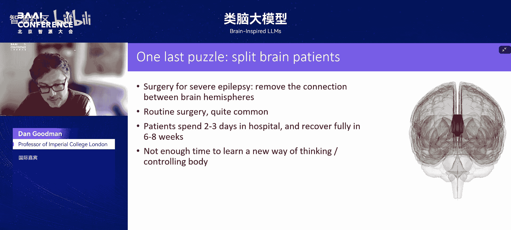

# 类脑大模型-p06-Dan-Goodman-国际嘉宾--Professor-of-Imperial-College-London

在本节课中，我们将学习伦敦帝国理工学院教授 Dan Goodman 的核心观点：要真正理解智能的本质，神经科学与机器学习必须协同工作。我们将探讨为何简单的“神经AI”单向借鉴模式已不再适用，并介绍一种通过共同解决核心谜题来推动两个领域发展的新框架。



---

## 概述：为何需要新视角？

你可能最近听说过“神经AI”这个词。其核心理念是，神经科学可以再次为机器学习的发展提供重要灵感。然而，这一观点遇到了阻力。机器学习研究者有充分的理由认为，他们目前比神经科学家更理解“学习”本身。

因此，我们需要一个不同的视角。这个视角不是让机器学习研究者听从神经科学家的指导，而是让两个领域共同致力于解决一个根本性的共同谜题：**智能如何产生？**

这个问题不仅仅是“如何构建智能”或“大脑如何工作”，而是一个更普遍的、关于智能所有可能表现形式的问题。要理解这一点，我们需要至少两种不同的智能视角进行比较。目前，我们恰好拥有两种：机器学习和人脑。通过合作与分享见解，我们可以从不同角度审视智能，这有助于我们理解智能产生的普遍条件，从而更好地解决各自领域的具体问题。

---

## 神经科学的未解之谜



上一节我们介绍了合作的新框架。本节中，我们来看看神经科学中一些令人困惑的观察，它们可能是推动合作的起点。神经科学远未完全理解大脑的工作机制，存在许多未解之谜。

以下是几个例子：

*   **突触的短暂性**：大脑中大多数神经元之间的连接（突触，相当于神经网络中的权重）只能持续几小时或几天。这与我们形成稳定记忆或技能的观念相矛盾。我们不知道原因，也不清楚这是否具有某种功能优势。
*   **视觉皮层的意外关联**：预测视觉皮层神经元活动时，了解动物面部肌肉在做什么，几乎和了解动物在看什么一样有效。这非常令人惊讶，因为视觉皮层本应是主要处理视觉输入的区域。
*   **神经元间的RNA传递**：最近观察到神经元之间会互相发送包裹着RNA的小包，这些RNA可以携带约1千字节的数据。控制这一过程的基因似乎与学习有关，但我们完全不清楚其具体机制。

这些谜题表明，大脑的运作方式远比我们当前理解的复杂。因此，当一位神经科学家告诉你“大脑就是这样工作的”时，请保持怀疑，并从中汲取灵感。

---


## 核心线索：大脑的极致能效

在深入具体研究之前，我们需要了解大脑的一个关键特征：**极致的能量效率**。这既是理解后续内容的基础，本身也是一个惊人的事实。



我们知道，机器学习主要运行在GPU上，功耗巨大，可达数百瓦。相比之下，**人脑的功耗估计不到20瓦**。蜜蜂的大脑能够处理复杂的视觉任务、导航和社交沟通，但其功耗仅约**10微瓦**。

大脑实现这种能效有一些惊人特性：


*   **极低的放电率**：平均而言，每个神经元每10秒才发送一个二进制消息（一个脉冲）。这相当于一种极端的参数量化形式。
*   **极高的稀疏性**：如果以10脉冲/秒作为神经元传递有用信息的速率，那么为了维持0.1脉冲/秒的平均水平，意味着在任何给定时间，只有约**1%** 的神经元处于活跃状态。
*   **稳定的总能耗**：大脑的总能量消耗在任何时候最多只波动约**5%**，无论你在进行困难还是简单的任务。这意味着大脑在非常严格的能量预算下运行，并采用某种高效方案来控制资源分配。

理解这种水平的控制和资源效率是如何实现的，本身就是一个巨大的谜题。



---

## 案例研究：结构模块化是否导致功能专门化？

上一节我们看到了大脑在能效上的约束。本节中，我们通过一个具体研究案例，看看如何用机器学习方法探索神经科学问题，并可能对两个领域都有启发。

我们研究的问题是：**大脑的结构模块化是否会导致功能专门化？**

大脑在结构上是模块化的，分为不同的区域（模块），模块间的连接具有特定模式。同时，某些区域受损会导致特定功能丧失（如失语症），这暗示了功能专门化。一个常见的隐含假设是：结构模块化会自然导致功能专门化。

我们使用机器学习模型来检验这个想法。我们训练具有以下结构的人工神经网络：

```python
# 概念性结构描述
# 两个模块，每个模块内部全连接（循环连接）
# 两个模块之间通过稀疏概率 P 连接
module_left = FullyRecurrentNetwork()
module_right = FullyRecurrentNetwork()
connections_between = SparseConnections(probability=P)
```

任务经过特殊设计以鼓励专门化：网络需要处理两个独立的手写数字，并判断它们是否具有相同的奇偶性。每个模块直接接收一个数字的输入，但最终需要合作做出联合决策。设置使得模块专门处理各自输入的数字是最直接的解决方案。

我们测量了**结构模块化程度**（模块间连接稀疏性）和**功能专门化程度**。功能专门化通过多种方式衡量，例如：
1.  **相关性分析**：固定一个模块的输入数字，观察其内部状态在不同配对下的相关性。高相关性意味着专门化。
2.  **探针解码**：训练一个探针网络，仅从一个模块的状态解码其对应的数字。高解码精度意味着专门化。
3.  **消融实验**：训练一个使用两个模块状态的解码器，然后移除一个模块，观察对解码两个数字能力的影响。不对称影响意味着专门化。

**结果发现**：只有当结构模块化程度达到极端水平（远超大脑中观察到的程度）时，显著的功能专门化才会出现。这意味着，**仅靠观察到的结构模块化，并不足以解释大脑中存在的功能专门化**。

---

## 关键发现：资源约束催生模块化

上一节的发现引出了新问题：既然结构模块化本身不够，那么大脑中的功能专门化从何而来？我们的研究指向了一个关键因素：**资源（能量）约束**。

当我们对网络施加资源限制（例如限制神经元数量或活动水平）后，情况发生了改变。

**在资源匮乏的条件下，功能专门化会在低得多的结构模块化水平上出现。**




这具有重要启示：
1.  **对神经科学**：大脑是极度能量高效的。这种资源约束可能正是推动其功能模块化和专门化演化的重要力量。
2.  **对机器学习**：当前的机器学习模型通常在资源极其丰富的环境中训练（数十亿参数）。在这种环境下，学习模块化、可组合的解决方案既无必要，甚至可能有害（因为参数充足，可以直接学习复杂映射）。这或许是当前大模型在技能组合与泛化方面仍面临挑战的部分原因。

模块化有利于**可组合性**和**泛化**。学习一个特定技能（模块），然后在新的情境中复用它，这能带来更好的泛化能力。



---


## 更深层的谜题：动态模块化与脑裂患者

我们的研究还揭示了关于模块化更复杂的图景，并引出了最后一个谜题。

首先，我们发现功能专门化不是静态的。在一个多时间步长的推理过程中，模块在初期表现出高度专门化，但随着模块间信息交换的进行，专门化程度会迅速下降。这表明，**模块化可能是一种动态的、依赖于上下文的功能状态，而非固定的结构属性**。



这引出了一个著名的神经科学案例：**脑裂患者**。为治疗严重癫痫，医生有时会切断连接大脑两半球的胼胝体。术后，两个半球几乎无法直接通信。

令人惊讶的是：
*   患者恢复极快，几天出院，几周内基本康复。
*   这种恢复速度表明，他们并非重新学习了新的思考或控制身体的方式。因为学习新技能需要更长时间。


这暗示，**大脑在日常运作中，可能并非始终以高度依赖半球间紧密协作的“模块化”方式工作**。否则，切断连接会造成持续性的严重功能障碍。

这就留下一个深刻的谜题：**能否设计一个即使其模块被断开连接也能继续运作的“大脑”？** 这种**鲁棒的智能**是否对神经科学和机器学习都至关重要？或许，这是实现稳健智能所需的一项基本技能。

---

## 总结

本节课中，我们一起学习了 Dan Goodman 教授关于神经科学与机器学习合作路径的思考：

1.  **超越单向启发**：有效的合作不是单向的知识转移，而是共同解决“智能如何产生”这一根本谜题。
2.  **关注未解之谜**：神经科学中大量的意外发现（如短暂突触、RNA传递）是灵感的宝贵来源，而非确定的答案。
3.  **重视能量约束**：大脑极致的能量效率是其关键特征，可能是驱动其模块化、稀疏性等特性的核心约束，这对设计更高效的机器学习模型具有启发意义。
4.  **重新审视模块化**：结构模块化不一定导致功能专门化。在资源约束下，功能专门化更易出现。且模块化可能是动态的、情境依赖的。
5.  **探索鲁棒性**：像脑裂患者这样的案例提示我们，智能系统可能需要具备在模块间通信受损时仍保持功能的能力，这对构建稳健的AI系统是一个重要启示。

通过将神经科学视为一个充满待解谜题的伙伴，而非答案的提供者，机器学习可以从中获得全新的视角和挑战，共同推进对智能本质的理解。