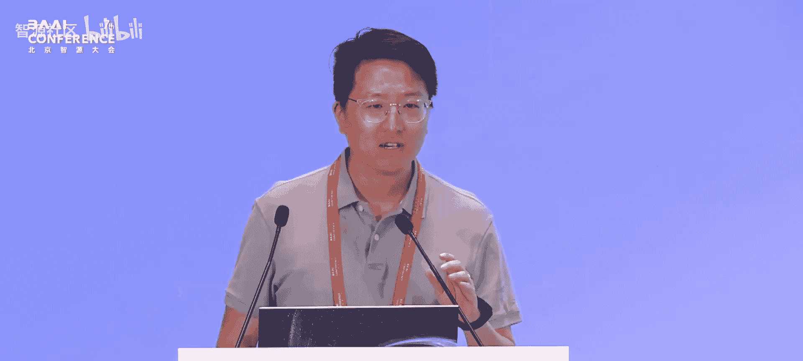
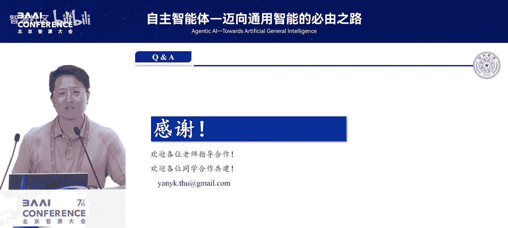

# 自主智能体——迈向通用智能的必由之路-p03-知识导向的智能体能力提升：闫宇坤

在本节课中，我们将要学习如何通过知识导向的方法来提升智能体的能力。我们将探讨大模型的知识局限，并深入介绍检索增强生成技术，以及如何优化知识的获取与利用过程，使智能体能够更准确、更可靠地解决复杂问题。

---

## 大模型的知识局限

上一节我们介绍了智能体的基本概念，本节中我们来看看当前大模型面临的核心挑战之一：知识局限。大模型虽然强大，但其知识存在固有的边界和问题。

首先，大模型存在幻觉问题。这是因为模型训练数据的规模、分布和历史限制所导致的。例如，询问“澳大利亚的首都是哪个城市”，模型可能错误地回答悉尼或墨尔本，而正确答案是堪培拉。这种幻觉与人类类似，难以完全消除，需要外部知识来加强。

其次，大模型存在知识过时的问题。例如，OpenAI在2024年4月发布的GPT-4.1，其训练数据截止到2024年6月。这意味着模型无法学习到之后产生的新数据。

此外，某些类型的数据不适合放入预训练或监督微调数据集中。例如，隐私数据。早期的GPT-3模型，若通过特定的提示词诱导，可能会泄露隐私信息。

研究还发现，试图在训练后通过持续的监督微调来让模型掌握更多知识效果有限。模型更倾向于学习回答的模式，而非真正掌握回答的内容。

当知识局限问题遇到具备深度思考能力的推理模型时，情况会变得更复杂。例如，向一个32B参数的模型提出具体问题，它可能会陷入反复纠结的思考循环，最终输出不可靠的答案。

---

## 检索增强生成技术的基础范式

面对知识局限，学术界提出了一系列解决方案，核心是**检索增强生成**技术。其发展脉络从2022年提出基础范式，到2023年关注检索时机，再到2024-2025年探索与思维链、知识库的深度结合，如今已成为解决复杂问题的核心方案。

RAG的基本思路非常简单，分为检索和生成两个模块：
*   **检索模块**：在遇到真实问题时，负责从外部知识库中找到相关的知识片段。
*   **生成模块**：将检索到的相关知识与用户问题拼接，让模型基于此进行输出。

该技术公式可简化为：
**最终输出 = 生成模型(用户问题 + 检索到的相关知识)**

RAG技术通常应用于知识密集的场景，例如通用知识问答、医疗、教育、法律等领域。

---

## 知识获取的优化：从基础检索到深度整合

我们的团队从2023年开始系统研究RAG技术。最初，我们关注基础检索能力的提升。

以下是我们在基础检索能力提升方面的两个主要方向：

1.  **检索模型性能提升**：我们利用仅解码器架构的强基础模型，训练了自己的嵌入模型，并研发了同质化小批次、分任务学习率调整等技术。我们发布的`MiniCPM-Embedding`模型曾在MTEB检索榜单上排名第一，下载量超过35万次。
2.  **检索对象模态扩展**：现实中的信息常以多模态形式存在。我们训练了跨模态检索模型`VisR`，使3B级模型的能力超越了GPT-4o的水平。

然而，基础性能提升和模态扩展并非解决复杂问题的根本方案。我们对检索过程本身进行了反思。

以下是几种检索模式的演进与问题：

*   **单次检索**：根据查询检索一次后直接生成。问题在于信息覆盖可能不全，且扩大检索范围会引入噪声。
*   **多轮检索**：在生成过程中定期检索。虽然能覆盖更多信息，但成本高且难以避免噪声引入。
*   **自适应检索**：伴随生成过程，动态判断是否需要检索。问题在于各轮检索的信息独立，缺乏融合与交互。

基于这些观察，我们提出了 **`DeepNote`** 工作，这是一种基于笔记的多轮检索与深度整合方法。它引入了一个大模型可以维护的“笔记”，实现了知识获取的整体规划、动态拓展、信息整合和自适应启停。

具体流程如下：
1.  接收用户问题，进行首次检索。
2.  在笔记中记录已掌握的信息和仍需获取的信息。
3.  进入循环：基于当前笔记内容提出新问题 -> 检索 -> 将新知识整合到笔记中。
4.  每次更新笔记后，判断其内容是否足以回答问题。若是，则基于笔记生成答案；若否，则继续循环。

`DeepNote` 方式有效提升了模型解决多跳或长跨度依赖问题的能力，相比基础RAG版本平均有约10个百分点的提升。分析表明，它在减少输入文本量的同时，提升了有效信息的密度。

---

## 知识利用的优化：生成链路的调优

知识获取之后，下一个关键问题是知识的利用。即使将准确、完备的外部知识提供给模型，模型也未必能正确输出。这是因为模型对外部知识的利用能力有限，且其内部知识可能与外部知识产生冲突。

例如，询问一个训练数据截止到2024年初的模型“美国总统是谁”，它可能回答“拜登”。即使你明确告知它“现在美国总统是特朗普”，再次询问时，模型仍会犹豫。此外，检索系统必然不完备，会引入噪声，因此模型需要加强抗噪声能力。这与指令微调的目标——让模型严格遵循输入——存在矛盾。

对于生成能力的调优，我们对比了两种方法：

*   **监督学习**：数据合成简单直接，但可能牺牲通用能力，且不适合自动化场景。
*   **强化学习**：更适合RAG系统生成模块的训练。其优势在于数据需求规模较低，适用于自动化场景，并能保持通用能力。缺点是数据采样相对困难。

我们提出了 **`RAG-DDR`** 方法，用于调优由多个智能体组成的生成链路。其基本思路是通过调整模型的温度参数、外部知识组合，并补充纯粹依赖内部知识的采样，来获得具有不同奖励的样本。

对于长链路调优，我们将其类比为多齿轮系统。传统的端到端强化学习方法成本极高。`DDR` 采用**后向对齐**的方式：固定最后一个“齿轮”（如答案生成器），只训练前一个“齿轮”（如信息整合器）与之完美匹配；然后固定这两个，再训练更前一个。如此逆向推进，高效地打磨了整个系统。

在实验中，我们采用“提炼器+生成器”的两智能体模式进行调优。使用`DDR`后，一个`MiniCPM2-4B`模型在多种任务上的表现可以超越`Llama3-8B`模型。且经过`DDR`训练后，模型的通用能力不仅没有下降，在知识性任务中反而有所提升。

`DDR`作为一个系统化调优框架，可以与多种范式结合：
*   与`DeepNote`结合，在笔记初始化、问题拓展、笔记更新、答案生成各环节进行调优，能将复杂问题解决准确度提升20个百分点左右。
*   与知识图谱结合，将知识图谱的检索读取模块加入链路并用`DDR`调优，也能有效提升下游任务解决能力。

---

## 迈向统一优化：采样、反馈与多模态路由

仅使用`DPO`等强化学习方法进行调优是不够的。在RAG场景下，模型有时需依赖内部知识，有时需依赖外部知识，有时需结合两者，导致采样成功率低。此外，伴随深度推理的问答任务，反馈信号非常稀疏。

我们后续工作围绕两个核心展开：**提升采样成功率**和**提升反馈信号密度**。

对于采样成功率，我们采用双向思维链进行采样，或通过大模型指导下的修正方式进行采样。
对于反馈信号密度，我们通过特殊的细化处理来获得更细粒度的反馈信号。

具体而言，我们提出了 **`CARE`** 工作。其思路是将模型推理过程中的知识进行展开，具体形式是构建一个**知识图谱**，包含实体和关系信息。这样，我们不仅可以根据最终答案的正确与否获得奖励，还能通过一个大模型来评估小模型在构建知识图谱时具体哪个环节出错，从而极大提升了监督信号的密度。

在训练时，我们会在`DPO`计算中着重提升错误标记的权重。实验表明，`CARE`在效果上与`DPO`相当，但所需训练数据量显著减少（例如，`CARE`用3000条数据达到了`DPO`用3万条数据的效果）。

在统一优化的视角下，知识获取与知识利用是密不可分的。基于此，我们提出了 **`RAG-Router`** 工作，它集成了我们之前的许多经验。

`RAG-Router`引入了**动态路由机制**：
*   在检索过程中，它是多轮、边思考边检索的。
*   其检索对象不限于文本知识库，还包括图像、表格等多模态信息源。
*   训练过程采用 **`Step-GRPO`** 方法，通过逐步采样来进行多能力的联合调优。

效果上，`RAG-Router`（一个7B模型）的性能超过了32B的基线模型。分析表明，通过细粒度的奖励调优，模型能有效地从多个信息源中获取所需信息。例如，在识别鸟类种类时，模型会先检索标准鸟类图像进行参考，再检索文本描述，最后综合所有信息给出答案。

---

## 总结与展望

本节课中我们一起学习了知识导向的智能体能力提升路径。我们首先剖析了大模型的知识局限，然后系统介绍了检索增强生成技术的基础与演进。在知识获取方面，我们探讨了从基础检索到`DeepNote`深度整合的优化方法；在知识利用方面，我们深入讲解了`RAG-DDR`生成链路调优框架及其优势。最后，我们展望了通过`CARE`和`RAG-Router`等工作，实现更高效的采样、更密集的反馈以及多模态知识统一路由的未来方向。

我们认为，解决复杂真实场景问题需要多个模块协同发挥作用：**知识库的整理与存储**、**推理过程的信息收集与整合**、**对知识源与推理路径的动态路由**，以及**强大的推理模块本身**。这四个模块的联合优化，是迈向更通用智能体的必由之路。

---

> **开源与合作**：我们与清华大学、东北大学以及OpenBMB、AI4SaaS等社区联合发布了开源项目，将持续集成前沿工作。欢迎关注并通过邮件或公众号联系我们寻求合作。