# 自主智能体——迈向通用智能的必由之路-p04-大模型自主智能体及端侧应用：林衍凯

## 概述
在本节课中，我们将学习大模型自主智能体的核心概念、关键技术以及团队在工具学习、任务泛化、长程任务执行和主动智能体方面的探索与实践。课程旨在阐明如何让大模型学会使用外部工具，并具备自主性、泛化性和长程性，从而迈向通用人工智能（AGI）。

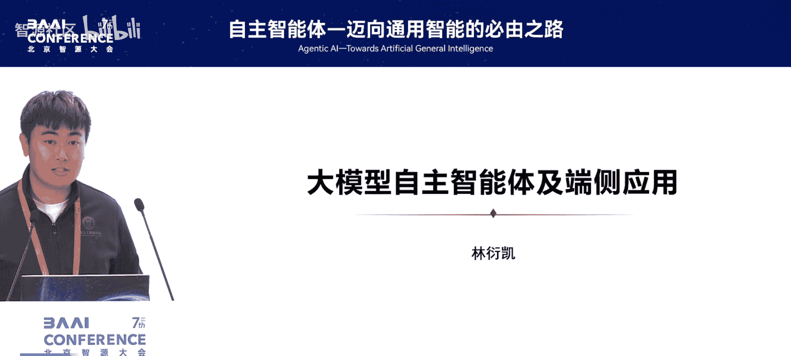

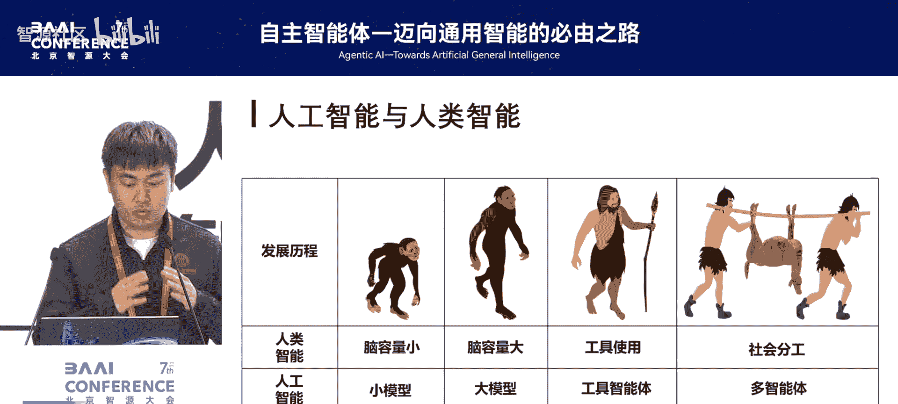

---

## 章节 1：大模型的发展与工具型智能体

在过去的五年间，大模型经历了从小模型到大模型的演进过程。模型通过持续增加参数量和训练数据量来提升智能水平。

在此基础上，若要迈向通用人工智能（AGI），我们需要让大模型像人类一样，学会使用工具并进行社会分工。

本报告将聚焦于如何让大模型学会使用外部工具来解决真实、复杂的问题，即构建**工具型智能体**。

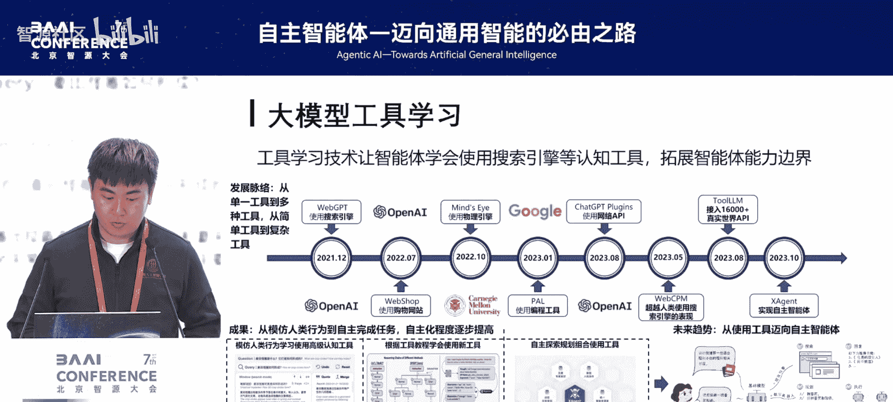

---

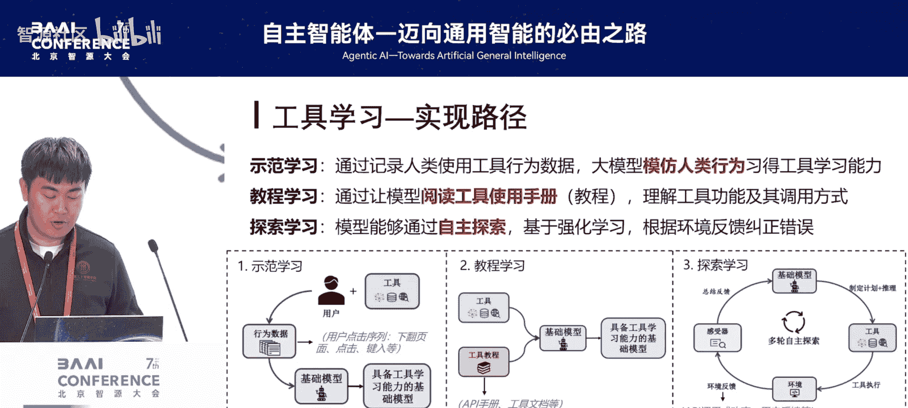

## 章节 2：让大模型学会使用工具

目前，许多大模型自主智能体的工作都基于闭源大模型（如GPT-4、Gemini、Claude），并通过设计特定的工作流程来激发其智能体能力。

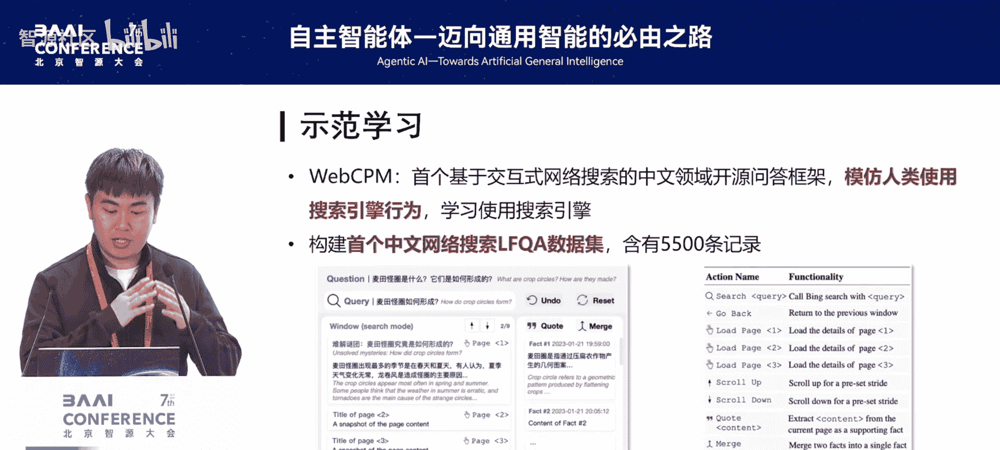

然而，若以AGI为目标，我们期望拥有一个能够自主学会使用工具、与环境交互以解决复杂问题的**智能体模型**。因此，**工具学习技术**成为一项至关重要的技术。

我们希望通过工具学习，让智能体学会使用搜索引擎等一系列复杂的认知工具，以提升其能力边界。

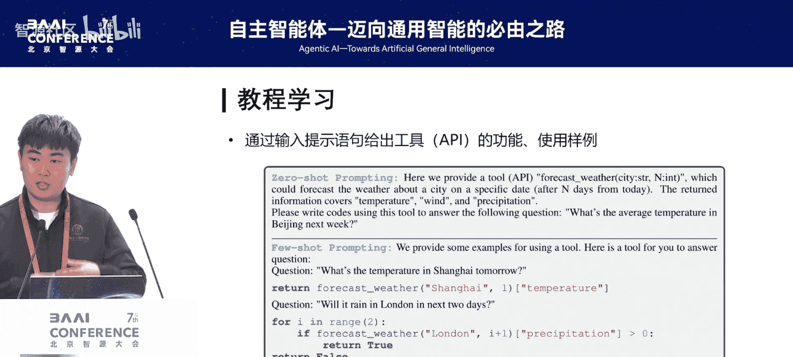

自大模型出现以来，这一方向就备受关注。从2020年OpenAI发布GPT-3后，2021年便出现了WebGPT，探索如何使用搜索引擎帮助大模型执行知识任务。在短短四五年间，已有成千上万的工作研究如何让大模型学会使用一项或多项外部工具，并通过与环境的反复交互来完成具体任务。

---

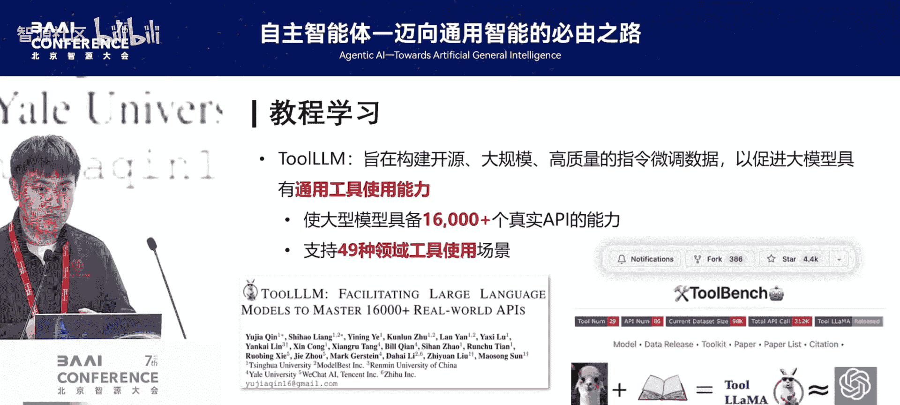

## 章节 3：工具学习的三种范式

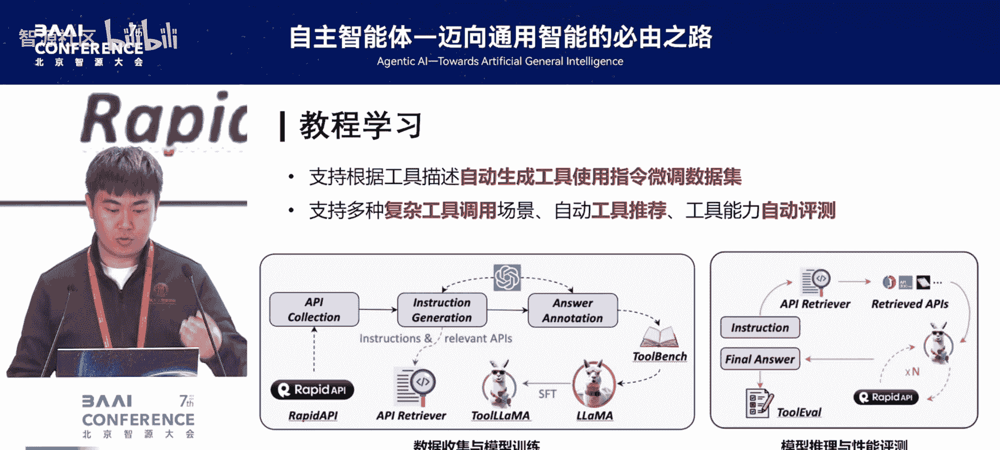

具体而言，如何让大模型学会使用工具？从学习范式角度，可以总结为以下三点：

**以下是三种核心的学习范式：**

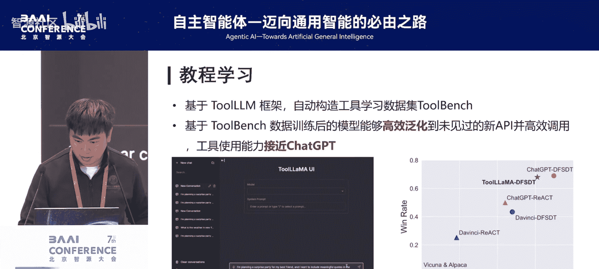

1.  **示范学习**：让大模型通过学习人类使用工具的行为轨迹，模仿人类行为来习得工具使用能力。
2.  **教程学习**：让大模型通过阅读工具的使用手册，像人类一样理解工具的功能和调用方式。
3.  **探索学习**：让大模型通过自我探索，基于强化学习，根据环境反馈和人类反馈来纠正错误，从而学会使用具体工具。

---

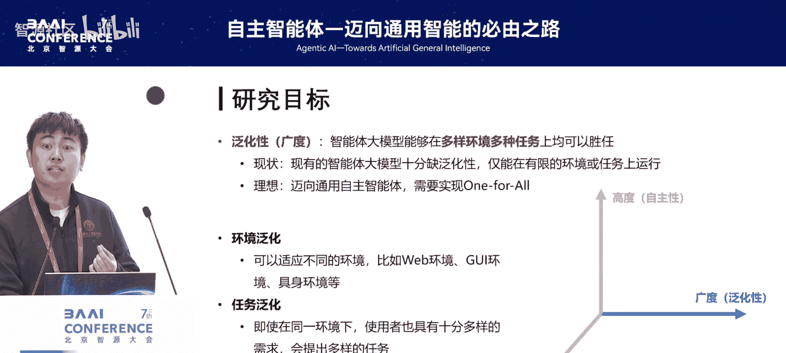

## 章节 4：团队在工具学习上的探索

我们的团队在上述方向进行了一些探索。

在**示范学习**方面，我们提出了中文互联网首个基于交互式网络搜索的中文领域问答框架。在该框架中，我们标注了大量人类如何使用开源搜索引擎回答开放域问题的数据。基于这些标注数据，我们微调了当时一个50亿参数的CPM模型。研究发现，仅需5500条记录，通过微调就能让大模型学会使用搜索引擎，并展现出类人的搜索策略。相比于不使用搜索引擎工具的模型，其在开放域问题上的能力得到了极大增强。

然而，示范学习虽然有效，但极度依赖为每个工具收集大量的人类使用轨迹，非常耗时耗力。

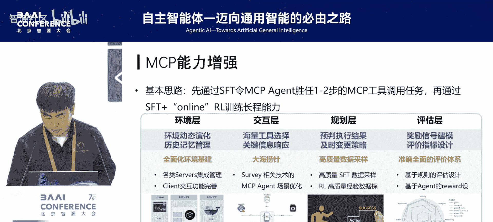

联想到人类如何使用工具，以及人类对工具的泛化能力，我们期望大模型能否像人类一样，仅通过阅读工具手册的描述（如工具名称、输入参数、操作方式）就能理解如何使用该工具。我们发现，像GPT-4这样的模型已具备这种能力，但如何让开源模型学会这一点？

基于此，我们提出了基于**Self-Instruction**的大规模、高质量工具指令微调数据构建方法。这使得我们能够在49个领域、16000个真实API场景下，通过调用大模型自主构建工具使用数据集。该框架支持根据工具描述自动生成指令微调数据，同时支持多种复杂工具调用场景，以及自动的工具推荐与评测。

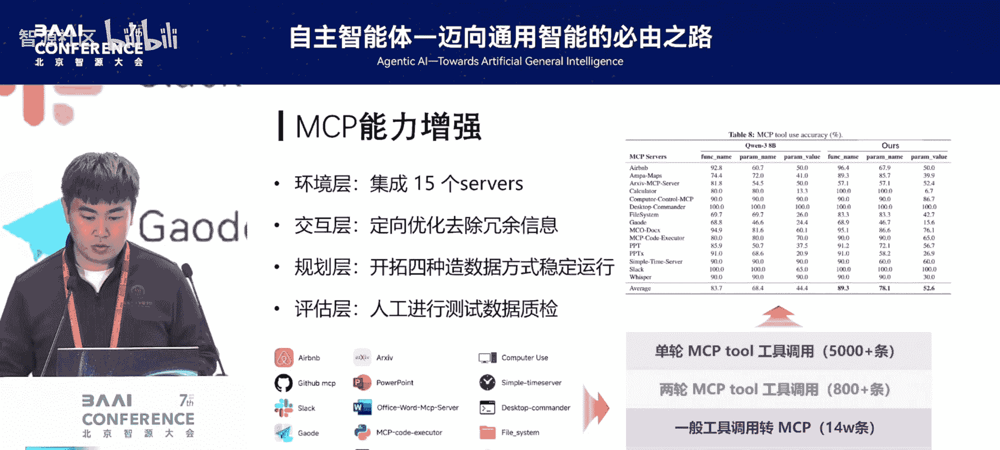

基于此框架，我们自动构建了工具学习数据集 **ToolBench**。使用ToolBench数据集训练当时的LLaMA-3模型后，我们发现模型能够高效地泛化到未曾见过的新API上。对于新API，只需提供工具手册，模型就能高效调用，其工具使用能力接近GPT-4。

---

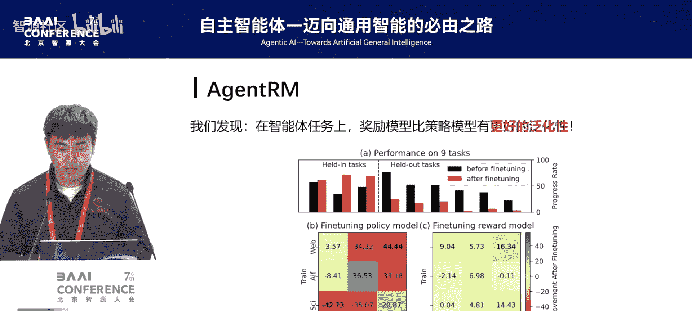

## 章节 5：优秀智能体的三大特性

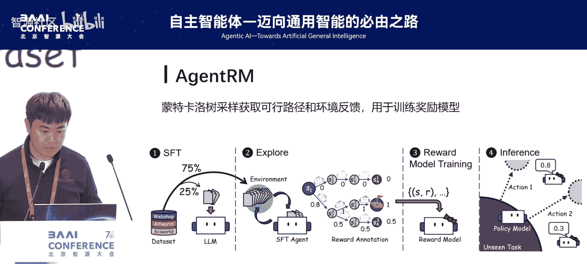

至此，我们似乎已经能基于这样的模型构建一个不错的大模型智能体了。但这足够了吗？我们是否已经实现了所谓的大模型智能体？

如果我们接下来的目标是沿着AGI的方向前进，那么应该关注智能体的哪些命题？我认为，一个真正优秀的智能体应具备三个关键特性：**自主性、泛化性和长程性**。

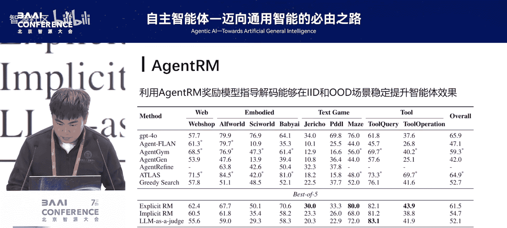

**什么是泛化性？** 我们希望智能体大模型能够在多种环境、多种任务上都能够胜任。然而，目前许多智能体大模型（如GUI Agent、Web Agent、Code Agent）都缺乏这种泛化性，它们只能在有限的环境中运行。我们的目标是像人类一样，迈向通用智能体，实现 **“One for All”**。

为了达成这个目标，需要解决大模型与外部工具交互逻辑静态、不标准、不统一的问题。任何一方的版本变动，都需要重写所有交互逻辑。

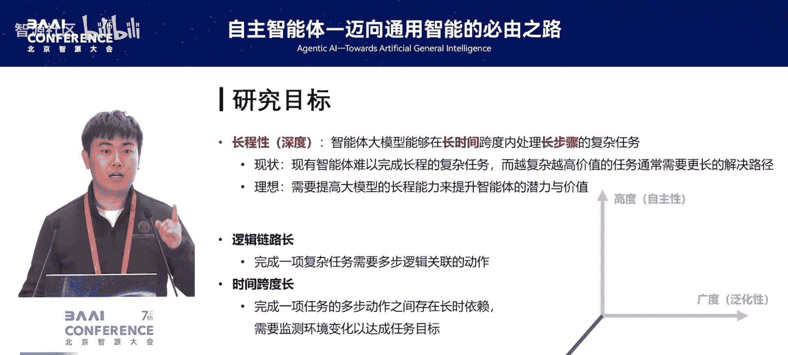

**模型上下文协议（MCP）** 正是为了解决这个问题而提出的。它通过定义一个标准化的协议（类似于电脑的适配器），旨在解决成本过高、不可扩展、交互历史难以复用、设计标准割裂和重复劳动等问题。

因此，面向此问题，我们在最近的MiniCPM模型上实现了MCP能力的增强。这其中有几个关键问题：一是需要搭建一个稳定、全面的MCP环境；二是能让模型在从不同MCP环境反馈的海量信息中获取关键信息，并在规划层进行高质量的推理。

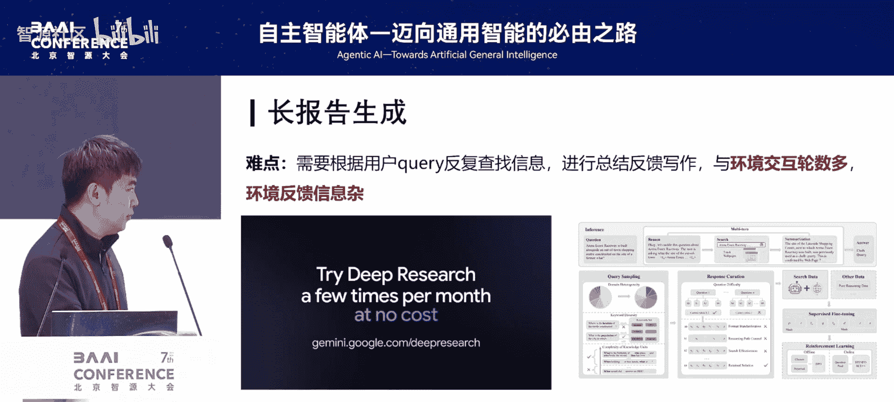

我们的方法是：首先通过数据构造方法，让我们的MCP智能体能够胜任1到2步的MCP工具调用任务；然后通过强化学习训练其长程能力。目前，我们在环境层集成了约15个常见的MCP Server，并从交互过程中定向去除了不必要的冗余信息；在规划层，我们开发了4种稳定的数据构造方法。最终，我们通过SFT和RFT训练了大量数据，在15个工具上的调用能力超过了千问模型，并达到了超过GPT-4的工具使用能力。

---

## 章节 6：实现任务层面的泛化

在此基础上，我们思考下一个问题：有了MCP，我们就足够泛化了吗？答案是不够。MCP只能实现工具层面的泛化。如果我们希望模型拥有任务层面的泛化，仅靠MCP还不够。

因此，我们探索如何让模型实现任务泛化。我们发现，在智能体任务上，**奖励模型比策略模型拥有更强的泛化性**。同样仅在一些特定任务上训练，奖励模型在未知任务上的表现可能超出策略模型20到30个百分点。

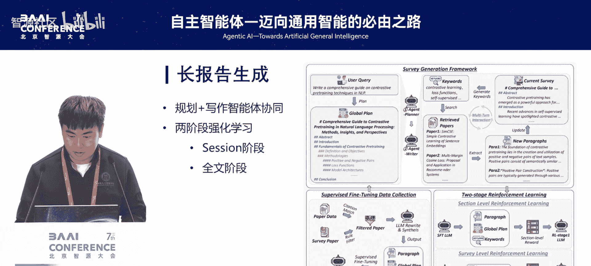

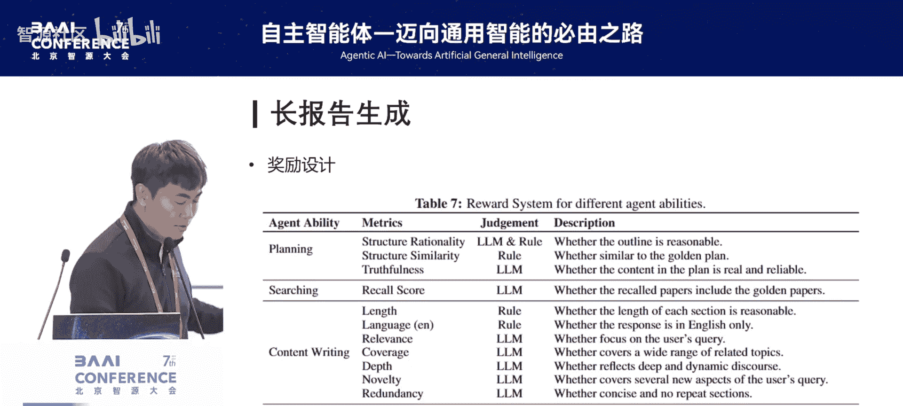

我们最近的工作是通过在环境中动态采样，训练了一个**过程奖励模型**。基于这个奖励模型去引导策略模型解码，发现在特定场景下有稳定的提升，同时在未知场景下也有足够的泛化性。这就是我们所期望的泛化性。

---

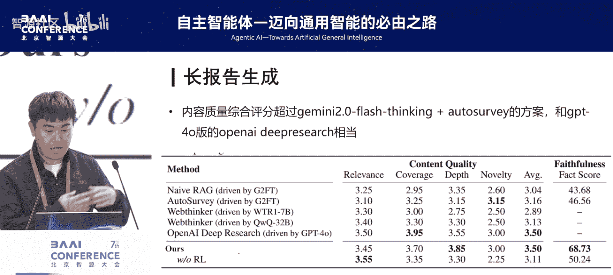

## 章节 7：解决长程任务执行的挑战

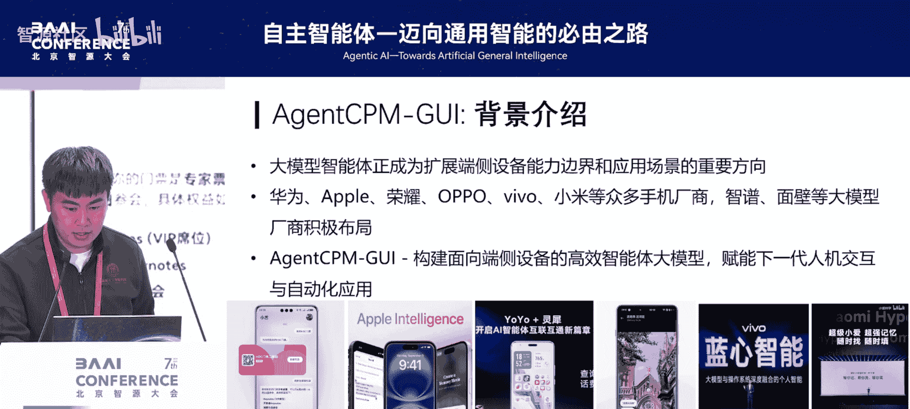

除了泛化性，我们还希望智能体具备足够的**长程性**，即能够在长时间跨度内处理足够多步骤的任务。

目前的现状是，即使单步成功率高达95%甚至98%，当执行步骤达到20或30步时，总体成功率可能只有百分之二三十（`0.95^20 ≈ 0.358`）。这是大模型智能体尚未稳定解决的一个问题。

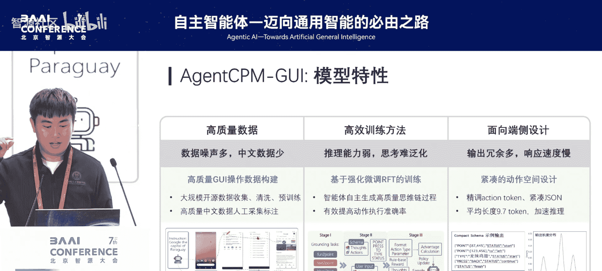

因此，我们希望通过**多步强化学习**来解决这个问题。我们选取了两个具体场景进行探索。

**第一个场景是生成长篇调研报告**。其难点在于需要根据用户查询反复寻找外部信息并进行总结反馈，与环境交互步骤多、信息杂。我们选择此场景的好处在于，它仅涉及一个工具（搜索），可以将执行速度优化到很高，从而规避强化学习框架中的一些挑战（如策略漂移）。目前，闭源模型在此领域表现不错，但大多数开源模型集中在奖励反馈明确、回答简短的简单问答任务上。

我们的总体框架采用一个规划模块和一个写作智能体协同工作。大模型首先规划报告的整体结构，然后通过不断检索论文、总结分析内容，由写作智能体逐段写出，并不断更新报告内容。

在此框架上，我们设计了一个两阶段强化学习方案。在单段落阶段，使用人类撰写的参考文本来评价单段质量；在全文章阶段，使用另一个模型进行全文综合评价。我们的奖励设计覆盖了结构、逻辑、新颖度、幻觉和事实性。最终，我们以一个约80亿参数的模型，在内容综合评分质量上超过了Ernie 4.0版本，与GPT-4相当，并且在事实相关度评价上效果最好。

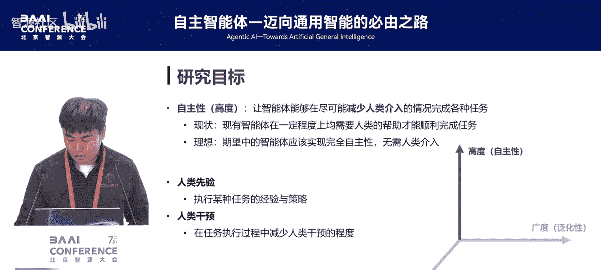

**第二个场景是图形用户界面（GUI）智能体**。相比于报告生成，GUI智能体更为复杂，它是一个多模态场景，交互方式是通过模拟点击进行。这需要模型较好地理解所有GUI控件和不同的应用程序。

面向此场景，我们开发了 **Agent-CPM for GUI**。主要贡献有三点：一是面向中英文场景构建了非常高质量的数据集，集成了目前市面上所有GUI场景数据并过滤了噪声；二是通过强化微调让模型学会在GUI场景下进行深度推理；三是面向端侧设计了一个紧凑的交互模式，极大加速了端侧解码速度。

具体来说，我们对MiniCPM模型继续预训练，从OCR、图标理解、图标检测三个方面增强了其基础视觉理解和GUI grounding能力。在此基础上，我们构建了安卓操作轨迹的SFT数据，包括人工构建的国产安卓系统APP操作数据，以及混合了AITW、Android Control等开源英文数据。我们对数据进行了仔细清理。最后，在SFT基础上，我们让模型尝试输出思考过程，并通过一个奖励模型引导大模型通过强化学习生成高质量的思考过程。我们的奖励包括动作执行成功率奖励和动作参数奖励。

通过这套方法，我们能够在所有中英文GUI基准测试（如Android Control、AITW、Mind2Web及中文APP）上都取得了领先的效果，超过了如UI-Task、千问等一系列GUI模型。

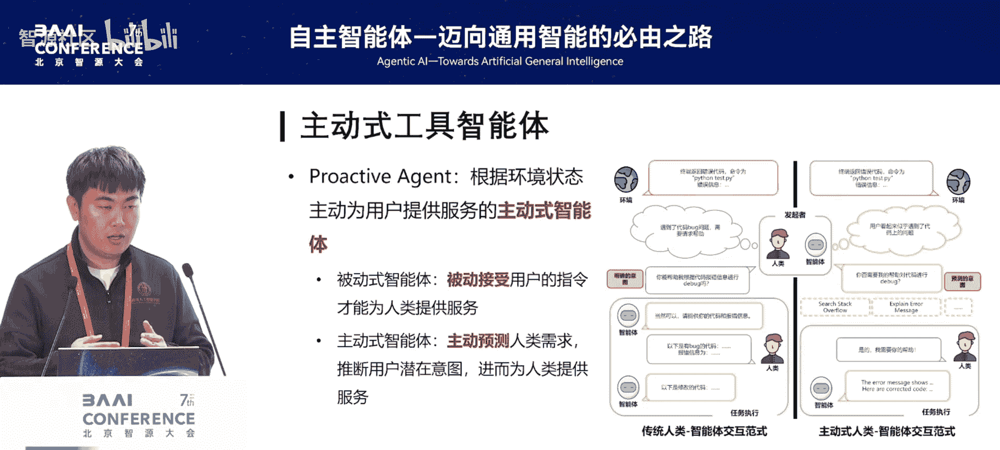

---

## 章节 8：迈向主动式智能体

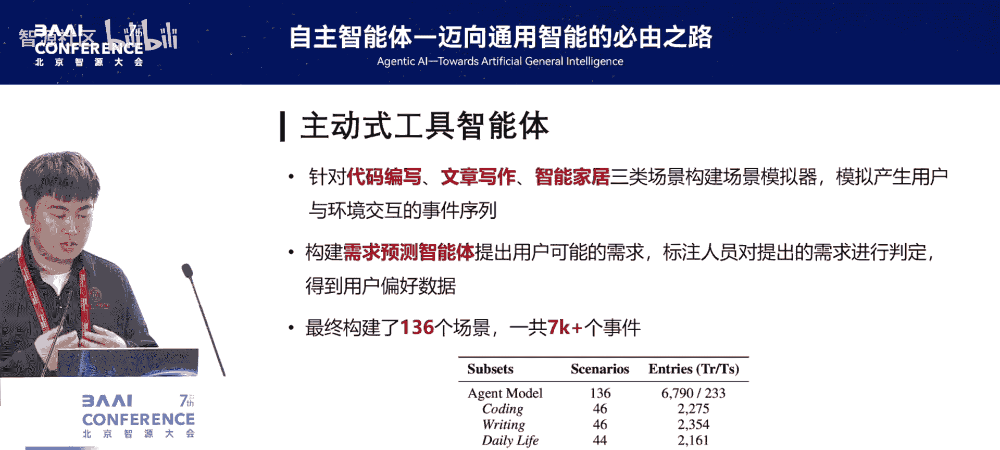

最后，我们还关注一点：我们希望智能体能够在尽可能减少人类介入的情况下完成任务。第一，它不需要很多人类先验知识；第二，它也不需要人类频繁干预。

为此，我们探索了**主动式工具型智能体**。目前大多数智能体都是被动式的，即需要人类给出指令，它才能理解并服务。什么是主动式智能体？我们希望它能够比较主动地预测人类需求。例如，当我拿起手机，它能感受到我要拍照而自动打开相机APP；或者中午12点我打开手机，它知道我想点一份黄焖鸡米饭而自动弹出推荐。

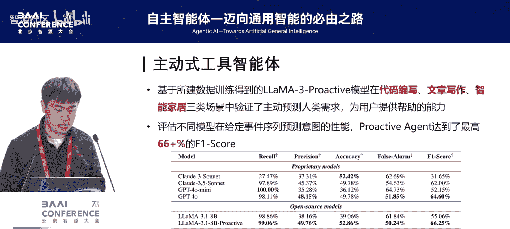

为了达到这一点，我们希望智能体能够理解环境，并根据环境中发生的事情主动预测人类需求。面向此场景，我们构建了一个基于环境模拟的主动式任务数据生成场景。该场景包含三个模块：环境模拟器、主动式智能体和用户智能体。环境模拟器根据要求模拟特定环境，为智能体提供沙盒条件；主动式智能体通过环境信息预测用户意图并生成预测任务；用户智能体模拟用户行为，并对主动智能体提出的任务反馈是否合理。

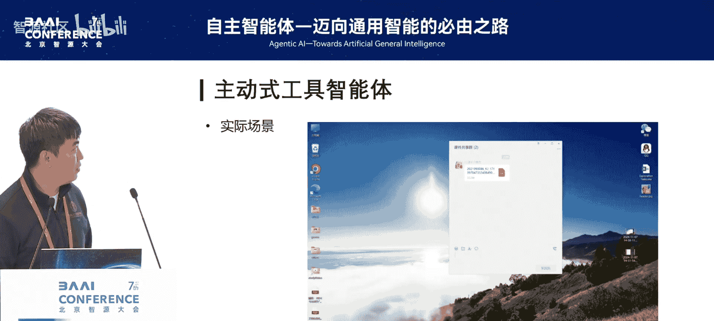

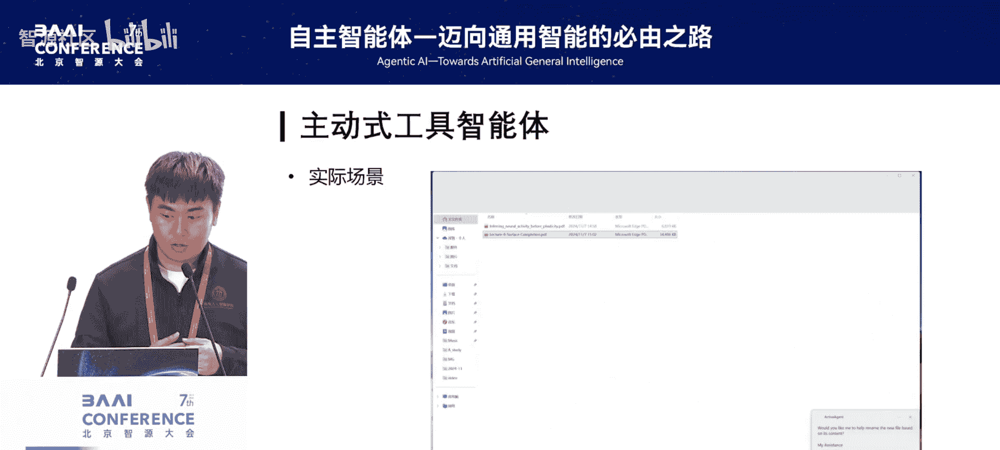

具体来说，我们针对代码编写、文章写作和智能家居三个场景构建了场景模拟器，模拟用户与环境交互的事件序列。在其中，我们可以构建需求预测智能体，提出用户在某个事件发生时可能有的需求，最后让标注人员判定需求合理性，得到训练数据。我们最终构建了136个场景，共7000多个事件。基于这些数据训练的LLaMA-Proactive模型，在三个场景中都验证了其主动预测人类需求的能力，其预测性能超过了包括Claude、GPT-4在内的一系列模型，达到了最高的66% F1分数。

一个具体案例是：当我在课件共享群收到一份课件时，模型能够主动理解到我可能需要将课件保存到特定位置，并重命名为我以后能理解的名字。如果智能体能够主动做到这一点，我就不需要布置任务，我们训练的主动式智能体就能完成目标。

---

## 总结

本节课中，我们一起探讨了大模型自主智能体的发展路径。我们从工具学习的基础范式（示范学习、教程学习、探索学习）出发，介绍了团队在构建工具使用能力、提升模型泛化性（通过MCP和任务泛化）、解决长程任务执行挑战（通过多步强化学习应用于报告生成和GUI交互），以及探索主动式智能体方面的系列工作。这些探索旨在持续推动大模型自主智能体的能力，使其向着通用人工智能（AGI）的目标迈进。