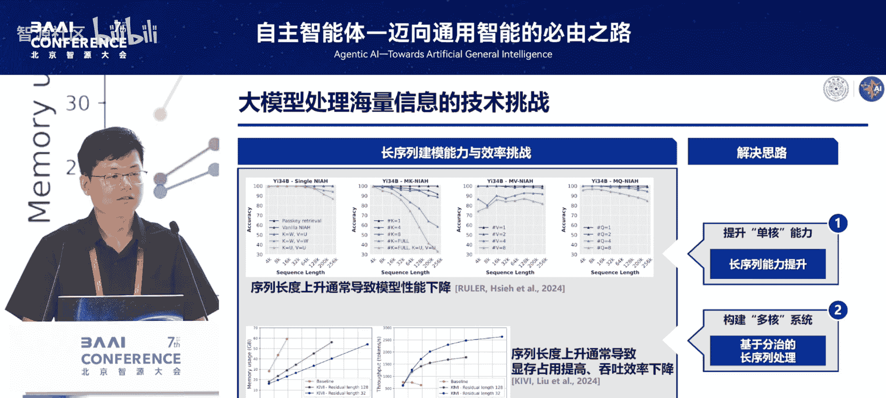
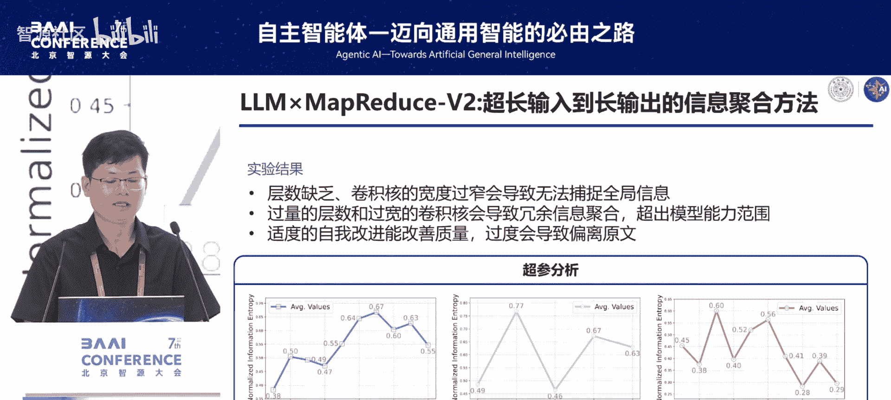
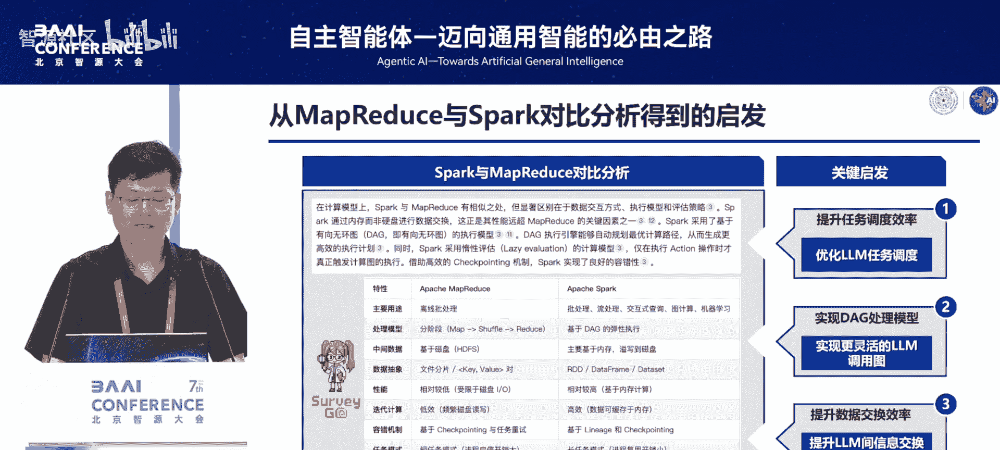
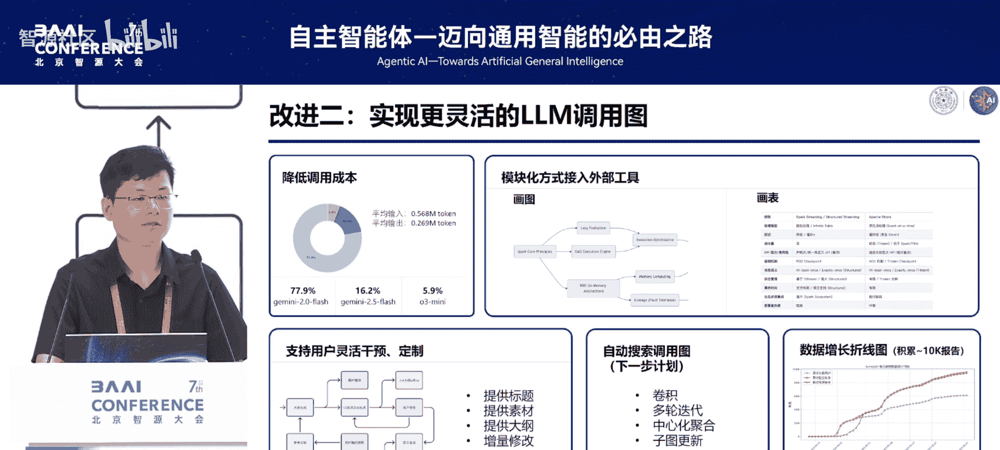
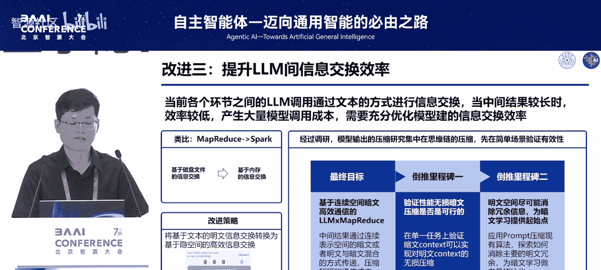
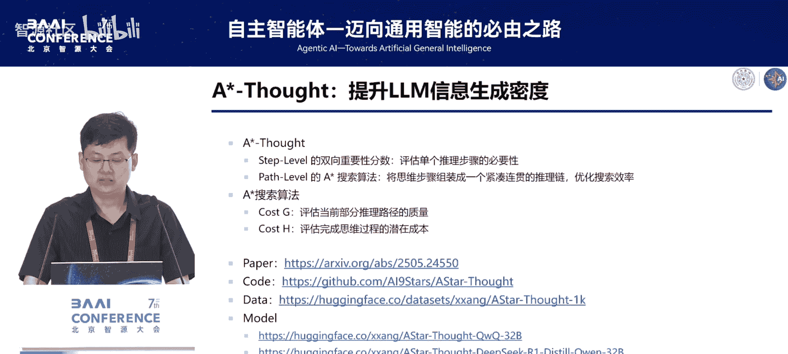

# 自主智能体——迈向通用智能的必由之路-p05-LLMxMapReduce--基于分治思想的长序列处理：王硕

在本节课中，我们将学习如何将大数据领域的经典思想——MapReduce，应用于大语言模型（LLM）的长序列处理任务中。我们将探讨其核心原理、面临的挑战、提出的解决方案，以及如何进一步优化其效率。

## 概述

大语言模型在处理超长文本时面临性能下降和计算开销巨大的挑战。为了解决这些问题，我们借鉴了大数据领域的MapReduce分治思想，提出了LLM x MapReduce框架。该框架将长文本切分为片段，由多个模型实例并行处理，最后汇总结果，从而实现对任意长度文本的高效处理。

## MapReduce的历史回顾

在正式介绍我们的工作之前，让我们先花一点时间回顾一下大数据领域的MapReduce。

MapReduce诞生于21世纪初，源于数据量的爆炸式增长。像谷歌这样的公司需要处理海量的网页和用户日志，这远超当时传统单机处理的能力。为了解决这个问题，谷歌的工程师借鉴了Lisp函数式编程语言中的`map`和`reduce`两个操作原语，设计出一个能够大规模并行处理的计算框架。

*   **`map`操作**：将输入数据进行转换，生成一组中间键值对。
    *   **公式/代码表示**：`map(input) -> list<key, value>`
*   **`reduce`操作**：将具有相同中间键的值聚合起来，得到最终结果。
    *   **公式/代码表示**：`reduce(key, list<value>) -> final_result`

这种分而治之的思想配合容错机制和廉价的商用机群，使得谷歌能够高效处理大规模数据。

## 大模型时代的长序列挑战

现在，让我们把视线拉回到大模型时代。大模型的能力越来越强，但它们也面临着和当年大数据系统非常类似的挑战，那就是如何处理长序列信息。

首先，在输入端，当文本序列变得非常长时，现有模型的性能会显著下降。例如，在“大海捞针”实验中，随着序列长度从几千增加到几十万，模型的准确率会出现明显的下降。模型在长篇大论中会迷失方向。

同时，长序列的处理也带来了巨大的计算开销。序列越长，对显存的占用就越高，而处理的效率则会急剧下降。

面对这样的问题，我们很自然地有两个解决思路：
1.  提升大模型单核的能力，即训练一个具有长序列处理能力的模型。
2.  构建一个多核系统，使用基于分治的思想，让多个模型相互配合来完成长序列处理。

我们的工作主要关注第二点，即基于分治思想的长序列处理。

## 分治思想的直接应用与挑战

将分而治之的思想应用到长文本处理任务上是非常直接的。我们可以把一篇长文档切分成若干个短的片段，然后让模型分块去读，最后再把结果汇总起来。

这样做有一个好处，就是它的可扩展性比较强，理论上可以支撑任意长度的输入。

但是，它也同样存在很多劣势。主要的问题在于，通过这种切割操作，很可能会破坏掉原文中跨片段的关键信息。例如，一个事件的完整逻辑链条可能分散在好几个片段里。如果模型只看到其中部分片段，可能会产生断章取义的问题，从而导致错误的结论。

具体来说，这种断章取义的问题主要分成两类：
1.  **跨片段依赖问题**：多个片段的信息相互依存，需要综合起来才能得到答案。
2.  **跨片段冲突问题**：即使是回答同一个问题，看不同的片段时可能得到不同的结论。

为此，我们分别提出了结构化通信协议和上下文知信度校准这两个技术来缓解这两个问题。

## LLM x MapReduce 框架介绍

基于以上的分析，我们正式提出了LLM x MapReduce框架。

以下是该框架的工作流程：
1.  **切分**：首先将一篇长文本切分成多个片段。
2.  **Map阶段**：让大模型像大数据领域的Mapper一样，从每个片段中抽取出结构化的信息。我们得到的信息包括：`answer`（答案）、`COT`（思维链理由）以及对应的`confidence`（知信度分数）。如果模型认为当前片段不包含任何有用信息，该片段会被直接丢弃。
    *   **公式/代码表示**：`map(fragment) -> {answer, CoT, confidence}`
3.  **Reduce阶段**：让这些结果被模型逐次聚合成最终的结果。
    *   **公式/代码表示**：`reduce(list of {answer, CoT, confidence}) -> final_answer`

## 框架效果与实验分析

上一节我们介绍了LLM x MapReduce的流程，本节中我们来看看它的实际效果。

我们在长文本评测基准“大海捞针”上进行了全面测试。无论是搭配当时知名的开源模型（如Llama、千问），还是基于我们自研的模型MiniCPM，该框架都可以取得非常好的效果。并且，即使仅基于一个4B的模型，其效果就可以媲美当时像Kimi、GPT-4这样的模型在长序列任务上的评分。

此外，我们还进行了一系列的对比实验和分析：
*   **组件消融实验**：验证了知信度校准和结构化通信协议这两个组件的有效性。分别去掉它们，模型性能都会出现明显下降。
*   **超长序列处理**：展示了处理超过100万token（这里是128万）时的表现。即使处理如此超长的序列，该框架仍然具有良好的信息召回和处理能力。
*   **分块大小分析**：发现分块较小时，信息过于碎片化，质量较低；随着分块增大，效果逐渐上升。
*   **推理速度对比**：我们的方法在不同GPU数量下，完成同样长度序列处理所需的时间，相比于模型直接推理或其他主流方法（如Long Agent、Chain of Agents），都有更高的处理效率。
*   **冲突解决示例**：展示了当不同片段答案冲突时，知信度校准确实能帮助模型确认最终的正确答

## 从推理到训练：yramidLine数据生成方法

在探索如何使用分治思想进行推理之后，我们也进一步思考能否将这种思想用于训练阶段，特别是生成高质量的对齐数据。

目前主流的长文本数据生成方法主要有两类：
1.  **全局生成**：如LongBench，基于全文内容生成问答，考察全局信息整合能力。
2.  **局部生成**：如Instruct2，从文档局部片段中生成问答，关注细粒度信息感知。

为了结合二者的优点，我们提出一个新的数据生成方法，叫做PyramidLine。它的核心思想是：首先用大模型将一篇长文档处理成一个具有层次化结构的金字塔树状结构。这个树的叶子节点对应每个原始片段，而上层节点则是对下层的概括和总结。

有了这样一个结构之后，我们就可以在不同层级进行采样来生成问题：
*   在**根节点**采样，类似于LongBench，生成全局性问题。
*   在**叶子节点**采样，类似于Instruct2，生成细节性问题。
*   在**中间层次**采样，可以生成不同粒度的问题。

实验结果表明，当使用相同的模型进行训练，并使用相同的文档进行数据合成时，PyramidLine确实具有更好的数据合成质量。

## 迈向更复杂的任务：从长输入到长输出

前面讨论的框架主要解决的是“长输入到短输出”的任务。但我们感觉这还不够实用，因为大数据领域的MapReduce处理的是PB级数据，而我们最多只做到了百万token级别的合成任务。

那么，能否在真实场景下进一步发挥分而治之的处理潜力？通过调研，我们发现还有一类更复杂的任务适合这种场景，即“超长输入到长输出”的应用。典型的例子是根据海量的参考文献来生成一篇信息密度高、忠于原文的长篇综述。

这个问题的核心挑战主要有两点：
1.  **资源收集**：如何更好地找到需要的素材。
2.  **资源利用**：有了素材之后，如何更好地利用它们。

在资源利用的角度上，主要有两类范式：
*   **抽取式**：从资源中抽取片段使用。风险是可能遗漏细节，且缺少全局抽象。
*   **聚合式**：我们采用的方法。类比CNN处理图片，每次看局部感受野，通过逐层卷积获取高级全局特征。

我们的设计是：通过`map`操作进行单篇素材的理解，然后通过反复的`reduce`（类比卷积神经网络）来得到全局特征。具体做法是：第一阶段获得对每一篇素材的理解；第二阶段通过多层累积的卷积式时间池化来得到高级结构。为了保证信息在多层累积过程中是提升而非损耗的，我们引入了信息熵评估方法来指导中间过程。

为了评测这类任务，我们构建了一个新的评测集SurveyEval。它是计算机领域首个将大量学术综述与其引用的参考文献全文匹配出来的数据集，包含384篇综述和超过26000篇去重后的参考文献，在输入长度和参考文献数量方面都提出了更高挑战。

自动化评测和人工评测结果都显示，我们的MapReduce V2方法在内容质量、引用准确率和信息密度方面都具有显著优势。

## 从MapReduce到Spark：框架的演进与优化

报告的前半部分我们主要介绍了LLM x MapReduce。但就像开头提到的一样，在大数据领域，MapReduce也有其固有的局限性，这些局限性催生了后续像Spark这样的改进产品。

我们对Spark与MapReduce进行了分析，发现Spark主要从以下几个方面进行了改进：
1.  使用内存计算代替磁盘I/O，提升数据交换效率。
2.  采用基于有向无环图（DAG）的执行模型，调度更灵活高效。
3.  惰性评估和长任务模式，优化了资源使用。

这些优势启发我们从三个方面改进我们的MapReduce系统：
1.  提升任务调度效率。
2.  实现DAG处理模型。
3.  提升数据交换效率。

### 任务调度优化：从批处理到流处理

我们最初的服务采用和MapReduce一样的批处理模式，用户提交任务后可能需要等待数小时。我们进行了重构，将大量批处理任务拆分成了队列式的流处理。经过优化，大部分环节的运行时间大幅缩短，目前用户提交任务后，响应时间最快可以达到10分钟左右，带来了更好的用户体验。

### 实现更灵活的调用图：基于DAG的弹性执行模型

当前的工作流在很大程度上还是一个固定的线性流程，缺乏灵活性。我们正在将整个算法解耦，从一个固定的线性结构改造成一个基于DAG的弹性执行模型。把每一个环节都封装成独立的模块，这样可以通过灵活的算法策略，并支持在中间过程引入人工干预，来实现整个工作流的自动搜索和人工定制。

这种模块化设计带来了很多优势：
*   **成本与效率优化**：可以将简单任务分配给便宜或较弱的模型，复杂任务分配给更强大的模型。目前线上系统有77.9%的任务仅使用中小型模型即可完成。
*   **工具集成**：可以更好地接入外部工具，进行画图或制表等操作。

### 提升信息交换效率：从明文到“暗文”

在我们的框架中，不同阶段的大模型通过文本来传递信息。当中间结果很长时，这个过程效率非常低，产生大量的token消耗和调用成本。这好比MapReduce基于磁盘文件交换数据，而Spark基于内存交换数据。

我们思考能否提升大模型之间信息交换的效率，即从“明文”传递转向更高效的“暗文”（如向量）传递。这样做的好处明显，但目前技术还比较初步。因此，我们决定先探索如何在明文空间进行冗余信息消除，作为迈向“暗文”学习的起点。

## A* Salt：提升思维链的信息密度

这就引出了我们最近的一个工作，叫做A* Salt。这个工作的主要目标是提升大模型信息生成的密度。

经过调研，我们发现目前最先进的“长到短”压缩算法都是在思维链压缩任务上进行实验验证的。因此，我们也选择了这个场景来定位明文空间的关键信息并进行冗余消除。

我们发现冗余信息主要存在于两个层面：
1.  **步骤/词元层面**：需要判断哪些词元具有较高的重要性或信息量。
2.  **路径层面**：需要判断哪些句子或片段对于模型得出最终结论是不可或缺的。

这启发我们设计一个启发式搜索算法，同时兼顾步骤和路径两个级别的信息来消除模型输出的冗余。

### 双向重要性估计

首先，我们需要对思维链中的每一个词元进行重要性估计。我们提出了双向重要性估计（BIS）算法：
*   **注意力层面**：使用注意力权重来计算每个词元的重要性。
*   **模型层面**：使用模型的对数概率来对每个词元进行重要性评估。
*   **结合**：将这两类分数结合起来，得到最终的重要性估计。

### A* 搜索路径优化

仅对单个步骤进行排序是不够的，我们还需要把这些重要的步骤串联起来。这就是我们在路径层面做的A*搜索工作。这个过程就像在一个巨大的搜索空间里进行最优路径查询。整个过程分为初始化、验证和探索三个阶段。

最关键的是如何定义代价函数。我们同时设计了两类代价函数：
1.  **当前代价**：使用一个验证模型来衡量中间思考过程的质量。
2.  **未来代价**：估计在当前步骤上找到正确答案的概率（自信息）。

通过结合当前代价和未来代价，我们完成整个A*搜索过程。

### 实验结果与应用

最终，我们在多个数学推理数据集上对A* Salt进行了验证。我们计算了ACU指标（准确率与生成长度的比值）。在不同的模型和推理预算设置下，A* Salt相比于基线方法和其他词元压缩方法，都取得了更优的ACU分数。

特别是在低预算场景下，它既可以提高ACU，也可以提高模型准确率。而在高预算场景下，模型可以更好地降低思维链长度，同时提升信息生成密度。

除了提升推理时性能，A* Salt也可以提升训练效率。使用A* Salt压缩后的训练数据，可以保留思维链中更多的精华。相比于原始数据，训练数据长度可以压缩近70%，训练时间也相应减少20%。更重要的是，使用我们的方法训练，模型的收敛损失更低。

## 总结

在本节课中，我们一起学习了如何将MapReduce分治思想应用于大语言模型的长序列处理。

我们首先回顾了MapReduce的历史，并分析了大模型处理长文本时面临的挑战。接着，我们介绍了LLM x MapReduce框架，它通过切分、Map（信息抽取）、Reduce（结果聚合）的流程来处理长文本，并引入了结构化通信和知信度校准来解决跨片段问题。

然后，我们将分治思想扩展到训练数据生成（PyramidLine）和更复杂的“长输入到长输出”任务（如生成综述），并展示了良好的效果。

最后，我们探讨了从MapReduce到Spark的演进思路对我们的启发，并介绍了在任务调度、执行模型和信息交换效率（特别是通过A* Salt提升思维链信息密度）方面的优化工作。

整个历程体现了从经典计算思想中汲取灵感，结合大模型特点进行创新，并持续迭代优化以解决实际问题的研究路径。