# 自主智能体——迈向通用智能的必由之路-p06-大模型群体协作的高效化机制：钱-忱

在本节课中，我们将学习大模型驱动的智能体如何进行高效的群体协作。我们将探讨智能体协作面临的成本挑战，并从通信协议、协作模式和推理过程三个层面，深入分析实现高效协作的核心机制与未来方向。

## 智能体的定义与能力延伸

上一节我们介绍了智能体的基本概念，本节中我们来看看其具体定义和能力。

智能体通常指由大模型驱动的系统。大模型本身擅长“快思考”，即处理封闭式任务。而智能体则利用长程规划、工具学习和长短期记忆，进行开放式的“慢思考”。

智能体的能力已远超传统模型。例如，给定“预测北医三院附近常驻人口及疾病流行率”的任务，智能体可以自主进行网页搜索、信息采集与总结，最终生成完整的分析报告。这表明，大模型不仅让计算机学会了语言处理，更通过序列化模式延伸出规划、工具使用及协作等高级能力。

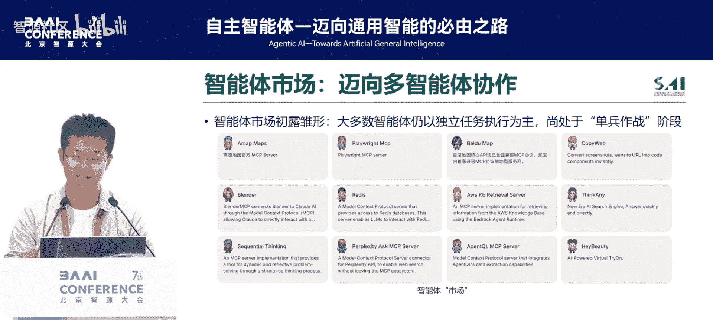

## 智能体市场的兴起与协作的必要性

理解了智能体的能力后，我们来看看当前智能体生态的发展。

模型上下文协议（Model Context Protocol, MCP）的出现，极大地促进了智能体工具生态的开放性和共享性。这使得智能体的构建变得更加容易。目前，智能体市场正在飞速扩张，相关研究论文数量激增。

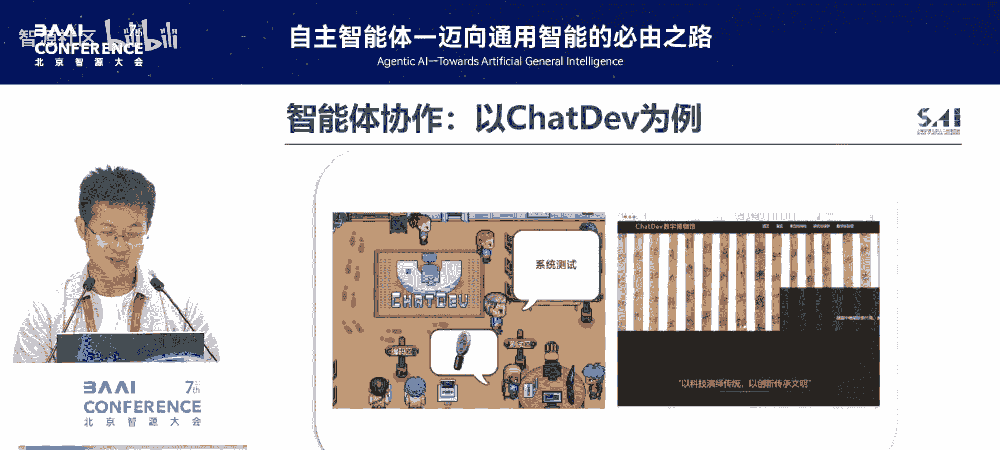

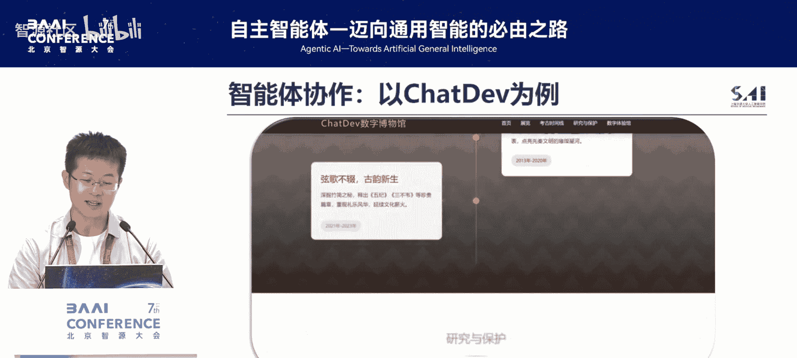

面对市场上众多的智能体，下一步的关键在于模拟人类团队的工作模式：**各取所长，分工协作**。通过群体协同，实现优势互补，共同拓展可完成的任务空间，释放大模型群体智能的潜力。

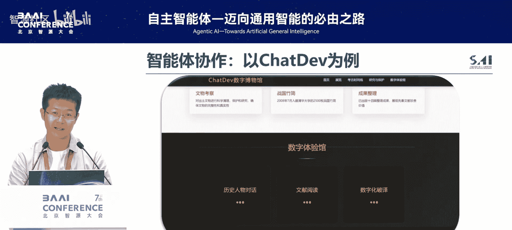

## 协作的可行性及其代价

智能体协作已被证明是可行的。例如，在开发“清华简”网页的任务中，多个智能体可以自主分工，完成编程、测试和文档撰写，最终生成可用的动态网页。

然而，协作并非没有代价。研究发现，在多智能体全连接协作的最坏情况下，其通信的token消耗复杂度高达 **O(N³)**，其中N为智能体数量。这种指数级增长的成本，使得协作在现实应用中可能效率低下。

因此，我们面临一个核心问题：**智能体协作的性价比**。这决定了其未来落地的广度。性价比可以定义为：

**性价比 = 任务完成性能 / 协作开销**

由于性能较难直接控制，我们的优化重点在于降低协作开销，即公式中的分母。

## 实现高效协作的三个方向

为了降低协作成本，我们需要分析成本产生的主要环节：

1.  **通信协议**：智能体间信息交互的消耗。
2.  **协作模式**：任务分配与调度的效率。
3.  **推理试错**：多轮迭代产生的资源浪费。

对应地，我们可以从以下三个方向进行高效化探索：

### 方向一：高效的交互——精简通信协议

智能体间的信息传递无需像人类社交一样包含大量寒暄。核心思想是：**信息交互的字数不在于多，而在于达意**。

例如，决定编程语言的冗长对话，可以精简为四个关键词的传递。研究表明，通过提示（Prompting）让智能体使用JSON、XML或代码等**非自然语言**进行交流，不仅能大幅压缩上下文长度，有时还能提升任务性能。

更进一步，我们可以通过训练将高效的交流模式注入模型参数。例如，使用SFT或DPO方法，让智能体学会在交互中自动精简语言。实验表明，这种方法在提升效果的同时，能减少约79%的token消耗。

### 方向二：高效的路由——优化协作架构

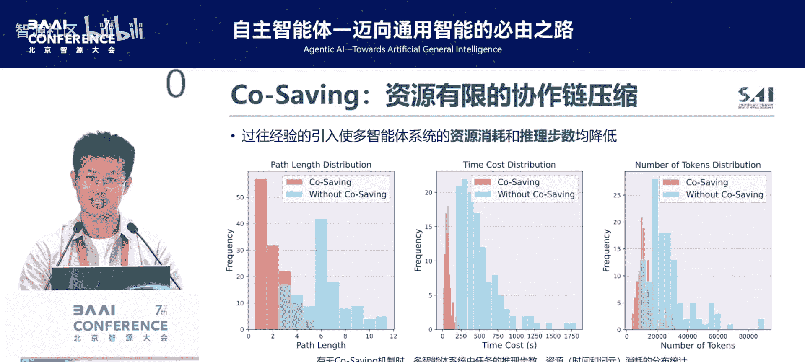

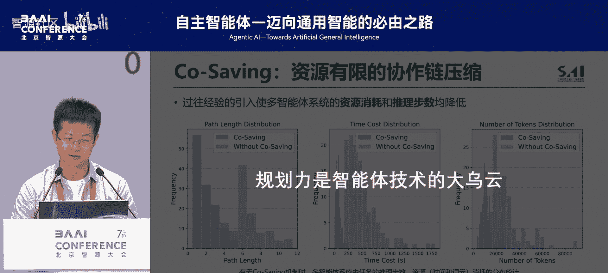

教会智能体高效说话后，还需教会它们高效协作。灵感来源于人类团队中的管理者（如导师），能够进行中心化编排，动态分配任务。

我们可以训练一个中心化的**调度策略（Policy）**，它像一个“提线木偶”的操控者，根据当前任务状态，动态决定下一步调用哪个智能体。其优化目标（Reward）是任务准确性与低消耗的结合。

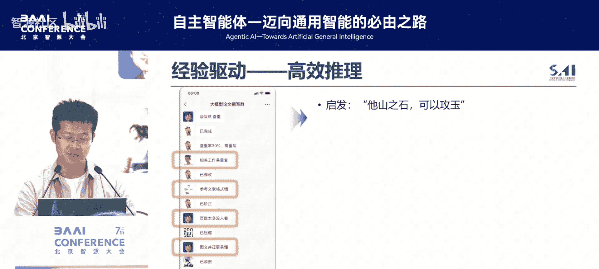

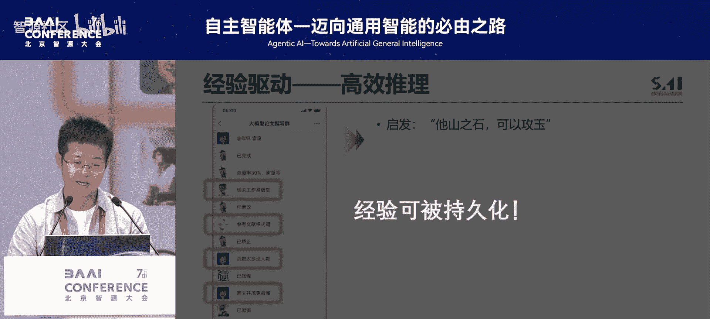

这种方法能实现组织结构的动态精简。系统会在协作过程中逐渐淘汰表现不佳的智能体，最终可能仅用一两个核心智能体就能完成任务，从而极大提升效率。

另一种思路是构建**多智能体思维链**，让智能体自身动态决定下一步路由到谁，跳过中间无效环节，形成高效的协作路径。

### 方向三：高效的推理——减少试错成本

智能体在协作中会产生许多试错经验。这些经验可以被持久化并复用，从而加速未来推理过程。

具体方法是构建**多智能体经验库**。每个智能体将自己推理过程中奖励（Reward）高的步骤存储下来。在后续任务中，智能体可以检索并借鉴这些成功经验（Few-shot Learning），使整个群体更快收敛，减少推理轮次和资源消耗。

另一种思路是“一步到位”的编排，即用大模型一次性生成整个多智能体协作的工作流（Workflow），并将其线性化为代码。这相当于提前规划好最优协作路径，直接执行，从而降低动态调度的开销。

## 总结与未来展望

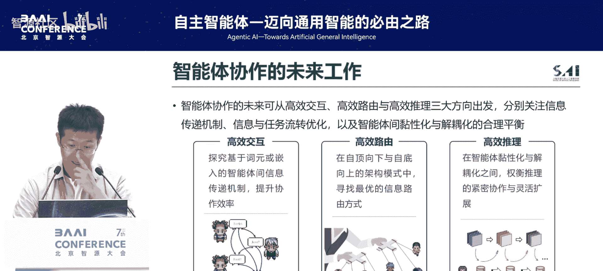

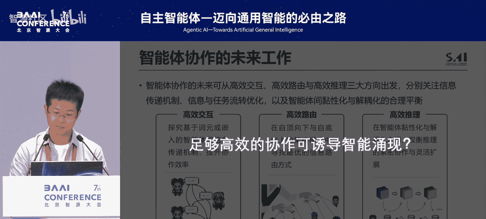

本节课中我们一起学习了提升大模型智能体群体协作效率的三大核心方向：

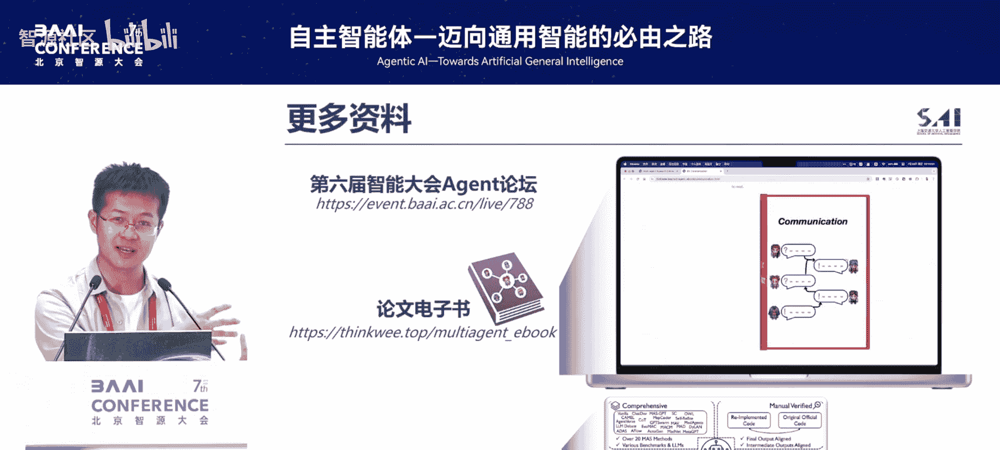

1.  **高效的交互**：通过压缩和聚焦信息流，提升单次交互的有效信息负载。
2.  **高效的路由**：通过中心化或链式架构设计，实现智能体的动态、灵活调度。
3.  **高效的推理**：通过沉淀和迁移推理经验，减少试错，加速收敛。

展望未来，仍有诸多开放问题值得探索：
*   **交互层面**：能否超越token，直接使用向量嵌入（Embedding）进行更底层的通信？
*   **路由层面**：能否实现自底向上的、去中心化的自主组织与协作？
*   **推理层面**：如何降低智能体对特定团队的“粘性”，使其经验能像人类一样在不同团队间迁移复用？

高效化机制的本质，是对“智能体数量-系统智商”曲线进行压缩。极致的压缩可能引发**群体智能的涌现**，即用极少数的智能体达成庞大群体的智能水平，这将是未来令人期待的研究方向。