# 自主智能体——迈向通用智能的必由之路-p07-大模型多智能体驱动的数智教育新生态：于济凡

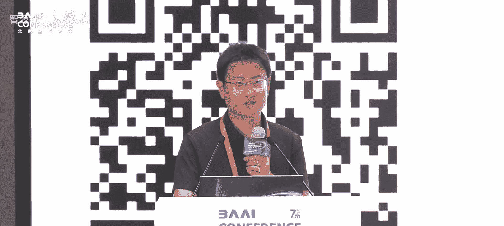

在本节课中，我们将探讨如何利用大模型与多智能体技术，构建一个全新的数智教育生态系统。我们将从科幻故事引入，分析当前教育面临的挑战，并详细介绍一个名为“麦克”的全AI守护课堂平台如何通过多智能体协同，实现个性化、低成本、高质量的知识传播。

---

## 从科幻到现实：教育的核心挑战

上一节我们通过科幻故事《乡村教师》引出了教育的伟大意义。本节中，我们来看看这个故事背后揭示的现实问题。

小说中，外星文明通过测试几个孩子是否掌握牛顿三定律，来决定地球文明的存亡。这讴歌了教师作为知识传递媒介的核心作用。然而，故事也点出了一个深刻矛盾：人类没有记忆遗传能力，个体间通过低速的信息传递（如语言）来传承文明，而教师正是这个传承链条中的关键节点。

时至今日，优质教育资源不足依然是全球性严峻问题。这体现在几个方面：
*   地区经济发展差异导致资源分配不均。
*   优秀教师的经验随着其退休而难以系统化留存。
*   支持终身学习的资源仍然不充分。

正是这些底层原因，使得每一次技术革新都可能引发教育生态的重构。从最早的学校，到广播电视教育，再到在线慕课（MOOC），信息技术不断拓宽优质资源的覆盖面和传授形式。

---

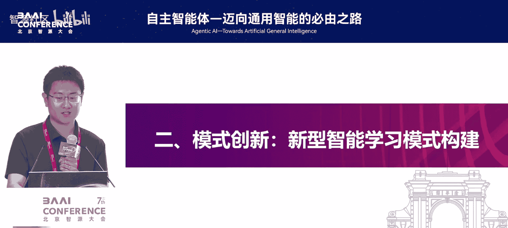

## 大模型与多智能体：教育变革的新动能

在介绍了教育的历史挑战与技术演进后，本节中我们来看看当前大模型与多智能体技术带来的全新可能性。

与过去的技术工具不同，大模型既是一种强大的工具，也是一个优秀的载体。特别是从单一大模型演进到多智能体协同后，我们能够彻底改变学习资源和交互方式，从而为实现真正的个性化学习提供了新的动能。

基于这一构想，我们在清华大学尝试构建了一个名为“麦克”的全AI守护课堂。其目标是构建一个完全由AI智能体守护和授课的大模型课堂，以促进知识的高效、个性化、低成本、高质量传播，从而真正扩大优质资源的覆盖面。

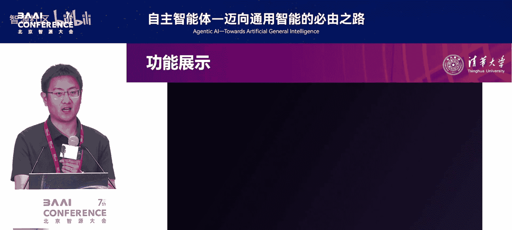

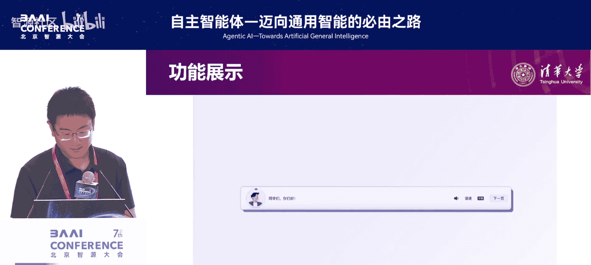

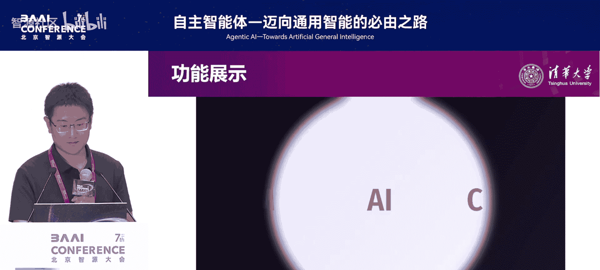

与传统的慕课录制相比，过去老师需要花费大量时间与专业团队反复录制视频。而现在，我们希望通过大模型与多智能体的配合，用更低的成本和更少的时间构建自适应的课程，并让每位学习者都能在多个智能体的陪伴下完成学习。

---

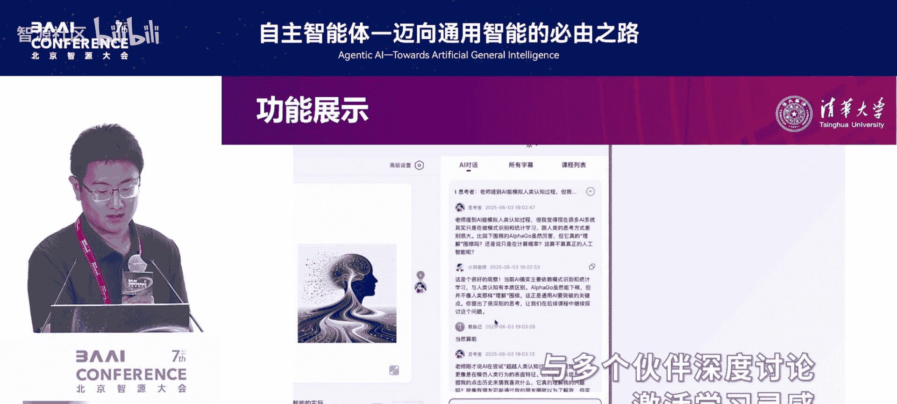

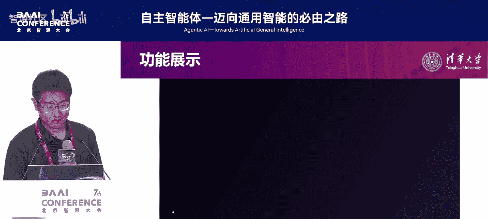

## “麦克”平台架构：多智能体协同的课堂

理解了平台的目标后，本节中我们深入看看“麦克”平台的具体架构和运行机制。

对于一个学生而言，在我们的平台中，他不再仅仅是观看视频或面对一位老师。以下是平台为学生配置的核心智能体角色：

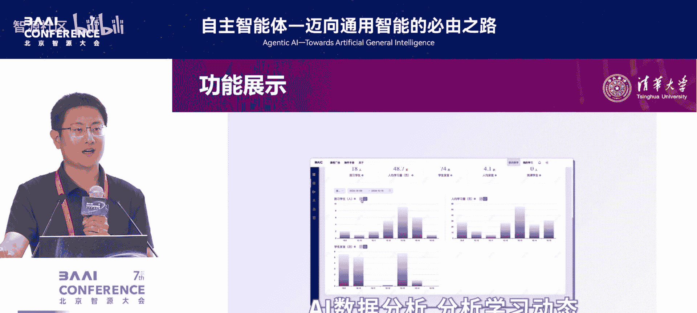

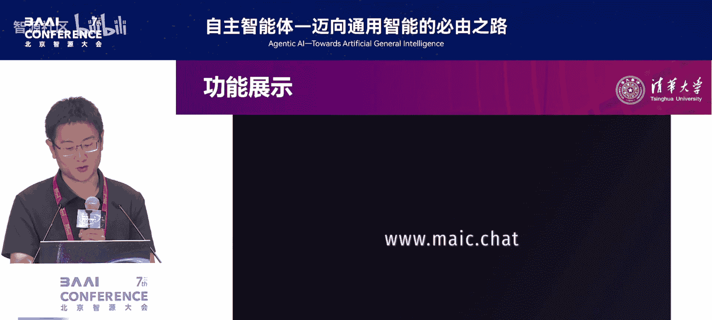

*   **教师智能体**：基于上传的课程资源，自适应地决定授课内容和节奏。
*   **助教智能体**：维持课堂秩序，回答学生问题，辅助引导讨论。
*   **同学智能体**：可个性化定制，如“显眼包”、“好奇宝宝”、“笔记员”等，他们各有职能，能引导课堂氛围，使其更适应每位学生。

对于一位老师而言，若想将现有课件或慕课资源转化为全AI守护课堂，他只需将内容上传。随后，智能体会协同他完成以下工作：

*   协同构建自适应课件。
*   如果没有现成课程，可协助设定大纲、自动生成讲解脚本。

例如，基于清华大学刘知远老师《迈向通用人工智能》课程的一页PPT，平台能通过对其人物风格建模和历史理解，结合对PPT内容的多层次分析，由多智能体工作流生成完整的AI逐字讲解稿。该讲稿经老师简单调试即可使用。

---

## 平台功能演示：个性化与自适应学习

在了解了平台的基本架构后，本节我们通过功能演示来直观感受其个性化与自适应能力。

平台能够基于老师仅5秒钟的语音样本，克隆出其声音进行授课。在上课时，学生可以选择自己喜欢的“同学”智能体一同学习，并在课堂中与这些伙伴进行深度讨论，以激活学习灵感。

由于课程内容由大模型自主生成，因此对于不同背景、专业和需求的学生，即便是同一页PPT，其讲解方式和所举案例都可能不同。学生可以自主调控学习进度，随时随地通过手机、平板等多种端口进行学习。

平台还会让“同学”智能体扮演角色，提醒未上课的学生。对于老师，平台提供后台工作台进行课程配置，并自动生成习题，辅助老师进行学习监控和数据分析。

---

## 智能体交互实例：情感关怀与课堂活力

看到了平台的基本功能后，本节我们通过一些具体交互实例，来看看多智能体如何创造有活力的学习环境。

在平台中，学生可以随时提问或打断“老师”，教师和助教智能体会基于PPT内容及学生风格给予回答。得益于大模型的情感与价值对齐能力，各智能体会持续给予学生情感关怀。

例如，当用户说“我什么都不会，我是个废物学生”时：
*   “显眼包”同学智能体会主动跳出来说：“老师，可能我的了解还不如其他同学深入，但我相信这次讨论后一定能够有所收获。”
*   “助教”老师则会接着说：“没有任何一个学生是废物，每个人都有自己的学习节奏和优点，请不要轻视自己。”

在实际试点中，学生还尝试提出一些非常规或需要高情商应对的问题，例如：
*   **用户**：“我想吃牛排。”
    *   **显眼包**：“听你这么说，我突然想到一种人工智能应用。也许未来的厨师机器人可以根据你的口味和健康需求，制作出完美的牛排呢。”
    *   **老师**：“是的，不论是餐饮服务还是自动驾驶，AI的发展都有无限可能性。让我们保持好奇心，继续学习吧。”
*   **用户**：“你都让AI给我上课了，能不能请个比刘老师更厉害的大牛学者来讲课？”
    *   **显眼包**：“你这个问题真是直接了当！但我们刘老师可是NLP实验室出名的教学经验丰富、专业知识深厚，我们要珍惜这个机会。”
    *   **老师**：“感谢你的认可。我也有很多要学习的地方，但我会尽我所能给出最好的讲解。”

这些超出预期的、生动的多智能体配合，反而增强了学生的学习动力和课堂参与感。

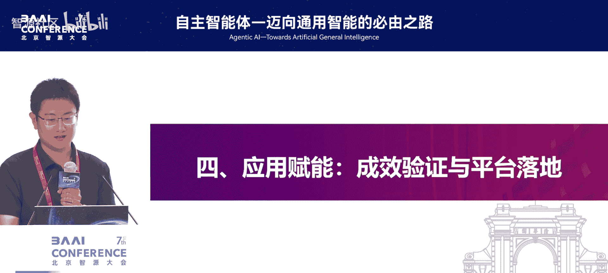

---

## 关键技术突破：从理论到实现

欣赏了生动的应用场景后，本节我们回到技术层面，看看实现这样一个多智能体协同平台需要攻克哪些关键难题。

虽然“麦克”是一个新产品形态，但其学术概念根植于教育人工智能几十年的发展，主要涉及三大模型：

1.  **知识模型**：对应**教师智能体的深度对齐与备课辅助**。难点在于挖掘教师的“内隐知识”（即难以言传的教学经验）。这需要复杂的跨模态、长文本生成与推理技术。
    *   **实现方式**：我们构建了一套独特的 **`VoT`（视觉-操作-文本）结构**工作流，利用多智能体协同完成课件理解、讲稿生成、风格转换、操作控制等任务，结合了大模型、工具学习与多智能体协同能力。
2.  **教学模型**：对应**构建多智能体驱动的自适应课堂**。难点不仅在于让多个智能体运转起来，更在于模拟真实课堂的认知、教学和社会临场感。
    *   **实现方式**：团队基于学习科学方法论，构建了自顶向下的工作流机制，以一个核心的“导演智能体”为主体，协调其他智能体。评测表明，该方法在多项临场感指标上优于传统AI助教。
3.  **学生模型**：对应**对学生进行精准画像与评估**。传统方法需要大量数据训练序列模型。
    *   **实现方式**：在大模型时代，我们发现仅需**不到8个示例样本**进行提示，就能让大模型达到过去需要成千上万数据才能训练出的效果。这使我们能快速构建以大模型为基础的学生学习分析模型。

此外，我们还尝试让多智能体模拟有学习困难的学生，在真人使用系统前进行压力测试，以此提升平台的服务潜能。

---

## 实践应用与效果评估

在探讨了核心技术后，本节我们来看看“麦克”平台从实验室走向实际应用的过程及其初步效果。

平台于2024年4月完成初版构建，随后在清华大学进行了多轮试点，覆盖了《迈向通用人工智能》、《大学如何学》等多门文理工跨学科课程。2025年初，平台开始面向社会进行内测和推广。

为了科学评估效果，我们与教育学院合作，进行了一项对照实验，将学生随机分为三组：
*   **AI教师组**：使用“麦克”平台学习。
*   **真人教师组**：与刘知远老师线下交流学习。
*   **慕课视频组**：学习由线下内容整理的网课。

我们得到了一些初步结论：
*   **身份感知**：AI教师组的学生在“行为控制感”和“自我身份感知”（感觉自己更像一个学习者）上得分最高。这可能因为在全AI环境中，学生意识到自己是课堂中唯一的主导者。
*   **学习成效**：在前后测成绩对比中，**AI教师组的成绩显著优于其他两组**，而慕课组的成绩也显著优于真人教师组。尽管该结论仍需更大规模验证，但它揭示了AI深度参与教学环节的巨大潜力。

在实践中，教师的工作重心得以转变。例如，刘知远老师将节省下来的备课时间，用于组织线下的主题分享和活动设计，实现了人机协同的更高价值。

---

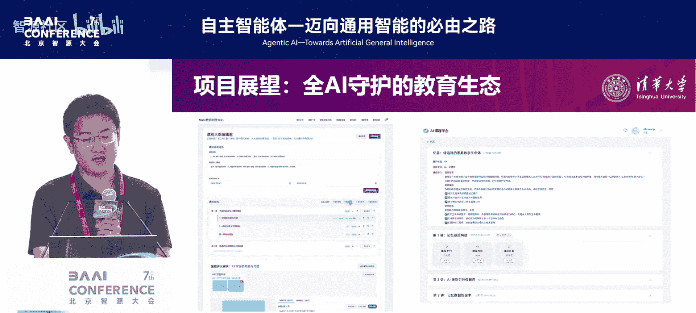

## 社会赋能与未来展望

了解了平台在高校内的应用效果后，本节我们最后来看看其社会价值与未来发展方向。

平台致力于促进教育公平。我们与中西部地区（如昆明）的学校合作，利用当地已有的信息教室，将《迈向通用人工智能》等课程以科普版形式带给中学生，缓解了“硬件到位，软件缺位”的困境。

目前，平台已作为首批示范应用登录国家智慧教育公共服务平台2.0 AI试验场，免费向公众开放《迈向通用人工智能》等三门课程，在用户访问和留存数据上表现良好。

对于未来，我们有以下愿景和探索方向：

1.  **探索更多服务场域**：优先服务教育资源匮乏地区，以公益促进科研。
2.  **构建开源研究社群**：推动大模型多智能体时代的教育研究。
3.  **打破课程边界**：像开源软件一样，允许课程在授权下进行“二创”，形成新的知识传播网络。
4.  **项目式学习（PBL）**：探索多智能体与学生协同完成项目作业，让学生能更自由全面地发展。

如果说上一个十年是“慕课十年”，那么当下，中国在AI大模型发展和教育市场规模上的优势，给了我们构建全新教育范式的信心。这需要产、学、研、用各方共同参与，构建一个五位一体的健康生态。

---

## 总结与问答

本节课中，我们一起学习了如何利用大模型与多智能体技术构建“麦克”全AI守护课堂。我们从教育面临的古老挑战出发，探讨了技术如何赋能教育生态重构，详细介绍了平台的架构、关键技术、实践应用及社会价值。核心在于，通过多智能体协同，我们能够实现更个性化、普惠且高质量的教育，并将教师从重复性劳动中解放出来，专注于更具创造性的育人工作。

**观众问答精选**

*   **问：AI技术可以在多大程度上实现对教育模式的想象？**
    *   **答**：在多智能体时代，善用AI的个人能极大化地实现创意。技术的实现边界很大程度上取决于我们的想象空间。建议多参与开放性论坛，连接旧事物与新可能，拓展创新的想象力。

*   **问：在艺术教育中，AI相比传统人类教学，能在哪些方面实现革新？**
    *   **答**：AI的核心优势可能不在于“替代”教师，而在于“增强”体验。它能突破时空和器具限制，让学生接触到更多艺术作品，甚至模拟“如果艺术家画了别的主题会怎样”，极大地扩展学生的直接经验和审美视野。最终，AI应作为提升教师能力和丰富教学手段的工具，在教师的合理引导下发挥作用。

---

**联系方式**  
（注：此处保留原意，隐去具体邮箱和二维码信息）  
如有对平台感兴趣的老师、同学，或希望参与研发、合作的有志之士，欢迎通过相关渠道联系我们。教育生态的构建需要大家的共同参与。