# 自主智能体——迈向通用智能的必由之路-p08-构建基础智能体的认知引擎：刘邦

在本节课中，我们将学习如何构建一个基础智能体的核心——认知引擎。我们将探讨智能体的基本定义与架构，并深入分析两个关键研究方向：记忆模块的构建与推理能力的增强。课程内容将涵盖从理论框架到具体技术实现的完整路径。

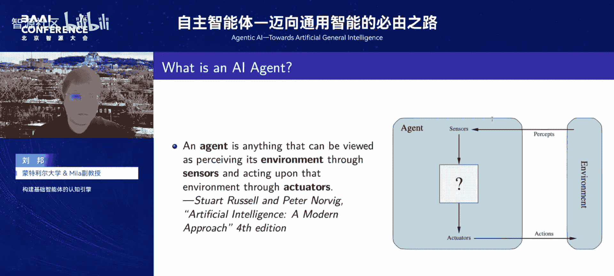

## 智能体的定义与核心挑战

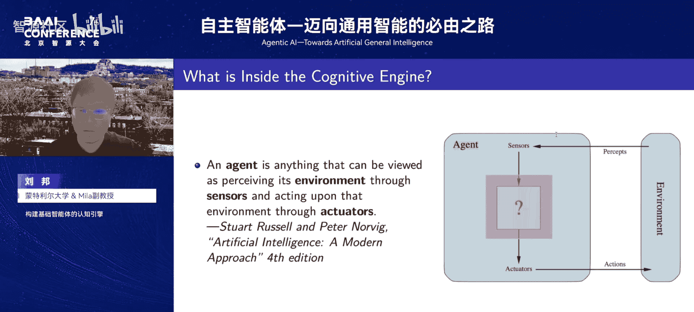

当我们讨论AI智能体时，首先需要明确其定义。经典的教科书《人工智能：一种现代方法》中定义：一个智能体是任何能够感知环境信号并做出决策、执行行动的实体。

其基本框图包含一个环境，智能体通过传感器感知环境信号，经过一个决策过程得出行动指令，并执行该行动。

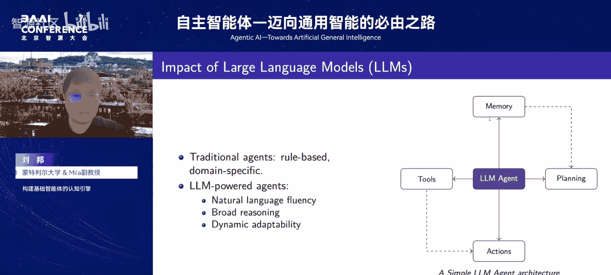

图中的问号代表智能体的认知核心。我们面临的核心挑战是：如何构建这个认知核心？它内部应具备怎样的结构和状态？

上图展示了一个典型的智能体架构。早期智能体可能通过基于规则或领域特定的方式实现。随着大模型时代的到来，AI模型在自然语言理解和推理能力上有了质的飞跃，对不同场景的适应性也显著增强。

基于大语言模型的能力，结合一些核心模块（如记忆、规划、工具使用等），我们可以形成一个非常简易的智能体架构。

当前，关于AI智能体的研究与应用层出不穷。智能体展现出强大的语言模型能力和推理能力。然而，它们依然存在诸多不足，例如安全性、可靠性、复杂推理以及对不同情况的适应性等。

因此，我们需要思考：如何构建一个统一的AI智能体框架？以及如何提升其核心能力，例如终身学习能力、复杂场景下的推理能力、情感支撑下的决策能力以及多模态处理能力？

## 从生物智能中汲取灵感

基于上述动机，我们联合全球20多所院校的研究者进行了一项大规模调研，名为《基础智能体的进展与挑战》。我们的核心想法是：人类大脑是自然界已知的唯一通用智能体。我们希望对比机器智能与生物智能的区别，分析各自的长处与弱点，并致力于构建一个以人为中心、有益社会的AI，促进人机有益合作，并增强其可解释性与透明度。

以下是人类大脑与基于大语言模型的智能体的一些关键区别：

*   **硬件层面**：大脑由生物细胞构成，功耗极低（约20瓦）。而大语言模型需要大规模集群进行训练，推理时也有显著的吞吐量消耗。
*   **意识层面**：迄今为止，我们可以安全地说，基于大语言模型的智能体不具备像人类一样的主观意识。
*   **学习特点**：人类天生具备终身学习和持续学习的能力，并能快速适应新的任务和场景。相比之下，大语言模型在这方面有所不足。
*   **社会性与情感**：人类具有丰富的社会性和情感。相比之下，基于大语言模型的智能体在这方面也略有不足。

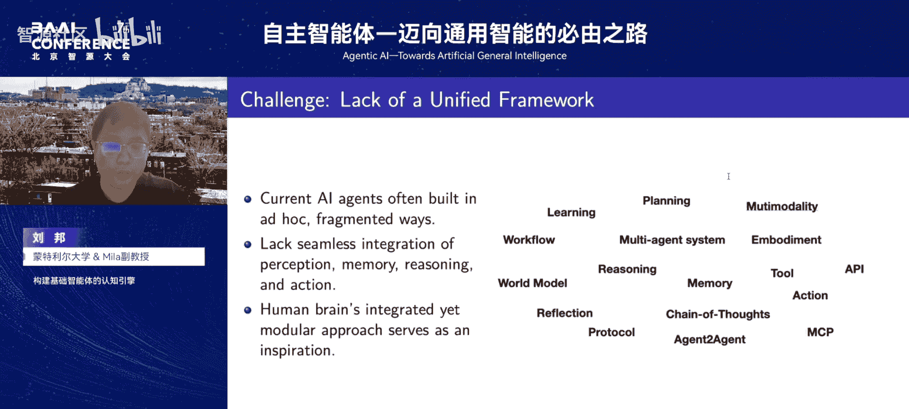

当然，机器智能也有其优势。例如，机器能够可靠地存储海量知识，而人类不可能读完其预训练阶段的所有数据。同时，机器易于规模化，并能进行深度高效的搜索与推理。

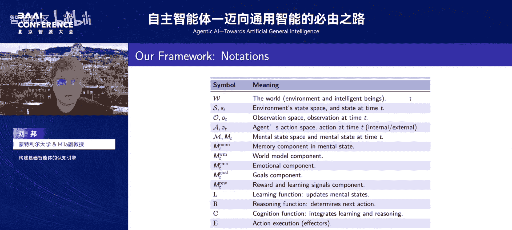

我们的目标是从生物智能中获得启发，审视整个研究领域，识别哪些子问题已发展成熟，哪些正在高速发展，哪些尚有巨大探索潜力。

我们将大脑的功能大致分为三类进行评估：

1.  **发展成熟（绿色）**：例如，基于大语言模型的自然语言理解能力，以及多模态模型的视觉感知能力，已经非常强大，可视为接近人类水平。
2.  **快速发展中（黄色）**：例如推理能力、记忆、规划等核心认知功能，已有大量优秀研究，但仍有广阔的探索空间。
3.  **探索潜力大（粉色）**：例如情感处理能力、触觉处理能力等，相关研究相对较少，但具有巨大的应用前景。

这种分类存在一定的主观性，但核心思想是：我们需要思考生物智能与当前机器智能之间存在哪些能力差距。

同时，我们看到当前AI智能体领域存在许多热门但零碎的研究方向，例如推理、规划、终身学习、工作流、思维链协议等。我们需要一个良好的框架来统一这些不同的功能模块。

## 基础智能体框架

基于上述目的，我们在调研论文中提出了一个基础智能体的框架。

首先，我们定义了“基础智能体”的概念：
*   **基础**：意味着我们希望它具有强大的泛化能力，适用于不同场景。
*   **智能体**：意味着它需要具备强大的理解、认知和行为能力。
*   **合作**：我们希望它具备强大的协作能力，使得多个智能体能够组成强大的多智能体系统，以解决更复杂的任务。

我们定义了智能体的工作循环（Agent Loop）：
1.  **环境**：环境在时刻 `t` 的状态表示为 `S_t`。
2.  **感知**：通过感知函数 `P`，智能体从环境状态 `S_t` 和自身上一时刻的内部状态 `M_{t-1}` 中，得到观察 `O_t`。这表明观察不仅取决于外部世界，也取决于智能体的内部状态。
3.  **认知核心**：智能体的认知结构由一系列核心心智状态组成，包括世界模型、记忆、目标、情绪、奖励模块等。它们共同构成了智能体的内部状态 `M`。
4.  **认知函数**：认知函数 `C` 基于上一时刻的心智状态 `M_{t-1}`、上一时刻的行动 `A_{t-1}` 和当前的观察 `O_t`，推导出更新后的心智状态 `M_t` 和当前决策的行动 `A_t`。这类似于循环神经网络维护隐藏状态的变化。
5.  **行动执行**：执行函数 `E` 将决策出的行动 `A_t` 转换为实际可执行的动作 `A'_t`（例如，在具身机器人中，这涉及复杂的运动控制）。
6.  **环境更新**：执行动作 `A'_t` 后，环境进入下一个状态 `S_{t+1}`，从而形成一个完整的循环。

我们可以进一步将认知函数 `C` 拆解为两个子函数：
*   **学习函数 `L`**：基于 `M_{t-1}`, `A_{t-1}`, `O_t` 更新心智状态 `M_t`，代表长期影响。
*   **推理函数 `R`**：基于更新后的心智状态 `M_t` 决策出行动 `A_t`。

因此，`C(M_{t-1}, A_{t-1}, O_t) = (M_t, A_t)`，其中 `M_t = L(M_{t-1}, A_{t-1}, O_t)`，`A_t = R(M_t)`。

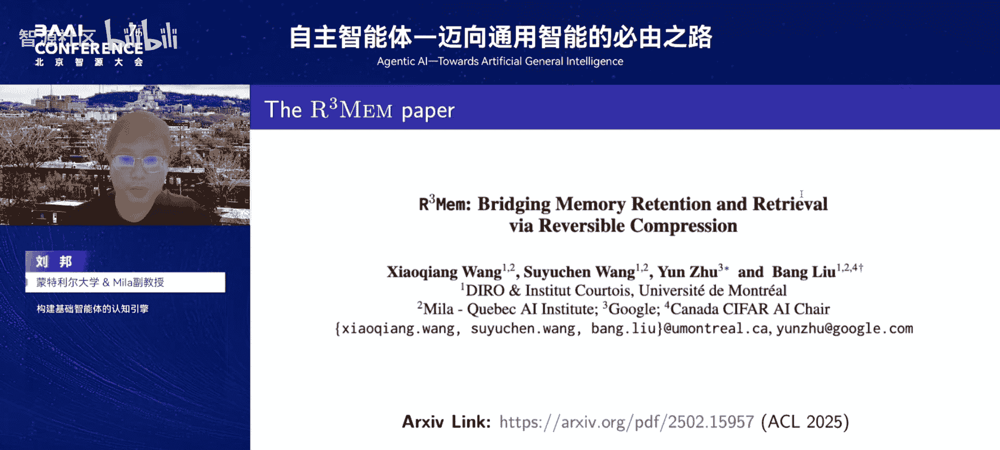

我们强调，具有此框架的智能体应具备三个核心特点：
1.  **理性**：具备强大的学习和推理能力。
2.  **可泛化**：能在不同环境和任务中有效工作。
3.  **可协作**：能够相互协作，形成多智能体系统。我们认为，构建可组合的多智能体系统比构建单一的“超人”智能体更加高效和经济。

## 工作一：构建可逆压缩记忆网络

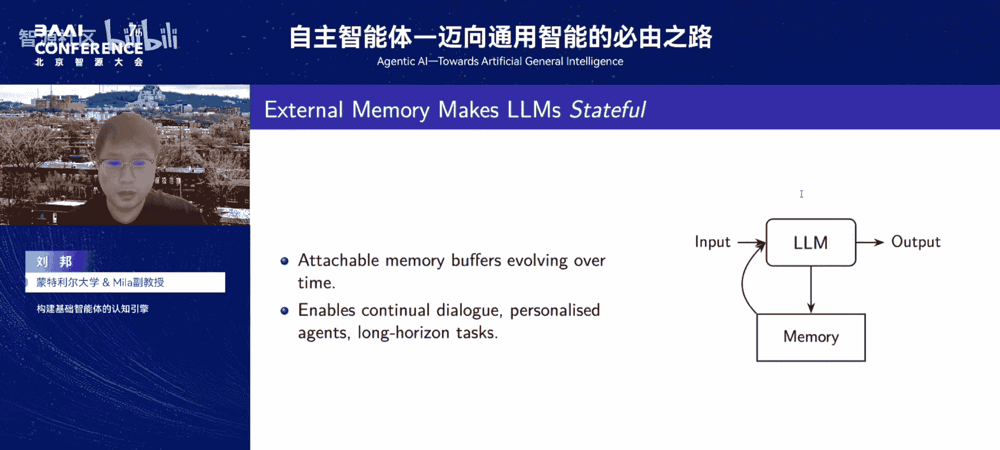

接下来，我们将探讨两个具体的研究工作，分别关于记忆构建和推理能力增强。第一个工作是 **CM（可逆压缩记忆）架构**，发表于ACL 2025。

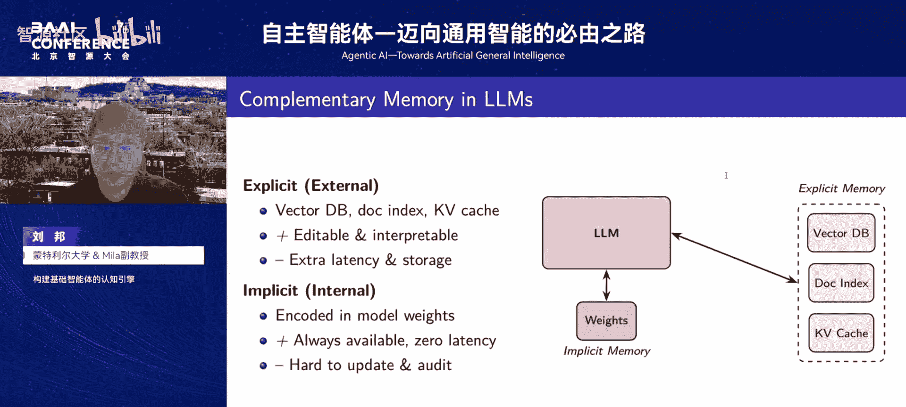

大语言模型本质上是无状态的。当新输入到来时，模型无法保留过往的经验。如果为模型增加一个记忆模块，就形成了一个最小化的智能体。这个记忆模块能帮助留存过往经验，实现连续对话、个性化服务以及执行需要多步骤的复杂任务。

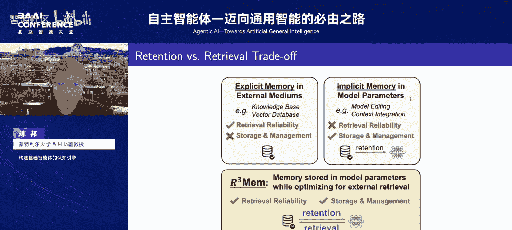

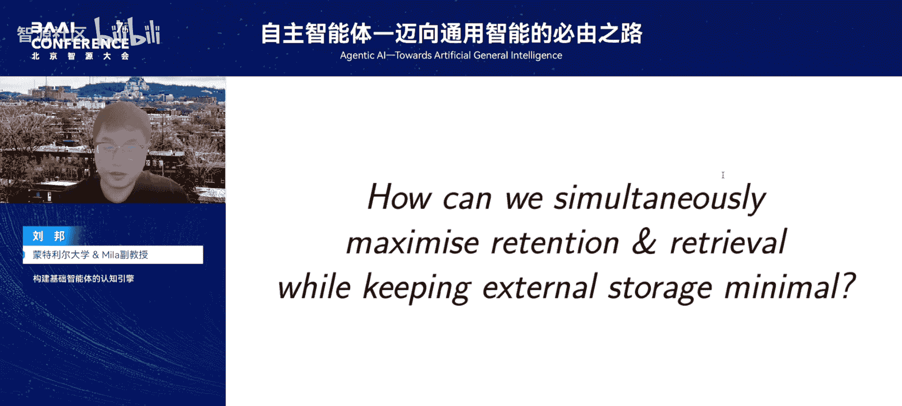

记忆的表示形式大致分为两类：
*   **显式记忆**：如向量数据库、原始文档索引或键值缓存。优点是易于编辑和理解，信息留存精准。缺点是随着规模增大，检索、存储和延迟都会受到影响。
*   **隐式记忆**：存在于模型内部，例如神经网络的权重。优点是延迟不会因外部检索而增加。缺点是难以编辑内部记忆并监控其质量。

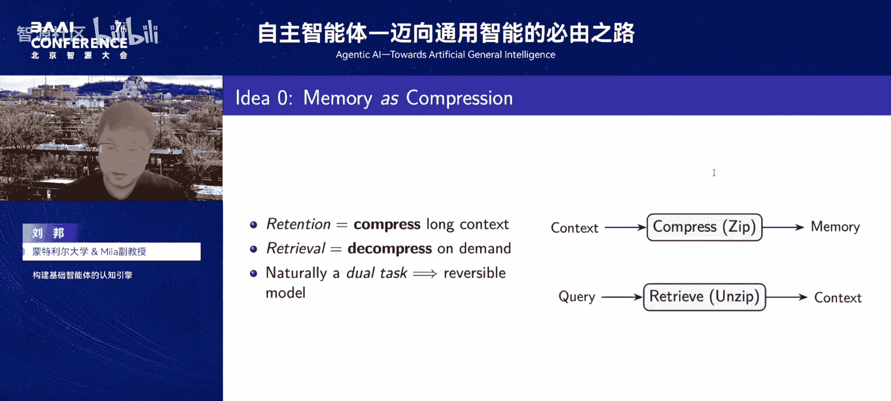

这形成了记忆留存与检索之间的权衡。显式记忆可靠但存储管理难，隐式记忆存储易但检索可能不准。我们能否兼得二者之长？

这篇论文旨在探索同时最大化记忆留存和检索效率的方法。

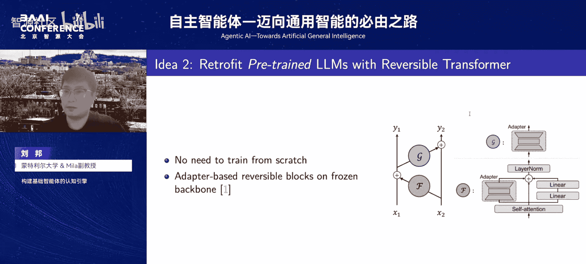

我们的核心想法如下：
1.  **将记忆视为信息压缩**：记忆留存是将长上下文压缩成记忆表示（编码），记忆检索是根据查询将相关上下文解压出来（解码）。这是一个双向的压缩-解压过程。

2.  **构建可逆记忆网络**：我们希望记忆网络是可逆的。如上图所示，通过定义 `F` 和 `G` 模块，可以从输入 `X` 计算出输出 `Y`，并能从 `Y` 反推回 `X`。

3.  **基于预训练模型改造**：我们不希望从头预训练一个大规模网络（如LLaMA）。记忆网络应具备语言理解能力。因此，我们通过为已有的Transformer模型增加两个适配器模块（`F` 和 `G`），将其改造成可逆网络，然后使用预训练算法进行微调，使其成为专职的记忆网络。

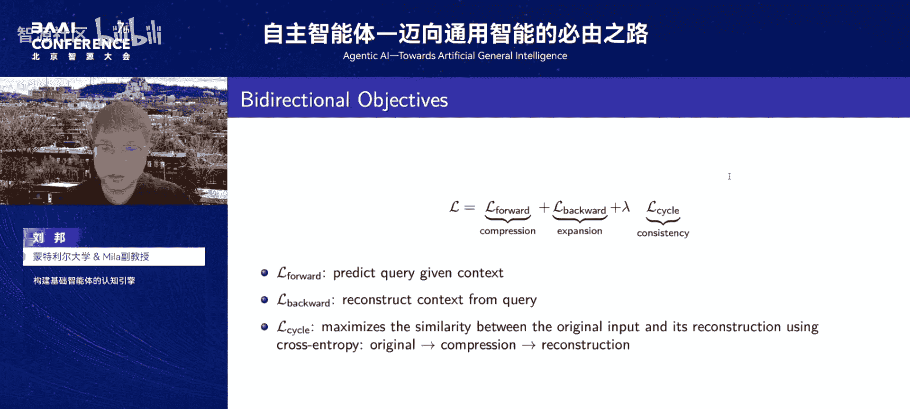

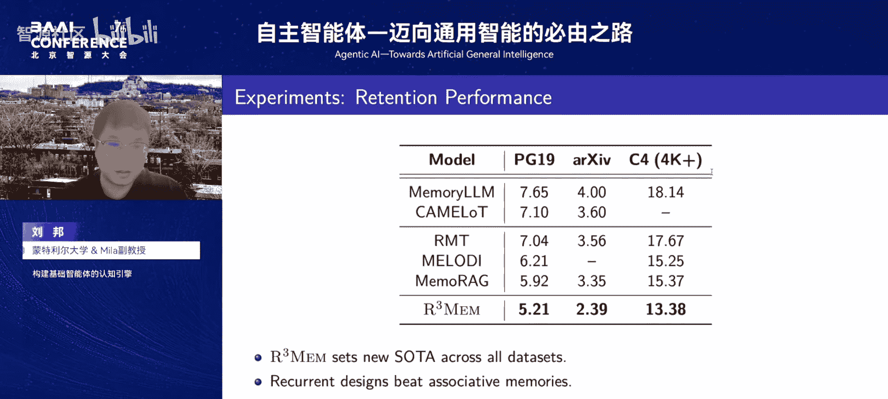

4.  **构建训练数据**：通过对文档进行分层压缩（从文档级到段落级，再到句子级，最后到实体级），并利用现有智能体（如GPT-4）进行总结，同时过滤低质量数据，我们构建了多粒度的“查询-上下文”训练数据对。

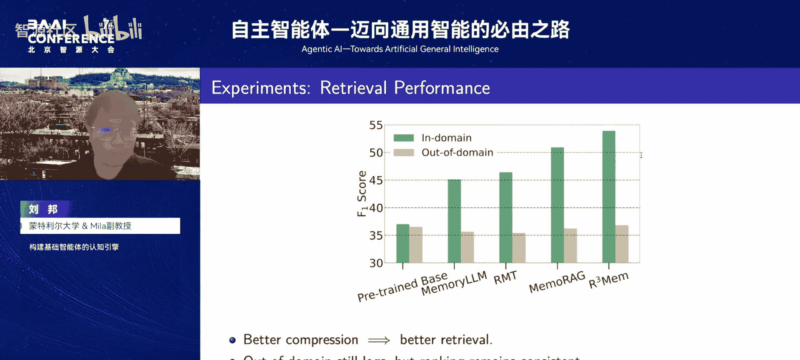

上图展示了CM网络的架构。基于自动构建的分层压缩数据，我们训练一个可逆的Transformer网络。在网络中，我们引入了“读写令牌”（记忆令牌），用于压缩上一层级的信息。当推进到下一层级时，这个记忆令牌能以压缩形式表征长上下文内容。

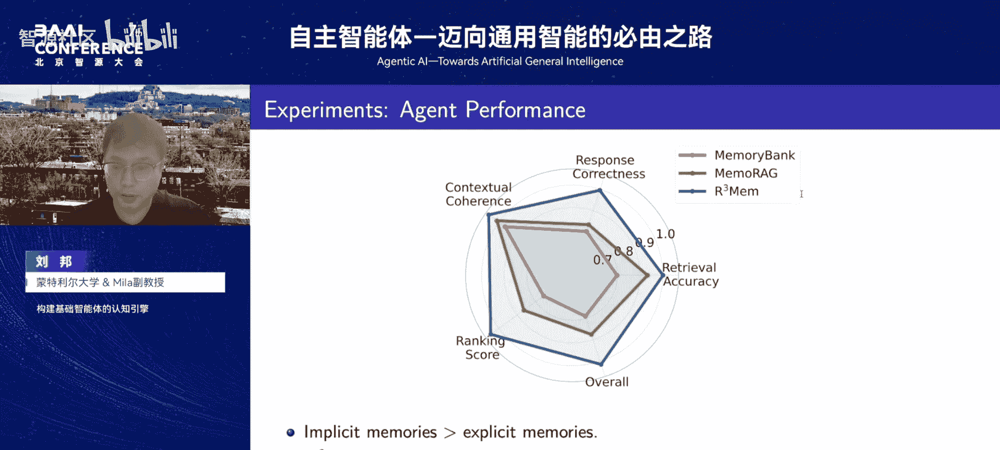

通过这种分层表示、可逆Transformer网络和压缩记忆令牌，我们能够高效地训练一个记忆网络。其训练损失包括三部分：压缩损失、解压损失和循环一致性损失（确保原始文本与反解压文本相似）。

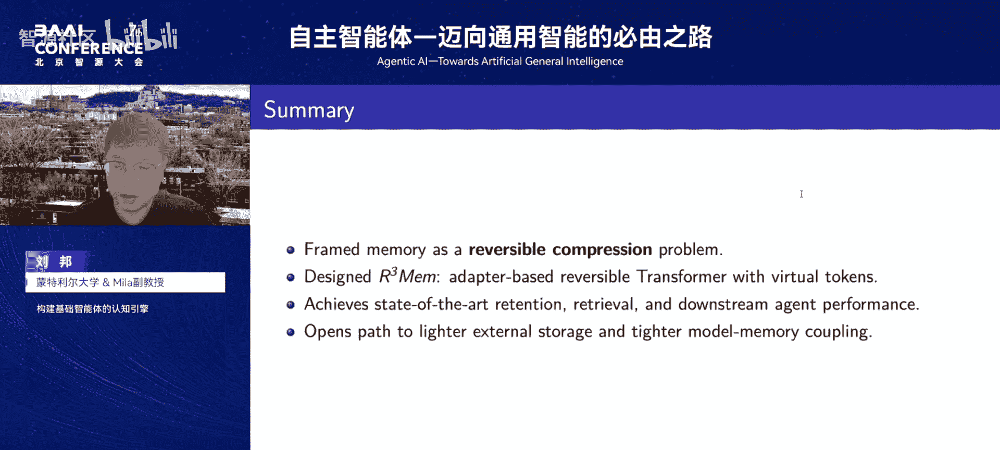

实验在多个数据集上证明，RCM的性能超过了论文撰写时的多种基线方法。

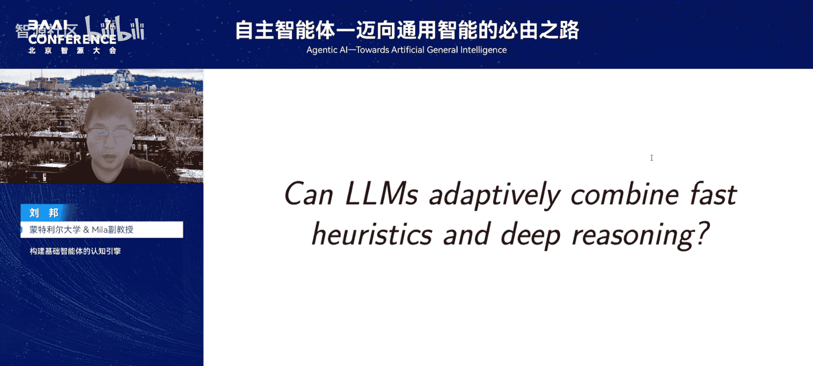

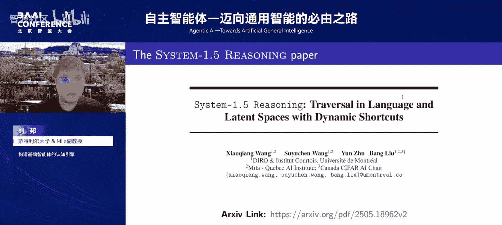

更好的压缩带来了更好的检索效果。在领域内和领域外场景的测试中，RCM都取得了良好效果。

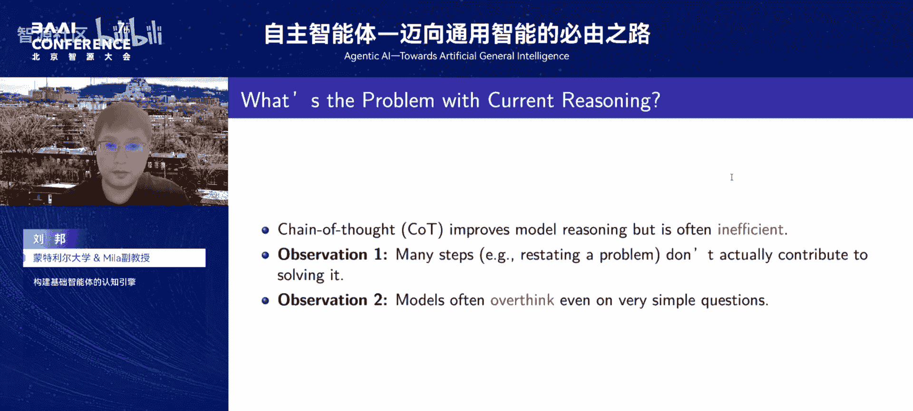

我们将RCM作为记忆模块嵌入到不同智能体中，与其它记忆模块（如Memory Bank, Memory Stack）进行对比。结果显示，RCM在上下文连贯性、回答正确性、追踪分数等指标上表现更优。

消融研究发现，双向路径和循环一致性损失对最终性能至关重要，数据质量也有重要影响。

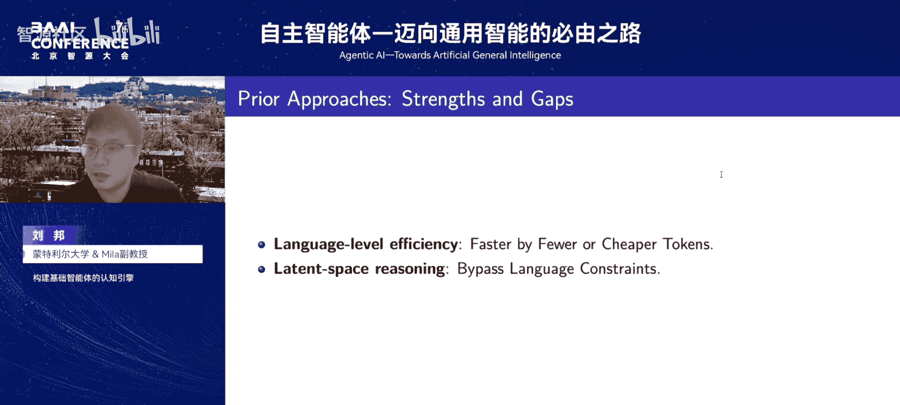

**总结**：在这项工作中，我们将记忆的存储与检索建模为一个可逆的压缩问题，设计了RCM记忆模块。它通过适配器将Transformer变为可逆Transformer，并使用记忆令牌来代表压缩记忆。实验证明，该模块达到了先进水平，为构建新型隐式记忆模块开辟了新途径。

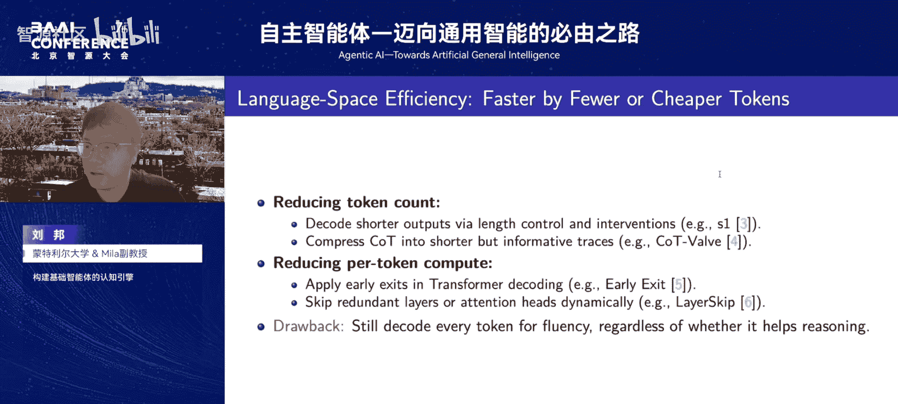

## 工作二：自适应潜在推理

第二个工作是关于如何结合快速的启发式推理（系统1）和深度的深思熟虑推理（系统2）。我们称之为 **系统1.5**，旨在兼顾两种推理模式的长处。

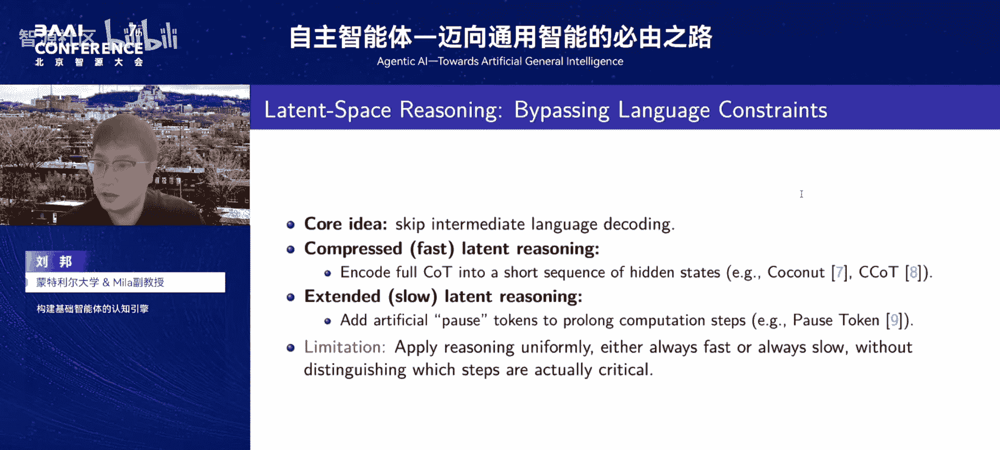

这项工作已在arXiv上发布。

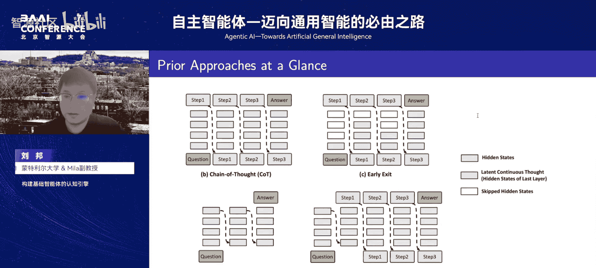

首先，我们思考思维链推理是否真的高效。它通过逐步推理解决问题，但存在两个问题：
1.  **冗余**：对于简单问题（如2+3），模型也会生成冗长的逐步推理，效率低下。
2.  **过度思考**：模型可能对简单问题想出多种复杂解法，生成大量无关的推理文本，浪费计算资源。

这促使我们重新思考模型推理资源的分配方式。理想情况下，模型应在关键思考步骤上投入更多算力，在简单步骤上快速跳过。这就是系统1.5自适应潜在推理的核心目标。

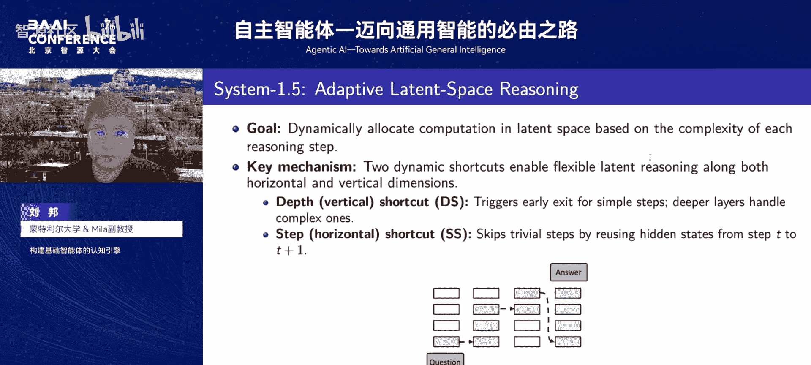

之前提升推理效率的研究主要有两个方向：
1.  **减少总令牌数**：例如，通过迭代起草与编辑缩短提示长度，或通过解码干预压缩生成内容。
2.  **降低每个令牌的计算开销**：例如，在模型置信度高时提前终止计算，或动态跳过某些层的计算。

然而，这些方法本质上仍在生成完整的文本，模型仍需为生成流畅语言花费算力，即使这些令牌对推理本身帮助不大。

**潜在空间推理** 提供了一种更高效的替代方案。它在中间过程中跳过语言生成，直接在模型内部（潜在空间）进行思考。这大致分为两类：
*   **压缩型潜在推理**：将长思维链轨迹压缩成更紧凑的潜在空间表示，减少推理步骤。
*   **扩展型潜在推理**：插入特殊令牌（如暂停令牌）来模拟延长思考时间，但不生成更多文字。

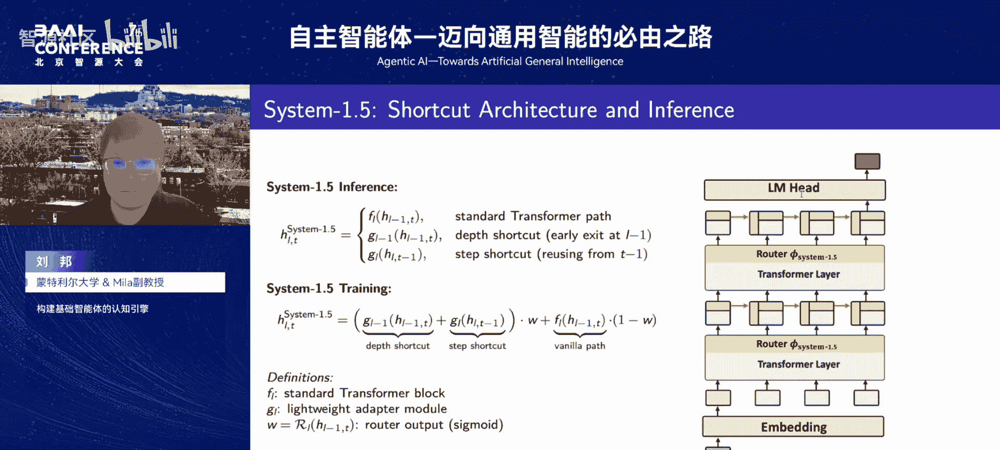

这两类方法的一个关键问题是：它们对所有推理步骤一视同仁，使用相同的计算深度，这依然导致效率问题。

系统1.5引入了一种新的潜在空间推理方式，希望兼具适应性与高效性。核心思想是：模型根据每一步的推理难度，动态调整投入的计算量。我们提出了两种“捷径”：
1.  **深度捷径**：在模型的垂直方向（层数）。简单步骤可能只需经过少数几层，复杂步骤则需走完全部层数。
2.  **步骤捷径**：在推理的时间线上。如果下一步非常简单，可以直接复用之前的潜在状态快速跳到下一步，跳过复杂的中间计算。

通过横向和纵向捷径的配合，模型可以在潜在空间进行灵活的“遍历”。简单步骤快速穿过，复杂推理则投入更多思考。

上图展示了系统1.5在推理和训练过程中的核心机制。在推理时，每一层每一步的潜在状态有三种可能路径：
*   **默认路径**：逐层向上计算，直到解码出最终令牌。
*   **步骤捷径**：在当前层的中间，直接跳到下一时间步的同一层，复用其状态（经过适配器转换）。
*   **深度捷径**：在某个浅层，模型已有足够信息决定提前退出，无需进行更深层推理。

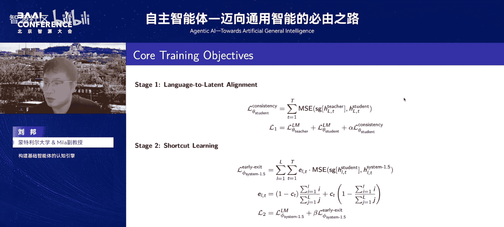

这些路径的选择由每层的一个小型路由网络控制，它输出一个置信度分数来决定走哪条路。在训练阶段，这些路径通过软权重进行混合，路由器的输出决定了每条路径的权重，让模型在学习中探索各种捷径策略。

训练系统1.5面临两个核心挑战：
1.  **预训练模型是为语言空间设计的**，而系统1.5在潜在空间推理，中间不生成自然语言。为此，我们设计了潜在空间蒸馏机制，让学生模型的潜在状态对齐一个经过思维链训练的教师模型的潜在状态。
2.  **模型的路径适应性**：如何知道哪些步骤该跳过，哪些该深思？我们引入了捷径学习机制：先通过原子思维分解标记每一步的重要性，然后设计损失函数来监督每一层的路由模块，鼓励非关键步骤尽早退出，关键步骤保留足够计算资源。

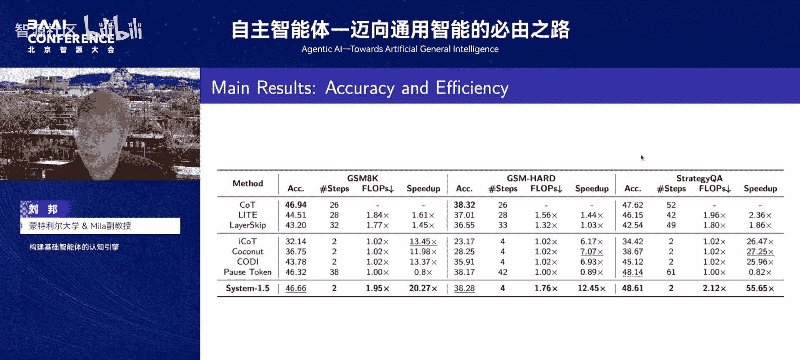

训练损失函数设计如下：
*   **第一阶段（蒸馏损失）**：让学生模型在潜在空间模仿教师模型的推理过程，在最终答案对应的潜在状态上计算均方误差损失。
*   **第二阶段（捷径学习损失）**：引入提前退出损失，引导模型在简单步骤上尽早退出，在复杂步骤上深入处理。同时，继续使用标准的语言模型损失来生成正确答案。

我们在GSM8K、GSM-Hard和StrategyQA三个基准任务上评估系统1.5。结果显示，它实现了目前最优的整体加速效果，在GSM8K上提速最高达20倍，在StrategyQA上甚至超过55倍，同时保持甚至提升了相较于思维链的准确率。

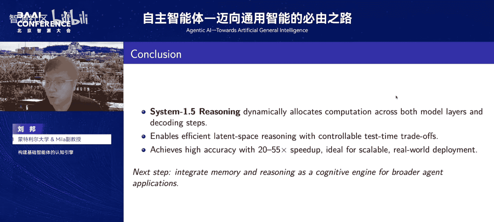

实验总结：我们实现了显著的推理加速，在减少计算量的同时保持了与思维链相当或更优的准确率。效率提升主要来自对潜在状态的重用和动态捷径机制，中间令牌生成量减少了90%以上。

我们的方法具备高度的可控制性。只需调整两个简单参数，即可在测试时控制模型的推理深度和步数：
*   `depth_threshold`：深度阈值。当路由器的置信度输出大于此阈值时，决定提前退出。
*   `max_steps`：最大思考步数。

通过这两个“旋钮”，我们可以在不重新训练或改变结构的前提下，平衡准确率与计算开销。

**总结**：系统1.5提出了一种高效灵活的潜在空间推理方式，能根据推理复杂度动态分配计算资源，实现了速度与准确性的双重提升，并具备强大的可部署性。展望未来，我们希望在潜在空间中深度融合记忆检索与推理模块，构建更强大的认知核心。

## 总结

在本节课中，我们一起学习了构建基础智能体认知引擎的核心内容。我们从智能体的基本定义和框架出发，探讨了从生物智能中汲取灵感的重要性。随后，我们深入分析了两项关键技术：一是将记忆建模为可逆压缩过程的RCM架构，它有效平衡了记忆留存与检索的效率；二是系统1.5自适应潜在推理框架，它通过动态分配计算资源，显著提升了推理效率并保持了准确性。这些工作为构建更理性、可泛化、可协作的基础智能体奠定了重要基础。