# 青年科学家发展与创新动能论坛-p03-研究+成长：Alex-Lamb

在本节课中，我们将跟随Alex Lamb的分享，回顾他的学术生涯轨迹，并提炼出他在研究过程中总结的八条宝贵经验。这些经验涵盖了从个人兴趣、问题选择到合作策略等多个方面，旨在为初学者和青年研究者提供实用的指导。

---

## 研究成长之路：02：早期经历与兴趣启蒙 🌱

上一节我们介绍了本教程的概述，本节中我们来看看Alex Lamb的早期生活与学术兴趣的萌芽。

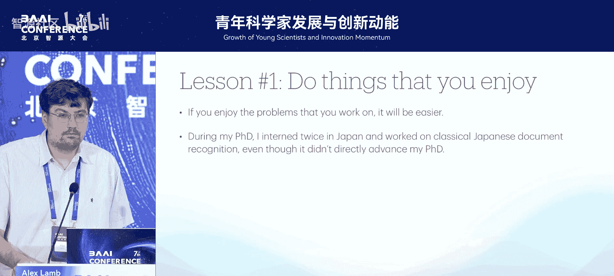

Alex Lamb在美国马里兰州北部长大，那里有许多马场和奶牛场。他早期对研究的兴趣始于高中时期，当时他使用名为Flash的软件和ActionScript语言，在一个叫Newgrounds的网站上制作和分享视频游戏。

在这个过程中，他第一次将数学（如三角函数`sin`和`cos`）应用于编程，让游戏中的角色能够以特定角度移动。这让他开始真正享受数学的乐趣。

**从这段经历中，他总结出第一条经验：从事你真正热爱的事情。** 他认为，找到自己乐于解决的问题会让研究过程变得更容易。例如，他在博士期间花了很多时间研究日本古典文献识别，尽管这与他的博士课题或职业发展无关，纯粹是出于个人兴趣。

---

## 研究成长之路：03：本科学习与研究方向探索 🧠

在高中对编程产生兴趣后，Alex Lamb进入约翰斯·霍普金斯大学攻读本科，主修计算机科学和应用数学。

以下是他在本科阶段的关键经历：
*   **感兴趣的课程**：他非常喜欢一门机器学习课程，这对他后来的职业方向产生了很大影响。
*   **首个研究项目**：他与该课程的教授合作，进行了一个关于推特流感分析的自然语言处理研究项目，相关论文于2013年发表。
*   **编程语言理论**：他同时开始对编程语言理论产生浓厚兴趣。
*   **当时的学术热点**：彼时（2011-2012年），神经网络领域的研究热点是深度信念网络。其核心思想是将网络的隐藏单元视为无向图模型，并通过**分层预训练**来构建深度生成神经网络。
*   **卫星控制室工作**：他曾在约翰斯·霍普金斯大学应用物理实验室的卫星任务控制室工作。这段经历让他意识到，与操作性的工作相比，他更渴望从事研究工作。

**从本科经历中，他总结出第二条经验：寻找比较优势。** 他认为，当一个新问题或新领域出现时，直观的、实证性的研究往往比理论研究发展得更快（深度学习早期便是如此）。然而，一旦坚实的理论被建立，它就可能主导该领域（如凸优化）。此外，随着领域成熟，工程和基础研究之间会出现更专业的分工（例如在大语言模型规模化研究中所见）。

---

## 研究成长之路：04：初入工业界与研究价值观 🏢

凭借本科期间的论文和与教授的联系，Alex Lamb很幸运地在2013年左右获得了亚马逊的研究科学家职位。

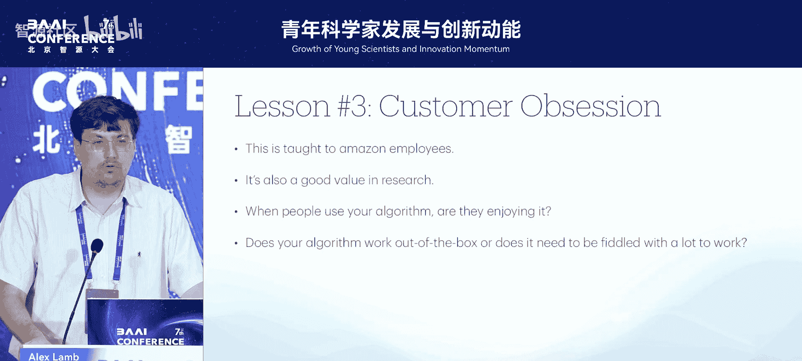

这是他职业生涯的一个重要发展，是他第一次有机会在一个拥有充分学术自由度的优秀工业实验室进行研究。他所在的团队当时使用大型随机森林进行需求预测，而他则早期探索了用于需求预测的分位数回归神经网络。

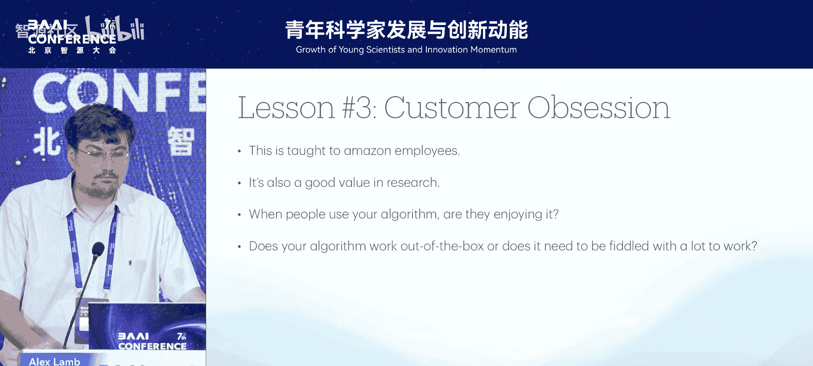

这项工作让他对生成模型和序列模型更加兴奋。尽管他后来离开了亚马逊预测团队，但该团队继续在库存控制的强化学习方面做了非常有趣的工作，例如直接使用**强化学习和策略梯度**来采购商品，从而绕过了需求预测步骤。

**在亚马逊的工作经历让他总结出第三条经验：客户至上。** 这是亚马逊倡导的理念之一，即专注于客户需求，而非仅仅是自己觉得有趣的东西。他认为这同样适用于研究：当你发布一个算法、论文或代码时，应该思考用户是否喜欢使用它、它是否开箱即用、还是需要反复调试才能工作。这是一个普适的良好价值观。

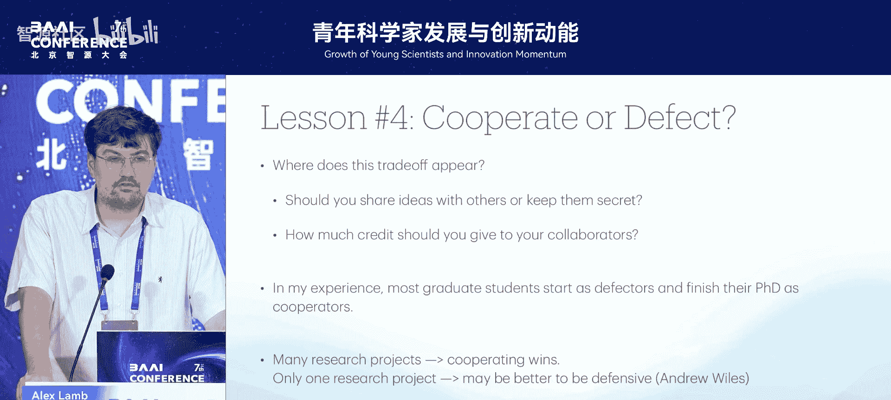

---

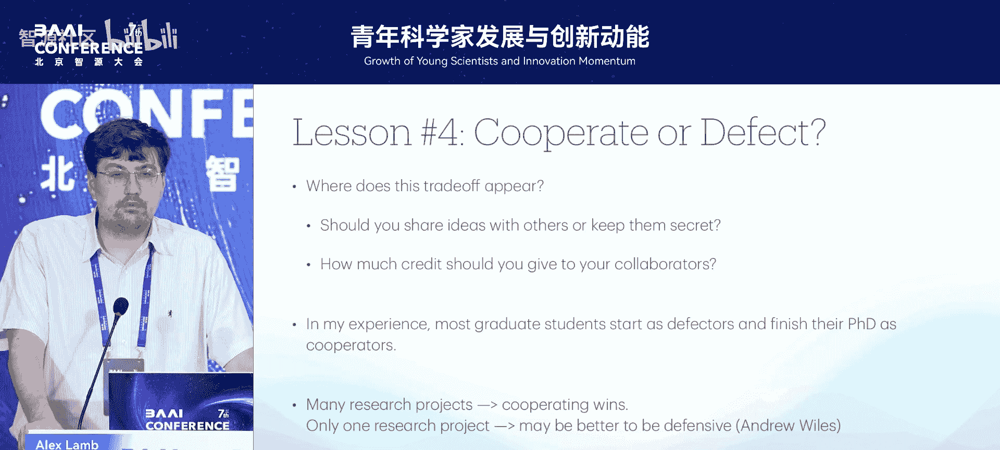

## 研究成长之路：05：研究生涯与协作之道 👥

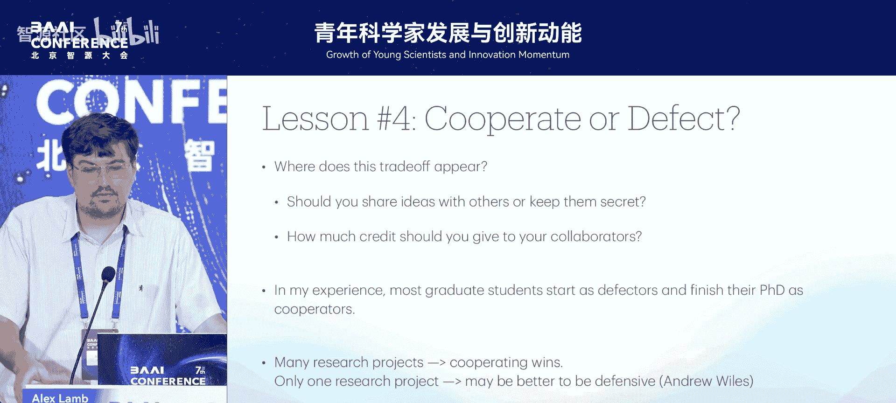

在亚马逊工作期间，Alex Lamb意识到自己想攻读博士学位以进行更深入的研究。在加拿大体系下，他首先在蒙特利尔大学跟随Aaron Courville攻读研究型硕士，随后跟随Yoshua Bengio攻读博士。在蒙特利尔大学，他建立了深厚的友谊和合作关系。

例如，他们开发了一种名为 **“流形混合”** 的技术，旨在使神经网络的隐藏表示更加线性可分，并通过理论和分析表明这也能使隐藏空间中的单元更加集中。

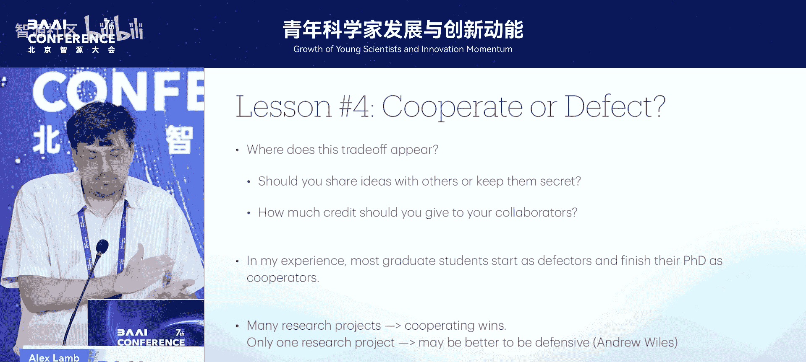

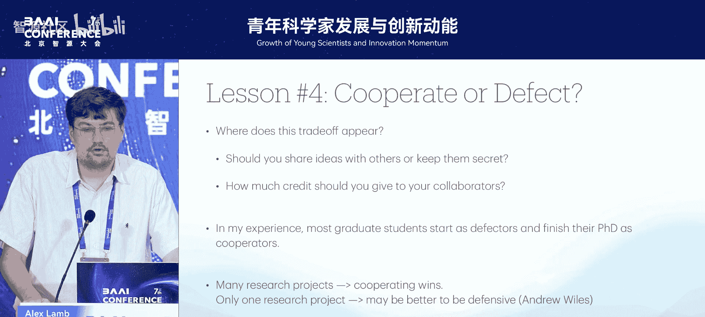

**从研究生涯中，他总结出几条重要经验：**

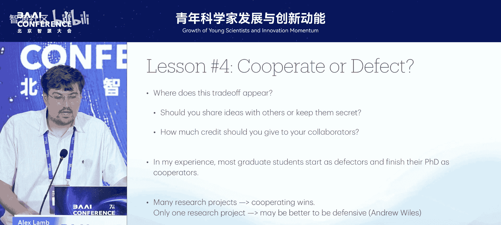

**关于合作与防御的权衡**
他认为研究中存在“合作”与“防御”（即优先帮助同事与更专注于自我提升）之间的权衡。这种权衡体现在多个方面：有了新想法是应该分享还是保密？在论文中应该如何分配功劳？

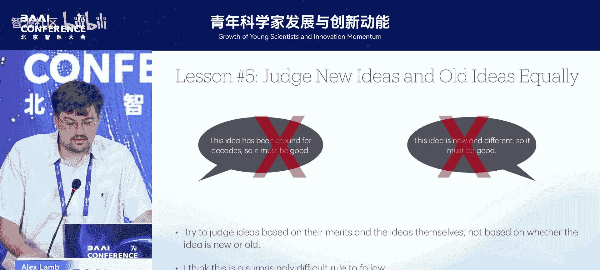

他的观察是，大多数博士生在生涯初期更倾向于“防御”（以自我为中心），而在毕业时则更多地转变为“合作者”（关心合作者）。从博弈论角度看，如果你有多个研究项目并与同一批人持续合作，采取合作、非自我中心的策略通常更有利。然而，如果你的整个职业生涯押注在一个研究想法上（如数学家安德鲁·怀尔斯证明费马大定理），那么采取更防御性的策略可能是理性的选择。不过，他认为在研究生涯的长期发展中，成为一名合作者通常更好。

**公正地评判想法**
他建议应努力基于其本身的价值来评判新想法和旧想法，避免“老的就是好的”或“新的就是好的”这类偏见。同时，也应努力公正地评判自己和他人的想法，避免因情感联系而高估自己的创意，或因来源（如著名实验室）而产生偏见。关键在于在谦逊和自信之间找到平衡。

---

## 研究成长之路：06：研究规划与目标设定 🎯

完成博士学业后，Alex Lamb加入了微软研究院纽约分部，在John Langford领导的强化学习理论小组工作。他主要研究**多步逆模型**，这是一种在强化学习环境中学习表示的方法。

他们以此申请了专利，并在ICML 2023上做了教程。这项研究的一个动机是：游戏《塞尔达传说：织梦岛》在1998年发布时文件仅约10MB，而2018年的高清重制版文件约10GB。尽管游戏动态完全相同，但如果能学习一种从丰富的视觉空间自动映射到更简单空间的方法，将大大提高智能体学习的效率。

**在这段经历中，他总结出关于研究规划的两条经验：**

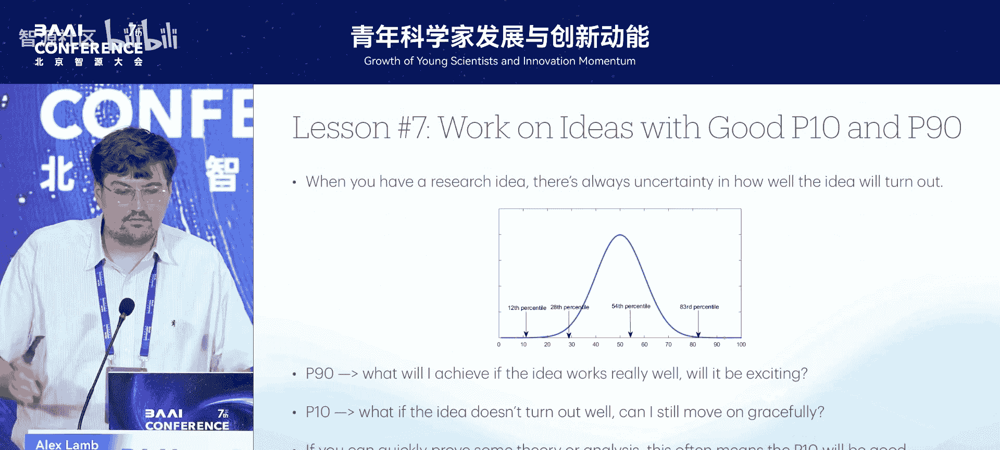

**评估想法的潜力与底线**
在开始一个想法前，尝试思考它的 **P90（第90百分位数）** 和 **P10（第10百分位数）**。P90代表如果想法非常成功，它能带来多大的兴奋和价值；P10则代表如果进展不顺，是否仍有策略可以体面地收尾或转向。例如，如果能快速证明一些理论，通常意味着研究项目的P10不会太差，因为至少可以宣称该理论或属性成立。同时，要确保想法足够通用或有趣，以使P90足够高。

**目标与路径并重**
仅仅有一个理想的目标通常不是启动研究项目的好方式，因为许多目标极难实现。他认为，一个好的研究想法应该同时包含一个**理想的目标**和一个**可行的实现路径**。

---

## 研究成长之路：07：当前阶段与经验回顾 📝

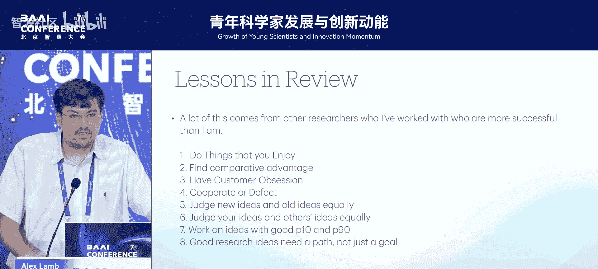

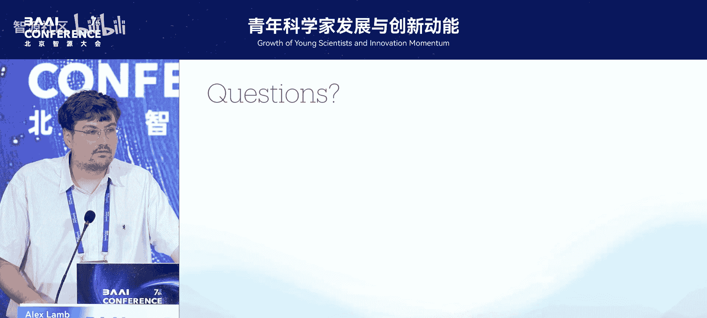

Alex Lamb职业生涯的最新进展是成为了清华大学人工智能学院的助理教授。他对这里学生的质量感到非常兴奋，许多优秀申请者已经达到了完成博士学位的标准（例如拥有多篇顶会一作论文）。

他还分享了一个趣事：在北京公园散步时帮助一只走失的小狗找到了主人。

**最后，他对分享的研究经验进行了回顾。** 他强调，这些经验大多来源于观察那些比他成功得多的研究者，仅仅是他个人认为值得遵循的做法。

---

## 研究成长之路：08：总结与问答环节 💡

本节课中，我们一起学习了Alex Lamb从高中到成为助理教授的学术成长路径，以及他总结的八条核心研究经验：

1.  **从事热爱之事**：让兴趣驱动你的研究。
2.  **寻找比较优势**：在新兴领域把握实证研究的先机，关注领域成熟后的分工。
3.  **客户至上**：从用户（读者、使用者）角度思考研究的实用性和易用性。
4.  **成为合作者**：在长期研究中，合作与分享通常比防御与独占更有利。
5.  **公正评判想法**：避免对新旧想法或个人/他人想法产生偏见。
6.  **平衡谦逊与自信**：公正地对待所有创意。
7.  **评估想法潜力**：在开始前思考项目的上限（P90）和底线（P10）。
8.  **目标与路径并重**：为理想的目标设计可行的实现路径。

这些经验旨在帮助研究者在漫长的学术生涯中更好地导航，保持动力，并做出明智的决策。