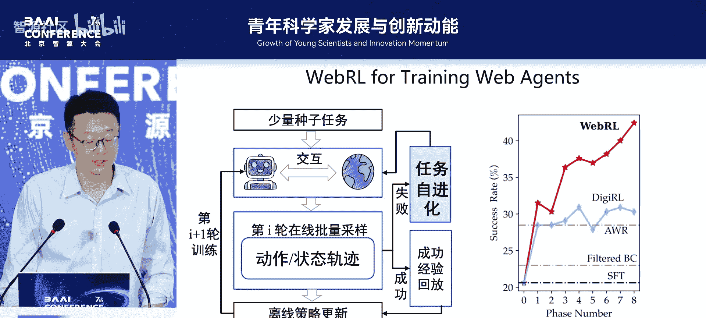
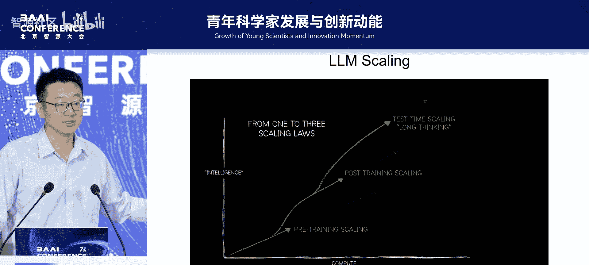
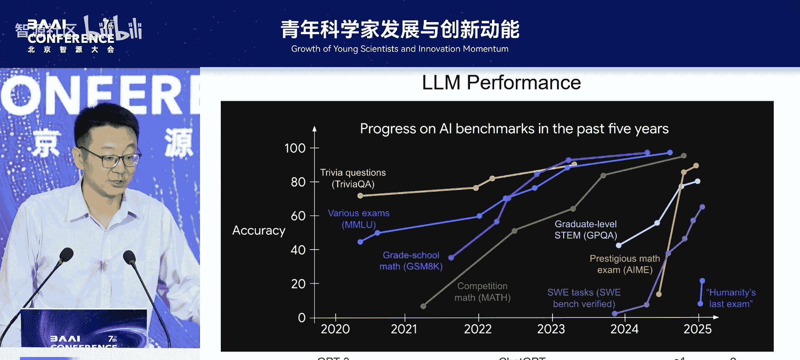
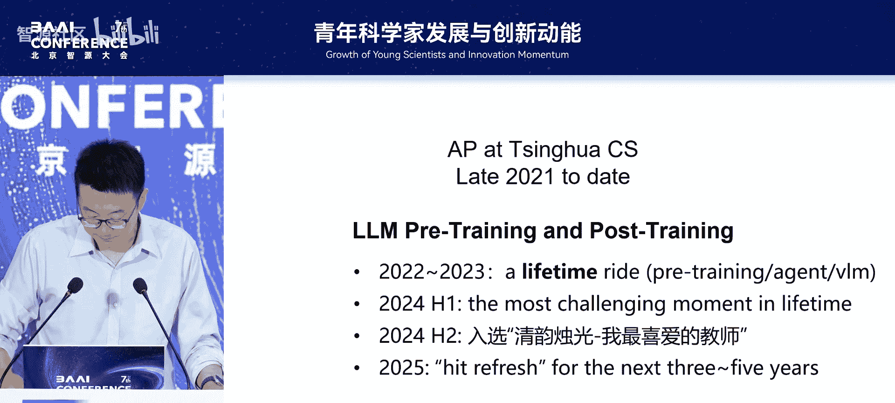

# 青年科学家发展与创新动能论坛-p04-主题演讲：东昱晓

在本节课中，我们将跟随东昱晓博士的分享，回顾他从博士阶段到成为青年科学家的学术旅程。我们将看到他如何从社会网络分析起步，逐步探索图表示学习，并最终投身于大语言模型的预训练与智能体研究。这个过程充满了探索、转变与思考，对于初入科研领域的同学具有很好的借鉴意义。

## 1：博士生涯的起点与探索 🔬

上一节我们概述了本次分享的主题，本节中我们来看看东昱晓博士的科研起点——他的博士生涯。他于2012年至2017年攻读博士学位，研究方向是计算社会学与信息网络。当时的目标很直接：在顶级会议上发表一篇第一作者的论文。

在博士期间，他主要尝试理解社交网络和信息网络的结构与规律，并运用计算模型来解决其中的问题。他总结博士阶段的三个关键点是：幸运地找到了自己感兴趣的研究方向；承受着发表顶会论文的压力；以及学习如何发现并尝试解决问题。

以下是博士期间进行的两项具体研究：

*   **研究一：通信网络中的社会结构分析**
    *   他们分析了欧洲一个国家约700万人口数月内的手机通话和短信数据（无内容，仅有通信记录）。
    *   研究可视化并分析了通信网络中“三角形”结构（即三人相互通信）的分布。他们发现，年轻人之间的各种三角形通信结构都非常紧密。但过了35岁后，同性三人组（三男或三女）的通信依然频繁，而混合性别组（两男一女或两女一男）的通信从统计上看则少很多。同时，跨代际（如父母与子女）的通信行为也非常频繁。

*   **研究二：共同好友结构与链接形成概率**
    *   一个直观的问题是：两个人拥有的共同好友越多，他们成为好友的可能性越大。
    *   他们进一步研究了一个更细致的问题：假设两个人都有4个共同好友，如果这4个好友彼此**不认识**（结构松散），与这4个好友彼此**都认识**（结构紧密）相比，哪种情况下那两个人成为好友的概率更高？这个问题的答案并不直观，研究发现了令人惊讶的结果。他们系统地探索了不同子图结构对链接形成概率的影响。

基于这些发现，他们开始从计算角度，用图模型来建模社交网络，并尝试进行用户属性预测、链接预测等任务。

## 2：转向图神经网络与工业界实践 ⚙️

上一节我们介绍了博士期间基于传统方法的网络分析，本节中我们来看看研究方向的第一次重要转变——图神经网络，以及随之而来的工业界经历。

在博士最后一年，在导师的要求下，他开始研究神经网络，并将其与图结合起来，试图解决大规模图的学习问题。其核心思想是将自然语言处理中经典的 **Word2Vec** 模型思想迁移到图领域，学习图中节点的向量表示（即图嵌入）。

他们提出的模型在学术合作网络上进行了验证。通过模型自动学习到的节点向量进行投影和聚类后，效果符合人们对计算机领域顶会分区的认知。同时，模型也自动发现了类似“国王-男人+女人=王后”的向量关系模式，例如在学术会议与其领军人物之间的关系上得到了体现。

博士毕业后，他加入了工业界的研究实验室（微软研究院、Facebook AI），继续深耕图表示学习，并尝试了图预训练。他体会到，在工业界，团队最看重的是产品与业务影响。因此，他努力在个人研究兴趣与团队业务目标之间寻找结合点。

在工业界，他最大的收获之一是能够亲眼看到自己的研究成果部署到生产系统，并直接影响数十亿用户。例如，在Facebook，一个让推荐效果提升0.03%的模型，在30亿用户的规模上会带来巨大的实际影响，这令人非常兴奋。他也意识到，工业界真正成功的想法往往**简单有效**，而非特别花哨。

## 3：回归学术与大模型浪潮的拥抱 🌊

上一节我们讲述了工业界将研究落地的实践，本节中我们来看看他学术生涯的另一个关键转折——回归学术界并投身于大模型的研究浪潮。

在工业界期间，他一直在思考两个问题。第一，他发现自己很多图学习的研究，其核心思想都借鉴自自然语言处理或计算机视觉领域。他开始思考，是否有机会进入这些“源头”领域，去发现和创造更根本性的思想。第二，2021年OpenAI发布的**Codex**模型对他冲击巨大。作为一个经常写代码的研究者，他真切感受到一个AI模型能真正实用化地辅助编程，这让他确信大模型是未来必须深入的方向。

恰逢其时，他得到了回国加入清华大学的机会，于是从2021年底开始，主要研究方向转向了大语言模型的预训练。他坦言，自ChatGPT出现后，已经很难说服学生继续做图学习研究了，大家都希望投身于大模型。这让他感到些许遗憾，但也必须面对现实。

回国后，他最大的体会是能够与一群有激情、有才华、肯拼搏的年轻人一起探索。他们的目标也从“发表顶会论文”转变为“让同学们学会独立研究，做出有影响力的工作”。团队在算力紧张的条件下，于2022年7月开源了千亿参数模型，并在2023年持续迭代，推出了多版效果显著提升的对话模型。他们还探索了如何提升模型本身的智能体能力（如规划、工具使用）以及多模态能力。

## 4：当下的思考与未来的方向 🤔

上一节我们回顾了投身大模型研究的激动人心历程，本节中我们来看看东昱晓博士对当前研究现状的反思以及对未来的展望。

近一年来，随着OpenAI推出o1等模型，强化学习和推理训练成为焦点。他的团队也在这方面进行探索，例如研究如何量化并提升模型在生成长文本时的推理能力。然而，他也提到，在工业界主导、需要巨大算力的AI研究现状下，学术界需要思考自己的定位。

他引用沈向洋博士的一个比喻：大部分研究像是在已有的“割麦子”模式上，努力把镰刀磨快20%（追求工程与数据上的渐进式改进）；而像大模型预训练和强化学习这类工作，则可能是一种“模式创新”。如何在追求工程极致与探索模式创新之间找到平衡，是学术界面临的挑战。

他总结道，2022-2023年是一段极其幸运的旅程。作为教师，最开心的事是得到学生的认可。现在，他正在思考：在当下这个时间点，选择做什么样的研究，才能在三年或五年后回看时不会后悔？正如2021年决定回国做大模型一样，他希望今天的选择也能经得起时间的考验。

最后，他分享了五点个人体会：
1.  **找到热爱**：做研究需要“温柔的坚定”，其前提是找到内心真正热爱、能让自己兴奋的方向。
2.  **接受平凡**：认清自己只是普通人，与内心和解，专注于服务（Serve）科学与社区。
3.  **坚持简单**：当一个想法**简单**且**有效**时，就应坚持投入资源（算力、人力、数据、时间）去扩大其规模。
4.  **感谢伙伴**：所有成果都离不开优秀的合作者、学生和实习生的共同努力。
5.  **保持开放**：研究领域在不断变化，保持开放心态，勇于探索新方向。

---

本节课中我们一起学习了东昱晓博士从社会网络分析到图神经网络，再到大语言模型的科研路径。我们看到了研究方向随技术浪潮的演变，感受到了工业界与学术界的不同侧重点，也体会到了一位研究者对科学探索本质的持续思考。他的经历启示我们，在快速变化的AI领域，保持好奇心、找到内心所爱、并与优秀的伙伴共同奋斗，是走向成长与创新的重要动力。