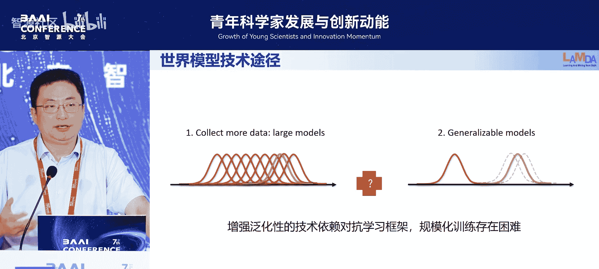
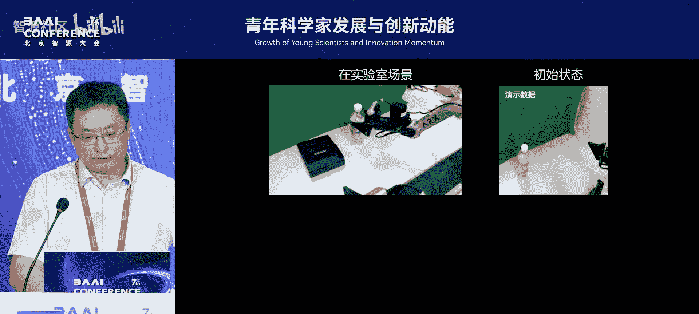
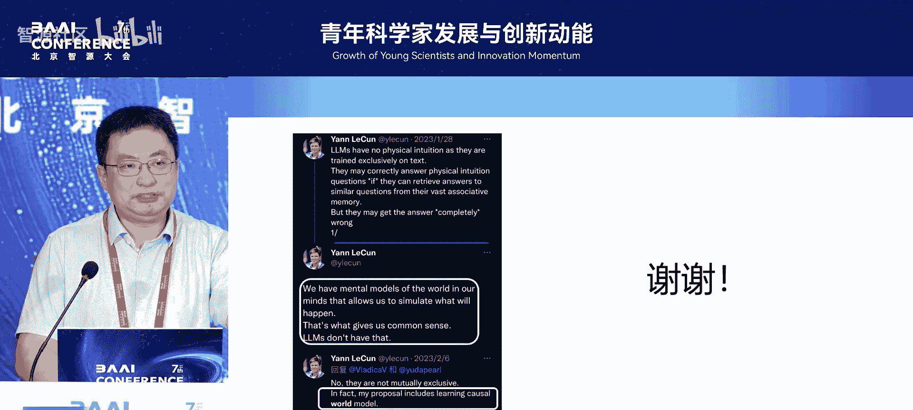

# 青年科学家发展与创新动能论坛-p05-LLM中的强化学习：俞扬

在本节课中，我们将跟随俞扬教授的分享，探讨强化学习领域的发展，特别是从模仿学习到世界模型这一技术路径的演变、挑战与未来展望。我们将了解为何模仿学习存在性能天花板，以及构建世界模型如何可能成为突破这一限制、实现更强泛化与推理能力的关键。

## 概述：科研方向的选择与演变

上一节我们介绍了科研方向选择的重要性。本节中，我们来看看俞扬教授个人的研究方向转变，这反映了对技术深度与应用价值平衡的思考。

俞扬教授在博士期间从事理论计算机方向的研究，专注于启发式优化算法的计算复杂度分析。这个方向由导师指定，尽管他自认为数学基础在同组中并非最强，但仍坚持完成了理论研究。

博士毕业后，他自主选择了强化学习作为研究方向。他认为，优化算法固然重要，但可能并非通向未来通用人工智能最核心的路径。强化学习更贴近他内心对人工智能方向的兴趣定位。

在早期（2011年），强化学习并无企业应用场景，难以吸引学生。直到2016年AlphaGo的出现，才让强化学习重回主流视野。近期，大模型中的强化学习应用（如RLHF）使其受到更多关注。

## 模仿学习的兴起与局限

上一节我们提到了强化学习的回归。本节中我们来看看其中一个重要分支——模仿学习。

模仿学习是指智能体通过观察专家提供的示范数据，直接学习如何行动。其核心思想很简单：**给定状态，执行专家在该状态下执行的动作**。这可以形式化为一个监督学习问题：

**公式**：学习一个策略 π(a|s)，使得在状态 s 下，其输出的动作 a 尽可能接近专家策略 π_E(a|s) 在该状态下的动作。

模仿学习的优势在于见效快。只要有大量高质量的专家数据，就能快速训练出一个能执行流畅动作的智能体，例如丝滑的机器人操作。

然而，模仿学习存在两个根本性理论局限：

1.  **性能天花板与误差累积**：数学上已证明，通过行为克隆（即上述的监督学习方式）学得的策略，其性能**必然差于**提供数据的专家。并且，单步的微小误差会在多步决策中**以平方级速度累积**，导致智能体行为逐渐偏离专家轨迹，甚至完全失败。
2.  **因果混淆**：智能体只是机械地记忆状态-动作对，而**无法理解专家行为背后的因果关系**。这可能导致学得错误的因果模型。

以下是因果混淆的一个例子：

*   **真实因果**：水温过高 -> 调大冷水阀门 -> 水温下降。
*   **从数据中可能学到的错误因果**：观察发现，当调节动作的幅度变小时，水温更接近目标值。因此错误地认为：**调小阀门幅度 -> 水温更快接近目标**。

## 当前主流路径：大数据与模仿学习

上一节我们分析了模仿学习的内在局限。本节中我们来看看当前解决决策问题的主流技术路径及其面临的挑战。

当前，将大语言模型和多模态模型的思路迁移到决策领域是一个主流方向，例如 **VLA（Vision-Language-Action）模型**。其做法是：收集大量带有标注的机器人控制数据，然后进行大规模训练。

然而，根据模仿学习的理论，这条路径存在**固有天花板**：模型性能无法超越提供训练数据的专家水平。实践也已验证这一点（如Google的“通才”智能体）。要提升性能，就需要更多、更高质量的数据。

但在决策领域，收集数据面临巨大挑战：

1.  **数据规模瓶颈**：与互联网上唾手可得的文本、图像数据不同，高质量的决策数据（如机器人交互数据）极其稀缺。目前最大的具身智能数据集之一，其数据量与传统大模型训练数据相比也微乎其微。
2.  **数据有效性低**：数据收集方式分为“被动收集”（先收集数据，再训练模型）和“主动收集”（根据模型当前弱点，针对性收集数据）。被动收集的数据中包含大量对改进当前模型无效的样本，数据利用效率低。而主动收集成本极高，难以实现。

因此，单纯依赖模仿学习和海量被动数据的路径，在决策领域会遇到数据稀缺和性能天花板双重瓶颈。

## 世界模型：通向更高天花板的可能路径

上一节我们指出了大数据模仿学习路径的困境。本节中我们来看看另一种可能突破性能上限的思路——构建**世界模型**。

世界模型是指智能体对其所处环境的一种内部模拟。它使智能体能够**在行动之前，预测其动作可能带来的后果**，即进行“如果...那么...”的推理。这类似于人类闭上眼睛也能想象周围环境，并能预演行动结果。

世界模型在强化学习领域也被称为环境模型、动力学模型等。其核心任务是：**给定当前状态 s 和智能体采取的动作 a，预测下一个状态 s‘**。

**公式**：学习一个模型 M(s, a) -> s‘，使得预测的状态 s‘ 尽可能接近真实环境的状态转移。

构建世界模型的意义在于，它允许智能体在内部模型中进行“思想实验”或“规划”，从而减少对昂贵真实交互的依赖，并能处理从未在训练数据中出现过的新情况。

## 世界模型面临的挑战与近期进展

上一节我们介绍了世界模型的概念与潜力。本节中我们来看看构建世界模型面临的核心挑战，以及一些新的研究进展。

世界模型面临的根本挑战是**分布外泛化**。传统机器学习主要处理独立同分布数据，而世界模型必须能够对**训练数据中从未出现过的“反事实”场景**进行准确预测。这是机器学习的核心难题之一。

当前，构建世界模型主要有两条技术路径：

1.  **大数据路径**：沿用大模型思路，收集海量交互数据（如在视频游戏环境中）进行训练。例如DeepMind的Genie系列工作。但此路径仍受限于高质量决策数据的获取，且模型可能难以预测“坏策略”导致的结果，因为数据集中多为“好策略”的轨迹。
2.  **提升泛化能力路径**：设计新的模型结构与训练方法，旨在提高模型对未见情况的推理能力。例如，俞扬教授团队的研究表明，通过区分数据来自何种策略，并让模型明确学习这种条件关系，可以理论上提升其泛化能力。他们将多种提升泛化性的技术结合，在机器人操作数据集上训练了一个世界模型。

该模型展示了初步的**反事实推理能力**：例如，预测机械钳在“夹取水杯”任务中，如果伸得太远会碰倒杯子，如果伸得不够则无法夹起。这种能力是进行有效规划的基础。

## 总结与展望

本节课中，我们一起学习了从模仿学习到世界模型的强化学习发展脉络。

我们首先看到，模仿学习虽能快速见效，但存在性能天花板和因果混淆的理论局限。当前主流的大数据模仿学习路径，在决策领域受限于数据稀缺和收集效率。

作为突破，世界模型提供了让智能体进行内部模拟和反事实推理的可能，指向更高的性能天花板。然而，构建强大的世界模型需要解决分布外泛化这一核心挑战。近期研究通过改进模型泛化能力，已展现出初步潜力。

最后，俞扬教授分享了对未来发展的看法：尽管世界模型方向目前发展较慢且困难，但仍是实现能在开放世界中可靠工作的、具有高度适应性的智能体的关键方向。在严肃应用场景（如自动驾驶、工业控制）中，智能体对“意外情况”的鲁棒处理能力（兜底能力）至关重要，而世界模型可能是实现这一目标的重要基石。