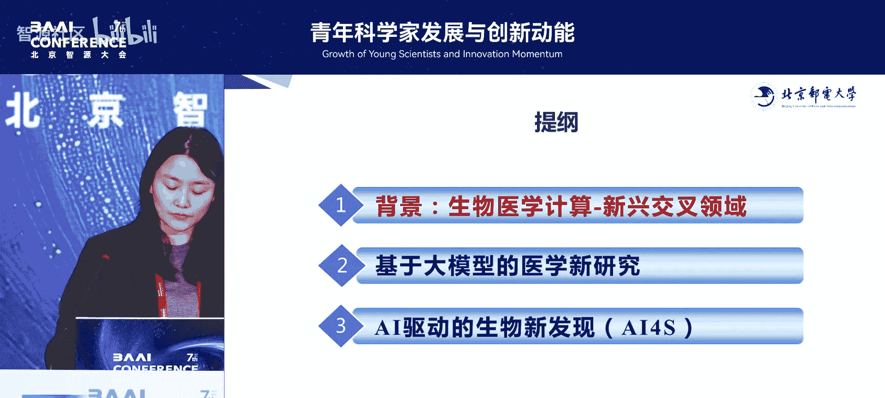
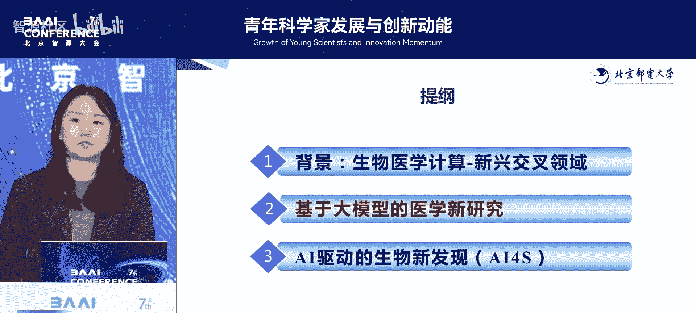
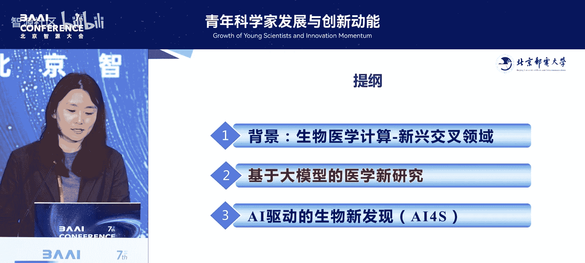
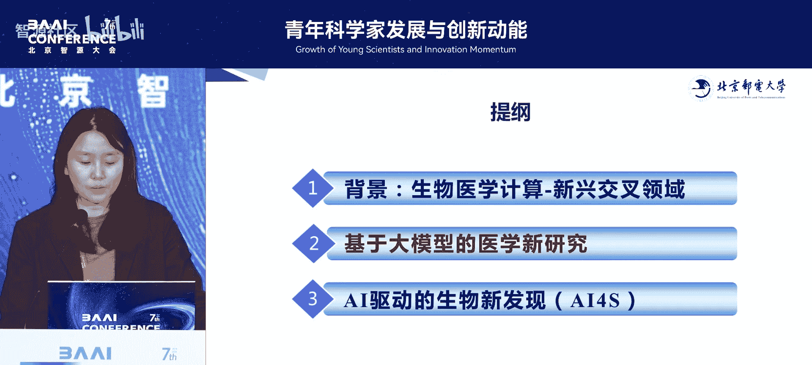
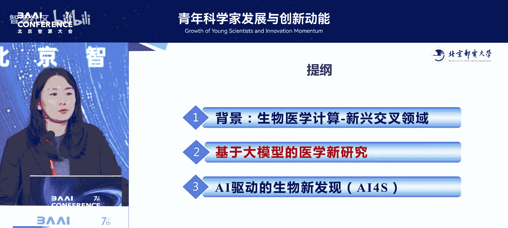
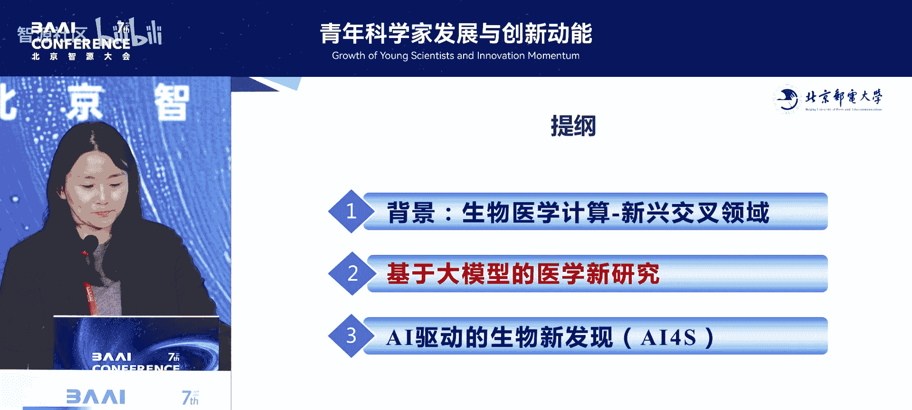
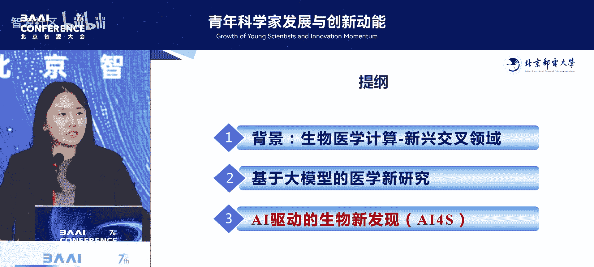
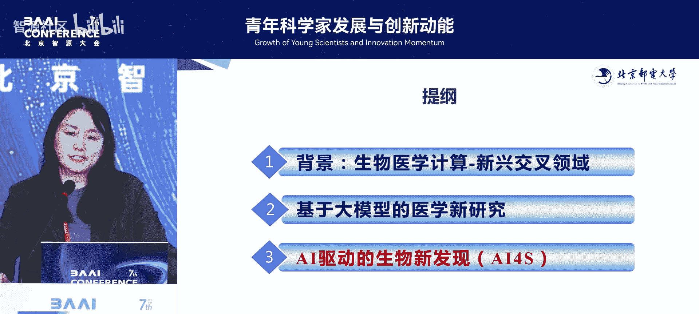
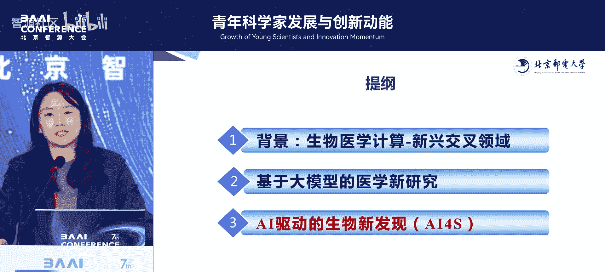

# 青年科学家发展与创新动能论坛-p06-生物医学计算：信息驱动的前沿交叉研究：王光宇

在本节课中，我们将学习王光宇研究员关于生物医学计算领域的分享。课程将涵盖该交叉学科的研究背景、青年科研人员的成长路径、以及在大模型时代下如何开展有特色的前沿工作。我们将重点了解如何利用信息智能工具解决生命科学与医学中的实际问题，并探索从基础平台构建到科学智能应用的全过程。

## 1：研究背景与交叉学科定位

生物医学计算是一个前沿的交叉研究方向。其研究对象是医学和生命科学，但研究手段主要是信息智能工具。整个生命和医学领域的发展，非常依赖于工具革新。

随着生物技术和信息技术的发展，我们积累了大量的数据和前期储备。发展到现在，通过智能和计算手段，有可能为该领域提供新的工具。反过来，在解决开放世界或实际环境问题的过程中，我们也希望推动方法本身的改进。

生命可以被视为一个复杂的信息系统。我们希望通过智能方法，对疾病或生命过程进行建模、预测，或进行更好的干预与调控。我们的工作主要围绕这些方面展开。

## 2：青年科研人员的平台融合与研究方向形成

上一节我们介绍了生物医学计算的宏观背景，本节中我们来看看青年科研人员如何在一个新平台上建立自己的研究体系。

我大约5年前加入北京邮电大学。北邮以信息网络研究为主，在此开展交叉学科研究有一定挑战。我的经验是，必须立足于平台自身的优势。

我们所在的网络与交换技术全国重点实验室，在信息领域有显著优势，例如在语音通信、AI等方面有深厚积累。团队希望我能推动生物医学计算方向的发展。因此，过去5年，我作为一个青年教师，核心任务是探索如何与团队更好地融合，利用团队优势，逐步形成自己的研究体系。

以下是基于平台优势开展的一些基础性工作：
*   **数据安全与隐私计算平台**：利用北邮在网络安全方面的优势，我们开发了隐私计算平台，以解决生物医学数据在流通和协同建模中的特定问题。
*   **可信隐私计算框架**：针对生物医学领域的数据安全需求，我们构建了可信的隐私计算框架，包括我们具有优势的多方安全联邦学习等技术基础，旨在更好地支持临床科研需求。
*   **生物医学融合分析平台**：生物医学计算涉及大量多模态、异构数据及其动态融合。我们建立了相应的分析方法体系。

在这些基础之上，我们开展了一系列应用探索，包括影像诊断、疾病建模、用药策略等。总之，作为青年老师，前期应紧密结合团队需求，形成有特色的研究方向。

## 3：在“内卷”的大模型时代寻找特色路径

在上一节我们讨论了如何依托平台建立研究基础，本节中我们来看看如何在竞争激烈的领域，特别是大模型时代，形成有标志性的成果。

大模型技术近年来发展迅速，竞争非常激烈。在交叉学科领域，同样存在对这类工具的需求。大模型本质上是人类知识的压缩器。如果我们能有一个基础工具来解决生物医学领域的通用任务，它将成为一个重要的底层基础设施。

近年来，包括《自然》及其子刊上，出现了大量相关的前沿工作。我们关心的是，在交叉学科中，如何构建特定领域的大模型。

医学数据模态与自然场景不同。例如，病理图像分辨率极高（可达10亿像素），在预训练方法上需要特别设计。此外，医学场景更关注安全性和可靠性，如何解决幻觉等问题至关重要。

以下介绍我们在大模型方向上的几项工作探索：

### 3.1：构建与验证领域基座模型

我们构建了一个目前规模较大的生物医学领域基座模型。目标是尽可能将开源生物医学语料知识压缩到模型中。

为了验证并提升其在特定任务上的能力，我们选择了诊断任务进行深入研究。我们主要做了两件事：一是进行大规模领域增量训练；二是通过思维链微调等方法，使模型对齐领域专家的需求。

在诊断任务中，生成式模型在细粒度分类任务上表现不佳。为此，我们引入了层次化的诊断知识偏好，引导模型生成更精准、可靠的诊断结果。测试表明，该模型在常见科室和罕见病（尤其是真实世界中的长尾分布数据）上都能达到非常好的性能。

我们还进行了临床分析。例如，在北京大学第三医院，我们请医生进行案例分析，发现大模型能够识别出更多被医生忽视的异常情况，从而提升诊断能力。我们也从领域出发，构建了评估其有效推理能力的人力评估框架。

### 3.2：构建可扩展的医学视觉基础模型

视觉大模型领域竞争同样激烈。常见做法是快速构建数据集并进行领域微调后发布。这对希望做深度传统研究的人员压力很大。

我们通过深入探索，发现现有的一些快速工作可能存在**负迁移**问题。即，将大量数据混合训练后，模型在特定任务上的性能可能下降。

为了解决这个问题，我们构建了一个**层次化、高度可扩展**的数据集。它基于领域词表和专家标注，形成了高质量的影像-掩码对，基本覆盖了开源数据中不同模态、器官部位和疾病。

为了消除负迁移，我们引入了医学知识的先验表征网络。通过知识先验，可以更好地聚合语义相关的任务，减少无关任务带来的负面影响。我们还采用了基于知识先验的混合专家模型，动态激活不同专家，提供不同策略。

这项工作的一个显著优势是效率高。与领域内知名的通用分割大模型相比，我们仅需其5%到25%的微调数据，就能达到对方100%数据微调的性能。

### 3.3：面向早期筛查的表观遗传组学基础模型

组学数据（如用于液体活检的cfDNA甲基化数据）可用于早期疾病筛查。但其早期信号微弱，且特征维度高、筛选困难。

我们提出了一个表观遗传组学基础模型，旨在更好地学习CpG位点之间的关联知识。通过一系列工作，我们实现了高效的早筛能力。在方法上，我们更多是从问题或数据特点出发进行创新和改进。

做交叉研究很有意义和成就感。我们希望在非常“卷”的大模型时代，探索自己的路径，在领域内做有价值的事情，实现研究的价值。

## 4：迈向科学智能：从辅助决策到加速新发现

前面我们主要讨论了AI在临床诊断辅助决策中的应用，本节我们探讨AI如何加速新的科学发现。

我们更希望AI能够触及人类不太擅长的工作，真正加速新知识的发现。近年来，我们也在科学智能方面开展工作。

### 4.1：蛋白质功能预测与交互分析

AlphaFold等工具在蛋白质结构预测上取得了开创性成果。我们更关心的是如何预测蛋白质的功能，这对解决生物问题至关重要。

我们围绕蛋白质相互作用开展了一系列工作。例如，我们提出了一个通用的蛋白质交互分析框架 **UniBind**。该框架首先将蛋白质在不同尺度上表示为图结构，然后设计了一系列方法模块来提取蛋白质交互过程中的几何和能量信息，并进行多任务学习（如预测亲和力变化）。

这项工作的计算价值显著。例如，在新冠疫情期间，我们可以提前2到3个月预测未来的优势毒株（见原文左图），这能为前瞻性的药物设计提供工具。为了让工具更普及，我们正在开发 **UniPPI** 工具，它能动态集成不同尺度的预训练模型，实现更优的PPI预测。

### 4.2：蛋白质-RNA相互作用预测

与蛋白质-蛋白质相互作用预测相比，蛋白质-RNA相互作用的预测更具挑战：数据更加稀缺，且结合模式更灵活。

为此，我们进行了方法探索，构建了 **CoBind** 工具。它利用三维复合物信息进行引导，结合蛋白质语言模型和RNA语言模型，形成了一个多模态的生物预训练语言模型，用于预测结合亲和力。我们还投入大量精力构建了目前规模较大的蛋白质-RNA结合亲和力数据集，以推动领域研究。

### 4.3：走向实际应用：肿瘤免疫与个性化疫苗

在上述基础之上，我们更加关注实际应用。例如，在肿瘤免疫中，涉及抗原肽和抗体的优化。

我们正深入探索相关问题，例如如何理解肿瘤中HLA口袋、癌症抗原肽与TCR结合的过程。若能很好地建模这一过程，将对个性化疫苗设计非常有用。我们希望通过计算工作，与实验团队深度合作，设计能更强激发免疫反应的个性化疫苗，加速整个医学领域的发展。

## 5：总结与问答环节

本节课中我们一起学习了生物医学计算这一交叉学科的研究脉络。从依托平台优势建立研究基础，到在大模型时代开展有特色的工作，再到迈向加速科学发现的智能研究，我们看到了信息智能工具驱动生命医学前沿探索的广阔前景。

做交叉学科研究，最终要找到自己独特且感兴趣的方向。这可能是一条少有人走的路，或充满不确定性，但这样的工作更有机会带来科学发现的快感和成就感。

---

### 现场问答精选

**问（西安交通大学博士生华梦博）：** 作为高校老师，在构建基座大模型时，如何克服在计算资源、数据收集及大量重复性工作方面的困难？

**答：** 高校相比工业界确实存在资源挑战。我的经验是：第一，不做通用领域训练，而是聚焦解决特定领域问题，确保工作有实际推动价值，而非盲目跟风。第二，计算资源方面需要积极寻求合作（“到处化缘”），当做出一定成果后，合作会更容易开展。

**问（现场老师）：** 1. 通用医学大模型是基于开源数据还是结合了临床专病数据？2. 在医学场景下，大语言模型与影像/病理等多模态融合的技术趋势是什么？

**答：** 1. 我们的模型主要以开源数据为主，但采用了领域知识层次化组织的方式，使得模型和数据可以动态扩展。我们通过专家知识表征学习和动态激活专家网络等方法，来提升模型在深层任务上的能力。2. 医学多模态融合，我们更关注构建**原生**的领域基座模型。因为医学数据有其独特性（如输入尺度高、对推理要求高），我们正在探索更适合这些特点的方法。

**问（北京大学物理学院博士生）：** 组学基础模型如何与具体检测结合？在疾病筛查中如何使用并迭代模型？当前推进的主要难点是什么？

**答：** 基座模型是在大规模组学数据（如甲基化数据）上预训练的。在具体疾病（如乳腺癌）早筛时，会使用少量该疾病数据进行微调，利用基座模型已有的强大能力。当前挑战包括：一方面，组学、分子层面的数据相比医学影像更难获取；另一方面是方法设计。我们正尝试与生物实验室合作，进行干湿闭环的主动学习，以优化数据采集和模型迭代。生成式模型也是解决数据问题的一个探索方向。