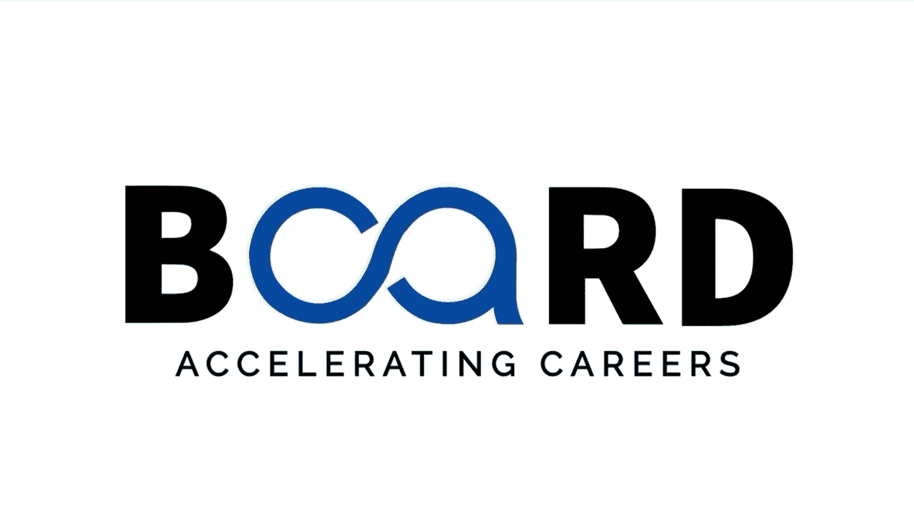

#  002：认识你的导师 👨‍🏫

在本节课中，我们将认识本课程的导师，了解他的专业背景和行业经验，为后续的学习旅程奠定基础。

大家好，我是Nathan Agraal，一位经验丰富的数据科学专业人士。

我拥有14年在生成式AI、大语言模型、机器学习、自然语言处理、深度学习以及数据分析领域的专业经验。

我的工作经历覆盖了医疗保健、科技、审计、航运和物流等多个行业。

在我的职业生涯中，我有幸指导了众多在数据科学、人工智能及相关技术领域的学生。分享我的专业知识，并见证学习者的成长，是我极大的满足感和动力来源。

我热切期待与你们一同踏上这段共同学习的旅程。

---

本节课中，我们一起认识了本课程的导师Nathan Agraal，了解了他深厚的技术背景和跨行业的丰富经验。在接下来的课程中，他将带领我们深入探索生成式AI与提示词工程的奥秘。