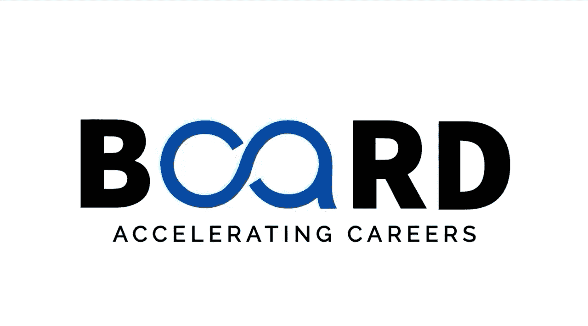

生成式AI：提示词工程基础｜P4：生成式AI在各行业的演变 🚀

在本节课中，我们将深入了解生成式AI如何变革各行各业，探索其从技术萌芽到广泛应用的演变历程，并理解提示词工程在其中扮演的关键角色。

上一节我们介绍了生成式AI的基本概念，本节中我们来看看它如何在实际行业中发挥作用。

### 技术演变回顾 📜

人工智能并非全新概念。神经网络技术自20世纪50年代就已存在。然而，真正的转折点出现在2014年，随着**生成对抗网络**的引入，情况开始迅速升温。这是一个游戏规则的改变者，因为它允许AI通过让两个模型相互竞争来创建逼真的图像，类似于一种AI内部的对抗。

随后在2017年，一项重大突破发生：**Transformer架构**被提出。这一突破彻底改变了AI处理语言的方式，使其能够更好地理解上下文，并生成类人的文本。

此后，我们见证了诸如2018年的BERT、2019年的GPT，以及当然还有2022年的ChatGPT等一系列模型的诞生。这些模型使得AI对话感觉比以往任何时候都更加自然。

### 行业应用与影响 🌍

现在，让我们谈谈现实世界的影响。生成式AI不仅仅是研究人员的实验工具，它已经深度嵌入全球各个行业。

以下是生成式AI正在重塑几乎所有行业的方式：

*   **内容创作**：AI可以协助生成文章、营销文案、诗歌和剧本。
*   **设计与艺术**：AI能够创建图像、插画，并进行艺术风格转换。
*   **软件开发**：AI可以辅助编写代码、调试程序，甚至生成软件文档。
*   **客户服务**：AI驱动的聊天机器人能够提供24/7的客户支持。
*   **教育与研究**：AI可以生成学习材料、解释复杂概念，并协助进行文献综述。
*   **医疗健康**：AI有助于分析医学影像、加速药物发现和生成个性化治疗建议。

### 核心技能：提示词工程 💡

随着生成式AI的普及，通过**提示词工程**与AI进行有效沟通的能力，正成为一项至关重要的技能。提示词工程的核心在于如何精心设计输入指令，以引导AI模型生成最符合期望的输出结果。

在后续课程中，我们将深入探讨如何利用这些能力，从AI中获得最佳结果。

### 总结与预告 📝

本节课中，我们一起学习了生成式AI从GANs、Transformer架构到GPT系列模型的技术演变路径，并看到了它在内容创作、设计、软件开发等多个行业的广泛应用。我们认识到，掌握提示词工程是有效驾驭这些AI能力的关键。

在下一个视频中，我们将了解一些关键的生成式AI模型及其具体应用场景。感谢观看，我们下期再见。