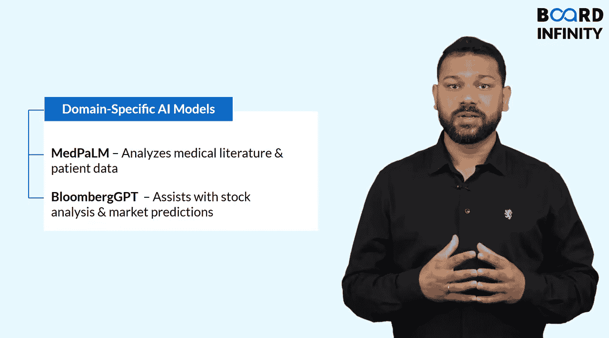

生成式AI：提示词工程基础：P5：关键模型（GPT、BERT、T5等）及其应用场景 🧠

在本节课中，我们将深入了解驱动当今AI应用的一些关键模型，包括GPT、BERT和T5。理解这些模型的工作原理，将帮助我们更好地进行提示词工程。

---

### 概述

我们已经探讨了生成式AI的工作原理及其如何改变各行各业。现在，让我们近距离观察一些为当今AI应用提供动力的关键模型。

---

### GPT：文本生成大师

首先介绍GPT（生成式预训练变换器），这是由OpenAI开发的一系列模型。可以将GPT视为生成类人文本的首选AI，无论是撰写文章、回答问题还是生成代码，它都能胜任。ChatGPT等工具就是由GPT驱动的。

GPT的独特之处在于其**自回归**特性。这意味着它一次预测序列中的下一个词，逐步生成文本。其公式可以简化为：

**`P(下一个词 | 所有之前的词)`**

正是这种机制，使得GPT能够生成连贯、流畅的回应。如果你曾使用AI来起草邮件、运行聊天机器人或进行创意写作，背后很可能就是GPT在发挥作用。

---

### BERT：上下文理解专家

接下来是BERT（来自变换器的双向编码器表示），由Google创建。与GPT从左到右阅读文本不同，BERT能同时从两个方向处理词语，这使其成为理解上下文的专家。

这使得BERT在搜索引擎、情感分析和文本分类等任务上表现出色。例如，当你在Google中输入一个模糊的搜索查询却仍能得到准确结果时，这就是BERT在发挥作用，帮助Google理解你的意图。

---

### T5：统一的文本到文本框架

现在让我们谈谈T5（文本到文本传输变换器）。T5将每一个自然语言处理任务都视为一个文本生成问题。

这意味着它可以在一个统一的框架内处理翻译、摘要甚至问答等任务。其核心思想是：

**`任务：输入文本 -> 输出文本`**

无论是需要将文本从一种语言翻译成另一种语言，总结一份冗长的报告，还是回答复杂问题，T5都是处理这类任务的理想模型。

---

### 领域专用AI模型

除了这些通用模型，我们还有为特定领域训练的专用AI模型。

以下是两个例子：

*   **Med-PaLM（用于医疗）**：帮助医生分析医学文献和患者数据。
*   **Bloomberg GPT（用于金融）**：基于金融数据训练，协助进行股票分析、市场预测甚至财务报告。

---

### 这对提示词工程为何重要？🎯

了解这些模型的工作原理，有助于我们根据其优势来设计更好的提示词。在本课程中，我们将主要关注像GPT这样的通用模型，但你在这里学到的技能，可以应用于未来或现在接触的任何AI模型。

---

### 总结

本节课我们一起学习了三种关键的AI模型：擅长文本生成的**GPT**、精于上下文理解的**BERT**，以及采用统一文本到文本框架的**T5**。我们还了解了领域专用模型的存在。理解这些模型是进行有效提示词工程的重要基础。在下一个视频中，我们将深入探讨生成式AI的实际应用。