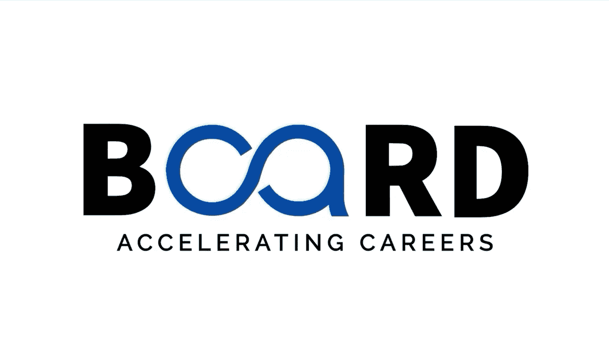

生成式AI：提示词工程基础：P6：实际应用：文本生成、内容创作与自动化 🚀

在本节课中，我们将探讨生成式AI在现实世界中的具体应用。我们将看到，AI不仅仅是未来的概念，它已经通过文本生成、内容创作和自动化，在各个行业中发挥着重要作用。

上一节我们介绍了生成式AI的基础概念，本节中我们来看看它如何在实际场景中大放异彩。

### 内容营销 📈

在内容营销领域，AI正成为强大的助手。企业利用AI来草拟博客文章、创建产品描述以及生成引人入胜的社交媒体内容。

以下是AI在内容营销中的具体应用：
*   **工具示例**：像 **Jasper** 和 **Copy.ai** 这样的工具正在帮助营销团队规模化地生产内容。
*   **核心协作模式**：AI草拟，人类优化。这种协作模式能产出高质量、有吸引力的内容。

### 客户服务 🤖

生成式AI驱动的聊天机器人正在改变公司与客户互动的方式。

以下是AI在客户服务中的具体应用：
*   **平台示例**：**Intercom** 和 **Drift** 等平台提供7x24小时支持，回答常见问题、排查故障。
*   **工作流程**：在需要时，它们能将复杂问题无缝转接给人工客服。结果是响应更快，客户满意度更高。

### 软件开发 💻

软件开发是另一个令人兴奋的应用领域。如果你是一名开发者，可能听说过 **GitHub Copilot**。

以下是AI在软件开发中的具体应用：
*   **核心功能**：它是一个AI驱动的编码助手，能根据自然语言描述建议代码片段，甚至完成整个子函数。
*   **类似工具**：同样地，**Replit Code Writer** 也在帮助开发者更高效地编写和调试代码。

### 法律文档自动化 ⚖️

法律文档自动化是另一个变革性的应用。AI可以草拟合同、总结报告，并从法律文件中提取关键细节。

以下是AI在法律领域的具体应用：
*   **核心价值**：律师事务所现在使用AI工具来创建合同的初稿，为律师和法律团队节省无数小时。

### 电子邮件管理 📧

我们也不能忘记电子邮件管理。像Gmail的“智能撰写”和“智能回复”这样的功能，帮助用户快速撰写回复、总结冗长的邮件线程并优先处理关键信息，让收件箱管理比以往更顺畅。

### 教育 📚

在教育领域，AI正在使学习更加个性化。它能生成针对不同技能水平定制的教案、测验和个性化学习材料，同时帮助教师和学生。

### 核心要点与过渡 🔑

所有这些应用都有一个共同的主线：**AI输出的质量取决于输入（即提示词）的质量**。一个结构良好的提示词，可以带来天壤之别的结果——从模糊的回应到富有洞察力的回应。

而这正是我们下一节课要深入探讨的内容。在下一课中，我们将开始解锁提示词工程的力量，学习如何构建精确、有效的提示词，以获得最佳可能的结果。

本节课中，我们一起学习了生成式AI在内容创作、客户服务、软件开发、法律、邮件管理和教育等多个领域的实际应用案例，并理解了高质量提示词对于获得优质AI输出的关键作用。