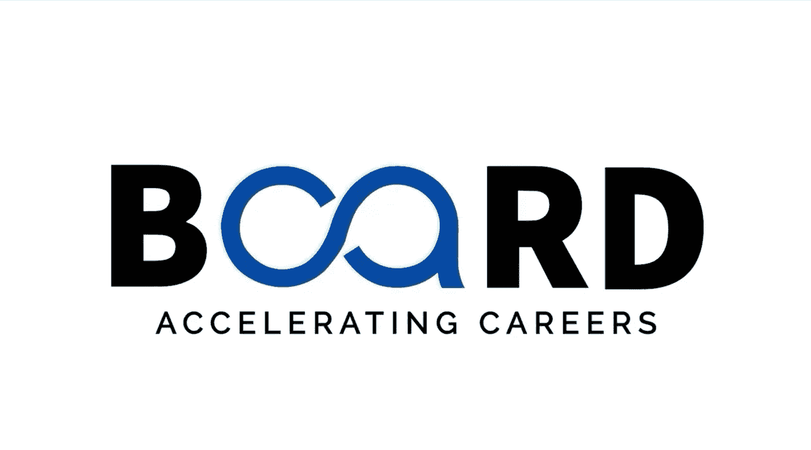

#  009：设计有效提示的关键原则 🛠️

在本节课中，我们将学习设计有效提示词的七个关键原则。这些原则是引导AI生成高质量、精准回应的核心工具。

在上一节视频中，我们了解了提示词如何塑造AI的回应。本节中，我们将深入探讨构成有效提示词工程的关键原则。你可以将这些原则视为从AI获取最佳结果的工具箱。

## 1. 具体性原则 🎯

模糊的提示词会导致模糊的回应。

想象一下，你问朋友：“告诉我关于气候变化的事。”你可能会得到一个宽泛、笼统的回答。相反，如果你问：“气候变化对太平洋西北部海洋生态系统产生了哪三种影响？”你将得到一个更加聚焦和有用的答案。AI的工作原理与此相同。你的提示词越具体，得到的回应就越好。

## 2. 上下文原则 📖

提供背景信息有助于AI理解你的具体需求。

如果你只是说“我如何修复这段代码？”，AI并不知道你的技能水平、使用的编程语言或具体问题。更好的方式是尝试这样说：“我是一名Python编程初学者，正在做一个网络爬虫项目。我的代码抛出了一个索引错误。这是我的代码片段，我该如何修复它？”然后附上代码片段。这些额外的信息有助于AI根据你的具体情况和技能水平来定制回应。

## 3. 定义输出格式原则 📊

明确说明你希望信息以何种形式呈现。

例如，你可以说：“创建一个表格，比较电动汽车、混合动力汽车和燃油汽车在成本、环境影响和维护需求方面的差异。”这为AI提供了清晰的结构化指导。

## 4. 角色分配原则 👨🏫

要求AI采用特定的视角可以产生更专业的回应。

例如，“作为一名经验丰富的教师，请对这份教案提供反馈。”这引导AI从教育者的角度来处理任务。通过分配角色，你可以促使AI给出更接近专家水平的回应。

## 5. 设定约束原则 ⛔

为你想要的内容设定边界。

例如，“用不超过200字解释量子计算，并避免使用技术术语。”这些约束条件能将回应的焦点集中在你最需要的内容上，并据此调整回应。

## 6. 利用示例原则 📝

引导AI的最佳方式是提供一些示例。

例如，“请按照这种风格撰写描述”，然后给出几个例子。这为AI提供了可遵循的模式，使输出更符合你的期望。

## 7. 迭代是关键原则 🔄

即使是最好的提示词也并非总能一次成功。要获得完美的回应，请将提示词工程视为一场对话：尝试一个提示词，查看回应，然后调整、优化它，直到获得满意的结果。遵循上述原则将减少你所需的迭代次数。

这些原则并非僵化的规则，而是可以根据你的具体需求进行调整的指导方针。随着你不断练习提示词工程，你将培养出在不同情境下判断哪些原则最重要的直觉。

在本节课中，我们一起学习了设计有效提示词的七个关键原则：具体性、提供上下文、定义输出格式、角色分配、设定约束、利用示例以及迭代优化。掌握这些原则将帮助你更高效地与AI互动，获得更精准的回应。

在下一个视频中，我们将探讨提示词设计中常见的陷阱以及如何避免它们。感谢观看，我们下期再见。