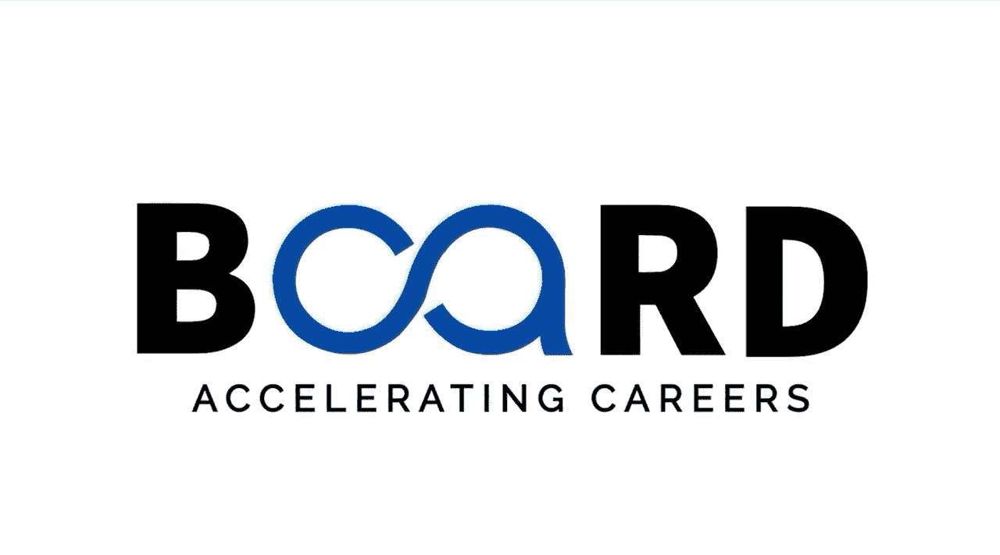

生成式AI：提示词工程基础：P10：提示设计中的常见陷阱及如何避免 🚧

在本节课中，我们将探讨提示词设计中的常见陷阱，并学习如何避免它们，以获得更精准、有用的AI回复。

我们已经介绍了提示词工程的基础知识，现在让我们来谈谈不应该做什么。即使是经验丰富的用户也可能遇到问题，导致AI的回复模糊、误导或不完整。但别担心，一旦你认识到这些陷阱，就很容易避免。

### 陷阱一：提示词过于模糊

第一个主要陷阱是提示词过于模糊。当提示词缺乏具体性时，AI的回复往往会非常笼统且没有帮助。

例如，询问“给我一些营销点子”得到的结果，远不如“为一家面向注重健康的千禧一代的小型有机面包店，建议五个社交媒体营销策略”有用。

**核心建议**：始终问自己，我是否提供了足够的细节来获得精确的答案？

### 陷阱二：忽略上下文

另一个常见错误是忽略上下文。AI模型不会自动了解你的具体情况。

例如，如果你在请求技术问题的帮助，你需要包含关键细节：你正在使用什么软件工具、什么版本、你已经尝试过什么方法。没有上下文，AI可能会做出错误的假设，给出不符合你需求的答案。

### 陷阱三：复合型提示词

许多用户会陷入“复合型提示词”的陷阱，即在一个提示词中提出多个不相关的问题。这通常会导致答案不完整，因为AI可能只关注一个方面而忽略了其他方面。

**解决方案**：将复杂的查询分解为独立的、聚焦的提示词。

### 陷阱四：使用歧义语言

歧义语言是另一个陷阱。具有多重含义的词语可能导致误解。

例如，询问“Python应用”可能指的是用Python编写的应用程序，也可能指的是Python的应用领域。请确保术语的精确性。

### 陷阱五：提供过多无关信息

有些用户提供了过多不必要的细节，将实际请求淹没在无关信息中。虽然上下文很重要，但应专注于对生成你所需回复真正重要的细节。

### 陷阱六：使用未解释的行话或缩写

另一个错误是使用未解释的行话或缩写。虽然现代AI系统能识别许多专业术语，但清晰总是更好的选择。请定义不常见的缩写或行业特定术语。

### 陷阱七：未指定受众

许多用户未能指定其受众。适合专家的内容与适合初学者的内容是不同的。请明确说明谁将阅读或使用这些信息。

### 陷阱八：未设定约束条件

忽略设定约束条件通常会导致回复要么过于冗长，要么过于技术化。请指定参数，如长度、复杂程度或格式，以获得更有用的结果。

### 如何避免：使用提示词模板

为了避免这些陷阱，你可以为常见任务开发一个简单的提示词模板。以下是一个基本结构：

以下是构建有效提示词的基本结构：

1.  **上下文**：AI需要哪些背景信息？
2.  **具体请求**：你希望AI做什么？
3.  **格式偏好**：你想要表格、摘要还是分步指南？
4.  **约束条件**：字数限制、正式或非正式语气。
5.  **受众**：这些信息是为谁准备的？

通过这种方式构建你的提示词，你将能持续获得更好的结果。

### 总结

本节课中，我们一起学习了提示词设计中常见的八个陷阱，包括提示词模糊、忽略上下文、使用复合提示词等，并了解了如何通过提供具体细节、拆分问题、明确术语和受众，以及使用结构化模板来避免这些问题。

在下一课中，我们将以此为基础，探索更高级的技巧来进一步优化你的提示词。