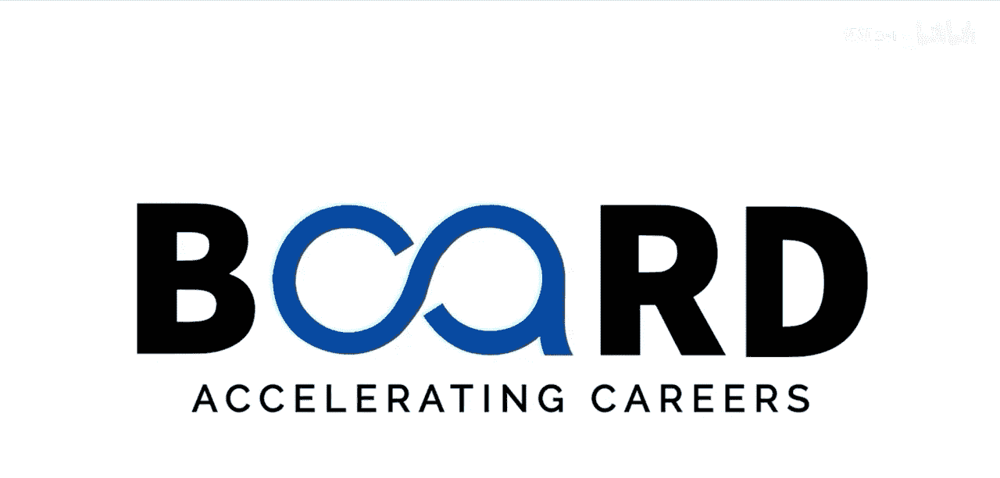

#  015：尝试不同的提示结构、具体性与上下文 🧪

在本节课中，我们将学习如何通过调整提示词的结构、具体性和上下文位置，来引导AI生成更符合需求的回答。我们将探讨几种有效的提示框架，并理解它们如何影响AI的响应质量。

---

上一节我们学习了如何优化和微调提示词。本节中，我们将更进一步，尝试不同的提示结构，并观察它们如何影响AI的回应。这就像构建一段对话，**你提问的方式决定了回答的有用程度**。提示词的结构与你使用的词语同等重要。

让我们深入探讨几种高效的提示结构。

以下是第一种高效的结构框架：**角色-任务-上下文-标准**框架。

*   **角色**：你是一位经验丰富的金融分析师。
*   **任务**：根据以下指标评估这家公司的财务健康状况。
*   **上下文**：这是一家SaaS初创公司，年经常性收入为200万美元，年增长率为40%。
*   **标准**：重点关注烧钱率、客户获取成本和生命周期价值比率。

这种结构清晰明了。通过明确定义每个部分，你可以引导AI生成更全面、更有针对性的回答。

另一种强大的结构是**比较框架**，它明确要求AI考虑多个视角或方法。

*   比较这三种用于预测房价的机器学习算法：线性回归、随机森林和神经网络。根据准确性、可解释性和计算需求对每种算法进行评估。

如果你希望获得实际应用的建议，可以尝试让AI基于**场景结构**进行工作。

*   假设你正在为一家刚刚遭遇数据泄露的小型企业提供咨询。他们在前24小时内应立即采取哪些步骤？

对于复杂主题，**分层分解结构**非常有效。它从高层概述开始，然后系统地探讨子主题。

*   分三个层次解释区块链技术：
    1.  用一个简单的类比向完全的新手解释。
    2.  解释其核心技术组件。
    3.  探讨共识机制和智能合约等高级概念。

尝试不同的具体性程度也很有价值。有时，**刻意模糊**可以鼓励创造性的回答。

*   给我一些改善团队沟通的想法。

而**极度具体**则能获得精确且有针对性的信息。

*   为一个分布在六个时区的远程软件开发团队，推荐五种异步沟通工具。重点关注能与Github和Slack集成的工具。

**上下文在提示词中的位置**也会改变AI处理信息的方式。将重要上下文前置，可以确保它塑造整个回答；而逐步揭示上下文，则适用于需要逐步推理的任务。

并不存在一种适用于所有场景的“完美”提示结构。关键在于尝试不同的方法，并观察哪种最适合你的需求。

---

本节课中，我们一起学习了多种提示词结构框架，包括角色-任务-上下文-标准框架、比较框架、场景结构和分层分解结构。我们还探讨了调整提示词的具体性以及上下文位置对AI回答的影响。记住，灵活运用这些结构是获得理想回应的关键。在下一个视频中，我们将探索迭代提示技术，这是一种通过多次交互来优化输出的强大方法。