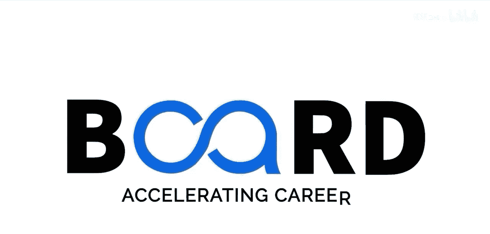

生成式AI：提示词工程基础：P18：利用AI进行内容创作：SEO、博客写作与数字营销 🚀


在本节课中，我们将探讨提示词工程在内容创作领域的实际应用。我们将学习如何通过精心设计的提示词，高效地生成博客文章、进行搜索引擎优化以及策划数字营销活动。

在上一节中，我们探索了能提升提示词工程工作流的工具和平台。本节中，我们来看看提示词工程在内容创作中的具体应用场景。无论你是撰写博客文章、进行搜索引擎优化还是策划数字营销活动，有效的提示词工程都能赋能你的内容工作流。想象一下，仅凭几个精心设计的提示词就能生成高质量内容的能力。生成式人工智能已成为内容创作的变革者，使营销人员和内容创作者能够比以往更快地制作出引人入胜的素材。

对于搜索引擎优化内容，提示词工程技术可以帮助锁定特定关键词，同时保持内容的可读性和价值。

以下是一个用于创建搜索引擎优化博客文章的高级结构化提示词示例：

```
创建一个关于[特定主题]的500字博客文章。
目标关键词短语为“[你的主要关键词短语]”。
自然地包含次要关键词两到三次。
文章结构应包括一个吸引人的引言、三到四个子标题，以及一个包含行动号召的结论。
优化可读性，使用短段落，并融入统计数据和实用建议。
使用适合目标受众的对话式但权威的语气。
```

这个提示词不仅涉及主题，还详细说明了搜索引擎优化的要求、文章结构和语气，这些都是提升搜索排名的关键。

对于数字营销活动，提示词可以被设计用于在多个渠道生成一致的信息。

以下是一个营销活动提示词框架示例：

```
为推广[你的产品]制定一个跨三个渠道（电子邮件、社交媒体和落地页）的连贯信息框架。
其独特的价值主张是[你的独特价值主张]。
目标受众是[你的受众人口统计细节]。
品牌声音是[每个渠道的声音特征]。
为每个渠道提供标题选项、正文文案和行动号召短语。
确保信息一致，同时适应每个渠道的格式和长度要求。
```

人工智能还可以通过精心构建的提示词来协助进行受众研究。

例如：

```
基于当前的数字营销趋势，为[你的产品]识别五个潜在客户画像。
包括他们可能面临的痛点、购买异议、偏好的内容类型以及触达他们的最佳营销渠道。
为每个人物画像提出三个能解决其独特关切的具体内容创意。
```

对于内容刷新和再利用，提示词工程能够高效地转化现有内容。

让我们看一个例子：

```
将这篇博客文章（[你的文章]）转化为：
1. 一个两分钟的YouTube视频脚本。
2. 五篇突出关键见解的LinkedIn帖子。
3. 一个概括主要统计数据和流程的信息图。
在适应每种格式优势的同时，保持核心信息不变。
```

通过重新利用内容，你可以最大化原始作品的价值，并在不同平台上触达不同的受众。在内容创作中取得成功的关键在于开发可以重复使用并随时间优化的提示词模板。许多营销团队现在为不同类型的内容维护着经过验证的提示词库，使他们能够以最少的精力持续产出高质量的材料。

在本节课中，我们一起学习了如何利用提示词工程进行搜索引擎优化博客写作、策划跨渠道数字营销活动、进行受众研究以及高效地再利用现有内容。掌握这些技巧，你将能显著提升内容创作的效率和质量。



在下一个视频中，我们将转换方向，探索提示词工程如何被用于代码生成和自动化任务。感谢观看，让我们继续构建这些技能。