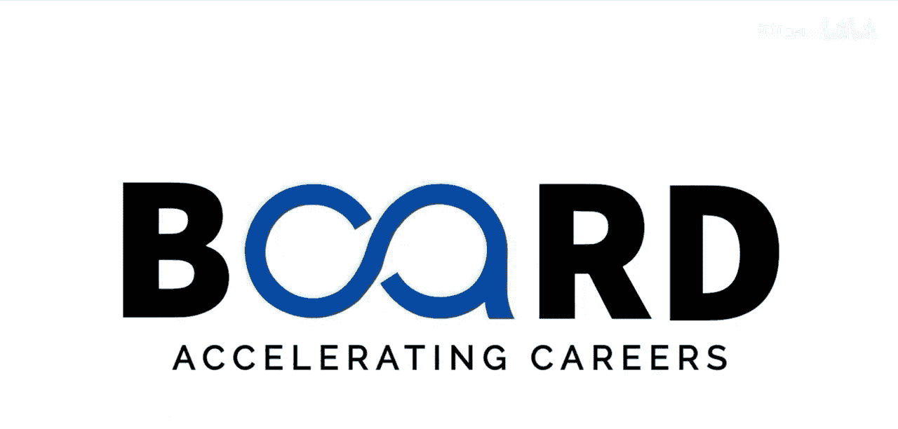

生成式AI：提示词工程基础：03：提示工程的未来：趋势、职业路径与新兴技术 🚀

在本节课中，我们将展望提示词工程的未来，探讨其发展趋势、相关的职业机会以及正在重塑这一领域的新兴技术。

上一节我们探讨了提示词工程的伦理层面，现在让我们向前看，展望其激动人心的未来。我们将了解塑造这一领域的趋势、职业机会和突破性技术。

### 趋势：从实验技能到正式学科

提示词工程正在演变为一门正式的学科。它最初是一项实验性技能，如今已被认可为一个结构化的领域，拥有最佳实践、专门的职位角色，甚至认证项目。

以下是当前的主要发展趋势：

*   **多模态提示的兴起**：技术层面，多模态提示正在兴起。它将文本、图像、音频和视频整合到单一的交互中。能够跨这些模态进行设计的工程师将拥有巨大优势。
*   **协作式提示工程**：协作式提示工程也日益受到重视。领域专家、用户体验设计师和人工智能专家组成团队，共同创建高性能的提示词。
*   **提示管理系统**：同时，提示管理系统正在出现，用于跟踪、测试和优化提示词，将其视为有价值的交互资产。

### 职业路径：广阔的机遇

在职业发展方面，机遇正在快速增长。以下是一些关键的职业路径：

*   **提示词工程师**：专注于设计高质量AI提示词的专业人员。
*   **AI开发人员**：将提示词工程与软件开发相结合的专业人员。
*   **行业专家**：在医疗保健、金融、法律等不同领域应用AI的专业人员。
*   **AI伦理学家**：确保提示词公平、负责任的专业人员。

### 新兴技术：重塑未来格局

展望未来，一些新兴技术将重塑提示词工程的格局。这些技术包括：

*   **基于智能体的AI**：AI系统将不仅能响应提示，还能智能地与外部工具交互，这需要更精确的指令。
*   **可定制模型**：允许用户根据特定需求调整和优化AI模型。
*   **高级提示分析**：提供更深入的洞察，以评估和提升提示词的效果。

### 如何为未来做好准备

为了在这个未来中蓬勃发展，你可以采取以下行动：

1.  **持续实验**：不断尝试新的提示词技巧和方法。
2.  **建立个人提示库**：积累和整理有效的提示词。
3.  **保持社区参与**：与同行交流，学习最新动态。

本节课中，我们一起学习了提示词工程的未来发展趋势、多样化的职业路径以及关键的新兴技术。提示词工程是连接人类思想与AI行动的桥梁。掌握它，你将站在这场革命的前沿。