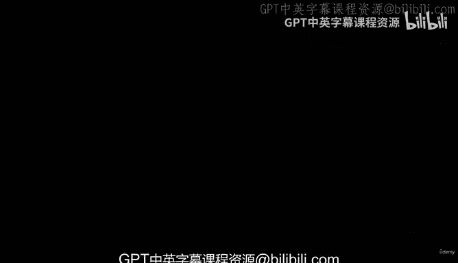
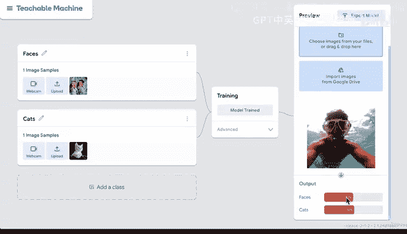
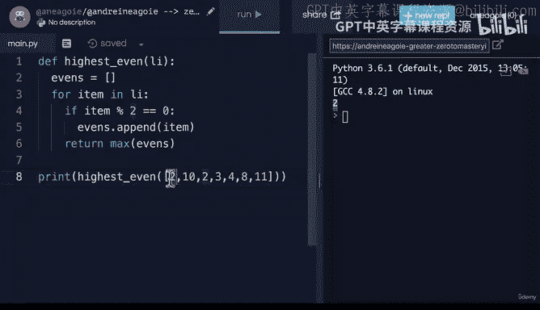
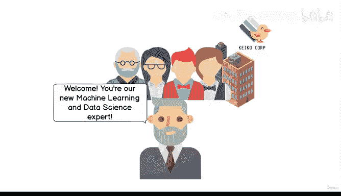

# 1：从零到精通的机器学习和数据科学训练营 🚀

在本节课中，我们将要学习《机器学习和数据科学训练营》的完整课程大纲。通过了解课程结构和学习路径，你将明确学习目标，为后续的学习打下坚实基础。

## 课程概述 📋

本课程包含超过200小时的视频内容，分为多个章节。我们将从机器学习的基础概念开始，逐步深入到实际项目和应用。课程设计旨在帮助你从零基础成长为精通机器学习和数据科学的专业人士。

## 章节详解 📚

### 1. 机器学习入门 🎯

首先，我们从机器学习入门开始。这一部分将介绍机器学习的基本概念，并通过一些有趣的工具帮助你理解机器学习的核心原理。掌握这些知识后，你将能够向朋友、家人解释机器学习的基本概念。

### 2. Python编程基础 🐍

上一节我们介绍了机器学习的基础概念，本节中我们来看看编程语言的选择。课程提供了两条学习路径：

*   如果你没有编程经验或从未接触过Python，我们将教你Python基础知识，以便你能跟上后续课程。
*   如果你已经熟悉编程和Python，可以直接进入下一部分的学习。

### 3. 工作环境搭建 ⚙️

掌握编程基础后，我们需要搭建一个专业的工作环境。这一部分将介绍以下工具：

*   Jupyter Notebooks
*   Conda
*   虚拟环境

通过本节学习，你将拥有一个专业的工作环境，为实际工作场景做好准备。

### 4. 数据分析 📊

环境搭建完成后，我们将学习如何分析数据。以下是本部分的核心内容：

*   使用Pandas库进行数据分析
*   掌握数据处理的基本技巧

### 5. NumPy库学习 🔢

数据分析离不开强大的工具支持。NumPy是数据科学中非常重要的库，它是所有数据科学家的基础工具。我们将深入学习NumPy的使用方法。

### 6. 数据可视化 📈

数据可视化是数据科学中非常有趣的部分。我们将使用Matplotlib库制作精美的图表和可视化效果，以更直观的方式展示数据。

### 7. Scikit-learn入门 🤖

如果你想要深入学习机器学习，Scikit-learn是必须掌握的库。它允许我们使用模型、训练模型并评估模型的准确性。在这一部分，我们将学习完整的机器学习项目工作流程。

### 8. 实际项目实战 🛠️

理论学习之后，我们将进入实际项目实战阶段。这部分内容非常有趣，我们将深入探索机器学习。以下是本部分的核心项目：

*   监督学习
*   神经网络
*   迁移学习
*   深度学习
*   分类项目
*   回归项目
*   时间序列数据建模

我们不会回避困难的话题，课程后期将介绍高级主题，如深度学习神经网络和迁移学习。我们将使用最新版本的TensorFlow和Keras完成有趣的图像分类和迁移学习项目。此外，我们还将展示如何在模型中使用GPU加速训练。

### 9. 数据工程基础 🏗️

数据工程本身是一个完整的领域，但作为数据科学家，你需要了解其基本概念。本部分将介绍以下内容：

*   Hadoop
*   Spark

掌握这些知识后，你将了解这些工具在行业中的应用，并能与数据工程师有效沟通。

### 10. 故事讲述与沟通技巧 🗣️

这是课程中我最喜欢的部分之一。故事讲述和沟通技巧非常重要，但常常被忽视。为了成为一名成功的机器学习和数据科学工程师，你需要能够向管理层、老板和同事展示你的工作成果。

基于我们在行业中的经验，我们将教你如何提升故事讲述和沟通能力，以在同事中脱颖而出。数据科学是一个热门领域，要想成功，沟通能力至关重要。

## 课程特色 ✨

课程内容非常丰富，包含大量视频和练习。我们将通过一个故事情节展开学习：假设你被一家公司录用，老板会分配各种任务。这些任务基于我们在公司工作的经验设计，以确保你在找到第一份工作时能够适应工作环境。

从机器学习基础到实际项目构建，课程内容将形成一个完整的体系。我们将带你从零开始，逐步达到精通水平。

## 在线社区支持 👥

本课程最大的亮点之一是我们的在线社区。每天有数千名开发者在这里交流、互相帮助、解决问题，并讨论编程、数据和科技领域的最新动态。这是一个可选资源，你可以与其他学生、我和Daniel进行互动交流。我们的目标是让你感受到自己是课堂的一部分，而不是独自学习。

## 总结 🎉

本节课中我们一起学习了《机器学习和数据科学训练营》的完整课程大纲。通过了解课程结构、学习路径和特色内容，你已经为接下来的学习做好了准备。在下一节课中，我们将模拟你的第一个工作日，正式开始这门课程。

让我们开始学习，探索为什么数据科学家已成为全球最受欢迎的技能之一。让我们开始吧！