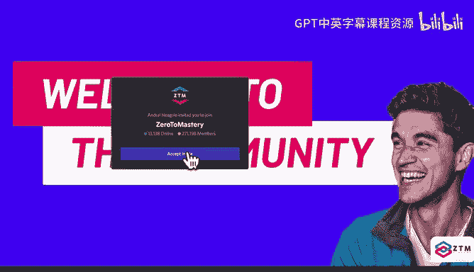
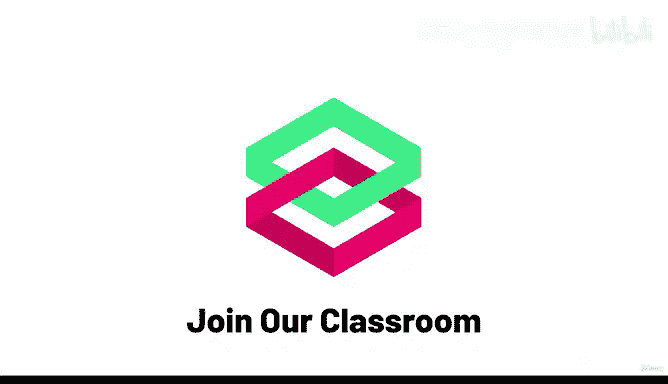

# 2：加入我们的在线课堂！👨‍🏫

在本节课中，我们将探讨如何通过加入在线课堂来提升学习成功率，确保你能够完成这门具有挑战性的课程。

---

## 概述

大多数人在家中舒适地学习在线课程时，往往会因为缺乏**监督**而难以坚持。本节将介绍一种有效方法，通过加入我们的在线社区来建立学习责任感，从而显著提高你完成课程的可能性。

---

## 为什么需要在线课堂？

上一节我们提到了学习中的挑战，本节中我们来看看如何克服这些困难。独自学习在线课程时，很容易因为缺乏外部动力而放弃。然而，研究表明，在群体中学习、拥有学习伙伴并建立责任感，能极大地提升成功率。

**核心公式**：  
`学习成功率 = 个人努力 + 群体支持 + 责任感`

---

## 如何加入在线课堂？

以下是加入我们在线课堂的三个关键步骤，每个步骤都旨在为你构建一个支持性的学习环境。

### 第一步：自我介绍

首先，你需要在社区中介绍自己。这有助于你融入集体，并公开承诺你的学习目标。

具体操作如下：
*   在社区中发布自我介绍。
*   分享你计划完成课程的目标日期。
*   将该日期记录在你的日历中。

### 第二步：寻找学习伙伴

接下来，你需要寻找一位或多位“责任伙伴”。你们可以互相监督，确保彼此都能完成设定的学习目标。

具体操作如下：
*   前往“责任伙伴”频道。
*   寻找同时开始学习ZTM课程的同学。
*   结成伙伴，互相督促完成课程和目标。

### 第三步：积极参与社区

最后，积极参与社区交流至关重要。在这里，你可以与其他学习者讨论任何话题，保持学习动力。

具体操作如下：
*   在“通用聊天”频道中自由交流。
*   使用课程专属频道进行针对性讨论。
*   定期参加由我和其他讲师举办的线上聚会。

---

## 社区支持的价值

我强调社区支持并非为了推销，而是基于一个简单的事实：在群体中学习、被其他学习者环绕、拥有责任感，你更有可能成功。这是经过验证的规律。

当你在课程中遇到困难时，请不要放弃。回到我们的Discord服务器提问并寻求帮助。更重要的是，随着你技能的增长，请回来帮助其他学生。**教授和帮助他人是巩固所学知识的最佳方法之一**。

如果你能围绕学习建立这样的习惯——打开Discord、开始上课、让自己置身于拥有相似目标的人群中——你将拥有完成课程所需的责任感和支持系统。我向你保证。

---

## 完成课程的奖励

作为一个小惊喜，当你完成课程后，你可以在“校友”频道分享你的结业证书，正式成为校友。社区中表现突出的成员还有机会成为明星导师。

这一切听起来或许有些特别，你可能会认为自己不需要任何人。但请相信我，我们从事教育多年，观察到一个持续的趋势：**那些完成课程、找到工作并在职业生涯中获得成功的人，正是积极参与社区的人**。有时，为了成功，我们必须做一些让自己不太舒适的事情。

---

## 总结

本节课中，我们一起学习了加入在线课堂的重要性及具体步骤。通过**自我介绍**、**寻找学习伙伴**和**积极参与社区**，你可以建立一个强大的支持系统，极大地提高完成这门具有挑战性课程的概率。记住，学习之旅不必孤单，社区将与你同行。

那么，就这样吧。我们下一讲再见，也在我们的社区里见！