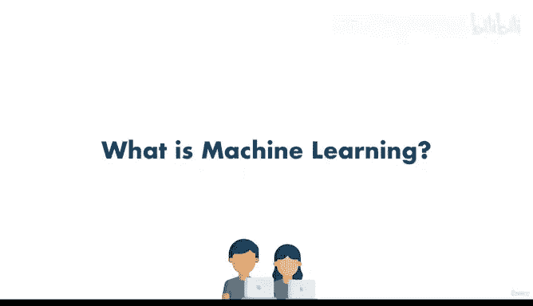

# 3：003_01_005 你的第一天 🚀

在本节课中，我们将学习如何向同事解释“什么是机器学习”。我们将通过一个虚构的职场故事，以简单直白的方式理解机器学习的核心概念。

---

恭喜你，你刚刚被 Cako 公司录用。他们是硅谷最新崛起的初创公司。

他们帮助分析大公司的数据，并就公司应如何处理数据提供咨询。

他们涉及自动驾驶汽车、安防摄像头领域。他们拥有一个在线交友应用和一个网站。

他们甚至拥有无人机，并且像亚马逊一样向其他大公司或初创公司提供服务。

而你刚刚被录用。太棒了。等等，你的职位是什么？你是新的机器学习和数据科学专家。

这有点尴尬，因为你其实对此一无所知，对吧？

也许知道一点点。也许你在新闻里听说过。但是，这将会很尴尬，因为为时已晚。

你已经被录用，人们希望你立即开始工作。于是你走进办公室，哦，你的老板就在那里。

就是那边那个发型完美的人。那是布鲁诺。他刚刚获得晋升，对于在 Cako 公司的数据部门产生影响感到非常兴奋。

而他刚刚聘请你来领导他们的一些项目。😊，现在，他表面上看起来很和善，但我感觉与他共事会很有挑战性，不过你知道，我们能挺过去的。

现在，如果你对如何来到 Cako 公司的记忆有些模糊，别担心。这是你上班的第一天。

你只知道自己是新的机器学习和数据科学专家。因为是第一天，按照惯例，你和同事一起出去吃午餐。

幸运的是，他们没有问你太多问题。他们似乎喜欢你。他们看起来很友好。

但在午餐时，问题来了。“嘿，我们听说过机器学习这个东西，布鲁诺说你是这方面的专家，我们很高兴你能加入团队，但机器学习到底是什么？”

你心里想。“哦，天哪。我该怎么说呢？嗯，这样吧，伙计们，我得回去工作了。时间不多，我明天再向你们解释。”

于是你跑开了，仍然困惑自己是怎么来到这里的。但幸运的是，这一天结束时，你没有暴露自己对此一无所知，也不知道自己是如何被录用的。

你熬过了第一天，但我们有个问题，对吧？明天，你必须去上班，并且要向你的同事们解释清楚。

希望你能在接下来的几周里生存下来，让人们知道你不是个冒牌货。但是，我们该怎么办呢？

幸运的是，你想起了你儿时的老朋友。他们的名字是安德烈和丹尼尔，看看他们小时候多可爱。

你打电话给他们说：“嘿，不知怎么的，我在硅谷找到了这份工作。薪水很高，但我完全不知道自己在说什么。”

幸运的是，他们懂。所以他们将在整个旅程中帮助你，确保布鲁诺不会解雇你，并且你能给所有同事留下深刻印象。

我们要做的是，每天在工作中，你会接到一些任务，然后回家后，安德烈和丹尼尔会帮助你，这样你就不会被解雇。

所以。😊，我们都在家里，试图决定如何解决这第一个问题。那就是：什么是机器学习？我们明天必须去上班并向同事解释。让我们开始吧。

---

## 什么是机器学习？🤖

上一节我们介绍了你入职第一天的尴尬处境，本节中我们来看看如何定义机器学习这个核心问题。

机器学习是人工智能的一个分支。其核心思想是让计算机系统能够从数据中**学习**，并根据学习到的模式做出**预测**或**决策**，而无需为每个特定任务进行明确的编程。

我们可以用一个简单的公式来描述其核心思想：

**机器学习 ≈ 从数据中寻找模式（Patterns）**

或者，用更技术性的方式表达，许多机器学习算法都在尝试解决一个优化问题，即找到一个函数 `f`，使得对于给定的输入 `X`，其输出 `y` 尽可能准确：

`y ≈ f(X)`

以下是机器学习的一些关键特点：

*   **基于数据**：算法通过分析大量数据来学习。
*   **自动改进**：随着接触到更多数据，模型的性能可以提升。
*   **用于预测或分类**：学到的模式可用于对新数据做出判断。

---

本节课中我们一起学习了如何向他人解释机器学习。我们通过一个故事引出了定义，并理解了其核心是让计算机从数据中自动学习模式。记住这个简单的概念，明天你就可以自信地向同事们解释了。在接下来的课程中，我们将深入探讨机器学习的具体类型和方法。