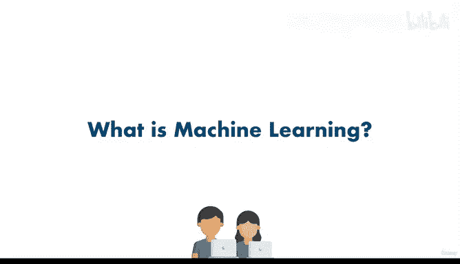

# 4：什么是机器学习？🤖

在本节课中，我们将要学习机器学习的核心概念，理解它为何重要，以及它与传统编程的区别。我们会从基础开始，用简单的语言解释这个正在席卷整个行业的技术。

## 概述：机器与人类的分工

在深入探讨之前，我们需要理解计算机的传统角色。机器或计算机在某些方面表现得非常出色。它们执行任务的速度极快，我们可以通过编程来控制它们，让它们为我们工作。

**编程**的本质就是：我们给计算机下达指令，让它执行任务。计算机的出现，使得人类能够快速完成那些过去可能需要数百名工人才能完成的工作。实际上，“计算机”这个词最初指的就是从事计算工作的人。

## 传统编程：基于规则的指令

让我们通过一个例子来理解传统编程。假设我想用谷歌地图找到去丹尼尔家的路。

*   一种方法是，我拿出一张地图，用尺子测量每一条可能去丹尼尔家的路线，然后做数学计算，找出最短路径。
*   另一种方法是，我让计算机来做这件事。我可以编程并询问计算机：“嘿，你能告诉我怎么去丹尼尔家吗？”

通过编程，我们告诉计算机：“你能快速计算这10条路线并找出最短的一条吗？” 这就是编程。我不需要花10分钟去计算，只需点击一个按钮，计算机就能告诉我答案。显然，我们需要先编程并给出指令，但一旦指令设定好，它就能立即为我们找到解决方案。

计算机之所以如此普及，是因为它们为公司节省了大量成本。与其雇佣大量工人，不如购买一台能完成100名工人工作的计算机。这样既省钱，计算机又不会抱怨，可以24/7为你工作。

这些机器或计算机非常擅长处理那些我们可以**描述**、可以用代码（如 `if-else` 语句块）来定义规则的事情。

以下是传统编程处理问题的典型思路：

1.  **明确规则**：我们可以清晰地描述逻辑。例如，在路线选择中，我们可以说：`如果 路线1 < 路线2 且 路线1 < 路线3 ... 那么 选择路线1`。
2.  **高效执行**：计算机能快速执行这些明确的规则和计算，从简单的路径计算到复杂的国际象棋对弈。理论上，我们可以用大量的 `if-else-then` 语句块来指导计算机如何移动棋子并分析利弊。

## 传统编程的局限：难以描述的问题

然而，这里存在一个问题。如果任务不是“如何去丹尼尔家”，而是判断“这个人是否生气”呢？

假设有人在亚马逊上留下了评论，或者我们正在开发一个检测人类情绪的产品。我们如何向计算机描述“生气”是什么意思？能用 `if-else` 语句块来实现吗？

再比如，这是什么？一只猫。我们如何告诉计算机什么是猫？假设我要求你编程让计算机检测一张图片是否是猫。你能编程实现吗？

你或许可以尝试描述：是的，猫有毛，猫有胡须，猫会“喵喵”叫。但计算机会反过来问你：什么是“喵喵叫”？什么是胡须？什么是毛发？

你会发现，事物越难以描述，我们就越难告诉机器该做什么。因此，我们雇佣人类来处理这些对我们来说更困难的事情。我们让机器处理更容易的部分——即那些我们可以清晰描述的事情。而那些难以直接给出指令的复杂任务，比如做销售或艺术创作，计算机并不擅长，所以我们雇佣人类来完成。

## 机器学习的登场：让机器更像人类

但随后出现了**机器学习**这个新理念。你肯定听说过它，因为它是我们行业当前的一个热门词汇。

机器学习拥有广泛的应用：自动驾驶汽车、机器人、视觉处理、语言处理、推荐引擎、翻译服务、股价预测等等。这都归功于机器学习。以前只有人类能做的事情，现在计算机通过机器学习也能做到了——当然，有时它能做对，有时则不能，我们后续会讨论这一点。

其核心理念是：**机器学习的目标是让机器的行为越来越像人类**。因为它们越聪明，就越能帮助我们人类实现目标。

在本节中，我们将学习一些理论来熟悉和理解这个主题。请不要担心或感到畏惧，我们将尝试简化内容，并在学习过程中找到乐趣。在后面的章节中，我们实际上将编写代码，构建自己的机器学习模型，进行那些令人兴奋的实践。但首先，我们必须打好基础。

## 总结

本节课我们一起学习了机器学习的基本概念。我们了解到，传统编程依赖于人类提供的明确规则（`if (条件) { 执行 }`），擅长解决可清晰描述的问题。然而，面对“识别情绪”或“辨别猫”这类难以用规则定义的复杂任务时，传统编程遇到了瓶颈。机器学习正是为了突破这一瓶颈而生，它通过让计算机从数据中自行学习规律，从而能够处理那些难以用传统指令描述的任务，目标是使机器能像人类一样思考和解决更广泛的问题。

接下来，让我们休息一下，下个视频再见。