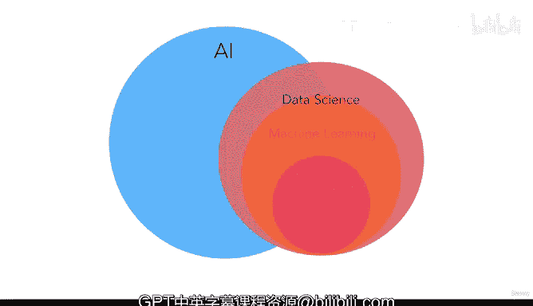

# 5：人工智能、机器学习与数据科学的关系 🌐

在本节课中，我们将学习人工智能、机器学习、数据科学、深度学习等核心概念的定义，并理清它们之间的层次与关联关系。

---

## 人工智能：一切的起点 🤖

上一节我们介绍了机器学习的基本概念，本节中我们来看看机器学习如何融入其他你可能听过的术语中。

首先，请记住下面这个关系图。一切始于**人工智能**，简称AI。它指的是机器所展现出的类人智能。一个AI就是一台能像人类一样行动的机器。

目前，我们行业中存在的是**狭义AI**。这意味着机器在特定任务上可以做得和人一样好，甚至更好。

以下是狭义AI的一些例子：
*   从医学影像中检测心脏病。
*   下围棋或国际象棋。
*   玩《星际争霸》等电子游戏。

然而，每个AI只擅长一项任务，这就是“狭义”的含义。我们目前拥有的AI意味着这些机器只能把一件事做得非常好，它们无法像人类一样拥有多种能力。那种多能力的AI被称为**通用AI**，这是我们目前还非常遥远的目标。

---

## 机器学习：实现AI的途径 🧠

现在，让我们看看机器学习如何融入这个体系。

**机器学习**是人工智能的一个子集。它是一种试图通过让系统在数据集中寻找模式来实现人工智能的途径。

实际上，斯坦福大学将机器学习描述为“让计算机在不被明确编程的情况下行动的科学”。也就是说，让机器做事，而不需要我们具体地命令它“做这个，然后做那个”。

别担心，我们将在整个章节中详细解释这一点。

---

## 深度学习：机器学习的一种技术 ⚙️

理解了机器学习后，你可能也听说过**深度学习**。

深度学习，或称深度神经网络，仅仅是实现机器学习的技术之一。目前，你可以将其理解为一种算法类型。

---

## 数据科学：重叠的领域 📊

接下来，我们看看另一个非常流行的领域——**数据科学**。

通常，数据科学家和机器学习专家的角色有很大重叠。大多数职位描述甚至没有清晰区分机器学习专家和数据科学专家。

**数据科学**领域指的是分析数据、观察数据并据此采取行动（通常是为了实现某种商业目标）的学科。因此，当我们谈论机器学习时，它与数据科学有很多交集。这就是本课程名为“机器学习与数据科学”的原因。

以下是数据科学与机器学习的关系要点：
*   如果你是数据科学家，你需要了解机器学习。
*   如果你是机器学习专家，你需要了解数据科学。

在接下来的几个视频中，我们将同时讨论这两个主题，因为它们相互关联、相互重叠。你无法只做其中一项而不涉及另一项，因为你需要理解和处理数据才能进行任何相关工作。这就是为什么在谈论职业时，机器学习工程师、数据科学家、数据分析师等角色通常很相似——因为他们都处理数据，并希望从数据中为公司或用户推导出某种行动方案。

---

## 本课程的侧重点 🎯

在本课程中，我们真正关注的是实际应用层面，即机器学习和数据科学的日常使用。我们不会专注于理论学术研究，这意味着你不需要拥有博士学位或成为超级聪明的数学家或统计学家也能学习本课程。

重点在于**使用**机器学习和数据科学，以提高生产力并达到求职所需的能力，因为这是当前公司所需要的。

当Daniel开始介绍数据科学和机器学习时，他会将这两者合二为一，并将机器学习这个圆圈放在数据科学之内。这是因为本课程的目标是涵盖整个数据科学领域，并教授数据科学范畴内的机器学习知识。

顺便一提，你可能想知道：“我听说过的数据工程呢？那是另一个术语吧？谈谈那个吧，Andre！” 嗯，你知道吗？我们在课程后面有专门的一整节来讲它。所以现在，先假装它不存在。我们一定会讲到，我保证。

---

## 总结 📝

本节课中，我们一起学习了人工智能、机器学习、数据科学和深度学习等核心概念的定义与关系。我们了解到机器学习是实现人工智能的一种重要途径，而深度学习是机器学习的一种技术。同时，数据科学与机器学习在实践中紧密重叠，共同构成了从数据中获取价值的关键领域。现在我们已经对这些大概念有了基本认识，让我们在下一个视频中找点乐趣吧！