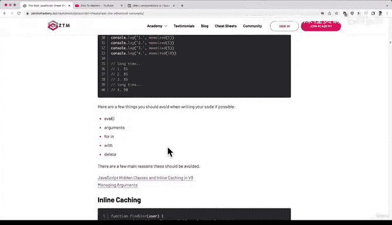
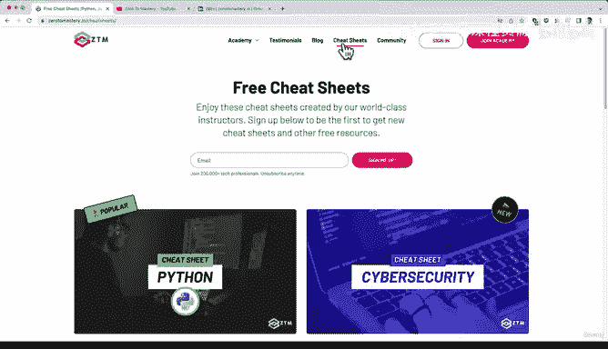
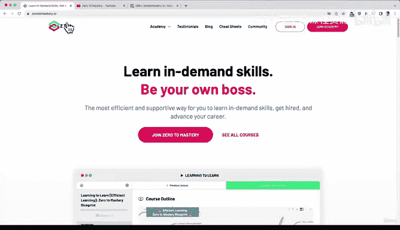

#  6：ZTM 资源 🎁

在本节课中，我们将了解作为 ZTM 学员可以获得的额外免费资源和福利。这些资源旨在帮助你学习、实践、与社区互动并紧跟行业动态。

---

## 社区与活动

上一节我们介绍了课程本身，本节中我们来看看 ZTM 提供的丰富社区支持。

作为 ZTM 学员，你将加入一个庞大的技术爱好者和学习者社区。社区提供了多种互动和练习机会。

以下是社区提供的主要活动与资源：

*   **编程挑战**：你可以在网站上找到编程挑战，用于练习技能。
*   **开源项目**：所有 ZTM 学员都可以参与这些开源项目。
*   **Discourse 服务器**：用于社区讨论。
*   **校园活动**：这是一个虚拟的实时课堂，你可以在这里结识其他学员并进行交流。
*   **年度活动**：全年会举办诸如“Advent of Code”或“Hacktober Fest”等活动。

---

## 学习辅助材料

除了社区活动，ZTM 还提供了多种辅助学习材料，帮助你更高效地掌握知识。

以下是你可以免费获取的学习辅助材料：

*   **备忘单**：这些备忘单与课程相关，无需注册即可使用。例如，你可以打开 JavaScript 备忘单，边学习课程边参考或做笔记。我们每月都会新增一份备忘单，你可以根据兴趣随时查看。
*   **博客**：我们每周会发布 2 到 3 篇博客文章，内容涵盖初学者指南、行业见解、求职技巧等，由不同讲师撰写。

---

## 行业动态与职业发展

为了帮助你紧跟技术潮流并规划职业道路，ZTM 提供了专门的资讯和指导。

以下是相关的资源与服务：

*   **月度行业通讯**：每月，我和其他 ZTM 讲师会撰写行业月度回顾，总结当月重要事件、最佳阅读资源和关键要点，帮助你高效获取信息，无需阅读大量文章或观看大量视频。目前涵盖 Web 开发、Python、机器学习和区块链开发等领域，未来还会增加更多主题。
*   **职业路径**：如果你在寻找特定的职业方向，这个板块会提供建议，告诉你需要遵循的学习路径、何时申请工作以及每种职业所需的技能水平。该网站免费使用，无需注册。

---

## 社交网络与额外渠道

最后，我们来看看 ZTM 在主流社交平台和视频平台上的存在，这些是扩展你网络和获取免费内容的绝佳途径。

以下是两个重要的外部平台资源：

*   **LinkedIn 群组**：我们为所有学员建立了 LinkedIn 群组。在这里，你可以与他人互相认可技能、获取职业建议、分享职位空缺和职业技巧，这对于提升你的 LinkedIn 个人档案很有帮助。
*   **YouTube 频道**：我们最近启动了 YouTube 频道，每周发布 3 到 4 个免费视频，涵盖各种主题。你可以订阅“Zero to Mastery”频道以获取更多内容。

---

本节课中我们一起学习了作为 ZTM 学员可以免费享用的各类资源，包括活跃的社区、实用的备忘单、丰富的博客、及时的行业通讯、清晰的职业路径指导以及 LinkedIn 和 YouTube 上的额外支持。请善用这些资源，祝你在学习之旅中一切顺利，欢迎加入 ZTM。