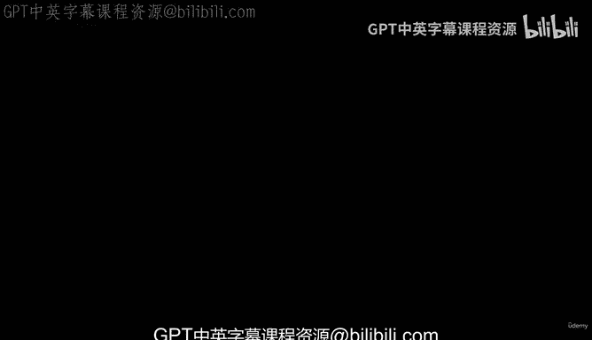
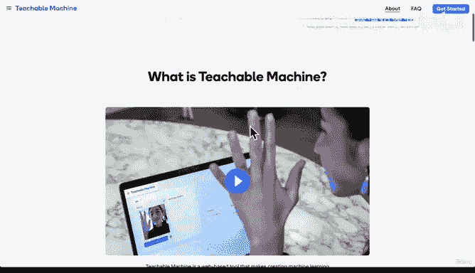
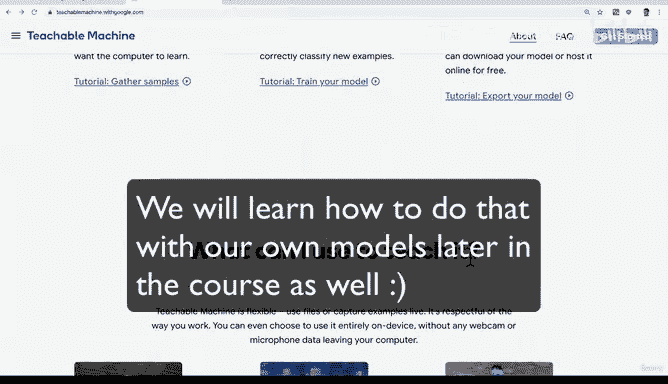
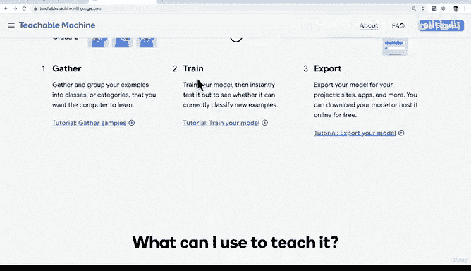

# 7：机器学习游乐场 🎮

在本节课中，我们将通过一个有趣的实践项目，直观地体验机器学习的基本流程。我们将使用一个名为“Teachable Machine”的在线工具，无需编写代码，亲手创建一个简单的图像分类模型。

---

欢迎回来。是时候进行一些有趣的实践了，因为刚才你一直在听我讲解，现在我们需要亲自动手尝试机器学习。

尽管我们对机器学习了解不多，但我们已经可以开始体验它。例如，谷歌提供了一个非常棒的网站，叫做 **Teachable Machine**。

这个网站的功能是帮助你进行一些机器学习活动。

如果我点击这里的“开始”，请注意，当你观看此视频时，该网站的布局可能已经改变。但这并不重要，因为本练习的主要目的是让你理解其背后的工作原理，并亲自尝试。

让我们创建一个图像项目。

目前，我们只需要决定并创建一个能够识别人脸或猫的机器学习模型。

我们设定一个类别为“人脸”，另一个类别为“猫”。

我们需要为模型提供一些图像样本，以便机器能够学习。

在我的桌面上，我已经保存了几张照片。我在网上找到了一张可爱的小猫图片。让我们上传这张猫的图片。

我们在这里上传猫的图片。可以看到我们只上传了一张。

接着，我将上传人脸的图片。我们在这里上传一张婴儿的图片。

现在我们有了“人脸”和“猫”两个类别，接下来我们训练模型。我们本质上是在告诉计算机：“看，这是人脸的样子，这是猫的样子，请学习吧。”

你可以看到它正在学习。

模型已经创建完成。

现在，我可以使用我的网络摄像头，或者直接上传一个文件。

让我们上传一张我自己的浮潜照片，然后点击“打开”。

我们训练的这个模型认为，这张照片有49%的概率是人脸，有51%的概率是猫。这是怎么回事？

如果我们给它一张更好的照片呢？我的意思是，这张照片有点难度，画面有些模糊，我还戴着浮潜面罩。也许对于这个模型来说，预测这张照片是有挑战性的。

我将上传另一个文件，比如使用训练时用过的那张人脸照片。点击“打开”。

哦，天哪。结果更糟了。它认为我有57%的概率是猫，只有43%的把握确定这是人脸。

发生了什么？

你刚刚见证的就是机器学习的工作原理。我们为计算机提供一些数据。

在这个例子中，我提供了一张我自己和丹尼尔的人脸照片，以及一张猫的照片。基于这两组输入数据，我对计算机说：“嘿，学习一下，试着理解这张图片和那张图片。下次我给你任何新图片时，请基于这些数据，预测并告诉我你对它是猫还是人脸有多大把握。”

这基本上就是机器学习。它不一定只针对图像，只需要是某种数据。我们训练计算机，并创建一个模型，该模型可以基于那些数据为我们进行预测。

现在我们可以看到，这个模型的表现非常糟糕。这绝对不是一只猫，对吧？为什么它表现不佳？

思考一下，尝试自己回答。

准备好答案了吗？

首先，我们每个类别只提供了一张图片。为了让计算机真正学习并理解什么是人脸、什么是猫，它需要成百上千甚至数百万张猫的图片来检测模式、找出规律。现在，每个类别我只给了一个样本，所以这个模型并不聪明。就像人类学习一样，在学校里你需要重复练习，反复观察。

其次，关于预测样本。有时我给它一张非常清晰的人脸照片，有时我给它一张非常模糊的浮潜照片。这也会影响输出结果。

但归根结底，机器学习就是：我们提供一些输入，然后让机器基于这些输入进行学习，下次我们给它新的输入时，它就能给出输出。

现在，我希望你在这里暂停一下。我将提供这个资源的链接，以便你可以亲自尝试，看看是否能改进这个模型。你甚至可以打开网络摄像头，就像他们提供的示例那样，而不仅仅是上传文件。

如果你访问 **Teachable Machine** 网站，你可以看到这里有不同的项目，只需点击即可构建，无需编程。

你甚至可以在完成后导出你的模型，以便在你自己的项目中使用。

再次强调，如果这让你感到困惑，请不要担心。我们实际上会一步一步地学习，而不仅仅是进行可视化操作。我们将通过编写代码来学习机器学习和数据科学家的工作方式。但这是一个很好的方法，让你从高层次理解机器学习的工作原理。

所以，去探索和体验这个网站吧。我们下个视频再见。

---

本节课中，我们一起学习了机器学习的基本概念：通过提供数据（如图片）来训练模型，并让模型对新数据进行预测。我们使用 **Teachable Machine** 工具，亲手创建了一个简单的图像分类器，并分析了模型表现不佳的原因——主要是训练数据不足。这个实践帮助我们直观地理解了“训练”和“预测”这两个核心环节。