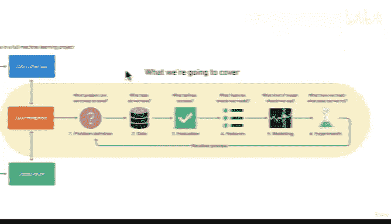

# 8：机器学习的演进与数据科学框架 📈

在本节课中，我们将探讨机器学习是如何发展至今的，并介绍数据科学的核心框架。我们将了解技术演进背后的商业需求，以及数据科学家如何将海量数据转化为有价值的洞察。

---

## 从商业需求到机器学习

上一节我们介绍了课程的整体目标，本节中我们来看看机器学习是如何在商业需求的推动下发展起来的。

我特别喜欢在课程中深入理解每件事背后的原因。我们学习的每个内容都应该有其存在的理由。

你可能会问自己，为什么我们要关心机器学习？它有什么用？我们是如何走到今天的？

如果你思考一下商业领域，会发现大多数技术都源于商业需求。计算机的出现使企业能够利用计算机快速高效地处理事务，从而获得竞争优势。

随后，电子表格（如 Excel 文件和 CSV 文件）的出现非常了不起，因为它们允许我们将企业生成的数据（例如客户数据）存储到 Excel 文件中。人们变得非常擅长分析这些 CSV 文件和电子表格，以做出商业决策。

例如，可以预测十二月的销售额会很高，因为过去两年由于圣诞节，十二月的销售额确实很高。

随着公司积累的数据越来越多，我们开始有了关系型数据库的概念。电子表格和 CSV 文件很好，但我们开始获得越来越多的信息和数据，需要更好的方式来组织它们，以便从数据中理解事物。

这时我们有了像 MySQL 这样的工具。它允许我们使用一种名为 SQL 的语言从数据库中读取信息、向数据库写入信息，而不是使用电子表格。但和电子表格类似，我们利用从业务中收集的数据来做出商业决策，从而使业务更加盈利。

进入 21 世纪，我们有了“大数据”这个时髦的术语。像 Facebook、Amazon、Twitter、Google 这样的大公司开始积累越来越多的数据，其数量之庞大，根本无法用电子表格容纳。例如用户行为、用户点赞、用户购买历史。

大数据的概念意味着这些公司拥有海量数据。有时，这些数据不像关系型数据库中的数据那样必须是结构化的，我们可能会得到非常混乱的非结构化数据。这时，我们开始有了 NoSQL 的概念，像 MongoDB 这样的工具应运而生，它可以存储非结构化数据，并希望从中做出商业决策。

例如，如果你是亚马逊，你可以利用客户的购买历史来推荐不同的产品。从那时起，获取越来越多数据的理念促使我们开始使用机器学习。

因为在某个时刻，我们拥有的数据如此之多，以至于作为人类，我们无法再像处理电子表格那样，仅仅查看行和列就做出商业决策。我们当然仍然可以这样做，但那样就会浪费多年来收集的所有数据。

因此，像 Facebook 和 Google 这样每天收集海量数据的公司，正在转向机器学习。这样，我们不是让人类查看数据并试图找出规律，而是将这些数据交给机器，让它们能够比人类更好地做出商业决策。

机器学习的理念真正形成，正是源于我们从商业中接收到的数据增长，以及 CPU、GPU（图形处理单元）和计算机技术的进步。利用海量数据和计算能力的巨大提升，我们可以使用这些机器来处理大数据并为我们做出决策，就像我们过去使用电子表格一样。

这是一个简化的版本，说明了我们如何走到今天。但我希望它能让你理解为什么企业喜欢机器学习这个理念。

---

## 数据科学框架

现在，在本课程中，我们将使用这个框架。

别担心，不要被吓到。你会对这个框架非常熟悉，因为我们会经常讨论它。先简单看一下，你认为最难的部分是什么？你能猜到吗？

是这里的第一个环节：**获取数据**。

要知道，在我们的世界里，随着互联网、所有手机和联网设备的发展，数据量每两年翻一番。我们正在创造越来越多的数据，但除非我们理解它，否则这些数据毫无意义。是的，我们在生产数据，但我们生成的很多数据都未被使用。

而这正是数据科学的意义所在：我们如何利用目前完全无用的大量数据，将其转化为有用的东西？

并非所有数据都是平等的，有些数据嘈杂，有些数据混乱。我们从哪里获取这些数据？如何找到它？如何清理它以便我们真正能从中学习？我们需要理解数据是什么，然后将机器学习应用于它。行业现在正朝着培养我们想成为的**数据科学家**的方向发展，即那些能够将数据从无用变为有用的人。

---

## 核心概念与挑战

上一节我们了解了数据获取是关键挑战，本节我们来总结其中的核心要点。

数据科学的核心任务可以概括为一个目标：**将原始数据 `raw_data` 转化为可行动的洞察 `actionable_insights`**。

然而，这个过程面临几个主要挑战：

以下是数据科学家常面临的主要挑战：
*   **数据质量**：数据可能包含错误、缺失值或不一致。
*   **数据规模**：数据量可能非常庞大，超出传统工具的处理能力。
*   **数据复杂性**：数据可能是非结构化的（如文本、图像），难以直接分析。

---

## 总结

本节课中，我们一起学习了机器学习是如何随着商业数据爆炸式增长和计算能力提升而发展起来的。我们了解到，从电子表格到关系数据库，再到大数据和 NoSQL，技术的演进始终围绕着更有效地处理和利用数据。最终，这引领我们进入机器学习和数据科学的时代。关键在于，数据本身没有价值，需要通过**数据科学框架**进行获取、理解和分析，才能转化为驱动决策的力量。在接下来的课程中，我们将深入这个框架的每一个步骤。