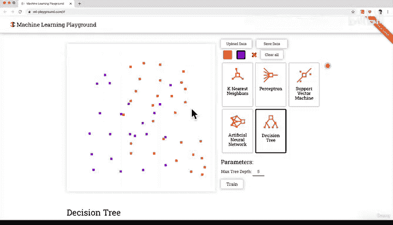

# 9：009_02_006 练习：构建YouTube推荐引擎 🧠

在本节课中，我们将通过一个有趣的练习，亲手构建一个简化版的YouTube推荐引擎。即使我们刚刚开始课程，这个练习也能帮助我们直观理解机器学习模型如何根据用户的历史行为数据，学习其偏好并进行预测。

---

## 概述 📋

我们将使用一个在线机器学习“游乐场”工具。在这个工具中，我们可以模拟用户对视频的喜好数据，并观察机器学习模型如何学习这些数据的模式，从而决定是否向用户推荐新视频。

---

## 理解数据与坐标轴 📊

首先，我们需要理解模拟环境中的坐标轴所代表的含义。

*   **Y轴（纵轴）**：代表**视频的长度**。从下到上，视频长度由短变长。
*   **X轴（横轴）**：代表**视频获得的“点赞”数量**。从左到右，点赞数由少变多。

在这个坐标系中，每一个点都代表一个视频。

---

## 模拟用户行为数据 👤

现在，让我们引入一个虚拟用户“Bob”，并模拟他的历史行为数据。

以下是Bob的喜好数据点：
*   **橙色点**：代表Bob**点击了“喜欢”**的视频。这些视频通常具有较多的点赞数和较长的时长。
*   **紫色点**：代表Bob**点击了“不喜欢”**的视频。这些视频通常点赞数较少，且时长较短。

通过观察这些数据点，我们可以初步看出Bob的偏好：他似乎更喜欢那些受欢迎（点赞多）且内容详实（时长长）的视频。

---

## 训练模型与绘制决策边界 🧮

上一节我们介绍了Bob的喜好数据，本节中我们来看看机器学习模型如何学习这些数据。

当我们点击工具中的 **`Train`** 按钮时，机器学习模型开始工作。它的目标是找到一条最优的“决策边界”，来区分Bob可能喜欢和不喜欢的视频区域。

**模型训练的核心公式/过程可以简化为：**
`模型 = 学习算法(用户历史行为数据)`

训练完成后，工具会生成一个覆盖了橙色区域的决策边界。这个边界就是模型学习到的“规则”：**落在橙色区域内的新视频，模型预测Bob会喜欢；落在区域外的，则预测Bob不喜欢。**

---

## 应用模型进行预测 🎯

模型训练完成后，我们就可以用它来为Bob做推荐了。假设有两个新视频上传：

1.  **视频A**：获得了大量点赞，且时长很长。它在坐标轴上的位置会落在**橙色决策区域内**。
    *   **模型预测**：推荐给Bob ✅
2.  **视频B**：点赞数很少，时长很短。它的位置落在**橙色决策区域外**。
    *   **模型预测**：不推荐给Bob ❌

模型正是通过这种基于历史数据学习到的“如果-那么”规则，来进行自动化决策。

---

## 模型迭代与持续学习 🔄

机器学习模型的强大之处在于它能随着新数据的加入而不断进化。让我们看看这个过程。

假设Bob最近观看并喜欢了一批新的视频（我们在图上添加一些新的橙色点）。如果我们用这批**更新后的数据**重新点击 **`Train`** 按钮，模型会进行重新学习。

**模型更新公式：**
`更新后的模型 = 学习算法(原有数据 + 新数据)`

重新训练后，我们会发现决策边界（橙色区域）的形状发生了改变。它根据所有新旧数据调整了自己，以更准确地反映Bob最新的、更复杂的偏好模式。这模拟了真实推荐系统随着时间推移不断优化推荐结果的过程。

---

## 总结与练习 🏁

本节课中，我们一起学习了机器学习一个核心应用——推荐系统的基本原理。

我们通过一个可视化工具，模拟了以下完整流程：
1.  **定义问题**：是否向用户Bob推荐一个新视频？
2.  **准备数据**：使用坐标轴表示视频特征（点赞数、时长），并用颜色标注用户反馈（喜欢/不喜欢）。
3.  **训练模型**：让机器学习算法从数据中找出规律，绘制出决策边界。
4.  **进行预测**：根据新视频的特征，看其落在决策边界的哪一侧，从而做出推荐决定。
5.  **迭代优化**：加入新数据重新训练，使模型能适应变化的用户偏好。

你现在已经构建了一个简化版的YouTube推荐引擎！虽然真实世界的系统要复杂得多（涉及更多特征、更复杂的算法和海量数据），但其核心思想与此完全一致：**让机器从数据中学习规律，并对未来事件做出预测。**

---

**课后练习**：请务必亲自尝试链接中的工具。你可以：
*   随意移动、添加或删除数据点（橙色/紫色点）。
*   尝试调整“Neurons”、“Learning Rate”等参数（不必理解其深意），观察决策边界的变化。
*   点击“Decision Tree”等其他算法，看看生成的边界有何不同。

通过动手实验，你会对机器学习模型如何“学习”有更直观的感受。我们下节课再见！

