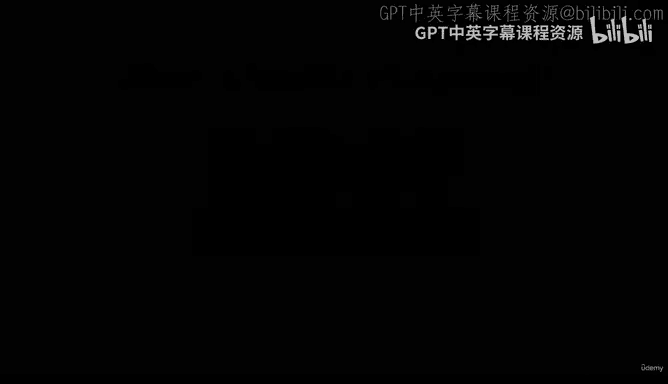
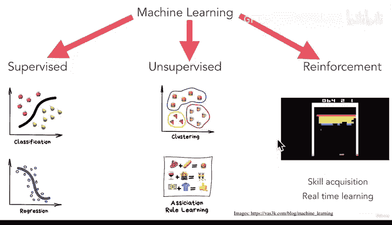

# 10：机器学习的类型 🧠



在本节课中，我们将学习机器学习的三种主要类型：监督学习、无监督学习和强化学习。我们将了解每种类型的基本概念、应用场景以及它们如何帮助机器从数据中学习并做出预测。

---

## 概述

机器学习的目标是让机器能够根据输入数据预测结果。为了实现这一目标，机器学习被分为几种不同的类型，每种类型都有其独特的方法和应用场景。接下来，我们将逐一探讨这些类型。

---

## 监督学习 📊

上一节我们介绍了机器学习的基本目标，本节中我们来看看监督学习。在监督学习中，我们使用的数据已经带有标签或类别。这些标签帮助我们训练模型，使其能够根据输入数据做出正确的预测。

监督学习主要分为两种任务：分类和回归。

以下是监督学习的两种常见任务：

1.  **分类**：模型根据输入数据将其分为不同的类别。例如，判断一张图片是苹果还是梨。机器学习模型通过绘制一条决策边界来区分不同类别。
   
   **代码示例**：
   ```python
   # 使用决策树进行分类
   from sklearn.tree import DecisionTreeClassifier
   model = DecisionTreeClassifier()
   model.fit(X_train, y_train)
   predictions = model.predict(X_test)
   ```

2.  **回归**：模型根据输入数据预测一个连续值。例如，预测股票价格或房价。
   
   **公式示例**：
   ```
   y = β₀ + β₁x₁ + β₂x₂ + ... + βₙxₙ
   ```
   其中，`y` 是预测值，`β` 是系数，`x` 是输入特征。

监督学习的应用场景包括根据工程师的工作经验、年龄、居住地等输入特征，预测是否应该雇佣该工程师。

---

## 无监督学习 🧩

上一节我们讨论了监督学习，本节中我们来看看无监督学习。在无监督学习中，数据没有预先定义的标签或类别。机器需要自行发现数据中的模式或结构。

无监督学习的主要任务包括聚类和关联规则学习。

以下是无监督学习的两种常见任务：

1.  **聚类**：机器根据数据的相似性将其分为不同的组。例如，给定一组数据点，机器可以自动将其分为几个簇。
   
   **代码示例**：
   ```python
   # 使用K均值算法进行聚类
   from sklearn.cluster import KMeans
   model = KMeans(n_clusters=3)
   model.fit(X)
   labels = model.predict(X)
   ```

2.  **关联规则学习**：机器发现数据中的关联关系。例如，通过分析购物数据，预测顾客未来可能购买的商品。

在无监督学习中，由于没有真实的类别标签，我们无法直接告诉机器它的预测是否正确。机器需要自行探索数据并创建有意义的组别。

---

## 强化学习 🎮

上一节我们介绍了无监督学习，本节中我们来看看强化学习。强化学习是一种通过试错、奖励和惩罚来训练机器的学习方法。机器通过与环境互动，学习如何最大化累积奖励。

强化学习的核心思想是让机器在多次尝试中学习最优策略。例如，训练一个程序玩电子游戏，程序最初不知道如何操作，但通过反复尝试，最终学会如何获得最高分。

**公式示例**：
```
Q(s, a) = Q(s, a) + α [R + γ max Q(s', a') - Q(s, a)]
```
其中，`Q(s, a)` 是状态-动作值，`α` 是学习率，`R` 是奖励，`γ` 是折扣因子。

强化学习常用于技能获取和实时学习，尤其在游戏和机器人控制领域有广泛应用。

---

## 机器学习算法与应用 🛠️

上一节我们探讨了强化学习，本节中我们来看看机器学习中常用的算法。这些算法是机器学习各个子领域实现预测任务的核心工具。

以下是几种常见的机器学习算法：

1.  **神经网络**：模仿人脑神经元结构的算法，用于处理复杂的数据模式。
2.  **决策树**：通过树状结构进行决策的算法，常用于分类和回归任务。
3.  **支持向量机**：通过寻找最优超平面来分类数据的算法。
4.  **K近邻算法**：根据最近邻样本的类别进行预测的算法。

这些算法在监督学习、无监督学习和强化学习中都有广泛应用，帮助机器从数据中学习并做出预测。

---

## 总结



在本节课中，我们一起学习了机器学习的三种主要类型：监督学习、无监督学习和强化学习。监督学习使用带标签的数据进行分类和回归任务；无监督学习通过聚类和关联规则发现数据中的模式；强化学习则通过试错和奖励机制训练机器。我们还介绍了几种常见的机器学习算法，如神经网络、决策树、支持向量机和K近邻算法。无论哪种类型，机器学习的核心目标都是从数据中学习并做出预测。