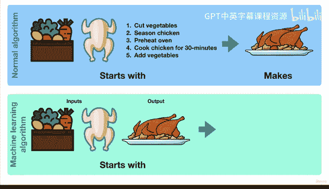

# 11：什么是机器学习（第二轮）🤖

在本节课中，我们将要学习机器学习的核心概念。我们将探讨机器学习与传统算法的区别，并通过一个生动的例子来理解其工作原理。课程最后，我们将总结机器学习在数据科学领域中的位置。

---

## 概述

机器学习是一个广泛的领域，包含许多不同的方面，网络上也有许多不同的定义。为了本课程的实用性，我们将其概括为一句话：**机器学习是使用算法或计算机程序来学习数据中的不同模式，然后利用该算法及其所学知识，对类似数据做出未来预测**。

机器学习算法通常也被称为模型，在本课程中这两个术语会交替使用。

---

## 机器学习与传统算法的区别

上一节我们介绍了机器学习的定义，本节中我们来看看它与传统算法的核心区别。机器学习算法与普通算法和计算机程序的不同之处在于其“学习”的特性。

让我们用一个例子来说明。

*   **传统算法**：是一组指令。例如，如何将一堆生食材变成你最喜欢的蜂蜜芥末鸡肉菜肴。
*   **机器学习算法**：则不是从一组指令开始。

以下是传统算法的步骤示例：

1.  首先，切好蔬菜。
2.  然后，给鸡肉调味。
3.  接着，预热烤箱。
4.  等等。

如果你正确遵循这些步骤，最终就会得到你最喜欢的蜂蜜芥末鸡肉菜肴。这里重要的是，你从**输入**（你的食材）和一组关于如何操作的**指令**开始，以得到你想要的菜肴。

---

## 机器学习的工作原理

理解了传统算法后，我们来看看机器学习是如何工作的。机器学习算法的过程则不同。

它从**输入**和**理想的输出**开始。在我们的例子中，食材是输入，我们最喜欢的鸡肉菜肴是输出。机器学习算法所做的是：观察输入（生食材），然后观察输出（理想的鸡肉菜肴），并试图找出连接这两者之间的那组指令。

现在思考一下：如果你第一次尝试这样做，可能不会得到很好的结果。你可能放了太多香料，导致菜肴太辣。第二次尝试，你会更接近一些。但在机器学习中，有时可能会有数百、数千甚至数万组这样的输入和输出组合。

如果你观察食材组和理想输出（你最喜欢的鸡肉菜肴）超过100次，你可能会变得相当擅长，或者非常接近找出制作那道菜的指令集。

我们这里省略了一些步骤，但这大致就是机器学习模型所做的事情：**它们发现数据中隐藏的模式，以便我们可以将这些模式用于未来的问题**。

在我们的鸡肉菜肴例子中，机器学习算法可能会找到一种方法，在给定正确食材的情况下，创造出美味的鸡肉菜肴。这样，我们就不必思考冰箱里有什么能做什么菜，而是由机器学习算法告诉我们。

---

## 机器学习与数据分析及数据科学的关系

你可能会想，我也听说过数据分析和数据科学，它们之间有何不同？这是一个很好的问题。

*   **数据分析**：是查看一组数据，并通过比较不同的样本、不同的特征以及制作图表等可视化手段来理解它。在我们的例子中，这可能意味着查看不同的食材样本并进行比较：所有食材有什么共同点？有些食材缺少什么？哪些食材中某种成分最多？
*   **数据科学**：是在一组数据上进行实验，希望在其中找到可操作的见解。这些实验之一可能就是构建一个机器学习模型。

这个模型可能会查看10000组不同的食材和10000道不同的鸡肉菜肴。然后，根据我们拥有的一组新食材，告诉我们这些食材最有可能做出哪道鸡肉菜肴。

你可以将数据分析和机器学习视为数据科学的一部分。如果现在所有这些看起来还不清楚，请不要担心，到本课程结束时，你将在所有这些方面获得大量的实践经验。

---

## 总结

本节课中我们一起学习了机器学习的核心定义，理解了它通过从输入和输出中学习模式来工作，而非遵循预设指令。我们还探讨了机器学习与数据分析、数据科学之间的关系。机器学习是发现数据模式并用于预测的强大工具。

在下节课之前，花一分钟时间回想一下你以前遵循过的一组指令的例子。你认为，如果向你展示足够多次某件事的输入和最终目标，你是否能反向推导出达到那里所采取的指令？