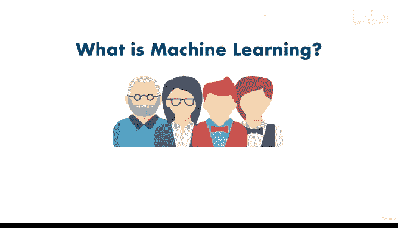

# 12：012_02_010 章节回顾 🧠

在本节课中，我们将对机器学习的基础概念进行回顾和总结，帮助你巩固对机器学习的理解。

---

现在你已经从我和Daniel那里获得了输入信息，你应该能够自信地回答同事关于“什么是机器学习”的问题了。作为最后的挑战，我希望你暂停视频，前往我们的Discord服务器，进入机器学习和数据科学频道，用不超过五句话简要地解释什么是机器学习。如果你能用少于五句话解释清楚，那就说明你已经理解了第一部分的内容。我们才刚刚开始，但目前做到这一步就足够了。

那么，什么是机器学习呢？

我们了解到，计算机非常擅长处理海量数据，而我们正在创造越来越多的数据。机器学习让计算机能够基于数据做出决策，它让计算机从数据中学习，并进行预测和决策。

以下是机器学习应用的几个例子：
*   YouTube推荐什么产品？
*   这个人是否患有心脏病？
*   这封邮件是垃圾邮件吗？

所有这些都使用了机器学习。因此，我们本质上是让计算机为我们做决定。尽管计算机最终只理解数字，即0和1，但通过机器学习，我们找到了让计算机为我们做决定的方法，并回答了过去只有人类才能回答的难题。

但归根结底，机器学习只是一个通用术语，指的是计算机从数据中学习的过程。它让计算机能够完成过去需要人类完成的任务，并有望让我们的生活更轻松。

---

在本节课中，我们一起回顾了机器学习的核心定义：**让计算机从数据中学习，并基于此做出预测或决策**。我们看到了它在推荐系统、医疗诊断和垃圾邮件过滤等领域的实际应用。理解这个基础概念是开启你机器学习之旅的第一步。下一节我们将深入探索更多内容。