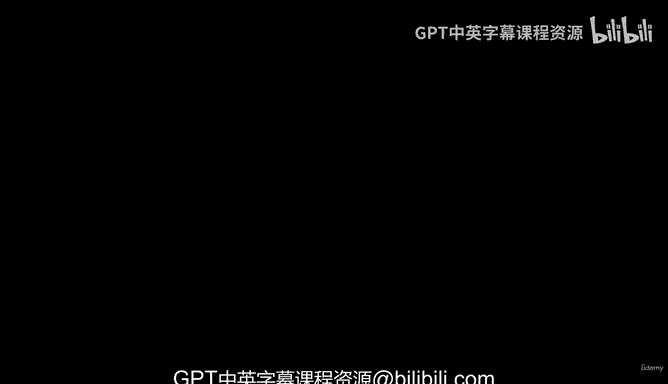

# 13：构建机器学习与数据科学框架 🧠

在本节课中，我们将学习如何构建一个标准化的机器学习与数据科学框架。这个框架将作为后续课程和职业生涯中解决问题的模板。

---

上一节我们介绍了课程的整体背景，本节中我们来看看如何构建一个实用的框架。

同事对你的表现印象深刻。他们提到你解释了机器学习是什么，并赞赏你的知识储备。现在，公司需要为约20名数据科学家和机器学习工程师创建一个标准化的工作框架，以确保团队实践一致。这个框架也将用于公司未来的招聘和培训。

这应该不是问题，对吗？

你已经成功度过了第一天，但第二天需要完成这个框架，并且Bruno希望明天就能看到成果。这时，你可以向朋友Andre和Daniel寻求帮助。在本节中，我们将构建自己的机器学习与数据科学框架，这个模板将在整个课程和职业生涯中帮助我们思考如何解决问题。

需要注意的是，这是课程中最后一个理论章节，我们将通过幻灯片和图表进行学习。此后，课程将进入全编码阶段，开始实际构建模型和处理数据。

本节内容非常重要，初次学习时可能无法立即完全掌握。因此，我们建议你在职业生涯中或课程进行中不时回顾本节内容，以巩固框架的理解。整个课程将以此框架为基础，逐步提升我们的技能。

如果你在课程中感到困惑或遇到困难，可以暂停并回看本节内容。课程结束后，也请再次回顾本节，你会发现随着知识的积累，这个框架变得更加清晰。

这是最后一个纯理论讲解的章节，之后我们将深入实践和编码。现在，让我们开始构建框架，希望明天能让Bruno满意，成功度过第二天。

---

以下是构建框架的核心步骤：

1.  **问题定义**：明确需要解决的业务问题。
2.  **数据收集**：获取与问题相关的数据。
3.  **数据预处理**：清洗和准备数据以供模型使用。
4.  **模型选择**：根据问题类型选择合适的机器学习算法。
5.  **模型训练**：使用数据训练选定的模型。
6.  **模型评估**：评估模型在测试数据上的性能。
7.  **模型部署**：将训练好的模型应用于实际场景。
8.  **监控与维护**：持续监控模型性能并进行必要更新。

---

本节课中我们一起学习了如何构建一个机器学习与数据科学框架，明确了从问题定义到模型部署的完整流程。这个框架将为后续的实践学习打下坚实基础。