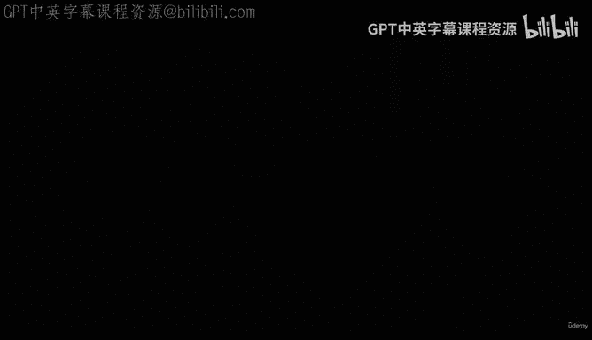
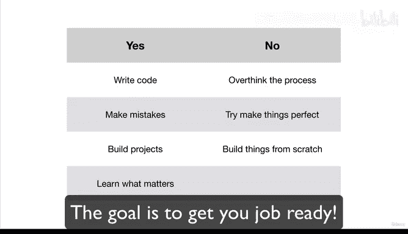

# 14：课程014_03_002 介绍我们的框架 🧭

在本节课中，我们将要学习本课程所采用的核心学习框架。这个框架旨在帮助初学者绕过复杂的理论迷宫，直接通过实践来掌握机器学习和数据科学的核心技能。

如果你之前了解过机器学习，你会发现相关的资源非常多。有些资源建议在学习数据科学和机器学习之前，先学习数学、统计和概率等知识。虽然这些主题很重要，但在开始动手实践之前试图掌握所有内容，无异于试图煮沸整个海洋，效率低下且令人沮丧。

因此，我们的方法将聚焦于构建实用的解决方案，并编写机器学习代码来从数据中获取洞见。如果你现在是一名程序员，并且有一些Python经验，那么在本课程结束时，你将能够运用你的编程技能来构建预测性机器学习模型。

## 机器学习的三个组成部分 🧩

上一节我们提到了实践的重要性，本节中我们来看看机器学习的宏观流程。机器学习主要包含三个部分：

1.  **数据收集**
2.  **数据建模**
3.  **部署**

在你完成前两个步骤后，可能会将你的机器学习模型部署给用户，例如通过应用程序、API或其他形式。本课程将重点覆盖**数据建模**部分，这意味着你将能够获取一个数据集，并应用机器学习算法来发现其中的规律和洞见。

## 我们的学习路径 🗺️

以下是本课程将遵循的核心学习路径：

首先，我们将**创建一个学习框架**。你在之前的幻灯片中已经看到了这个框架的简要轮廓。

其次，在深入理解这个框架后，我们将**将其与现有的数据科学和机器学习工具相匹配**。这意味着过去的人们已经遇到过我们未来试图解决的类似问题，并为此创建了工具。因此，我们将学习哪些工具适用于哪些机器学习项目。

最后，为了掌握所有这些知识，我们将**通过实践来学习**。我们将通过完成一系列项目来学习，这些项目涉及上述第一步和第二步，最终帮助你建立一个作品集，以展示你的工作和技能。

## 课程设计理念 💡

在设计本课程时，我们极其注重聚焦于真正重要的内容。当我开始学习机器学习时，我发现自己常常对该做什么感到困惑。很多时候，我会花太多时间思考，而不是编写代码和采取行动。因此，我们设计了这门课程来避免这种情况。

我们不会从零开始做所有事情，而是将**使用行之有效的方法来构建实用的解决方案**，同时学习机器学习和数据科学的知识。

现在，让我们更深入地看看我们将要使用的框架。

---

本节课中我们一起学习了本课程的核心学习框架。我们明确了聚焦实践、避免过早陷入复杂理论的学习理念，并概述了机器学习的三大部分以及“创建框架-匹配工具-项目实践”的具体学习路径。接下来，我们将对这个框架进行更深入的探讨。