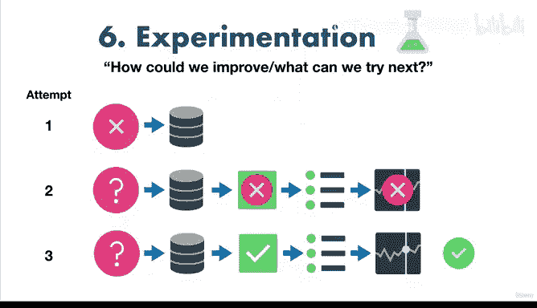

# 15：六步机器学习框架 🧠

在本节课中，我们将学习一个通用的六步机器学习框架。这个框架可以帮助你系统化地处理各种机器学习问题，从定义问题到实验优化，确保项目的每一步都清晰可控。

---

## 概述

机器学习项目涉及多个环节，建立一个可重复使用的框架至关重要。我们将要学习的六步框架，经过多个行业项目的验证，能帮助你高效拆解和解决问题。接下来，我们将逐一深入每个步骤。

---

## 第一步：问题定义

在开始编写代码和寻找实用解决方案之前，必须明确要解决的问题。问题定义是机器学习项目的起点。

以下是问题定义阶段需要明确的关键点：

*   判断问题是监督学习还是无监督学习。
*   确定问题是分类问题还是回归问题。

在后续课程中，我们将学习如何具体区分这些问题类型。

---

## 第二步：数据

机器学习算法的核心是从数据中发现和学习模式。因此，数据是任何机器学习项目的基石。

第二步的核心问题是：我们拥有什么样的数据？

根据问题的不同，数据可以分为不同类型。了解数据类型有助于我们决定如何使用机器学习。

以下是两种主要的数据类型：

*   **结构化数据**：例如行和列的数据，类似于Excel电子表格中的数据。
*   **非结构化数据**：例如图像或音频。

---

## 第三步：评估

在这一步，我们需要定义“成功”的标准。由于机器学习在很大程度上是实验性的，如果没有明确的目标，你可能会无止境地尝试改进模型，追求并不存在的“完美模型”。

作为实践者，我们知道完美模型并不存在。因此，我们需要设定一个可行的目标。例如，对于一个预测房价的机器学习项目，我们可以设定目标为：“模型预测房价的准确率至少需要达到95%。”

当然，在项目初期，这个评估指标可能并不精确，并且会随着时间推移而调整。但在项目开始时设定一个目标，能为我们提供明确的努力方向。

---

## 第四步：特征

这一步我们要回答的问题是：关于这些数据，我们已经知道了什么？

即使在同一种数据类型中，也存在不同种类的特征。例如，在预测某人是否患有心脏病时，你可能会使用他们的体重作为一个特征。由于体重是一个数字，它被称为**数值特征**。

通过与医生交流，你可能会得知，如果某人的体重超过某个特定数值，他们患心脏病的可能性更高。此外，还有**类别特征**和**衍生特征**等其他类型的特征，我们将在未来的课程中详细探讨。

机器学习算法的目标，正是将这些特征（如体重、性别、血压、胸痛）转化为模式，从而做出预测（例如，判断某位患者是否患有心脏病）。

---

## 第五步：建模

在对数据有了一定了解之后，下一步就是建立模型。

这一步的核心问题是：基于我们的问题和数据，应该使用哪种机器学习模型？

与其他需要从头编写的算法和指令集不同，许多最有用的机器学习算法已经为你编写好了代码，这对我们来说非常方便。

不同的模型在不同类型的问题上表现各异。在初期，你的重点是**为正确的问题找到正确的模型**。

---

## 第六步：实验

我们刚刚介绍的所有步骤都处在一个循环之中。你可能会从一个问题定义开始，然后发现你的数据并不适合它。接着，你构建了一个模型，却发现它的表现没有达到你在评估指标中设定的标准。

于是，你构建另一个模型，并发现这个模型效果不错。但重要的是要记住，虽然我们在这个框架中列出了这些步骤，但它们**不必严格按照顺序执行**，也**不是一成不变**的。请将它们视为一个粗略的指南。

---

## 总结

本节课中，我们一起学习了机器学习的六步框架：**1. 问题定义**、**2. 数据**、**3. 评估**、**4. 特征**、**5. 建模**、**6. 实验**。这个框架为你提供了一个结构化的问题解决路径，帮助你从零开始构建机器学习项目。记住，这是一个灵活的循环过程，实践是掌握它的关键。