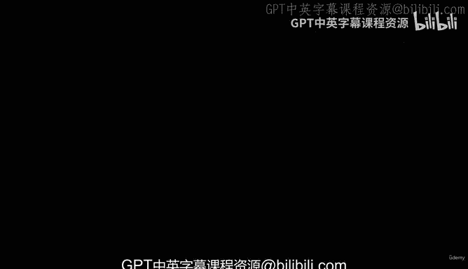
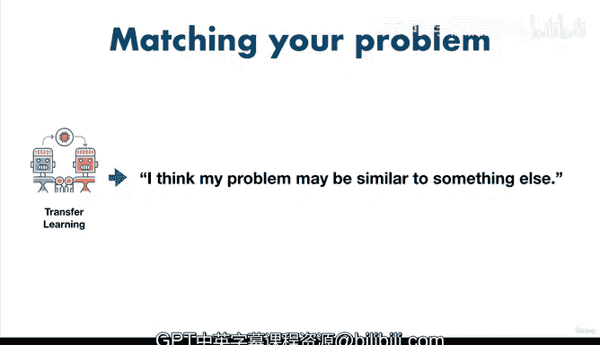

# 16：机器学习问题类型 🧠

在本节课中，我们将学习机器学习的主要问题类型。理解这些类型是定义和解决实际问题的第一步。

---

## 概述

我们将探讨四种主要的机器学习问题类型：监督学习、无监督学习、迁移学习和强化学习。了解每种类型的特点和适用场景，能帮助你将现实世界的问题转化为可解决的机器学习问题。

---

## 何时不使用机器学习

在深入探讨不同类型之前，需要明确一点：机器学习并非所有问题的解决方案。

如果简单的、基于手工编码指令的系统就能解决问题，那么你应该优先选择更简单的系统，而不是机器学习系统。

例如，如果你想制作一道最喜欢的鸡肉菜肴，并且你已经知道所需的食材和确切的步骤，那么最好选择这个简单的系统，而不是试图用机器学习来找出步骤。

除了这种你已经知道简单手工编码系统的情况外，大多数时候，你或许都能通过机器学习找到价值。

---

## 主要机器学习问题类型

现在进入定义问题的第一步：将我们试图解决的问题与主要的机器学习问题类型相匹配。

以下是四种主要类型：
*   监督学习
*   无监督学习
*   迁移学习
*   强化学习

本课程将重点介绍监督学习、无监督学习和迁移学习。因为这些是实践中最常见、最实用的类型。

---

### 监督学习 👨‍🏫

监督学习之所以称为“监督”，是因为你拥有**数据**和**标签**。

机器学习算法尝试使用数据来预测标签。如果它猜错了标签，算法会自我纠正并再次尝试。这种纠正行为就是“监督”的由来。

这就像你试图猜测如何将一组食材（数据）变成你最喜欢的鸡肉菜肴（标签）。如果你尝试一次并做错了，你会告诉自己这是错的，下次可能会尝试不同的方法。监督学习算法会一遍又一遍地重复这个过程，试图做得更好。

监督学习的主要问题类型是**分类**和**回归**。

#### 分类问题

分类涉及预测某物是某一类还是另一类。

例如，根据医疗记录预测患者是否患有心脏病，或者根据图像预测狗的品种。

*   **二分类**：如果只有两个选项，则称为二分类。例如，预测“有心脏病”或“无心脏病”。
*   **多分类**：如果选项超过两个，则称为多分类。例如，根据照片预测不同的狗品种。

#### 回归问题

回归问题涉及预测一个**数值**。这个数值也被称为连续值，意味着它可以上升或下降。

一个经典的回归问题是根据房间数量、所在区域、卫生间数量等因素预测房屋的售价。或者根据网站访问量和点击量预测会有多少人购买一个新应用。

---

### 无监督学习 🕵️‍♂️

无监督学习有**数据**，但**没有标签**。

例如，你可能拥有所有顾客在店里的购买历史。你的营销团队想为下一个夏季发送促销信息，但他们知道并非所有人都会对新的夏装感兴趣。他们来问你这位内部数据科学和机器学习工程师：“你知道谁对夏装感兴趣吗？”

问题是你也不知道。但你知道可以从已有的数据中找出答案。

于是你决定运行一个算法来发现数据中的模式，并将购买相似商品的顾客分组在一起。

完成后，你注意到两个群体：一个群体只在冬季购物，另一个群体主要在夏季购物。你给他们贴上“冬季顾客”和“夏季顾客”的标签，然后交给营销团队。他们感谢你为他们避免了发送数千封不受欢迎的电子邮件。

这里需要注意的是，**标签是你提供的**，它们一开始并不存在，但**模式是存在的**，这正是机器学习算法所发现的。在检查这些分组后，是你看到了共同点并应用了“夏季”或“冬季”这样的标签。

这类问题也称为**聚类**，即将相似的样本分组在一起。像根据某人之前的音乐选择推荐音乐这样的**推荐问题**，通常最初就是这类无监督学习问题。

---

### 迁移学习 🔄

迁移学习利用一个机器学习模型已经学到的知识，应用到另一个机器学习任务中。

例如，假设你试图预测照片中出现的是什么品种的狗。你可以找到一个已经学会识别不同汽车类型的现有模型，并针对你的任务进行微调。

为什么这很有价值？因为训练一个机器学习算法（即让它找出数据中的所有模式）可能是一项非常昂贵的任务。为了发现数据中的模式，机器学习算法必须进行数百万次计算，虽然计算机计算速度很快，但计算并非没有成本。

因此，与其从零开始学习关于不同照片的一切（例如不同的树是什么样子，不同的形状是什么样子，草是什么样子），不如利用已经识别不同汽车的模型。如果你已经训练过一个模型，它可能已经弄清楚了哪些是树而不是汽车，哪些是草，因此它对不同的模式已经有了概念。

你可以把这想象成写论文和写诗歌的区别：虽然写作风格不同，但你所使用的写作遵循相同的基本原则。因此，我们可以利用这个识别不同汽车的模型，使用其基础模式，并将其应用到我们的狗品种识别问题上。当然，这里涉及更多步骤，但这就是迁移学习的基本前提。

---

### 强化学习 🎮

强化学习涉及让一个计算机程序在定义的空间内执行某些动作，并根据其表现良好给予奖励，表现不佳则给予惩罚。

一个很好的例子是教机器学习算法下棋。棋盘是定义的空间，动作是移动棋子。当我提到惩罚或奖励时，这些可以简单到如果赢了就加一分，如果输了就减一分。机器学习算法的目标可能是最大化分数。这意味着，如果你做得对，它应该学会导致胜利的走法。

DeepMind 的 AlphaGo 成为有史以来最好的围棋（一种比国际象棋复杂得多的中国棋盘游戏）选手，击败了许多围棋世界冠军，使用的就是强化学习。尽管前景广阔，但强化学习尚未在许多实际应用中找到广泛用途。由于我们专注于构建实用的解决方案，因此决定在本课程中重点关注其他类型的学习，如监督学习、无监督学习和迁移学习。

---

## 总结

本节课我们一起学习了四种主要的机器学习问题类型。

现在你知道了主要的学习类型，你已经掌握了处理框架中第一步（问题定义，即将你试图解决的问题与机器学习问题对齐）的工具。

*   对于**监督学习**，你可能会说：我知道我的输入和输出。例如，输入是患者记录，输出是患者是否患有心脏病。或者输入是房屋的参数（房间数、位置、卫生间数量），输出是房屋售价（这是一个回归问题）。
*   对于**无监督学习**，你可能会说：我不确定输出是什么，但我有输入，例如客户购买记录，并且我试图找出哪些客户彼此最相似。
*   对于**迁移学习**，你可能会想：我的问题可能与其他问题类似，我能否利用现有机器学习模型已学到的知识，并将其用在我自己的问题上？

如果目前这些学习类型让你有些困惑，请不要担心。在本课程中，我们将为每种学习类型（监督、无监督和迁移）构建实践项目。同时，请思考一下你日常面临的一些问题：它们中的任何一个可以被归类为机器学习问题吗？你是否试图将某物分类为某一类或另一类？那是一个分类问题。你是否曾试图预测一个数字可能是什么？那可能是一个回归问题。