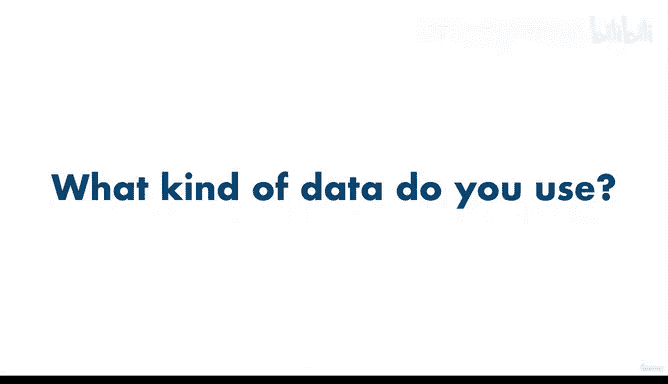

# 17：数据类型 📊


在本节课中，我们将要学习机器学习项目中的关键一步：理解数据类型。我们已经明确了要解决的问题，并将其归类为特定的机器学习问题类型。现在，让我们来看看我们手头的数据是什么样的。

数据以多种形态和大小存在，但主要分为两大类：**结构化数据**和**非结构化数据**。

## 结构化数据 📋

结构化数据通常类似于你在Excel文件中看到的内容，例如不同患者医疗记录的行和列，以及他们是否患有心脏病，或者客户购买交易记录。它之所以被称为结构化数据，是因为所有样本（即不同的患者记录）通常具有相似的格式。

这意味着一列可能包含特定类型的数字，例如患者的平均血压、性别或体重；而另一列可能包含他们是否有胸痛以及疼痛的强度等级。

## 非结构化数据 🖼️

非结构化数据则包括图像、自然语言文本（如转录的电话通话）、视频和音频文件等。尽管我们可以将这些数据转化为数字并创建结构，但它们通常以多种不同的格式出现。例如，一张狗的照片可能与另一张狗的照片完全不同，你与朋友往来的电子邮件结构也可能与你写给同事的邮件结构完全不同。

## 静态数据与流数据 🔄

在这两种数据类型内部，还存在**静态数据**和**流数据**的区分。

静态数据是指不随时间变化的数据。你可能有一个以`.csv`格式存储的患者记录电子表格，`.csv`代表逗号分隔值，这意味着所有不同的数据都在一个文件中，由逗号分隔。

它看起来像这样：
```
id,weight,sex
1,70,M
2,65,F
```

如果我们使用像`pandas`这样的工具将其读入数据框（我们将在后续课程中详细学习），它看起来会是这样：

```python
import pandas as pd
df = pd.read_csv('patient_data.csv')
print(df.head())
```

你实际遇到的大量数据都以这种简单的格式存在。但为了将其转化为更具结构性的形式，你可以将其转换为数据框。CSV是最常见的静态数据格式之一，在本课程结束时，我们会非常熟悉它。

由于这些值不会随时间真正改变，它们被称为静态数据。在机器学习中，你通常需要大量的这类样本。有句话说得好：“数据越多越好”。这很容易理解：你拥有的样本越多（例如患者记录的输入和输出，其中输入是患者的身体参数，输出是他们是否患有心脏病），你就越有机会发现其中的模式。

机器学习算法也是如此：它们能查看的样本越多，就越有机会发现模式，从而利用这些模式来预测未来，例如预测一个新来的、不在此表中的患者是否患有心脏病。

## 流数据 🌊

流数据是指随时间不断变化的数据。例如，假设你想根据新闻标题预测股价将如何变化。你将处理流数据，因为新闻标题在不断更新。你会希望第一个看到它们如何影响股票。

在实践中，你的大部分工作将从静态数据开始。如果你的数据分析和机器学习工作证明能提供一些见解，那么在部署或投入生产时，你将转向处理流数据。

一个常见的数据科学工作流程始于在Jupyter Notebook（一个用于构建机器学习项目的工具）中打开CSV文件，然后使用`pandas`（一个用于数据分析的Python库）探索数据并进行数据分析，并使用`Matplotlib`制作可视化图表和比较不同的数据点，最后使用`Scikit-learn`在数据上构建机器学习模型，例如构建一个机器学习模型来利用这些模式预测患者是否患有心脏病。

如果你在想“什么是Jupyter Notebook和pandas？我们是在动物园吗？”，请不要担心。我们后续将有专门的章节和项目来详细介绍这些工具。

现在，请思考你每天创建或使用的不同类型的数据。它们是结构化的还是非结构化的？数据量有多大？

---



**本节课总结**：在本节课中，我们一起学习了数据的两种主要类型（结构化与非结构化），以及数据随时间变化的两种状态（静态与流式）。理解数据的性质是构建有效机器学习模型的第一步。记住，结构化数据组织有序，而非结构化数据形式多样；静态数据稳定不变，而流数据动态更新。选择正确的工具和方法来处理这些数据，是数据科学工作流程成功的关键。