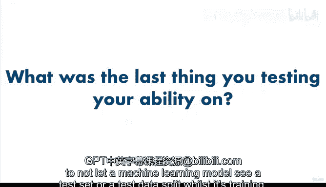

# 20：建模 - 数据拆分 🧠

在本节课中，我们将要学习机器学习建模流程中的第一步，也是最重要的概念之一：如何将数据拆分为训练集、验证集和测试集。理解并正确实施数据拆分，是构建一个能够有效泛化到新数据的模型的基础。

---

## 建模流程概述

我们正以闪电般的速度推进这个框架。我们已经完成了问题定义、数据查看、评估指标选择以及对数据特征的初步理解。现在，我们来到了第5步：建模。

建模本身包含几个部分，因此我们将其分解为四个不同的章节。本节是第一章，它涵盖了机器学习中最重要的概念之一：三个数据集。在整个建模过程中，我们希望回答的问题是：基于我们的问题和数据，应该使用哪种机器学习模型？

建模可以分解为三个主要部分：
1.  选择并训练模型。
2.  调整模型。
3.  模型比较。

然而，在深入这些部分之前，建模的第一步，也是整个课程中最重要、最核心的主题，就是机器学习中最重要的概念：训练集、验证集和测试集的拆分，通常简称为“三个数据集”。

---

## 为什么需要数据拆分？🤔

既然你想使用机器学习模型从数据中获取洞察并预测未来，那么测试它们在真实世界中的表现就至关重要。为此，你需要将数据拆分为三个不同的集合：
*   **训练集**：用于训练你的模型。
*   **验证集**：用于调整你的模型。
*   **测试集**：用于测试和比较你的不同模型。

为什么这很重要？可以这样理解：

当你在大学时，你可能会在整个学期学习课程材料。然后在期末考试前，你可能会通过模拟考试来检验如何提升自己的知识水平。在模拟考试中取得好成绩后，你就有信心在期末考试中表现出色。当你参加期末考试时，尽管有些题目你从未见过，但你能够将学习材料中获得的知识，应用到这些略有不同但相似的考题上。因此，你以优异的成绩通过了期末考试。

这种从课程材料和模拟考试到期末考试的适应能力，在机器学习中被称为**泛化能力**，即机器学习模型在未见过的数据上表现良好的能力，因为它从另一个数据集中学到了知识。

---

## 如果做错了会怎样？😡

那么，哪里可能出错呢？如果你的教授不小心把期末考试卷发给大家练习，那么到了真正的考试时，每个人都已经见过试卷了。既然人们知道会考什么，他们就能轻松作答，最终每个人都得了高分。

这看起来可能不错，但学生们真的学到了东西吗？还是他们只是变成了熟练的记忆机器？为了让你的机器学习模型在预测未来未见数据时具有价值，你需要避免它们变成记忆机器。这就是训练集、验证集和测试集发挥作用的地方。

---

## 数据拆分实践示例

在我们的心脏病预测示例中，假设有100名患者的数据。我们一开始有100条记录。

以下是创建这些拆分的一种方法：
1.  首先打乱这些患者的顺序。
2.  然后选择70%用于训练。这意味着大约有70条患者记录。
3.  选择15%用于验证。
4.  选择15%用于测试。

最终结果是：训练集中有70名患者，验证集中有15名患者，测试集中有15名患者。

每个集合的百分比可能会有所不同，但标准做法通常是：
*   **训练集**：约 70% 到 80%
*   **验证集**：约 10% 到 15%
*   **测试集**：约 10% 到 15%

在某些例子中，你可能会看到数据集只被拆分为训练集和测试集，但那是具体情况具体分析，通常你会拥有三个不同的集合。

---

## 各数据集的用途

一旦你获得了这些拆分，并选择了一个模型，你会将训练数据（即这70条患者记录的信息）输入模型进行训练。模型训练完成后，你可以在验证集上检查其结果，并看看是否能改进它们。这就是进行**模型调优**的地方。仅仅因为你的机器学习模型在患者记录上得到了一组结果，你实际上可以改进它们，我们将在未来关于验证集的课程中看到这一点。验证集正是你应该用来测试是否能改进模型的地方。

最后，一旦你改进了模型，你可以在测试集上检查该模型的结果，以及你在实验过程中可能尝试过的任何其他模型的结果。

---

## 必须牢记的关键原则

需要记住的重要一点是，在训练期间，这三个集合是相互独立的：模型**从未**见过验证集或测试集。而在测试时，你是在测试集上进行，而不是在训练集上。

这就像你为考试而学习一样：如果你在练习时看到了期末考试卷，那就是作弊，你的最终成绩将无法反映你真实的学习水平。

现在，回想一下你上次参加考试的情景。你事先练习了吗？你所做的练习对考试有帮助吗？当你思考这个问题时，试着想想它如何与“为什么在训练期间不让机器学习模型看到测试集或测试数据拆分”的重要性相关联。

---

## 总结

本节课中，我们一起学习了机器学习建模的基础步骤——数据拆分。我们理解了将数据分为**训练集**、**验证集**和**测试集**的必要性，这能防止模型成为“记忆机器”，并确保其具备良好的**泛化能力**。我们通过一个心脏病数据的例子，了解了常见的拆分比例（如70-15-15）以及每个数据集的具体用途：训练模型、调整参数和最终评估。记住，保持数据集的独立性是获得可靠模型评估结果的关键。