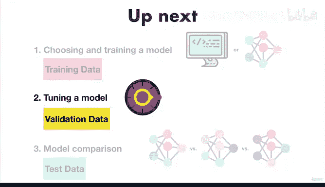

# 21：建模 - 选择模型 🧠

在本节课中，我们将学习机器学习建模流程的第二步：如何为你的问题选择合适的模型。我们将探讨不同模型适用的场景、模型训练的基本概念，以及如何高效地进行实验。

---

## 概述

上一节我们介绍了建模流程的三个主要部分：选择模型、调优模型和比较模型。本节中，我们将深入探讨**选择模型**这一环节。你将学习如何根据数据类型和问题性质挑选合适的机器学习算法，并了解模型训练的核心目标与高效实验的策略。

---

## 模型选择的基本原则

选择模型时，核心目标是了解不同机器学习算法最适合解决何种问题。这是因为某些算法在处理特定类型的数据时表现更优。

以下是选择模型时需要记住的两个关键点：

*   **结构化数据**：例如表格数据。对于这类数据，**决策树**（如随机森林）和**梯度提升算法**（如 CatBoost、XGBoost）通常效果最佳。
*   **非结构化数据**：例如图像、文本、音频。对于这类数据，**深度学习**、**神经网络**和**迁移学习**通常表现更好。

我们将在后续的实践项目中具体探讨这些应用。

---

## 模型训练的目标

选定模型后，下一步是在训练集上对其进行训练。训练的主要目标是**对齐输入与输出**。

例如，在我们的心脏病预测问题中，我们希望模型查看**特征变量**（输入），找出其中的规律，并用这些规律来预测**目标变量**。

另一种常见的命名约定是使用 **`X`** 代表用于预测的数据（特征），使用 **`Y`** 代表标签（目标）。

不同的机器学习算法有不同的实现方式。我们将在未来的项目中学习几种常用算法的具体操作。请记住，模型训练是在**训练集**上进行的，这是模型“学习课程材料”的地方。我们绝不能让模型在“学习”之前就“偷看”最终的“考试”（即验证集和测试集）。

---

## 高效实验的策略

根据数据量和模型复杂度，训练过程可能需要一些时间。训练模型时的一个重要目标是**最小化实验周期**。

这意味着有时需要先使用一小部分数据进行实验。例如，如果你的训练集有10万个样本，你可以先只用前1万个样本来训练模型，观察其初步表现。你也可以先从一个不太复杂的模型开始尝试。

通常，像神经网络这样的深度模型比其他类型的模型需要更长的训练时间。这一点在训练你自己的模型时值得考虑。

例如，如果一个实验需要花费你三小时甚至几天时间，却只能带来模型性能的微小提升，你可能需要考虑：这个实验真的值得吗？因为机器学习是一个高度迭代的过程，我们希望缩短实验周期，以便快速地从第一步推进到第二步、第三步。

如果这些概念看起来有些抽象，不用担心，我们将在动手实践项目中看到具体的应用。

---

## 核心要点总结

以下是在选择与训练模型时需要记住的几个要点：

*   **模型表现因问题而异**：没有“一刀切”的最佳模型，不同问题需要不同的算法。
*   **勇于尝试**：机器学习是一个高度迭代的过程。你尝试的某些方法可能第一次不会成功，这意味着你需要放弃它，继续尝试其他方法。
*   **从小处着手，逐步构建**：例如，如果你有10万个样本，先从1万个开始；先使用一个简单的模型，而不是一开始就采用最庞大、最新颖的模型。因为我们追求的是**实际效果**，而不仅仅是纸面上的最优。我们希望得到的是能在现实世界中真正使用的解决方案。

---

## 后续步骤

你的实验过程将包括对初步表现良好的模型进行**调优**，以获得更好的结果。这就像调校一辆赛车：如果一辆车在一条赛道上表现良好，在另一条赛道上可能就不行，因此你需要对它进行调校。

接下来，让我们看看如何为机器学习模型进行这种“调校”，而不是为赛车。

---

本节课中，我们一起学习了如何根据数据类型选择机器学习模型，理解了模型训练的核心是学习输入到输出的映射，并掌握了通过从小规模实验开始、逐步增加复杂度来高效迭代的策略。记住，实践是学习这些概念的最佳方式。